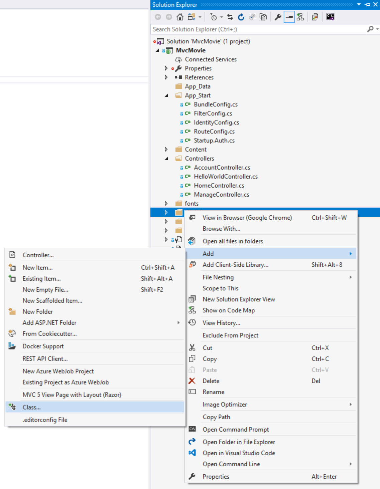
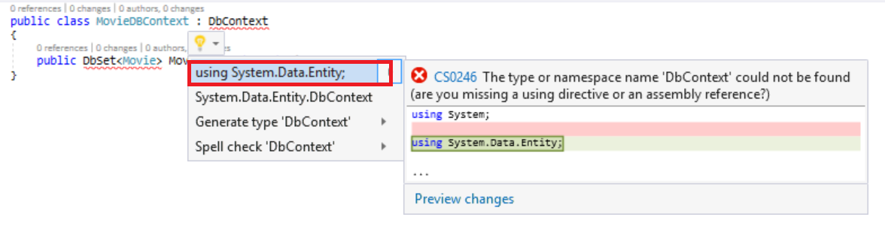
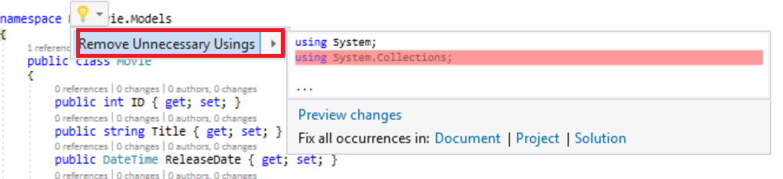

Adding a Model
====================
by [Rick Anderson](https://github.com/Rick-Anderson)

In this section you'll add some classes for managing movies in a database. These classes will be the &quot;model&quot; part of the ASP.NET MVC app.

You'll use a .NET Framework data-access technology known as the [Entity Framework](https://msdn.microsoft.com/en-us/library/bb399572(VS.110).aspx) to define and work with these model classes. The Entity Framework (often referred to as EF) supports a development paradigm called *Code First*. Code First allows you to create model objects by writing simple classes. (These are also known as POCO classes, from &quot;plain-old CLR objects.&quot;) You can then have the database created on the fly from your classes, which enables a very clean and rapid development workflow. If you are required to create the database first, you can still follow this tutorial to learn about MVC and EF app development. You can then follow Tom Fizmakens [ASP.NET Scaffolding](../../../../visual-studio/overview/2013/aspnet-scaffolding-overview.md) tutorial, which covers the database first approach.

## Adding Model Classes

In **Solution Explorer**, right click the *Models* folder, select **Add**, and then select **Class**.

Enter the *class* name &quot;Movie&quot;.

Add the following five properties to the `Movie` class:

[!code-csharp[Main](adding-a-model/samples/sample1.cs)]

We'll use the `Movie` class to represent movies in a database. Each instance of a `Movie` object will correspond to a row within a database table, and each property of the `Movie` class will map to a column in the table.

Note: In order to use System.Data.Entity, and the related class, you need to install the [Entity Framework NuGet Package](https://www.nuget.org/packages/EntityFramework/). Follow the link for further instructions.

In the same file, add the following `MovieDBContext` class:

[!code-csharp[Main](adding-a-model/samples/sample2.cs?highlight=2,15-18)]

The `MovieDBContext` class represents the Entity Framework movie database context, which handles fetching, storing, and updating `Movie` class instances in a database. The `MovieDBContext` derives from the `DbContext` base class provided by the Entity Framework.

In order to be able to reference `DbContext` and `DbSet`, you need to add the following `using` statement at the top of the file:

[!code-csharp[Main](adding-a-model/samples/sample3.cs)]

You can do this by manually adding the using statement, or you can right click on the red squiggly lines and click `using System.Data.Entity;`

Note: Several unused `using` statements have been removed. You can do this by right clicking in the file, click **Organize Usings**, and then click **Remove Unused Usings.**

We've finally added a model (the M in MVC). In the next section you'll work with the database connection string.

>[!div class="step-by-step"]
[Previous](adding-a-view.md)
[Next](creating-a-connection-string.md)
