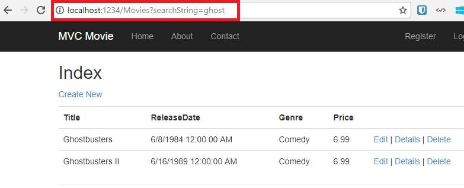
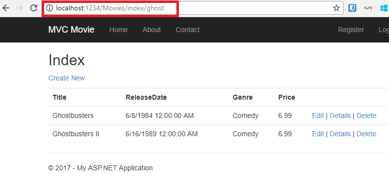
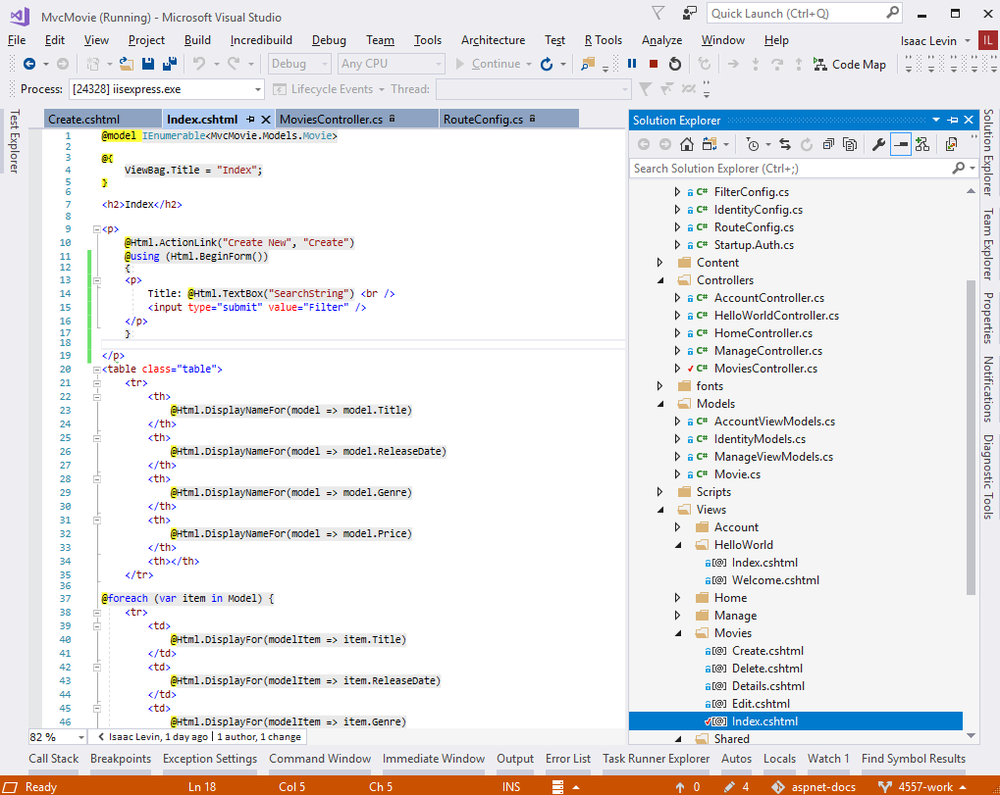
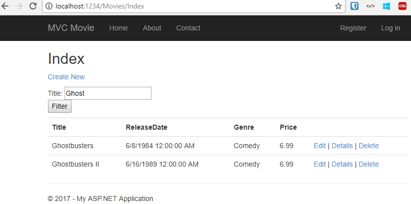
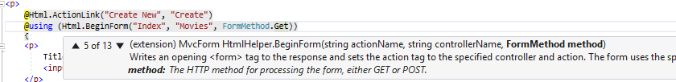
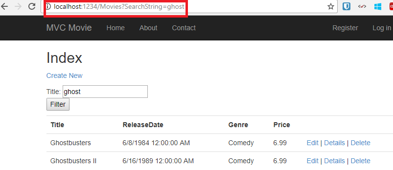
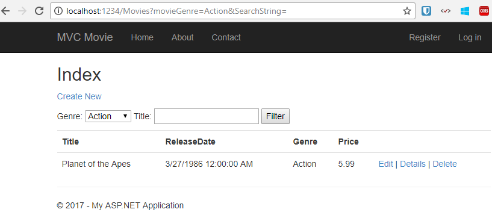

Search
====================
by [Rick Anderson](https://github.com/Rick-Anderson)

## Adding a Search Method and Search View

In this section you'll add search capability to the `Index` action method that lets you search movies by genre or name.

## Updating the Index Form

Start by updating the `Index` action method to the existing `MoviesController` class. Here's the code:

[!code-csharp[Main](adding-search/samples/sample1.cs?highlight=1,6-9)]

The first line of the `Index` method creates the following [LINQ](https://msdn.microsoft.com/en-us/library/bb397926.aspx) query to select the movies:

[!code-csharp[Main](adding-search/samples/sample2.cs)]

The query is defined at this point, but hasn't yet been run against the database.

If the `searchString` parameter contains a string, the movies query is modified to filter on the value of the search string, using the following code:

[!code-csharp[Main](adding-search/samples/sample3.cs)]

The `s => s.Title` code above is a [Lambda Expression](https://msdn.microsoft.com/en-us/library/bb397687.aspx). Lambdas are used in method-based [LINQ](https://msdn.microsoft.com/en-us/library/bb397926.aspx) queries as arguments to standard query operator methods such as the [Where](https://msdn.microsoft.com/en-us/library/system.linq.enumerable.where.aspx) method used in the above code. LINQ queries are not executed when they are defined or when they are modified by calling a method such as `Where` or `OrderBy`. Instead, query execution is deferred, which means that the evaluation of an expression is delayed until its realized value is actually iterated over or the [`ToList`](https://msdn.microsoft.com/en-us/library/bb342261.aspx) method is called. In the `Search` sample, the query is executed in the *Index.cshtml* view. For more information about deferred query execution, see [Query Execution](https://msdn.microsoft.com/en-us/library/bb738633.aspx).

> [!NOTE]
> The [Contains](https://msdn.microsoft.com/en-us/library/bb155125.aspx) method is run on the database, not the c# code above. On the database, [Contains](https://msdn.microsoft.com/en-us/library/bb155125.aspx) maps to [SQL LIKE](https://msdn.microsoft.com/en-us/library/ms179859.aspx), which is case insensitive.

Now you can update the `Index` view that will display the form to the user.

Run the application and navigate to */Movies/Index*. Append a query string such as `?searchString=ghost` to the URL. The filtered movies are displayed.

If you change the signature of the `Index` method to have a parameter named `id`, the `id` parameter will match the `{id}` placeholder for the default routes set in the *App\_Start\RouteConfig.cs* file.

[!code-json[Main](adding-search/samples/sample4.json)]

The original `Index` method looks like this::

[!code-csharp[Main](adding-search/samples/sample5.cs)]

The modified `Index` method would look as follows:

[!code-csharp[Main](adding-search/samples/sample6.cs?highlight=1,3)]

You can now pass the search title as route data (a URL segment) instead of as a query string value.

However, you can't expect users to modify the URL every time they want to search for a movie. So now you you'll add UI to help them filter movies. If you changed the signature of the `Index` method to test how to pass the route-bound ID parameter, change it back so that your `Index` method takes a string parameter named `searchString`:

[!code-csharp[Main](adding-search/samples/sample7.cs)]

Open the *Views\Movies\Index.cshtml* file, and just after `@Html.ActionLink("Create New", "Create")`, add the form markup highlighted below:

[!code-cshtml[Main](adding-search/samples/sample8.cshtml?highlight=12-15)]

The `Html.BeginForm` helper creates an opening `<form>` tag. The `Html.BeginForm` helper causes the form to post to itself when the user submits the form by clicking the **Filter** button.

Visual Studio 2013 has a nice improvement when displaying and editing View files. When you run the application with a view file open, Visual Studio 2013 invokes the correct controller action method to display the view.

With the Index view open in Visual Studio (as shown in the image above), tap Ctr F5 or F5 to run the application and then try searching for a movie.

There's no `HttpPost` overload of the `Index` method. You don't need it, because the method isn't changing the state of the application, just filtering data.

You could add the following `HttpPost Index` method. In that case, the action invoker would match the `HttpPost Index` method, and the `HttpPost Index` method would run as shown in the image below.

[!code-csharp[Main](adding-search/samples/sample9.cs)]

However, even if you add this `HttpPost` version of the `Index` method, there's a limitation in how this has all been implemented. Imagine that you want to bookmark a particular search or you want to send a link to friends that they can click in order to see the same filtered list of movies. Notice that the URL for the HTTP POST request is the same as the URL for the GET request (localhost:xxxxx/Movies/Index) -- there's no search information in the URL itself. Right now, the search string information is sent to the server as a form field value. This means you can't capture that search information to bookmark or send to friends in a URL.

The solution is to use an overload of `BeginForm` that specifies that the POST request should add the search information to the URL and that it should be routed to the `HttpGet` version of the `Index` method. Replace the existing parameterless `BeginForm` method with the following markup:

[!code-cshtml[Main](adding-search/samples/sample10.cshtml)]

Now when you submit a search, the URL contains a search query string. Searching will also go to the `HttpGet Index` action method, even if you have a `HttpPost Index` method.

## Adding Search by Genre

If you added the `HttpPost` version of the `Index` method, delete it now.

Next, you'll add a feature to let users search for movies by genre. Replace the `Index` method with the following code:

[!code-csharp[Main](adding-search/samples/sample11.cs)]

This version of the `Index` method takes an additional parameter, namely `movieGenre`. The first few lines of code create a `List` object to hold movie genres from the database.

The following code is a LINQ query that retrieves all the genres from the database.

[!code-csharp[Main](adding-search/samples/sample12.cs)]

The code uses the `AddRange` method of the generic `List` collection to add all the distinct genres to the list. (Without the `Distinct` modifier, duplicate genres would be added — for example, comedy would be added twice in our sample). The code then stores the list of genres in the `ViewBag.movieGenre` object. Storing category data (such a movie genre's) as a [SelectList](https://msdn.microsoft.com/en-us/library/system.web.mvc.selectlist(v=vs.108).aspx) object in a `ViewBag`, then accessing the category data in a dropdown list box is a typical approach for MVC applications.

The following code shows how to check the `movieGenre` parameter. If it's not empty, the code further constrains the movies query to limit the selected movies to the specified genre.

[!code-csharp[Main](adding-search/samples/sample13.cs)]

As stated previously, the query is not run on the data base until the movie list is iterated over (which happens in the View, after the `Index` action method returns).

## Adding Markup to the Index View to Support Search by Genre

Add an `Html.DropDownList` helper to the *Views\Movies\Index.cshtml* file, just before the `TextBox` helper. The completed markup is shown below:

[!code-cshtml[Main](adding-search/samples/sample14.cshtml?highlight=11)]

In the following code:

[!code-cshtml[Main](adding-search/samples/sample15.cshtml)]

The parameter "movieGenre" provides the key for the `DropDownList` helper to find a `IEnumerable<SelectListItem>` in the `ViewBag`. The `ViewBag` was populated in the action method:

[!code-csharp[Main](adding-search/samples/sample16.cs?highlight=10)]

The parameter "All" provides an option label. If you inspect that choice in your browser, you'll see that its "value" attribute is empty. Since our controller only filters `if` the string is not `null` or empty, submitting an empty value for `movieGenre` shows all genres.

You can also set an option to be selected by default. If you wanted "Comedy" as your default option, you would change the code in the Controller like so:

[!code-cshtml[Main](adding-search/samples/sample17.cshtml)]

Run the application and browse to */Movies/Index*. Try a search by genre, by movie name, and by both criteria.

In this section you created a search action method and view that let users search by movie title and genre. In the next section, you'll look at how to add a property to the `Movie` model and how to add an initializer that will automatically create a test database.

>[!div class="step-by-step"]
[Previous](examining-the-edit-methods-and-edit-view.md)
[Next](adding-a-new-field.md)
