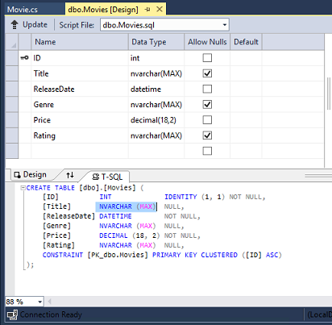
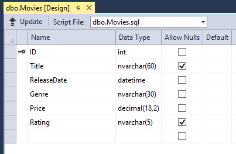
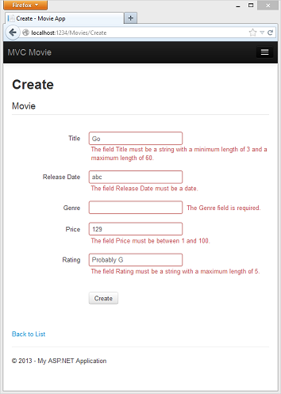
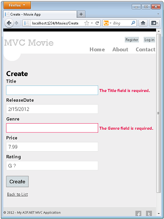
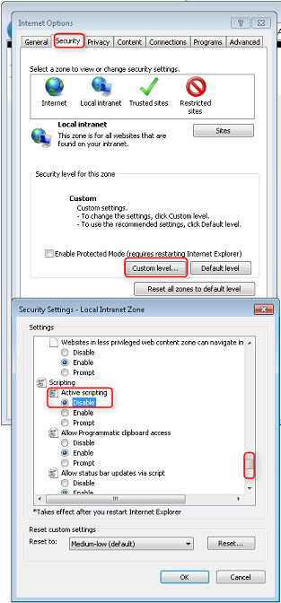
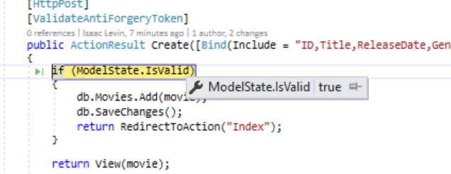
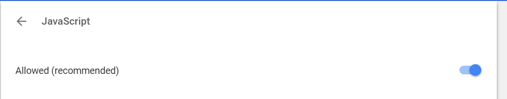

Adding Validation
====================
by [Rick Anderson](https://github.com/Rick-Anderson)

In this this section you'll add validation logic to the `Movie` model, and you'll ensure that the validation rules are enforced any time a user attempts to create or edit a movie using the application.

## Keeping Things DRY

One of the core design tenets of ASP.NET MVC is [DRY](http://en.wikipedia.org/wiki/Don't_repeat_yourself) (&quot;Don't Repeat Yourself&quot;). ASP.NET MVC encourages you to specify functionality or behavior only once, and then have it be reflected everywhere in an application. This reduces the amount of code you need to write and makes the code you do write less error prone and easier to maintain.

The validation support provided by ASP.NET MVC and Entity Framework Code First is a great example of the DRY principle in action. You can declaratively specify validation rules in one place (in the model class) and the rules are enforced everywhere in the application.

Let's look at how you can take advantage of this validation support in the movie application.

## Adding Validation Rules to the Movie Model

You'll begin by adding some validation logic to the `Movie` class.

Open the *Movie.cs* file. Notice the [`System.ComponentModel.DataAnnotations`](https://msdn.microsoft.com/en-us/library/system.componentmodel.dataannotations.aspx) namespace does not contain `System.Web`. DataAnnotations provides a built-in set of validation attributes that you can apply declaratively to any class or property. (It also contains formatting attributes like [DataType](https://msdn.microsoft.com/en-us/library/system.componentmodel.dataannotations.datatype.aspx) that help with formatting and don't provide any validation.)

Now update the `Movie` class to take advantage of the built-in [`Required`](https://msdn.microsoft.com/en-us/library/system.componentmodel.dataannotations.requiredattribute.aspx), [`StringLength`](https://msdn.microsoft.com/en-us/library/system.componentmodel.dataannotations.stringlengthattribute.aspx), [RegularExpression](https://msdn.microsoft.com/en-us/library/system.componentmodel.dataannotations.regularexpressionattribute.aspx), and [`Range`](https://msdn.microsoft.com/en-us/library/system.componentmodel.dataannotations.rangeattribute.aspx) validation attributes. Replace the `Movie` class with the following:

[!code-csharp[Main](adding-validation/samples/sample1.cs?highlight=8,22-24,30-31,37-38)]

The [`StringLength`](https://msdn.microsoft.com/en-us/library/system.componentmodel.dataannotations.stringlengthattribute.aspx) attribute sets the maximum length of the string, and it sets this limitation on the database, therefore the database schema will change. Right click on the **Movies** table in **Server explorer** and click **Open Table Definition**:

In the image above, you can see all the string fields are set to [NVARCHAR (MAX)](https://technet.microsoft.com/en-us/library/ms186939.aspx). We will use migrations to update the schema. Build the solution, and then open the **Package Manager Console** window and enter the following commands:

[!code-console[Main](adding-validation/samples/sample2.cmd)]

When this command finishes, Visual Studio opens the class file that defines the new `DbMIgration` derived class with the name specified (`DataAnnotations`), and in the `Up` method you can see the code that updates the schema constraints:

[!code-csharp[Main](adding-validation/samples/sample3.cs)]

The `Genre` field is are no longer nullable (that is, you must enter a value). The `Rating` field has a maximum length of 5 and `Title` has a maximum length of 60. The minimum length of 3 on `Title` and the range on `Price` did not create schema changes.

Examine the Movie schema:

The string fields show the new length limits and `Genre` is no longer checked as nullable.

The validation attributes specify behavior that you want to enforce on the model properties they are applied to. The `Required` and `MinimumLength` attributes indicates that a property must have a value; but nothing prevents a user from entering white space to satisfy this validation. The [RegularExpression](https://msdn.microsoft.com/en-us/library/system.componentmodel.dataannotations.regularexpressionattribute.aspx) attribute is used to limit what characters can be input. In the code above, `Genre` and `Rating` must use only letters (white space, numbers and special characters are not allowed). The [`Range`](https://msdn.microsoft.com/en-us/library/system.componentmodel.dataannotations.rangeattribute.aspx) attribute constrains a value to within a specified range. The `StringLength` attribute lets you set the maximum length of a string property, and optionally its minimum length. Value types (such as `decimal, int, float, DateTime`) are inherently required and don't need the `Required` attribute.

Code First ensures that the validation rules you specify on a model class are enforced before the application saves changes in the database. For example, the code below will throw a [DbEntityValidationException](https://msdn.microsoft.com/en-us/library/system.data.entity.validation.dbentityvalidationexception(v=vs.103).aspx) exception when the `SaveChanges` method is called, because several required `Movie` property values are missing:

[!code-csharp[Main](adding-validation/samples/sample4.cs)]

The code above throws the following exception:

*Validation failed for one or more entities. See 'EntityValidationErrors' property for more details.*

Having validation rules automatically enforced by the .NET Framework helps make your application more robust. It also ensures that you can't forget to validate something and inadvertently let bad data into the database.

## Validation Error UI in ASP.NET MVC

Run the application and navigate to the */Movies* URL.

Click the **Create New** link to add a new movie. Fill out the form with some invalid values. As soon as jQuery client side validation detects the error, it displays an error message.

> [!NOTE]
> to support jQuery validation for non-English locales that use a comma (",") for a decimal point, you must include the NuGet globalize as described previously in this tutorial.

Notice how the form has automatically used a red border color to highlight the text boxes that contain invalid data and has emitted an appropriate validation error message next to each one. The errors are enforced both client-side (using JavaScript and jQuery) and server-side (in case a user has JavaScript disabled).

A real benefit is that you didn't need to change a single line of code in the `MoviesController` class or in the *Create.cshtml* view in order to enable this validation UI. The controller and views you created earlier in this tutorial automatically picked up the validation rules that you specified by using validation attributes on the properties of the `Movie` model class. Test validation using the `Edit` action method, and the same validation is applied.

The form data is not sent to the server until there are no client side validation errors. You can verify this by putting a break point in the HTTP Post method, by using the [fiddler tool](http://fiddler2.com/fiddler2/), or the IE [F12 developer tools](https://msdn.microsoft.com/en-us/ie/aa740478).

## How Validation Occurs in the Create View and Create Action Method

You might wonder how the validation UI was generated without any updates to the code in the controller or views. The next listing shows what the `Create` methods in the `MovieController` class look like. They're unchanged from how you created them earlier in this tutorial.

[!code-csharp[Main](adding-validation/samples/sample5.cs)]

The first (HTTP GET) `Create` action method displays the initial Create form. The second (`[HttpPost]`) version handles the form post. The second `Create` method (The `HttpPost` version) calls `ModelState.IsValid` to check whether the movie has any validation errors. Calling this method evaluates any validation attributes that have been applied to the object. If the object has validation errors, the `Create` method re-displays the form. If there are no errors, the method saves the new movie in the database. In our movie example, **the form is not posted to the server when there are validation errors detected on the client side; the second** `Create`**method is never called**. If you disable JavaScript in your browser, client validation is disabled and the HTTP POST `Create` method calls `ModelState.IsValid` to check whether the movie has any validation errors.

You can set a break point in the `HttpPost Create` method and verify the method is never called, client side validation will not submit the form data when validation errors are detected. If you disable JavaScript in your browser, then submit the form with errors, the break point will be hit. You still get full validation without JavaScript. The following image shows how to disable JavaScript in Internet Explorer.

The following image shows how to disable JavaScript in the FireFox browser.

The following image shows how to disable JavaScript in the Chrome browser.

Below is the *Create.cshtml* view template that you scaffolded earlier in the tutorial. It's used by the action methods shown above both to display the initial form and to redisplay it in the event of an error.

[!code-cshtml[Main](adding-validation/samples/sample6.cshtml?highlight=16-17)]

Notice how the code uses an `Html.EditorFor` helper to output the `<input>` element for each `Movie` property. Next to this helper is a call to the `Html.ValidationMessageFor` helper method. These two helper methods work with the model object that's passed by the controller to the view (in this case, a `Movie` object). They automatically look for validation attributes specified on the model and display error messages as appropriate.

What's really nice about this approach is that neither the controller nor the `Create` view template knows anything about the actual validation rules being enforced or about the specific error messages displayed. The validation rules and the error strings are specified only in the `Movie` class. These same validation rules are automatically applied to the `Edit` view and any other views templates you might create that edit your model.

If you want to change the validation logic later, you can do so in exactly one place by adding validation attributes to the model (in this example, the `movie` class). You won't have to worry about different parts of the application being inconsistent with how the rules are enforced — all validation logic will be defined in one place and used everywhere. This keeps the code very clean, and makes it easy to maintain and evolve. And it means that you'll be fully honoring the *DRY* principle.

## Using DataType Attributes

Open the *Movie.cs* file and examine the `Movie` class. The [`System.ComponentModel.DataAnnotations`](https://msdn.microsoft.com/en-us/library/system.componentmodel.dataannotations.aspx) namespace provides formatting attributes in addition to the built-in set of validation attributes. We've already applied a [`DataType`](https://msdn.microsoft.com/en-us/library/system.componentmodel.dataannotations.datatype.aspx) enumeration value to the release date and to the price fields. The following code shows the `ReleaseDate` and `Price` properties with the appropriate [`DataType`](https://msdn.microsoft.com/en-us/library/system.componentmodel.dataannotations.datatype.aspx) attribute.

[!code-csharp[Main](adding-validation/samples/sample7.cs)]

The [DataType](https://msdn.microsoft.com/en-us/library/system.componentmodel.dataannotations.datatypeattribute.aspx) attributes only provide hints for the view engine to format the data (and supply attributes such as `<a>` for URL's and `<a href="mailto:EmailAddress.com">` for email. You can use the [RegularExpression](https://msdn.microsoft.com/en-us/library/system.componentmodel.dataannotations.regularexpressionattribute.aspx) attribute to validate the format of the data. The [DataType](https://msdn.microsoft.com/en-us/library/system.componentmodel.dataannotations.datatypeattribute.aspx) attribute is used to specify a data type that is more specific than the database intrinsic type, they are ***not*** validation attributes. In this case we only want to keep track of the date, not the date and time. The [DataType Enumeration](https://msdn.microsoft.com/en-us/library/system.componentmodel.dataannotations.datatype.aspx) provides for many data types, such as *Date, Time, PhoneNumber, Currency, EmailAddress* and more. The `DataType` attribute can also enable the application to automatically provide type-specific features. For example, a `mailto:` link can be created for [DataType.EmailAddress](https://msdn.microsoft.com/en-us/library/system.componentmodel.dataannotations.datatype.aspx), and a date selector can be provided for [DataType.Date](https://msdn.microsoft.com/en-us/library/system.componentmodel.dataannotations.datatype.aspx) in browsers that support [HTML5](http://html5.org/). The [DataType](https://msdn.microsoft.com/en-us/library/system.componentmodel.dataannotations.datatypeattribute.aspx) attributes emits HTML 5 [data-](http://ejohn.org/blog/html-5-data-attributes/) (pronounced *data dash*) attributes that HTML 5 browsers can understand. The [DataType](https://msdn.microsoft.com/en-us/library/system.componentmodel.dataannotations.datatypeattribute.aspx) attributes do not provide any validation.

`DataType.Date` does not specify the format of the date that is displayed. By default, the data field is displayed according to the default formats based on the server's[CultureInfo](https://msdn.microsoft.com/en-us/library/vstudio/system.globalization.cultureinfo(v=vs.110).aspx).

The `DisplayFormat` attribute is used to explicitly specify the date format:

[!code-csharp[Main](adding-validation/samples/sample8.cs)]

The `ApplyFormatInEditMode` setting specifies that the specified formatting should also be applied when the value is displayed in a text box for editing. (You might not want that for some fields — for example, for currency values, you might not want the currency symbol in the text box for editing.)

You can use the [DisplayFormat](https://msdn.microsoft.com/en-us/library/system.componentmodel.dataannotations.displayformatattribute.aspx) attribute by itself, but it's generally a good idea to use the [DataType](https://msdn.microsoft.com/en-us/library/system.componentmodel.dataannotations.datatypeattribute.aspx) attribute also. The `DataType` attribute conveys the *semantics* of the data as opposed to how to render it on a screen, and provides the following benefits that you don't get with `DisplayFormat`:

- The browser can enable HTML5 features (for example to show a calendar control, the locale-appropriate currency symbol, email links, etc.).
- By default, the browser will render data using the correct format based on your[locale](https://msdn.microsoft.com/en-us/library/vstudio/wyzd2bce.aspx).
- The[DataType](https://msdn.microsoft.com/en-us/library/system.componentmodel.dataannotations.datatypeattribute.aspx) attribute can enable MVC to choose the right field template to render the data (the [DisplayFormat](https://msdn.microsoft.com/en-us/library/system.componentmodel.dataannotations.displayformatattribute.aspx) if used by itself uses the string template). For more information, see Brad Wilson's[ASP.NET MVC 2 Templates](http://bradwilson.typepad.com/blog/2009/10/aspnet-mvc-2-templates-part-1-introduction.html). (Though written for MVC 2, this article still applies to the current version of ASP.NET MVC.)

If you use the `DataType` attribute with a date field, you have to specify the `DisplayFormat` attribute also in order to ensure that the field renders correctly in Chrome browsers. For more information, see [this StackOverflow thread](http://stackoverflow.com/questions/12633471/mvc4-datatype-date-editorfor-wont-display-date-value-in-chrome-fine-in-ie).

> [!NOTE]
> jQuery validation does not work with the[Range](https://msdn.microsoft.com/en-us/library/system.componentmodel.dataannotations.rangeattribute.aspx) attribute and[DateTime](https://msdn.microsoft.com/en-us/library/system.datetime.aspx). For example, the following code will always display a client side validation error, even when the date is in the specified range:
> 
> [!code-csharp[Main](adding-validation/samples/sample9.cs)]
> 
> You will need to disable jQuery date validation to use the [Range](https://msdn.microsoft.com/en-us/library/system.componentmodel.dataannotations.rangeattribute.aspx) attribute with[DateTime](https://msdn.microsoft.com/en-us/library/system.datetime.aspx). It's generally not a good practice to compile hard dates in your models, so using the[Range](https://msdn.microsoft.com/en-us/library/system.componentmodel.dataannotations.rangeattribute.aspx) attribute and[DateTime](https://msdn.microsoft.com/en-us/library/system.datetime.aspx) is discouraged.

The following code shows combining attributes on one line:

[!code-csharp[Main](adding-validation/samples/sample10.cs?highlight=6,10)]

In the next part of the series, we'll review the application and make some improvements to the automatically generated `Details` and `Delete` methods.

>[!div class="step-by-step"]
[Previous](adding-a-new-field.md)
[Next](examining-the-details-and-delete-methods.md)
