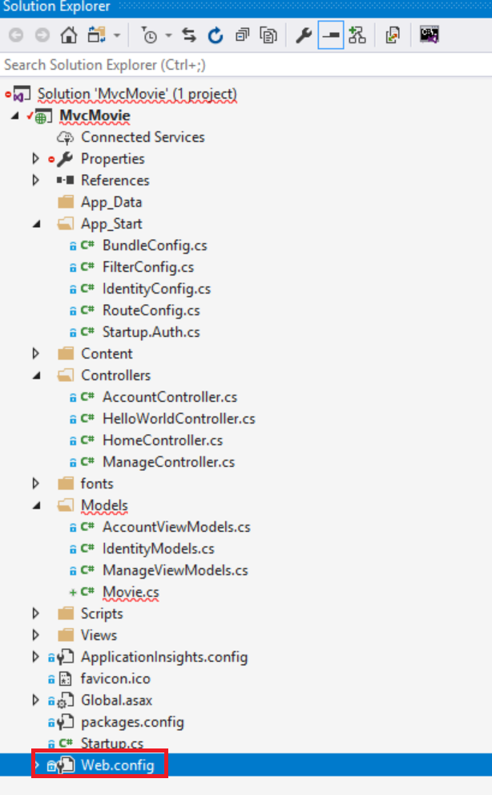
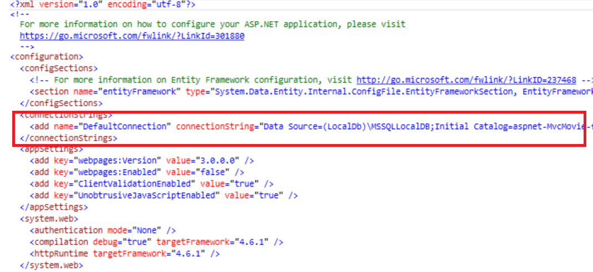

Creating a Connection String and Working with SQL Server LocalDB
====================
by [Rick Anderson](https://github.com/Rick-Anderson)

## Creating a Connection String and Working with SQL Server LocalDB

The `MovieDBContext` class you created handles the task of connecting to the database and mapping `Movie` objects to database records. One question you might ask, though, is how to specify which database it will connect to. You don't actually have to specify which database to use, Entity Framework will default to using [LocalDB](https://msdn.microsoft.com/en-us/library/hh510202.aspx). In this section we'll explicitly add a connection string in the *Web.config* file of the application.

## SQL Server Express LocalDB

[LocalDB](https://blogs.msdn.com/b/sqlexpress/archive/2011/07/12/introducing-localdb-a-better-sql-express.aspx) is a lightweight version of the SQL Server Express Database Engine that starts on demand and runs in user mode. LocalDB runs in a special execution mode of SQL Server Express that enables you to work with databases as *.mdf* files. Typically, LocalDB database files are kept in the *App\_Data* folder of a web project.

SQL Server Express is not recommended for use in production web applications. LocalDB in particular should not be used for production with a web application because it is not designed to work with IIS. However, a LocalDB database can be easily migrated to SQL Server or SQL Azure.

In Visual Studio 2013 (and in 2012), LocalDB is installed by default with Visual Studio.

By default, the Entity Framework looks for a connection string named the same as the object context class (`MovieDBContext` for this project). For more information see [SQL Server Connection Strings for ASP.NET Web Applications](https://msdn.microsoft.com/en-us/library/jj653752.aspx).

Open the application root *Web.config* file shown below. (Not the *Web.config* file in the *Views* folder.)

Find the `<connectionStrings>` element:

Add the following connection string to the `<connectionStrings>` element in the *Web.config* file.

[!code-xml[Main](creating-a-connection-string/samples/sample1.xml)]

The following example shows a portion of the *Web.config* file with the new connection string added:

[!code-xml[Main](creating-a-connection-string/samples/sample2.xml)]

The two connection strings are very similar. The first connection string is named `DefaultConnection` and is used for the membership database to control who can access the application. The connection string you've added specifies a LocalDB database named *Movie.mdf* located in the *App\_Data* folder. We won't use the membership database in this tutorial, for more information on membership, authentication and security, see my tutorial [Create an ASP.NET MVC app with auth and SQL DB and deploy to Azure App Service](https://www.windowsazure.com/en-us/develop/net/tutorials/web-site-with-sql-database/).

The name of the connection string must match the name of the [DbContext](https://msdn.microsoft.com/en-us/library/system.data.entity.dbcontext(v=vs.103).aspx) class.

[!code-csharp[Main](creating-a-connection-string/samples/sample3.cs?highlight=15)]

You don't actually need to add the `MovieDBContext` connection string. If you don't specify a connection string, Entity Framework will create a LocalDB database in the users directory with the fully qualified name of the [DbContext](https://msdn.microsoft.com/en-us/library/system.data.entity.dbcontext(v=vs.103).aspx) class (in this case `MvcMovie.Models.MovieDBContext`). You can name the database anything you like, as long as it has the *.MDF* suffix. For example, we could name the database *MyFilms.mdf*.

Next, you'll build a new `MoviesController` class that you can use to display the movie data and allow users to create new movie listings.

>[!div class="step-by-step"]
[Previous](adding-a-model.md)
[Next](accessing-your-models-data-from-a-controller.md)