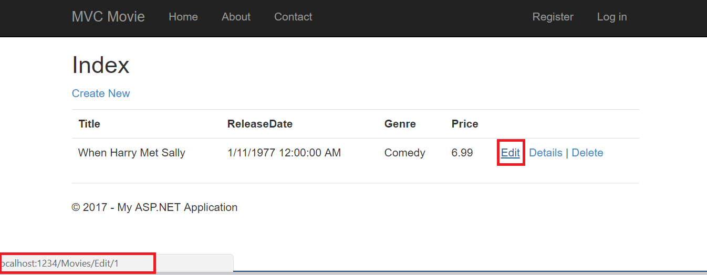
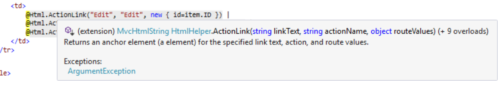
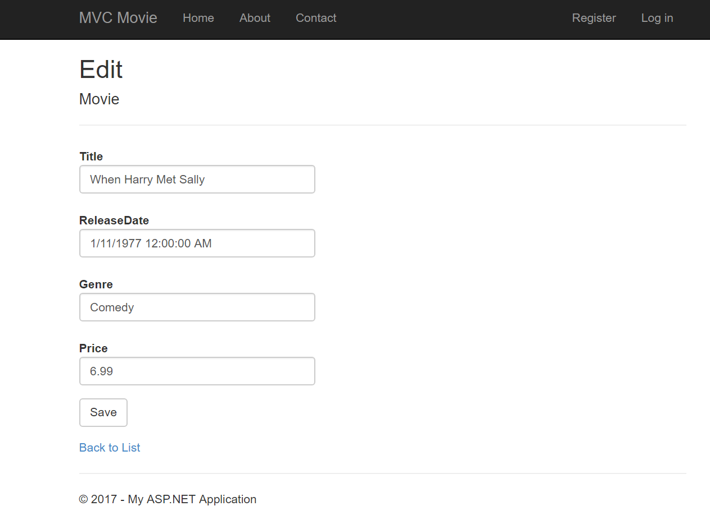
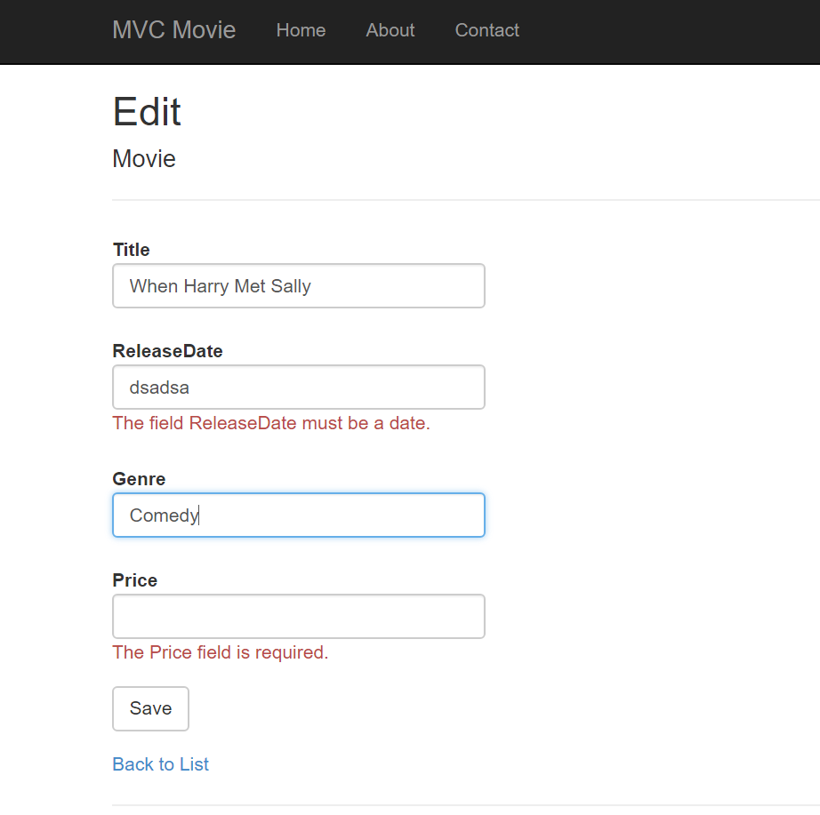
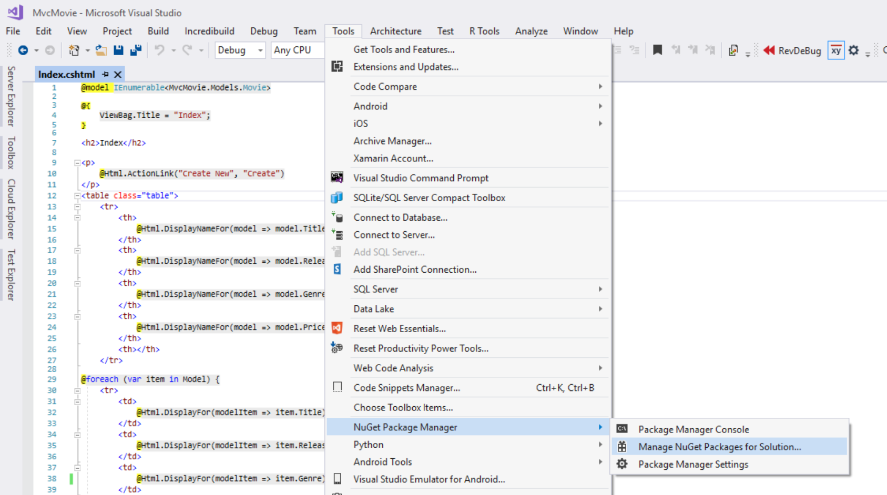
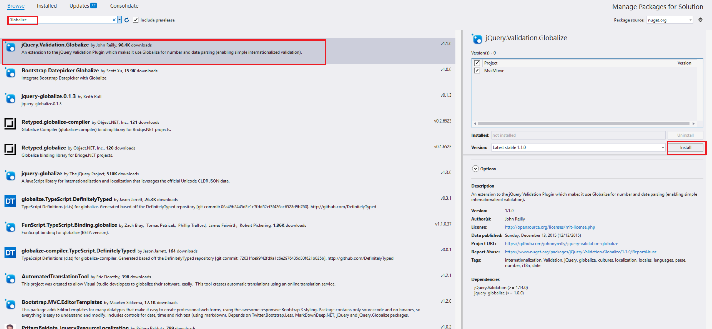

Examining the Edit Methods and Edit View
====================
by [Rick Anderson](https://github.com/Rick-Anderson)

In this section, you'll examine the generated `Edit` action methods and views for the movie controller. But first will take a short diversion to make the release date look better. Open the *Models\Movie.cs* file and add the highlighted lines shown below:

[!code-csharp[Main](examining-the-edit-methods-and-edit-view/samples/sample1.cs?highlight=2,12-14)]

You can also make the date culture specific like this:

[!code-csharp[Main](examining-the-edit-methods-and-edit-view/samples/sample2.cs?highlight=3)]

We'll cover [DataAnnotations](https://msdn.microsoft.com/en-us/library/system.componentmodel.dataannotations.aspx) in the next tutorial. The [Display](https://msdn.microsoft.com/en-us/library/system.componentmodel.dataannotations.displayattribute.aspx) attribute specifies what to display for the name of a field (in this case "Release Date" instead of "ReleaseDate"). The [DataType](https://msdn.microsoft.com/en-us/library/system.componentmodel.dataannotations.datatypeattribute.aspx) attribute specifies the type of the data, in this case it's a date, so the time information stored in the field is not displayed. The [DisplayFormat](https://msdn.microsoft.com/en-us/library/system.componentmodel.dataannotations.displayformatattribute.aspx) attribute is needed for a bug in the Chrome browser that renders date formats incorrectly.

Run the application and browse to the `Movies` controller. Hold the mouse pointer over an **Edit** link to see the URL that it links to.

The **Edit** link was generated by the `Html.ActionLink` method in the *Views\Movies\Index.cshtml* view:

[!code-cshtml[Main](examining-the-edit-methods-and-edit-view/samples/sample3.cshtml)]

The `Html` object is a helper that's exposed using a property on the [System.Web.Mvc.WebViewPage](https://msdn.microsoft.com/en-us/library/gg402107(VS.98).aspx) base class. The `ActionLink` method of the helper makes it easy to dynamically generate HTML hyperlinks that link to action methods on controllers. The first argument to the `ActionLink` method is the link text to render (for example, `<a>Edit Me</a>`). The second argument is the name of the action method to invoke (In this case, the `Edit` action). The final argument is an [anonymous object](https://weblogs.asp.net/scottgu/archive/2007/05/15/new-orcas-language-feature-anonymous-types.aspx) that generates the route data (in this case, the ID of 4).

The generated link shown in the previous image is `http://localhost:1234/Movies/Edit/4`. The default route (established in *App\_Start\RouteConfig.cs*) takes the URL pattern `{controller}/{action}/{id}`. Therefore, ASP.NET translates `http://localhost:1234/Movies/Edit/4` into a request to the `Edit` action method of the `Movies` controller with the parameter `ID` equal to 4. Examine the following code from the *App\_Start\RouteConfig.cs* file. The [MapRoute](../../older-versions-1/controllers-and-routing/asp-net-mvc-routing-overview-cs.md) method is used to route HTTP requests to the correct controller and action method and supply the optional ID parameter. The [MapRoute](../../older-versions-1/controllers-and-routing/asp-net-mvc-routing-overview-cs.md) method is also used by the [HtmlHelpers](https://msdn.microsoft.com/en-us/library/system.web.mvc.htmlhelper(v=vs.108).aspx) such as `ActionLink` to generate URLs given the controller, action method and any route data.

[!code-csharp[Main](examining-the-edit-methods-and-edit-view/samples/sample4.cs?highlight=7)]

You can also pass action method parameters using a query string. For example, the URL `http://localhost:1234/Movies/Edit?ID=3` also passes the parameter `ID` of 3 to the `Edit` action method of the `Movies` controller.

Open the `Movies` controller. The two `Edit` action methods are shown below.

[!code-csharp[Main](examining-the-edit-methods-and-edit-view/samples/sample5.cs?highlight=19-21)]

Notice the second `Edit` action method is preceded by the `HttpPost` attribute. This attribute specifies that that overload of the `Edit` method can be invoked only for POST requests. You could apply the `HttpGet` attribute to the first edit method, but that's not necessary because it's the default. (We'll refer to action methods that are implicitly assigned the `HttpGet` attribute as `HttpGet` methods.) The [Bind](https://msdn.microsoft.com/en-us/library/system.web.mvc.bindattribute(v=vs.108).aspx) attribute is another important security mechanism that keeps hackers from over-posting data to your model. You should only include properties in the bind attribute that you want to change. You can read about overposting and the bind attribute in my [overposting security note](https://go.microsoft.com/fwlink/?LinkId=317598). In the simple model used in this tutorial, we will be binding all the data in the model. The [ValidateAntiForgeryToken](https://msdn.microsoft.com/en-us/library/system.web.mvc.validateantiforgerytokenattribute(v=vs.108).aspx) attribute is used to prevent forgery of a request and is paired up with `@Html.AntiForgeryToken()` in the edit view file (*Views\Movies\Edit.cshtml*), a portion is shown below:

[!code-cshtml[Main](examining-the-edit-methods-and-edit-view/samples/sample6.cshtml?highlight=9)]

`@Html.AntiForgeryToken()` generates a hidden form anti-forgery token that must match in the `Edit` method of the `Movies` controller. You can read more about Cross-site request forgery (also known as XSRF or CSRF) in my tutorial [XSRF/CSRF Prevention in MVC](../../security/xsrfcsrf-prevention-in-aspnet-mvc-and-web-pages.md).

The `HttpGet` `Edit` method takes the movie ID parameter, looks up the movie using the Entity Framework `Find` method, and returns the selected movie to the Edit view. If a movie cannot be found, [HttpNotFound](https://msdn.microsoft.com/en-us/library/gg453938(VS.98).aspx) is returned. When the scaffolding system created the Edit view, it examined the `Movie` class and created code to render `<label>` and `<input>` elements for each property of the class. The following example shows the Edit view that was generated by the visual studio scaffolding system:

[!code-cshtml[Main](examining-the-edit-methods-and-edit-view/samples/sample7.cshtml)]

Notice how the view template has a `@model MvcMovie.Models.Movie` statement at the top of the file — this specifies that the view expects the model for the view template to be of type `Movie`.

The scaffolded code uses several *helper methods* to streamline the HTML markup. The [`Html.LabelFor`](https://msdn.microsoft.com/en-us/library/gg401864(VS.98).aspx) helper displays the name of the field (&quot;Title&quot;, &quot;ReleaseDate&quot;, &quot;Genre&quot;, or &quot;Price&quot;). The [`Html.EditorFor`](https://msdn.microsoft.com/en-us/library/system.web.mvc.html.editorextensions.editorfor(VS.98).aspx) helper renders an HTML `<input>` element. The [`Html.ValidationMessageFor`](https://msdn.microsoft.com/en-us/library/system.web.mvc.html.validationextensions.validationmessagefor(VS.98).aspx) helper displays any validation messages associated with that property.

Run the application and navigate to the */Movies* URL. Click an **Edit** link. In the browser, view the source for the page. The HTML for the form element is shown below.

[!code-cshtml[Main](examining-the-edit-methods-and-edit-view/samples/sample8.cshtml?highlight=1-2)]

The `<input>` elements are in an HTML `<form>` element whose `action` attribute is set to post to the */Movies/Edit* URL. The form data will be posted to the server when the **Save** button is clicked. The second line shows the hidden [XSRF](../../security/xsrfcsrf-prevention-in-aspnet-mvc-and-web-pages.md) token generated by the `@Html.AntiForgeryToken()` call.

## Processing the POST Request

The following listing shows the `HttpPost` version of the `Edit` action method.

[!code-csharp[Main](examining-the-edit-methods-and-edit-view/samples/sample9.cs)]

The [ValidateAntiForgeryToken](https://msdn.microsoft.com/en-us/library/system.web.mvc.validateantiforgerytokenattribute(v=vs.108).aspx) attribute validates the [XSRF](../../security/xsrfcsrf-prevention-in-aspnet-mvc-and-web-pages.md) token generated by the `@Html.AntiForgeryToken()` call in the view.

The [ASP.NET MVC model binder](https://msdn.microsoft.com/en-us/library/dd410405.aspx) takes the posted form values and creates a `Movie` object that's passed as the `movie` parameter. The `ModelState.IsValid` method verifies that the data submitted in the form can be used to modify (edit or update) a `Movie` object. If the data is valid, the movie data is saved to the `Movies` collection of the `db(MovieDBContext` instance). The new movie data is saved to the database by calling the `SaveChanges` method of `MovieDBContext`. After saving the data, the code redirects the user to the `Index` action method of the `MoviesController` class, which displays the movie collection, including the changes just made.

As soon as the client side validation determines the values of a field are not valid, an error message is displayed. If you disable JavaScript, you won't have client side validation but the server will detect the posted values are not valid, and the form values will be redisplayed with error messages. Later in the tutorial we examine validation in more detail.

The `Html.ValidationMessageFor` helpers in the *Edit.cshtml* view template take care of displaying appropriate error messages.

All the `HttpGet` methods follow a similar pattern. They get a movie object (or list of objects, in the case of `Index`), and pass the model to the view. The `Create` method passes an empty movie object to the Create view. All the methods that create, edit, delete, or otherwise modify data do so in the `HttpPost` overload of the method. Modifying data in an HTTP GET method is a security risk, as described in the blog post entry [ASP.NET MVC Tip #46 – Don't use Delete Links because they create Security Holes](http://stephenwalther.com/blog/archive/2009/01/21/asp.net-mvc-tip-46-ndash-donrsquot-use-delete-links-because.aspx). Modifying data in a GET method also violates HTTP best practices and the architectural [REST](http://en.wikipedia.org/wiki/Representational_State_Transfer) pattern, which specifies that GET requests should not change the state of your application. In other words, performing a GET operation should be a safe operation that has no side effects and doesn't modify your persisted data.

If you are using a US-English computer, you can skip this section and go to the next tutorial. You can download the Globalize version of this tutorial [here](https://archive.msdn.microsoft.com/Project/Download/FileDownload.aspx?ProjectName=aspnetmvcsamples&amp;DownloadId=16475). For an excellent two part tutorial on Internationalization, see [Nadeem's ASP.NET MVC 5 Internationalization](http://afana.me/post/aspnet-mvc-internationalization.aspx).

> [!NOTE]
> to support jQuery validation for non-English locales that use a comma (&quot;,&quot;) for a decimal point, and non US-English date formats, you must include *globalize.js* and your specific *cultures/globalize.cultures.js* file(from [https://github.com/jquery/globalize](https://github.com/jquery/globalize) ) and JavaScript to use `Globalize.parseFloat`. You can get the jQuery non-English validation from NuGet. (Don't install Globalize if you are using a English locale.)

1. From the **Tools** menu click **Library Package Manager**, and then click **Manage NuGet Packages for Solution**.  
  
    
2. On the left pane, select **Online*.***(See the image below.)
3. In the **Search Installed packages** input box, enter *Globalize.  
  
    *Click **Install**. The *Scripts\jquery.globalize\globalize.js* file will be added to your project. The *Scripts\jquery.globalize\cultures\* folder will contain many culture JavaScript files. Note, it can take five minutes to install this package.

 The following code shows the modifications to the Views\Movies\Edit.cshtml file: 

[!code-cshtml[Main](examining-the-edit-methods-and-edit-view/samples/sample10.cshtml)]

To avoid repeating this code in every Edit view, you can move it to the layout file. To optimize the script download, see my tutorial [Bundling and Minification](../../performance/bundling-and-minification.md).

For more information see [ASP.NET MVC 3 Internationalization](http://afana.me/post/aspnet-mvc-internationalization.aspx) and [ASP.NET MVC 3 Internationalization - Part 2 (NerdDinner)](http://afana.me/post/aspnet-mvc-internationalization-part-2.aspx).

As a temporary fix, if you can't get validation working in your locale, you can force your computer to use US English or you can disable JavaScript in your browser. To force your computer to use US English, you can add the globalization element to the projects root *web.config* file. The following code shows the globalization element with the culture set to United States English.

[!code-xml[Main](examining-the-edit-methods-and-edit-view/samples/sample11.xml)]

 In the next tutorial, we'll implement search functionality.

>[!div class="step-by-step"]
[Previous](accessing-your-models-data-from-a-controller.md)
[Next](adding-search.md)