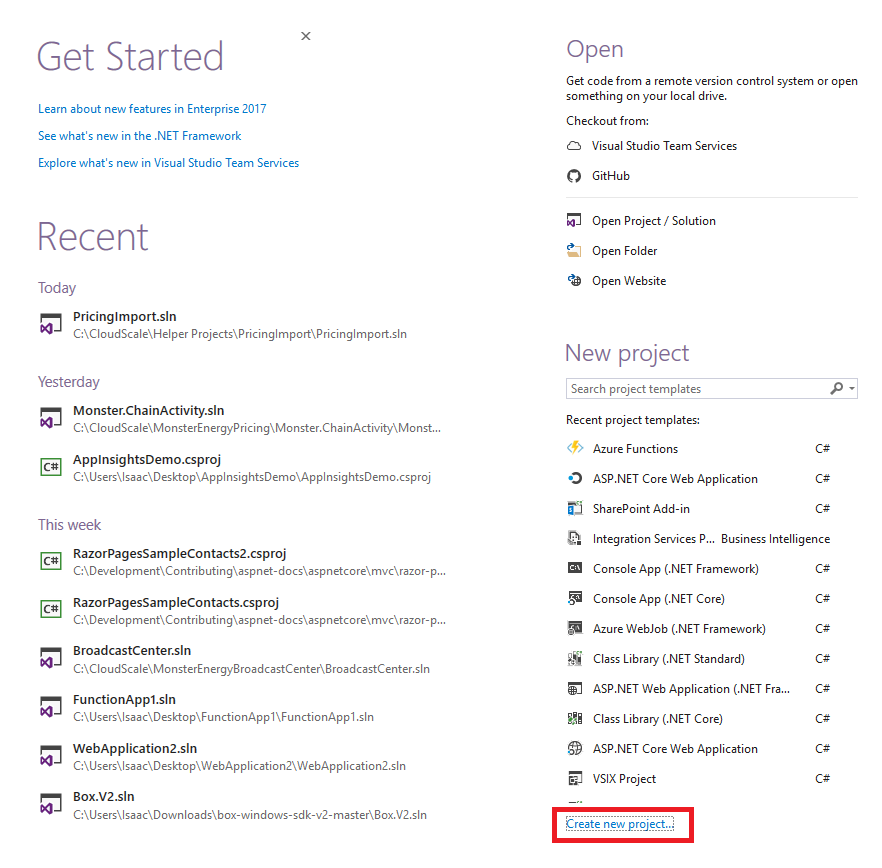
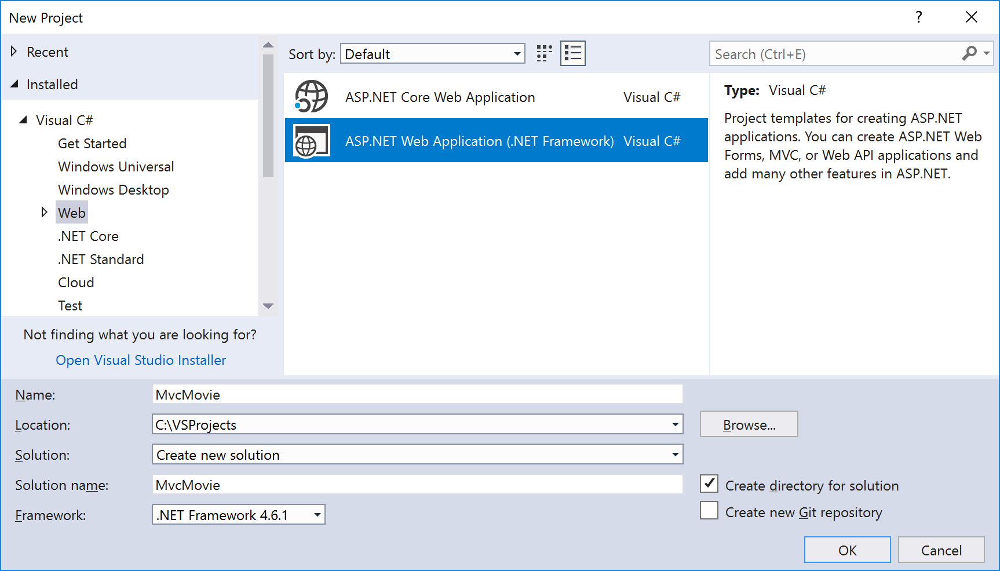
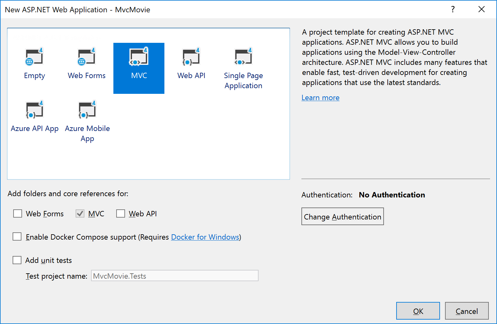
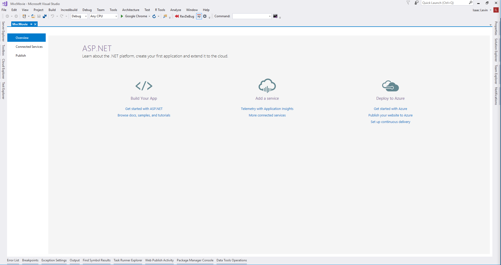
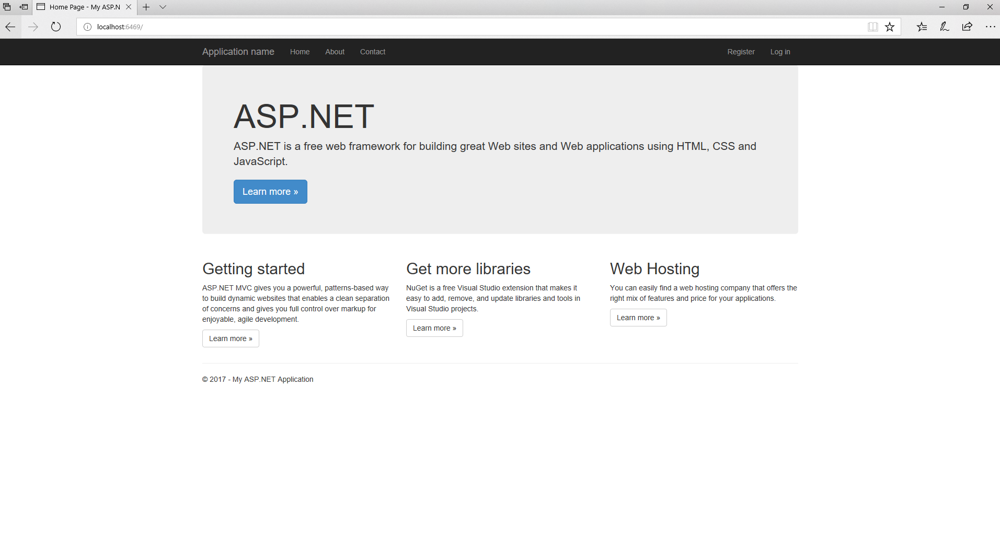
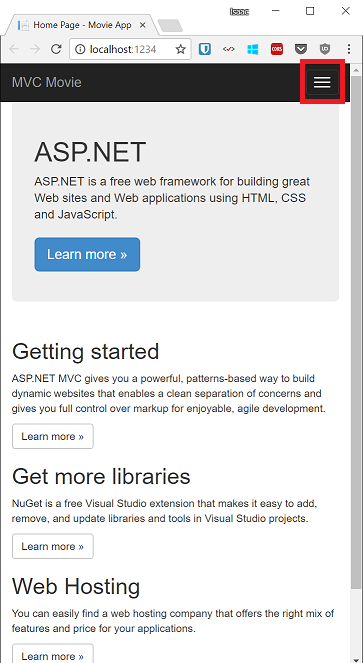
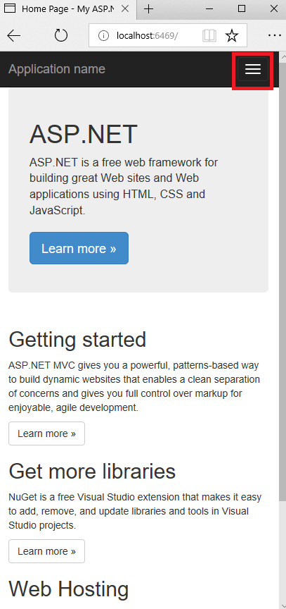

Getting Started with ASP.NET MVC 5
====================
by [Rick Anderson](https://github.com/Rick-Anderson)

> > [!NOTE]
> > An updated version of this tutorial is available [here](https://docs.microsoft.com/en-us/aspnet/core/tutorials/first-mvc-app/start-mvc) using the latest version of [Visual Studio.](https://www.visualstudio.com) The new tutorial uses [ASP.NET Core MVC](https://docs.microsoft.com/en-us/aspnet/core/mvc/), which provides many improvements over this tutorial.
> 
> 
> This tutorial will teach you the basics of building an ASP.NET MVC 5 web app using [Visual Studio 2013](https://www.microsoft.com/visualstudio/eng/2013-downloads).
> 
> <!-- Download the [completed project](https://github.com/Rick-Anderson/MvcMovie5). -->
> 
> This tutorial was written by [Scott Guthrie](https://weblogs.asp.net/scottgu/) (twitter[@scottgu](https://twitter.com/scottgu) ), [Scott Hanselman](http://www.hanselman.com/blog/) (twitter: [@shanselman](https://twitter.com/shanselman) ), and [Rick Anderson](https://twitter.com/RickAndMSFT) ( [@RickAndMSFT](https://twitter.com/#!/RickAndMSFT) )
> 
> You need an Azure account to deploy this app to Azure:
> 
> - You can [open an Azure account for free](https://azure.microsoft.com/en-us/pricing/free-trial/?WT.mc_id=A443DD604) - You get credits you can use to try out paid Azure services, and even after they're used up you can keep the account and use free Azure services.
> - You can [activate MSDN subscriber benefits](https://azure.microsoft.com/en-us/pricing/member-offers/msdn-benefits-details/?WT.mc_id=A443DD604) - Your MSDN subscription gives you credits every month that you can use for paid Azure services.

## Getting Started

Start by installing and running [Visual Studio Express 2013 for Web](https://www.microsoft.com/visualstudio/eng/2013-downloads#d-2013-express) or [Visual Studio 2013](https://www.microsoft.com/visualstudio/eng/2013-downloads).

Visual Studio is an IDE, or integrated development environment. Just like you use Microsoft Word to write documents, you'll use an IDE to create applications. In Visual Studio there's a toolbar along the top showing various options available to you. There's also a menu that provides another way to perform tasks in the IDE. (For example, instead of selecting **New Project** from the **Start** page, you can use the menu and select **File** &gt; **New Project**.)

   
  
 

## Creating Your First Application

Click **New Project**, then select Visual C# on the left, then **Web** and then select **ASP.NET Web Application**. Name your project "MvcMovie" and then click **OK**.

In the **New ASP.NET Project** dialog, click **MVC** and then click **OK**.

Visual Studio used a default template for the ASP.NET MVC project you just created, so you have a working application right now without doing anything! This is a simple "Hello World!" project, and it's a good place to start your application.

Click F5 to start debugging. F5 causes Visual Studio to start [IIS Express](https://www.iis.net/learn/extensions/introduction-to-iis-express/iis-express-overview) and run your web app. Visual Studio then launches a browser and opens the application's home page. Notice that the address bar of the browser says `localhost:port#` and not something like `example.com`. That's because `localhost` always points to your own local computer, which in this case is running the application you just built. When Visual Studio runs a web project, a random port is used for the web server. In the image below, the port number is 1234. When you run the application, you'll see a different port number.

Right out of the box this default template gives you Home, Contact and About pages. The image above doesn't show the **Home**, **About** and **Contact** links. Depending on the size of your browser window, you might need to click the navigation icon to see these links.

  
 

The application also provides support to register and log in. The next step is to change how this application works and learn a little bit about ASP.NET MVC. Close the ASP.NET MVC application and let's change some code.

For a list of current tutorials, see [MVC recommended articles](../mvc-learning-sequence.md).

## See this App Running on Azure

Would you like to see the finished site running as a live web app? You can deploy a complete version of the app to your Azure account by simply clicking the following button.

You need an Azure account to deploy this solution to Azure. If you do not already have an account, you have the following options:

- [Open an Azure account for free](https://azure.microsoft.com/en-us/pricing/free-trial/?WT.mc_id=A443DD604) - You get credits you can use to try out paid Azure services, and even after they're used up you can keep the account and use free Azure services.
- [Activate MSDN subscriber benefits](https://azure.microsoft.com/en-us/pricing/member-offers/msdn-benefits-details/?WT.mc_id=A443DD604) - Your MSDN subscription gives you credits every month that you can use for paid Azure services.

>[!div class="step-by-step"]
[Next](adding-a-controller.md)
