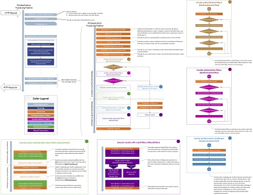

Lifecycle of an ASP.NET MVC 5 Application
====================
by [Cephas Lin](https://github.com/cephalin)

[Download PDF Document](lifecycle-of-an-aspnet-mvc-5-application/_static/lifecycle-of-an-aspnet-mvc-5-application1.pdf)

Here you can download a PDF document that charts the lifecycle of every ASP.NET MVC 5 application, from receiving the HTTP request to sending the HTTP response back to the client. It is designed both as an educational tool for those who are new to ASP.NET MVC and also as a reference for those who need to drill into specific aspects of the application. The PDF document has the following features:

- Relevant [HttpApplication](https://msdn.microsoft.com/en-us/library/system.web.httpapplication.aspx) stages to help you understand where MVC integrates into the [ASP.NET application lifecycle](https://msdn.microsoft.com/en-us/library/bb470252.aspx).
- A high-level view of the MVC application lifecycle, where you can understand the major stages that every MVC application passes through in the request processing pipeline.  
    
- A detail view that shows drills down into the details of the request processing pipeline. You can compare the high-level view and the detail view to see how the lifecycles details are collected into the various stages. [Download PDF](lifecycle-of-an-aspnet-mvc-5-application/_static/lifecycle-of-an-aspnet-mvc-5-application1.pdf) to see a larger view.
    
- Placement and purpose of all overridable methods on the [Controller](https://msdn.microsoft.com/en-us/library/system.web.mvc.controller.aspx) object in the request processing pipeline. You may or may not have the need to override any one method, but it is important for you to understand their role in the application lifecycle so that you can write code at the appropriate life cycle stage for the effect you intend.
- Blown-up diagrams showing how each of the filter types (authentication, authorization, action, and result) is invoked.
- Link to a useful article or blog from each point of interest in the detail view.

## Next Steps

Does this document meet your need? We'd appreciate your feedback. If you have any question on the ASP.NET MVC lifecycle in your application, [Stackoverflow](http://stackoverflow.com/help) and the [ASP.NET MVC forums](https://forums.asp.net/1146.aspx) are great places to ask. Follow [me](https://twitter.com/Cephas_MSFT) on twitter so you can get updates on my latest tutorials.
