Iteration #1 – Create the Application (C#)
====================
by [Microsoft](https://github.com/microsoft)

[Download Code](iteration-1-create-the-application-cs/_static/contactmanager_1_cs1.zip)

> In the first iteration, we create the Contact Manager in the simplest way possible. We add support for basic database operations: Create, Read, Update, and Delete (CRUD).

## Building a Contact Management ASP.NET MVC Application (VB)

In this series of tutorials, we build an entire Contact Management application from start to finish. The Contact Manager application enables you to store contact information - names, phone numbers and email addresses - for a list of people.

We build the application over multiple iterations. With each iteration, we gradually improve the application. The goal of this multiple iteration approach is to enable you to understand the reason for each change.

- Iteration #1 - Create the application. In the first iteration, we create the Contact Manager in the simplest way possible. We add support for basic database operations: Create, Read, Update, and Delete (CRUD).

- Iteration #2 - Make the application look nice. In this iteration, we improve the appearance of the application by modifying the default ASP.NET MVC view master page and cascading style sheet.

- Iteration #3 - Add form validation. In the third iteration, we add basic form validation. We prevent people from submitting a form without completing required form fields. We also validate email addresses and phone numbers.

- Iteration #4 - Make the application loosely coupled. In this third iteration, we take advantage of several software design patterns to make it easier to maintain and modify the Contact Manager application. For example, we refactor our application to use the Repository pattern and the Dependency Injection pattern.

- Iteration #5 - Create unit tests. In the fifth iteration, we make our application easier to maintain and modify by adding unit tests. We mock our data model classes and build unit tests for our controllers and validation logic.

- Iteration #6 - Use test-driven development. In this sixth iteration, we add new functionality to our application by writing unit tests first and writing code against the unit tests. In this iteration, we add contact groups.

- Iteration #7 - Add Ajax functionality. In the seventh iteration, we improve the responsiveness and performance of our application by adding support for Ajax.

## This Iteration

In this first iteration, we build the basic application. The goal is to build the Contact Manager in the fastest and simplest way possible. In later iterations, we improve the design of the application.

The Contact Manager application is a basic database-driven application. You can use the application to create new contacts, edit existing contacts, and delete contacts.

In this iteration, we complete the following steps:

1. ASP.NET MVC application
2. Create a database to store our contacts
3. Generate a model class for our database with the Microsoft Entity Framework
4. Create a controller action and view that enables us to list all of the contacts in the database
5. Create controller actions and a view that enables us to create a new contact in the database
6. Create controller actions and a view that enables us to edit an existing contact in the database
7. Create controller actions and a view that enables us to delete an existing contact in the database

## Software Prerequisites

In ASP.NET MVC applications, you must have either Visual Studio 2008 or Visual Web Developer 2008 installed on your computer (Visual Web Developer is a free version of Visual Studio that does not include all of the advanced features of Visual Studio). You can download either the trial version of Visual Studio 2008 or Visual Web Developer from the following address:

[https://www.asp.net/downloads/essential/](https://www.asp.net/downloads/essential)

> [!NOTE] 
> 
> For ASP.NET MVC applications with Visual Web Developer, you must have Visual Web Developer Service Pack 1 installed. Without Service Pack 1, you cannot create Web Application Projects.

ASP.NET MVC framework. You can download the ASP.NET MVC framework from the following address:

[https://www.asp.net/mvc](../../../index.md)

In this tutorial, we use the Microsoft Entity Framework to access a database. The Entity Framework is included with .NET Framework 3.5 Service Pack 1. You can download this service pack from the following location:

[https://www.microsoft.com/downloads/details.aspx?familyid=ab99342f-5d1a-413d-8319-81da479ab0d7&amp;displaylang=en](https://www.microsoft.com/downloads/details.aspx?familyid=ab99342f-5d1a-413d-8319-81da479ab0d7&amp;displaylang=en)

As an alternative to performing each of these downloads one by one, you can take advantage of the Web Platform Installer (Web PI). You can download the Web PI from the following address:

[https://www.asp.net/downloads/essential/](https://www.asp.net/downloads/essential)

## ASP.NET MVC Project

ASP.NET MVC Web Application Project. Launch Visual Studio and select the menu option **File, New Project**. The **New Project** dialog appears (see Figure 1). Select the **Web** project type and the **ASP.NET MVC Web Application** template. Name your new project *ContactManager* and click the OK button.

Make sure that you have .NET Framework 3.5 selected from the dropdown list at the top right of the **New Project** dialog. Otherwise, the ASP.NET MVC Web Application template won t appear.

**Figure 01**: The New Project dialog([Click to view full-size image](iteration-1-create-the-application-cs/_static/image2.png))

ASP.NET MVC application, the **Create Unit Test Project** dialog appears. You can use this dialog to indicate that you want to create and add a unit test project to your solution when you create your ASP.NET MVC application. Although we won t be building unit tests in this iteration, you should select the option **Yes, create a unit test project** because we plan to add unit tests in a later iteration. Adding a Test project when you first create a new ASP.NET MVC project is much easier than adding a Test project after the ASP.NET MVC project has been created.

> [!NOTE] 
> 
> Because Visual Web Developer does not support Test projects, you do not get the Create Unit Test Project dialog when using Visual Web Developer.

[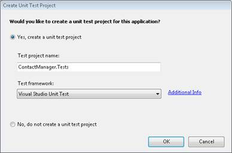](iteration-1-create-the-application-cs/_static/image3.png)

**Figure 02**: The Create Unit Test Project dialog ([Click to view full-size image](iteration-1-create-the-application-cs/_static/image4.png))

ASP.NET MVC application appears in the Visual Studio Solution Explorer window (see Figure 3). If you don t see the Solution Explorer window then you can open this window by selecting the menu option **View, Solution Explorer**. Notice that the solution contains two projects: the ASP.NET MVC project and the Test project. The ASP.NET MVC project is named ContactManager and the Test project is named ContactManager.Tests.

[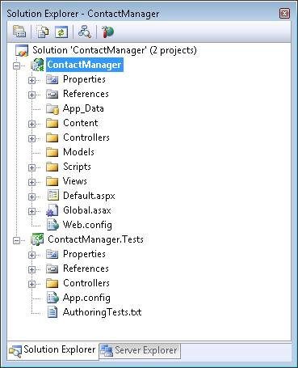](iteration-1-create-the-application-cs/_static/image5.png)

**Figure 03**: The Solution Explorer window ([Click to view full-size image](iteration-1-create-the-application-cs/_static/image6.png))

## Deleting the Project Sample Files

The ASP.NET MVC project template includes sample files for controllers and views. Before creating a new ASP.NET MVC application, you should delete these files. You can delete files and folders in the Solution Explorer window by right-clicking a file or folder and selecting the menu option **Delete**.

You need to delete the following files from the ASP.NET MVC project:

- \Controllers\HomeController.cs

- \Views\Home\About.aspx

- \Views\Home\Index.aspx

And, you need to delete the following file from the Test project:

\Controllers\HomeControllerTest.cs

## Creating the Database

The Contact Manager application is a database-driven web application. We use a database to store the contact information.

The ASP.NET MVC framework with any modern database including Microsoft SQL Server, Oracle, MySQL, and IBM DB2 databases. In this tutorial, we use a Microsoft SQL Server database. When you install Visual Studio, you are provided with the option of installing Microsoft SQL Server Express which is a free version of the Microsoft SQL Server database.

Create a new database by right-clicking the App\_Data folder in the Solution Explorer window and selecting the menu option **Add, New Item**. In the **Add New Item** dialog, select the **Data** category and the **SQL Server Database** template (see Figure 4). Name the new database ContactManagerDB.mdf and click the OK button.

[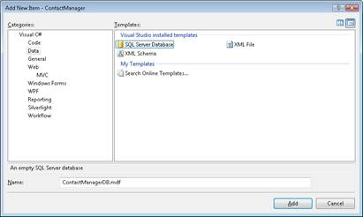](iteration-1-create-the-application-cs/_static/image7.png)

**Figure 04**: Creating a new Microsoft SQL Server Express database ([Click to view full-size image](iteration-1-create-the-application-cs/_static/image8.png))

After you create the new database, the database appears in the App\_Data folder in the Solution Explorer window. Double-click the ContactManager.mdf file to open the Server Explorer window and connect to the database.

> [!NOTE] 
> 
> The Server Explorer window is called the Database Explorer window in the case of Microsoft Visual Web Developer.

You can use the Server Explorer window to create new database objects such as database tables, views, triggers, and stored procedures. Right-click the Tables folder and select the menu option **Add New Table**. The Database Table Designer appears (see Figure 5).

[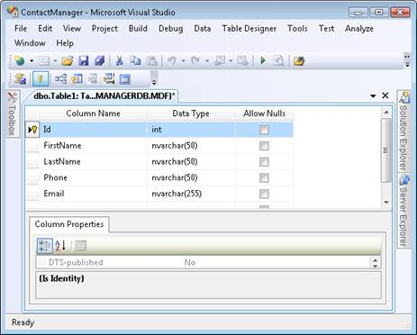](iteration-1-create-the-application-cs/_static/image9.png)

**Figure 05**: The Database Table Designer ([Click to view full-size image](iteration-1-create-the-application-cs/_static/image10.png))

We need to create a table that contains the following columns:

| **Column Name** | **Data Type** | **Allow Nulls** |
| --- | --- | --- |
| Id | int | false |
| FirstName | nvarchar(50) | false |
| LastName | nvarchar(50) | false |
| Phone | nvarchar(50) | false |
| Email | nvarchar(255) | false |

The first column, the Id column, is special. You need to mark the Id column as an Identity column and a Primary Key column. You indicate that a column is an Identity column by expanding Column Properites (look at the bottom of Figure 6) and scrolling down to the Identity Specification property. Set the **(Is Identity)** property to the value **Yes**.

You mark a column as a Primary Key column by selecting the column and clicking the button with the icon of a key. After a column is marked as a Primary Key column, an icon of a key appears next to the column (see Figure 6).

After you finish creating the table, click the Save button (the button with an icon of a floppy) to save the new table. Give your new table the name *Contacts*.

After finish creating the Contacts database table, you should add some records to the table. Right-click the Contacts table in the Server Explorer window and select the menu option **Show Table Data**. Enter one or more contacts in the grid that appears.

## Creating the Data Model

The ASP.NET MVC application consists of Models, Views, and Controllers. We start by creating a Model class that represents the Contacts table that we created in the previous section.

In this tutorial, we use the Microsoft Entity Framework to generate a model class from the database automatically.

> [!NOTE] 
> 
> The ASP.NET MVC framework is not tied to the Microsoft Entity Framework in any way. You can use ASP.NET MVC with alternative database access technologies including NHibernate, LINQ to SQL, or ADO.NET.

Follow these steps to create the data model classes:

1. Right-click the Models folder in the Solution Explorer window and select **Add, New Item**. The **Add New Item** dialog appears (see Figure 6).
2. Select the **Data** category and the **ADO.NET Entity Data Model** template. Name your data model *ContactManagerModel.edmx* and click the **Add** button. The Entity Data Model wizard appears (see Figure 7).
3. In the **Choose Model Contents** step, select **Generate from database** (see Figure 7).
4. In the **Choose Your Data Connection** step, select the ContactManagerDB.mdf database and enter the name *ContactManagerDBEntities* for the Entity Connection Settings (see Figure 8).
5. In the **Choose Your Database Objects** step, select the checkbox labeled Tables (see Figure 9). The data model will include all tables contained in your database (there is just one, the Contacts table). Enter the namespace *Models*. Click the Finish button to complete the wizard.

[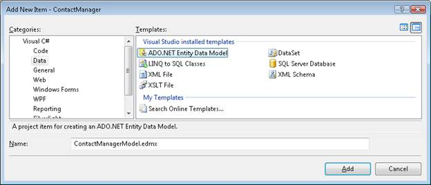](iteration-1-create-the-application-cs/_static/image11.png)

**Figure 06**: The Add New Item dialog ([Click to view full-size image](iteration-1-create-the-application-cs/_static/image12.png))

[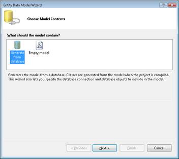](iteration-1-create-the-application-cs/_static/image13.png)

**Figure 07**: Choose Model Contents ([Click to view full-size image](iteration-1-create-the-application-cs/_static/image14.png))

[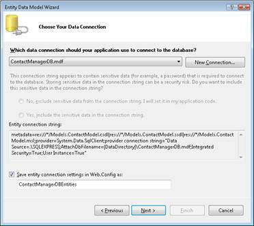](iteration-1-create-the-application-cs/_static/image15.png)

**Figure 08**: Choose Your Data Connection ([Click to view full-size image](iteration-1-create-the-application-cs/_static/image16.png))

**Figure 09**: Choose Your Database Objects ([Click to view full-size image](iteration-1-create-the-application-cs/_static/image18.png))

After you complete the Entity Data Model Wizard, the Entity Data Model Designer appears. The designer displays a class that corresponds to each table being modeled. You should see one class named Contacts.

The Entity Data Model wizard generates class names based on database table names. You almost always need to change the name of the class generated by the wizard. Right-click the Contacts class in the designer and select the menu option **Rename**. Change the name of the class from Contacts (plural) to Contact (singular). After you change the class name, the class should appear like Figure 10.

[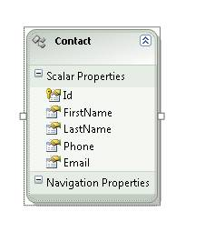](iteration-1-create-the-application-cs/_static/image19.png)

**Figure 10**: The Contact class ([Click to view full-size image](iteration-1-create-the-application-cs/_static/image20.png))

At this point, we have created our database model. We can use the Contact class to represent a particular contact record in our database.

## Creating the Home Controller

The next step is to create our Home controller. The Home controller is the default controller invoked in an ASP.NET MVC application.

Create the Home controller class by right-clicking the Controllers folder in the Solution Explorer window and selecting the menu option **Add, Controller** (see Figure 11). Notice the checkbox labeled **Add action methods for Create, Update, and Details scenarios**. Make sure that this checkbox is checked before clicking the **Add** button.

[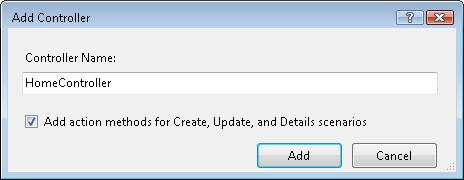](iteration-1-create-the-application-cs/_static/image21.png)

**Figure 11**: Adding the Home controller ([Click to view full-size image](iteration-1-create-the-application-cs/_static/image22.png))

When you create the Home controller, you get the class in Listing 1.

**Listing 1 - Controllers\HomeController.cs**

[!code-csharp[Main](iteration-1-create-the-application-cs/samples/sample1.cs)]

## Listing the Contacts

In order to display the records in the Contacts database table, we need to create an Index() action and an Index view.

The Home controller already contains an Index() action. We need to modify this method so that it looks like Listing 2.

**Listing 2 - Controllers\HomeController.cs**

[!code-csharp[Main](iteration-1-create-the-application-cs/samples/sample2.cs)]

Notice that the Home controller class in Listing 2 contains a private field named \_entities. The \_entities field represents the entities from the data model. We use the \_entities field to communicate with the database.

The Index() method returns a view that represents all of the contacts from the Contacts database table. The expression \_entities.ContactSet.ToList() returns the list of contacts as a generic list.

Now that we ve created the Index controller, we next need to create the Index view. Before creating the Index view, compile your application by selecting the menu option **Build, Build Solution**. You should always compile your project before adding a view in order for the list of model classes to be displayed in the **Add View** dialog.

You create the Index view by right-clicking the Index() method and selecting the menu option **Add View** (see Figure 12). Selecting this menu option opens the **Add View** dialog (see Figure 13).

[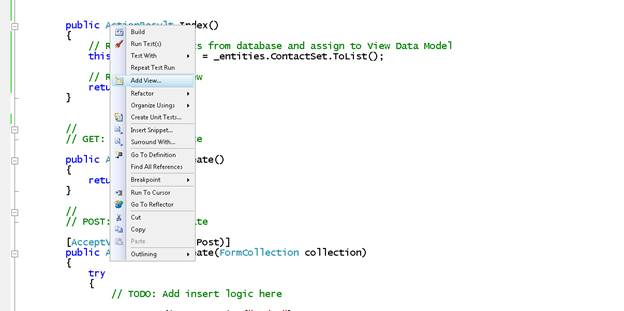](iteration-1-create-the-application-cs/_static/image23.png)

**Figure 12**: Adding the Index view ([Click to view full-size image](iteration-1-create-the-application-cs/_static/image24.png))

In the **Add View** dialog, check the checkbox labeled **Create a strongly-typed view**. Select the View data class ContactManager.Models.Contact and the View content List. Selecting these options generates a view that displays a list of Contact records.

[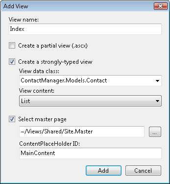](iteration-1-create-the-application-cs/_static/image25.png)

**Figure 13**: The Add View dialog ([Click to view full-size image](iteration-1-create-the-application-cs/_static/image26.png))

When you click the **Add** button, the Index view in Listing 3 is generated. Notice the &lt;%@ Page %&gt; directive that appears at the top of the file. The Index view inherits from the ViewPage&lt;IEnumerable&lt;ContactManager.Models.Contact&gt;&gt; class. In other words, the Model class in the view represents a list of Contact entities.

The body of the Index view contains a foreach loop that iterates through each of the contacts represented by the Model class. The value of each property of the Contact class is displayed within an HTML table.

**Listing 3 - Views\Home\Index.aspx (unmodified)**

[!code-aspx[Main](iteration-1-create-the-application-cs/samples/sample3.aspx)]

We need to make one modification to the Index view. Because we are not creating a Details view, we can remove the Details link. Find and remove the following code from the Index view:

{ id=item.Id })%&gt;

After you modify the Index view, you can run the Contact Manager application. Select the menu option Debug, Start Debugging or simply press F5. The first time you run the application, you get the dialog in Figure 14. Select the option **Modify the Web.config file to enable debugging** and click the OK button.

[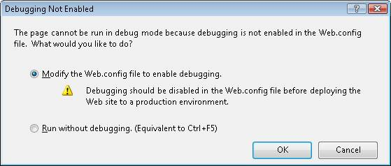](iteration-1-create-the-application-cs/_static/image27.png)

**Figure 14**: Enabling debugging ([Click to view full-size image](iteration-1-create-the-application-cs/_static/image28.png))

The Index view is returned by default. This view lists all of the data from the Contacts database table (see Figure 15).

**Figure 15**: The Index view ([Click to view full-size image](iteration-1-create-the-application-cs/_static/image30.png))

Notice that the Index view includes a link labeled Create New at the bottom of the view. In the next section, you learn how to create new contacts.

## Creating New Contacts

To enable users to create new contacts, we need to add two Create() actions to the Home controller. We need to create one Create() action that returns an HTML form for creating a new contact. We need to create a second Create() action that performs the actual database insert of the new contact.

The new Create() methods that we need to add to the Home controller are contained in Listing 4.

**Listing 4 - Controllers\HomeController.cs (with Create methods)**

[!code-csharp[Main](iteration-1-create-the-application-cs/samples/sample4.cs)]

The first Create() method can be invoked with an HTTP GET while the second Create() method can be invoked only by an HTTP POST. In other words, the second Create() method can be invoked only when posting an HTML form. The first Create() method simply returns a view that contains the HTML form for creating a new contact. The second Create() method is much more interesting: it adds the new contact to the database.

Notice that the second Create() method has been modified to accept an instance of the Contact class. The form values posted from the HTML form are bound to this Contact class by the ASP.NET MVC framework automatically. Each form field from the HTML Create form is assigned to a property of the Contact parameter.

Notice that the Contact parameter is decorated with a [Bind] attribute. The [Bind] attribute is used to exclude the Contact Id property from binding. Because the Id property represents an Identity property, we don t want to set the Id property.

In the body of the Create() method, the Entity Framework is used to insert the new Contact into the database. The new Contact is added to the existing set of Contacts and the SaveChanges() method is called to push these changes back to the underlying database.

You can generate an HTML form for creating new Contacts by right-clicking either of the two Create() methods and selecting the menu option **Add View** (see Figure 16).

**Figure 16**: Adding the Create view ([Click to view full-size image](iteration-1-create-the-application-cs/_static/image32.png))

In the **Add View** dialog, select the **ContactManager.Models.Contact** class and the **Create** option for view content (see Figure 17). When you click the **Add** button, a Create view is generated automatically.

**Figure 17**: Seeing a page explode ([Click to view full-size image](iteration-1-create-the-application-cs/_static/image34.png))

The Create view contains form fields for each of the properties of the Contact class. The code for the Create view is included in Listing 5.

**Listing 5 - Views\Home\Create.aspx**

[!code-aspx[Main](iteration-1-create-the-application-cs/samples/sample5.aspx)]

After you modify the Create() methods and add the Create view, you can run the Contact Manger application and create new contacts. Click the **Create New** link that appears in the Index view to navigate to the Create view. You should see the view in Figure 18.

**Figure 18**: The Create View ([Click to view full-size image](iteration-1-create-the-application-cs/_static/image36.png))

## Editing Contacts

Adding the functionality for editing a contact record is very similar to adding the functionality for creating new contact records. First, we need to add two new Edit methods to the Home controller class. These new Edit() methods are contained in Listing 6.

**Listing 6 - Controllers\HomeController.cs (with Edit methods)**

[!code-csharp[Main](iteration-1-create-the-application-cs/samples/sample6.cs)]

The first Edit() method is invoked by an HTTP GET operation. An Id parameter is passed to this method which represents the Id of the contact record being edited. The Entity Framework is used to retrieve a contact that matches the Id. A view that contains an HTML form for editing a record is returned.

The second Edit() method performs the actual update to the database. This method accepts an instance of the Contact class as a parameter. The ASP.NET MVC framework binds the form fields from the Edit form to this class automatically. Notice that you don t include the[Bind] attribute when editing a Contact (we need the value of the Id property).

The Entity Framework is used to save the modified Contact to the database. The original Contact must be retrieved from the database first. Next, the Entity Framework ApplyPropertyChanges() method is called to record the changes to the Contact. Finally, the Entity Framework SaveChanges() method is called to persist the changes to the underlying database.

You can generate the view that contains the Edit form by right-clicking the Edit() method and selecting the menu option Add View. In the Add View dialog, select the **ContactManager.Models.Contact** class and the **Edit** view content (see Figure 19).

**Figure 19**: Adding an Edit View ([Click to view full-size image](iteration-1-create-the-application-cs/_static/image38.png))

When you click the Add button, a new Edit view is generated automatically. The HTML form that is generated contains fields that correspond to each of the properties of the Contact class (see Listing 7).

**Listing 7 - Views\Home\Edit.aspx**

[!code-aspx[Main](iteration-1-create-the-application-cs/samples/sample7.aspx)]

## Deleting Contacts

If you want to delete contacts then you need to add two Delete() actions to the Home controller class. The first Delete() action displays a delete confirmation form. The second Delete() action performs the actual delete.

> [!NOTE] 
> 
> Later, in Iteration #7, we modify the Contact Manager so that it supports a one step Ajax delete.

The two new Delete() methods are contained in Listing 8.

**Listing 8 - Controllers\HomeController.cs (Delete methods)**

[!code-csharp[Main](iteration-1-create-the-application-cs/samples/sample8.cs)]

The first Delete() method returns a confirmation form for deleting a contact record from the database (see Figure20). The second Delete() method performs the actual delete operation against the database. After the original contact has been retrieved from the database, the Entity Framework DeleteObject() and SaveChanges() methods are called to perform the database delete.

**Figure 20**: The delete confirmation view ([Click to view full-size image](iteration-1-create-the-application-cs/_static/image40.png))

We need to modify the Index view so that it contains a link for deleting contact records (see Figure 21). You need to add the following code to the same table cell that contains the Edit link:

Html.ActionLink( { id=item.Id }) %&gt;

[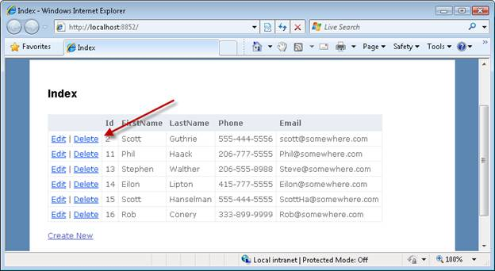](iteration-1-create-the-application-cs/_static/image41.png)

**Figure 21**: Index view with Edit link ([Click to view full-size image](iteration-1-create-the-application-cs/_static/image42.png))

Next, we need to create the delete confirmation view. Right-click the Delete() method in the Home controller class and select the menu option Add View. The Add View dialog appears (see Figure 22).

Unlike in the case of the List, Create, and Edit views, the Add View dialog does not contain an option to create a Delete view. Instead, select the **ContactManager.Models.Contact** data class and the **Empty** view content. Selecting the Empty view content option will require us to create the view ourselves.

**Figure 22**: Adding the delete confirmation view ([Click to view full-size image](iteration-1-create-the-application-cs/_static/image44.png))

The content of the Delete view is contained in Listing 9. This view contains a form that confirms whether or not a particular contact should be deleted (see Figure 21).

**Listing 9 - Views\Home\Delete.aspx**

[!code-aspx[Main](iteration-1-create-the-application-cs/samples/sample9.aspx)]

## Changing the Name of the Default Controller

It might bother you that the name of our controller class for working with contacts is named the HomeController class. Shouldn t the controller be named ContactController?

This issue is easy enough to fix. First, we need to refactor the name of the Home controller. Open the HomeController class in the Visual Studio Code Editor, right click the name of the class and select the menu option **Refactor, Rename**. Selecting this menu option opens the Rename dialog.

[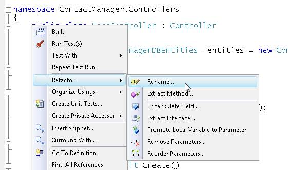](iteration-1-create-the-application-cs/_static/image45.png)

**Figure 23**: Refactoring a controller name ([Click to view full-size image](iteration-1-create-the-application-cs/_static/image46.png))

[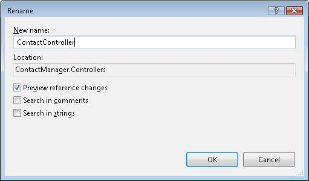](iteration-1-create-the-application-cs/_static/image47.png)

**Figure 24**: Using the Rename dialog ([Click to view full-size image](iteration-1-create-the-application-cs/_static/image48.png))

If you rename your controller class, Visual Studio will update the name of the folder in the Views folder as well. Visual Studio will rename the \Views\Home folder to the \Views\Contact folder.

After you make this change, your application will no longer have a Home controller. When you run your application, you'll get the error page in Figure 25.

[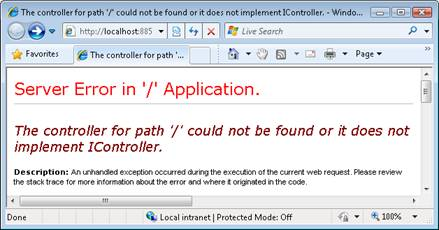](iteration-1-create-the-application-cs/_static/image49.png)

**Figure 25**: No default controller ([Click to view full-size image](iteration-1-create-the-application-cs/_static/image50.png))

We need to update the default route in the Global.asax file to use the Contact controller instead of the Home controller. Open the Global.asax file and modify the default controller used by the default route (see Listing 10).

**Listing 10 - Global.asax.cs**

[!code-csharp[Main](iteration-1-create-the-application-cs/samples/sample10.cs)]

After you make these changes, the Contact Manager will run correctly. Now, it will use the Contact controller class as the default controller.

## Summary

In this first iteration, we created a basic Contact Manager application in the fastest way possible. We took advantage of Visual Studio to generate the initial code for our controllers and views automatically. We also took advantage of the Entity Framework to generate our database model classes automatically.

Currently, we can list, create, edit, and delete contact records with the Contact Manager application. In other words, we can perform all of the basic database operations required by a database-driven web application.

Unfortunately, our application has some problems. First and I hesitate to admit this, the Contact Manager application is not the most attractive application. It needs some design work. In the next iteration, we'll look at how we can change the default view master page and cascading style sheet to improve the appearance of the application.

Second, we have not implemented any form validation. For example, there is nothing to prevent you from submitting the Create contact form without entering values for any of the form fields. Furthermore, you can enter invalid phone numbers and email addresses. We start to tackle the problem of form validation in iteration #3.

Finally, and most importantly, the current iteration of the Contact Manager application cannot be easily modified or maintained. For example, the database access logic is baked right into the controller actions. This means that we cannot modify our data access code without modifying our controllers. In later iterations, we explore software design patterns that we can implement to make the Contact Manager more resilient to change.

>[!div class="step-by-step"]
[Next](iteration-2-make-the-application-look-nice-cs.md)