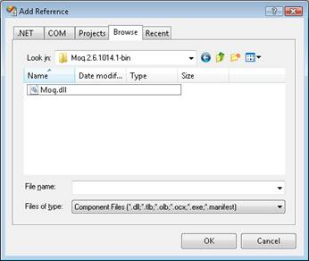
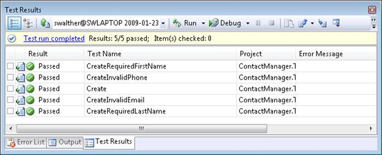

Iteration #5 – Create unit tests (VB)
====================
by [Microsoft](https://github.com/microsoft)

[Download Code](iteration-5-create-unit-tests-vb/_static/contactmanager_5_vb1.zip)

> In the fifth iteration, we make our application easier to maintain and modify by adding unit tests. We mock our data model classes and build unit tests for our controllers and validation logic.

## Building a Contact Management ASP.NET MVC Application (VB)

In this series of tutorials, we build an entire Contact Management application from start to finish. The Contact Manager application enables you to store contact information - names, phone numbers and email addresses - for a list of people.

We build the application over multiple iterations. With each iteration, we gradually improve the application. The goal of this multiple iteration approach is to enable you to understand the reason for each change.

- Iteration #1 - Create the application. In the first iteration, we create the Contact Manager in the simplest way possible. We add support for basic database operations: Create, Read, Update, and Delete (CRUD).

- Iteration #2 - Make the application look nice. In this iteration, we improve the appearance of the application by modifying the default ASP.NET MVC view master page and cascading style sheet.

- Iteration #3 - Add form validation. In the third iteration, we add basic form validation. We prevent people from submitting a form without completing required form fields. We also validate email addresses and phone numbers.

- Iteration #4 - Make the application loosely coupled. In this third iteration, we take advantage of several software design patterns to make it easier to maintain and modify the Contact Manager application. For example, we refactor our application to use the Repository pattern and the Dependency Injection pattern.

- Iteration #5 - Create unit tests. In the fifth iteration, we make our application easier to maintain and modify by adding unit tests. We mock our data model classes and build unit tests for our controllers and validation logic.

- Iteration #6 - Use test-driven development. In this sixth iteration, we add new functionality to our application by writing unit tests first and writing code against the unit tests. In this iteration, we add contact groups.

- Iteration #7 - Add Ajax functionality. In the seventh iteration, we improve the responsiveness and performance of our application by adding support for Ajax.

## This Iteration

In the previous iteration of the Contact Manager application, we refactored the application to be more loosely coupled. We separated the application into distinct controller, service, and repository layers. Each layer interacts with the layer beneath it through interfaces.

We refactored the application to make the application easier to maintain and modify. For example, if we need to use a new data access technology, we can simply change the repository layer without touching the controller or service layer. By making the Contact Manager loosely coupled, we ve made the application more resilient to change.

But, what happens when we need to add a new feature to the Contact Manager application? Or, what happens when we fix a bug? A sad, but well proven, truth of writing code is that whenever you touch code you create the risk of introducing new bugs.

For example, one fine day, your manager might ask you to add a new feature to the Contact Manager. She wants you to add support for Contact Groups. She wants you to enable users to organize their contacts into groups such as Friends, Business, and so on.

In order to implement this new feature, you'll need to modify all three layers of the Contact Manager application. You'll need to add new functionality to the controllers, the service layer, and the repository. As soon as you start modifying code, you risk breaking functionality that worked before.

Refactoring our application into separate layers, as we did in the previous iteration, was a good thing. It was a good thing because it enables us to make changes to entire layers without touching the rest of the application. However, if you want to make the code within a layer easier to maintain and modify, you need to create unit tests for the code.

You use a unit test to test an individual unit of code. These units of code are smaller than entire application layers. Typically, you use a unit test to verify whether a particular method in your code behaves in the way that you expect. For example, you would create a unit test for the CreateContact() method exposed by the ContactManagerService class.

The unit tests for an application work just like a safety net. Whenever you modify code in an application, you can run a set of unit tests to check whether the modification breaks existing functionality. Unit tests make your code safe to modify. Unit tests make all of the code in your application more resilient to change.

In this iteration, we add unit tests to our Contact Manager application. That way, in the next iteration, we can add Contact Groups to our application without worrying about breaking existing functionality.

> [!NOTE] 
> 
> There are a variety of unit testing frameworks including NUnit, xUnit.net, and MbUnit. In this tutorial, we use the unit testing framework included with Visual Studio. However, you could just as easily use one of these alternative frameworks.

## What Gets Tested

In the perfect world, all of your code would be covered by unit tests. In the perfect world, you would have the perfect safety net. You would be able to modify any line of code in your application and know instantly, by executing your unit tests, whether the change broke existing functionality.

However, we don t live in a perfect world. In practice, when writing unit tests, you concentrate on writing tests for your business logic (for example, validation logic). In particular, you *do not* write unit tests for your data access logic or your view logic.

To be useful, unit tests must execute very quickly. You easily can accumulate hundreds (or even thousands) of unit tests for an application. If the unit tests take a long time to run then you'll avoid executing them. In other words, long running unit tests are useless for day to day coding purposes.

For this reason, you typically do not write unit tests for code that interacts with a database. Running hundreds of unit tests against a live database would be too slow. Instead, you mock your database and write code that interacts with the mock database (we discuss mocking a database below).

For a similar reason, you typically do not write unit tests for views. In order to test a view, you must spin up a web server. Because spinning up a web server is a relatively slow process, creating unit tests for your views is not recommended.

If your view contains complicated logic then you should consider moving the logic into Helper methods. You can write unit tests for Helper methods that execute without spinning up a web server.

> [!NOTE] 
> 
> While writing tests for data access logic or view logic is not a good idea when writing unit tests, these tests can be very valuable when building functional or integration tests.

> [!NOTE] 
> 
> ASP.NET MVC is the Web Forms View Engine. While the Web Forms View Engine is dependent on a web server, other view engines might not be.

## Using a Mock Object Framework

When building unit tests, you almost always need to take advantage of a Mock Object framework. A Mock Object framework enables you to create mocks and stubs for the classes in your application.

For example, you can use a Mock Object framework to generate a mock version of your repository class. That way, you can use the mock repository class instead of the real repository class in your unit tests. Using the mock repository enables you to avoid executing database code when executing a unit test.

Visual Studio does not include a Mock Object framework. However, there are several commercial and open source Mock Object frameworks available for the .NET framework:

1. Moq - This framework is available under the open source BSD license. You can download Moq from [https://code.google.com/p/moq/](https://code.google.com/p/moq/).
2. Rhino Mocks - This framework is available under the open source BSD license. You can download Rhino Mocks from [http://ayende.com/projects/rhino-mocks.aspx](http://ayende.com/projects/rhino-mocks.aspx).
3. Typemock Isolator - This is a commercial framework. You can download a trial version from [http://www.typemock.com/](http://www.typemock.com/).

In this tutorial, I decided to use Moq. However, you could just as easily use Rhino Mocks or Typemock Isolator to create the Mock objects for the Contact Manager application.

Before you can use Moq, you need to complete the following steps:

1. .
2. Before you unzip the download, make sure that you right-click the file and click the button labeled **Unblock** (see Figure 1).
3. Unzip the download.
4. Add a reference to the Moq assembly to your Test project by selecting the menu option **Project, Add Reference** to open the **Add Reference** dialog. Under the Browse tab, browse to the folder where you unzipped Moq and select the Moq.dll assembly. Click the **OK** button (see Figure 2).

**Figure 01**: Unblocking Moq([Click to view full-size image](iteration-5-create-unit-tests-vb/_static/image2.png))

**Figure 02**: References after adding Moq([Click to view full-size image](iteration-5-create-unit-tests-vb/_static/image4.png))

## Creating Unit Tests for the Service Layer

Let s start by creating a set of unit tests for our Contact Manager application s service layer. We'll use these tests to verify our validation logic.

Create a new folder named Models in the ContactManager.Tests project. Next, right-click the Models folder and select **Add, New Test**. The **Add New Test** dialog shown in Figure 3 appears. Select the **Unit Test** template and name your new test ContactManagerServiceTest.vb. Click the **OK** button to add your new test to your Test Project.

> [!NOTE] 
> 
> In general, you want the folder structure of your Test Project to match the folder structure of your ASP.NET MVC project. For example, you place controller tests in a Controllers folder, model tests in a Models folder, and so on.

**Figure 03**: Models\ContactManagerServiceTest.cs([Click to view full-size image](iteration-5-create-unit-tests-vb/_static/image6.png))

Initially, we want to test the CreateContact() method exposed by the ContactManagerService class. We'll create the following five tests:

- CreateContact() - Tests that CreateContact() returns the value true when a valid Contact is passed to the method.
- CreateContactRequiredFirstName() - Tests that an error message is added to model state when a Contact with a missing first name is passed to the CreateContact() method.
- CreateContactRequredLastName() - Tests that an error message is added to model state when a Contact with a missing last name is passed to the CreateContact() method.
- CreateContactInvalidPhone() - Tests that an error message is added to model state when a Contact with an invalid phone number is passed to the CreateContact() method.
- CreateContactInvalidEmail() - Tests that an error message is added to model state when a Contact with an invalid email address is passed to the CreateContact() method..

The first test verifies that a valid Contact does not generate a validation error. The remaining tests check each of the validation rules.

The code for these tests is contained in Listing 1.

**Listing 1 - Models\ContactManagerServiceTest.vb**

[!code-vb[Main](iteration-5-create-unit-tests-vb/samples/sample1.vb)]

Because we use the Contact class in Listing 1, we need to add a reference to the Microsoft Entity Framework to our Test project. Add a reference to the System.Data.Entity assembly.

Listing 1 contains a method named Initialize() that is decorated with the [TestInitialize] attribute. This method is called automatically before each of the unit tests is run (it is called 5 times right before each of the unit tests). The Initialize() method creates a mock repository with the following line of code:

[!code-vb[Main](iteration-5-create-unit-tests-vb/samples/sample2.vb)]

This line of code uses the Moq framework to generate a mock repository from the IContactManagerRepository interface. The mock repository is used instead of the actual EntityContactManagerRepository to avoid accessing the database when each unit test is run. The mock repository implements the methods of the IContactManagerRepository interface, but the methods don t actually do anything.

> [!NOTE] 
> 
> When using the Moq framework, there is a distinction between \_mockRepository and \_mockRepository.Object. The former refers to the Mock(Of IContactManagerRepository) class that contains methods for specifying how the mock repository will behave. The latter refers to the actual mock repository that implements the IContactManagerRepository interface.

The mock repository is used in the Initialize() method when creating an instance of the ContactManagerService class. All of the individual unit tests use this instance of the ContactManagerService class.

Listing 1 contains five methods that correspond to each of the unit tests. Each of these methods is decorated with the [TestMethod] attribute. When you run the unit tests, any method that has this attribute is called. In other words, any method that is decorated with the [TestMethod] attribute is a unit test.

The first unit test, named CreateContact(), verifies that calling CreateContact() returns the value true when a valid instance of the Contact class is passed to the method. The test creates an instance of the Contact class, calls the CreateContact() method, and verifies that CreateContact() returns the value true.

The remaining tests verify that when the CreateContact() method is called with an invalid Contact then the method returns false and the expected validation error message is added to model state. For example, the CreateContactRequiredFirstName() test creates an instance of the Contact class with an empty string for its FirstName property. Next, the CreateContact() method is called with the invalid Contact. Finally, the test verifies that CreateContact() returns false and that model state contains the expected validation error message "First name is required."

You can run the unit tests in Listing 1 by selecting the menu option **Test, Run, All Tests in Solution (CTRL+R, A)**. The results of the tests are displayed in the Test Results window (see Figure 4).

**Figure 04**: Test Results ([Click to view full-size image](iteration-5-create-unit-tests-vb/_static/image8.png))

## Creating Unit Tests for Controllers

ASP.NET MVC application control the flow of user interaction. When testing a controller, you want to test whether the controller returns the right action result and view data. You also might want to test whether a controller interacts with model classes in the manner expected.

For example, Listing 2 contains two unit tests for the Contact controller Create() method. The first unit test verifies that when a valid Contact is passed to the Create() method then the Create() method redirects to the Index action. In other words, when passed a valid Contact, the Create() method should return a RedirectToRouteResult that represents the Index action.

We don t want to test the ContactManager service layer when we are testing the controller layer. Therefore, we mock the service layer with the following code in the Initialize method:

[!code-vb[Main](iteration-5-create-unit-tests-vb/samples/sample3.vb)]

In the CreateValidContact() unit test, we mock the behavior of calling the service layer CreateContact() method with the following line of code:

[!code-vb[Main](iteration-5-create-unit-tests-vb/samples/sample4.vb)]

This line of code causes the mock ContactManager service to return the value true when its CreateContact() method is called. By mocking the service layer, we can test the behavior of our controller without needing to execute any code in the service layer.

The second unit test verifies that the Create() action returns the Create view when an invalid contact is passed to the method. We cause the service layer CreateContact() method to return the value false with the following line of code:

[!code-vb[Main](iteration-5-create-unit-tests-vb/samples/sample5.vb)]

If the Create() method behaves as we expect then it should return the Create view when the service layer returns the value false. That way, the controller can display the validation error messages in the Create view and the user has a chance to correct that invalid Contact properties.

If you plan to build unit tests for your controllers then you need to return explicit view names from your controller actions. For example, do not return a view like this:

Return View()

Instead, return the view like this:

Return View("Create")

If you are not explicit when returning a view then the ViewResult.ViewName property returns an empty string.

**Listing 2 - Controllers\ContactControllerTest.vb**

[!code-vb[Main](iteration-5-create-unit-tests-vb/samples/sample6.vb)]

## Summary

In this iteration, we created unit tests for our Contact Manager application. We can run these unit tests at any time to verify that our application still behaves in the manner that we expect. The unit tests act as a safety net for our application enabling us to safely modify our application in the future.

We created two sets of unit tests. First, we tested our validation logic by creating unit tests for our service layer. Next, we tested our flow control logic by creating unit tests for our controller layer. When testing our service layer, we isolated our tests for our service layer from our repository layer by mocking our repository layer. When testing the controller layer, we isolated our tests for our controller layer by mocking the service layer.

In the next iteration, we modify the Contact Manager application so that it supports Contact Groups. We'll add this new functionality to our application using a software design process called test-driven development.

>[!div class="step-by-step"]
[Previous](iteration-4-make-the-application-loosely-coupled-vb.md)
[Next](iteration-6-use-test-driven-development-vb.md)