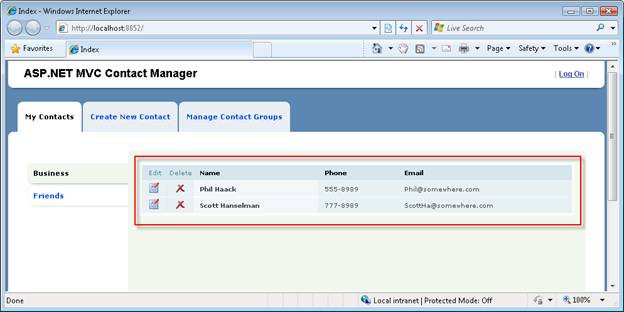
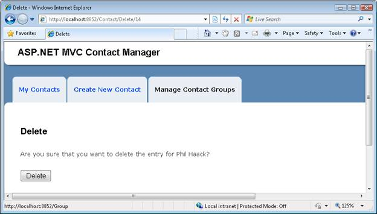

Iteration #7 – Add Ajax functionality (VB)
====================
by [Microsoft](https://github.com/microsoft)

[Download Code](iteration-7-add-ajax-functionality-vb/_static/contactmanager_7_vb1.zip)

> In the seventh iteration, we improve the responsiveness and performance of our application by adding support for Ajax.

## Building a Contact Management ASP.NET MVC Application (VB)
  

In this series of tutorials, we build an entire Contact Management application from start to finish. The Contact Manager application enables you to store contact information - names, phone numbers and email addresses - for a list of people.

We build the application over multiple iterations. With each iteration, we gradually improve the application. The goal of this multiple iteration approach is to enable you to understand the reason for each change.

- Iteration #1 - Create the application. In the first iteration, we create the Contact Manager in the simplest way possible. We add support for basic database operations: Create, Read, Update, and Delete (CRUD).

- Iteration #2 - Make the application look nice. In this iteration, we improve the appearance of the application by modifying the default ASP.NET MVC view master page and cascading style sheet.

- Iteration #3 - Add form validation. In the third iteration, we add basic form validation. We prevent people from submitting a form without completing required form fields. We also validate email addresses and phone numbers.

- Iteration #4 - Make the application loosely coupled. In this third iteration, we take advantage of several software design patterns to make it easier to maintain and modify the Contact Manager application. For example, we refactor our application to use the Repository pattern and the Dependency Injection pattern.

- Iteration #5 - Create unit tests. In the fifth iteration, we make our application easier to maintain and modify by adding unit tests. We mock our data model classes and build unit tests for our controllers and validation logic.

- Iteration #6 - Use test-driven development. In this sixth iteration, we add new functionality to our application by writing unit tests first and writing code against the unit tests. In this iteration, we add contact groups.

- Iteration #7 - Add Ajax functionality. In the seventh iteration, we improve the responsiveness and performance of our application by adding support for Ajax.

## This Iteration

In this iteration of the Contact Manager application, we refactor our application to make use of Ajax. By taking advantage of Ajax, we make our application more responsive. We can avoid rendering an entire page when we need to update only a certain region in a page.

We'll refactor our Index view so that we don t need to redisplay the entire page whenever someone selects a new contact group. Instead, when someone clicks a contact group, we'll just update the list of contacts and leave the rest of the page alone.

We'll also change the way our delete link works. Instead of displaying a separate confirmation page, we'll display a JavaScript confirmation dialog. If you confirm that you want to delete a contact, an HTTP DELETE operation is performed against the server to delete the contact record from the database.

Furthermore, we will take advantage of jQuery to add animation effects to our Index view. We'll display an animation when the new list of contacts is being fetched from the server.

Finally, we'll take advantage of the ASP.NET AJAX framework support for managing browser history. We'll create history points whenever we perform an Ajax call to update the contact list. That way, the browser backward and forward buttons will work.

## Why use Ajax?

Using Ajax has many benefits. First, adding Ajax functionality to an application results in a better user experience. In a normal web application, the entire page must be posted back to the server each and every time a user performs an action. Whenever you perform an action, the browser locks and the user must wait until the entire page is fetched and redisplayed.

This would be an unacceptable experience in the case of a desktop application. But, traditionally, we lived with this bad user experience in the case of a web application because we did not know that we could do any better. We thought it was a limitation of web applications when, in actuality, it was just a limitation of our imaginations.

In an Ajax application, you don t need to bring the user experience to a halt just to update a page. Instead, you can perform an asynchronous request in the background to update the page. You don t force the user to wait while part of the page gets updated.

By taking advantage of Ajax, you also can improve the performance of your application. Consider how the Contact Manager application works right now without Ajax functionality. When you click a contact group, the entire Index view must be redisplayed. The list of contacts and list of contact groups must be retrieved from the database server. All of this data must be passed across the wire from web server to web browser.

After we add Ajax functionality to our application, however, we can avoid redisplaying the entire page when a user clicks a contact group. We no longer need to grab the contact groups from the database. We also don t need to push the entire Index view across the wire. By taking advantage of Ajax, we reduce the amount of work that our database server must perform and we reduce the amount of network traffic required by our application.

## Don t be Afraid of Ajax

Some developers avoid using Ajax because they worry about downlevel browsers. They want to make sure that their web applications will still work when accessed by a browser that does not support JavaScript. Because Ajax depends on JavaScript, some developers avoid using Ajax.

However, if you are careful about how you implement Ajax then you can build applications that work with both uplevel and downlevel browsers. Our Contact Manager application will work with browsers that support JavaScript and browsers that do not.

If you use the Contact Manager application with a browser that supports JavaScript then you will have a better user experience. For example, when you click a contact group, only the region of the page that displays contacts will be updated.

If, on the other hand, you use the Contact Manager application with a browser that does not support JavaScript (or that has JavaScript disabled) then you will have a slightly less desirable user experience. For example, when you click a contact group, the entire Index view must be posted back to the browser in order to display the matching list of contacts.

## Adding the Required JavaScript Files

We'll need to use three JavaScript files to add Ajax functionality to our application. All three of these files are included in the Scripts folder of a new ASP.NET MVC application.

If you plan to use Ajax in multiple pages in your application then it makes sense to include the required JavaScript files in your application s view master page. That way, the JavaScript files will be included in all of the pages in your application automatically.

Add the following JavaScript includes inside the &lt;head&gt; tag of your view master page:

    
        
        

## Refactoring the Index View to use Ajax

Let s start by modifying our Index view so that clicking a contact group only updates the region of the view that displays contacts. The red box in Figure 1 contains the region that we want to update.

**Figure 01**: Updating only contacts([Click to view full-size image](iteration-7-add-ajax-functionality-vb/_static/image2.png))

The first step is to separate the part of the view that we want to update asynchronously into a separate partial (view user control). The section of the Index view that displays the table of contacts has been moved into the partial in Listing 1.

**Listing 1 - Views\Contact\ContactList.ascx**

    <%@ Control Language="VB" Inherits="System.Web.Mvc.ViewUserControl(Of ContactManager.Group)" %>
    <table class="data-table" cellpadding="0" cellspacing="0">
        <thead>
            <tr>
                <th class="actions edit">
                    Edit
                </th>
                <th class="actions delete">
                    Delete
                </th>
                <th>
                    Name
                </th>
                <th>
                    Phone
                </th>
                <th>
                    Email
                </th>
            </tr>
        </thead>
        <tbody>
            <% For Each item in Model.Contacts %>
            <tr>
                <td class="actions edit">
                    <a href='<%= Url.Action("Edit", New With {.id=item.Id}) %>'></a>
                </td>
                <td class="actions delete">
                    <a href='<%= Url.Action("Delete", New With {.id=item.Id}) %>'></a>
                </td>
                <th>
                    <%= Html.Encode(item.FirstName) %>
                    <%= Html.Encode(item.LastName) %>
                </th>
                <td>
                    <%= Html.Encode(item.Phone) %>
                </td>
                <td>
                    <%= Html.Encode(item.Email) %>
                </td>
            </tr>
            <% Next %>
        </tbody>
    </table>

Notice that the partial in Listing 1 has a different model than the Index view. The *Inherits* attribute in the &lt;%@ Page %&gt; directive specifies that the partial inherits from the ViewUserControl&lt;Group&gt; class.

The updated Index view is contained in Listing 2.

**Listing 2 - Views\Contact\Index.aspx**

    <%@ Page Title="" Language="VB" MasterPageFile="~/Views/Shared/Site.Master" Inherits="System.Web.Mvc.ViewPage(Of ContactManager.IndexModel)" %>
    <%@ Import Namespace="ContactManager" %>
    <asp:Content ID="Content1" ContentPlaceHolderID="head" runat="server">
    <title>Index</title>
    </asp:Content>
    
    <asp:Content ID="Content2" ContentPlaceHolderID="MainContent" runat="server">
    
    <ul id="leftColumn">
    <% For Each item in Model.Groups %>
        <li <%= Html.Selected(item.Id, Model.SelectedGroup.Id) %>>
        <%= Ajax.ActionLink(item.Name, "Index", New With { .id = item.Id }, New AjaxOptions With { .UpdateTargetId = "divContactList"})%>
        </li>
    <% Next %>
    </ul>
    

        <% Html.RenderPartial("ContactList", Model.SelectedGroup) %>
    

    
    
 

    </asp:Content>

There are two things that you should notice about the updated view in Listing 2. First, notice that all of the content moved into the partial is replaced with a call to Html.RenderPartial(). The Html.RenderPartial() method is called when the Index view is first requested in order to display the initial set of contacts.

Second, notice that the Html.ActionLink() used to display contact groups has been replaced with an Ajax.ActionLink(). The Ajax.ActionLink() is called with the following parameters:

    <%= Ajax.ActionLink(item.Name, "Index", New With { .id = item.Id }, New AjaxOptions With { .UpdateTargetId = "divContactList"})%>

The first parameter represents the text to display for the link, the second parameter represents the route values, and the third parameter represents the Ajax options. In this case, we use the UpdateTargetId Ajax option to point to the HTML &lt;div&gt; tag that we want to update after the Ajax request completes. We want to update the &lt;div&gt; tag with the new list of contacts.

The updated Index() method of the Contact controller is contained in Listing 3.

**Listing 3 - Controllers\ContactController.<wbr />vb (Index method)**

    Public Function Index(ByVal id As Integer?) As ActionResult
        ' Get selected group
        Dim selectedGroup = _service.GetGroup(id)
        if IsNothing(selectedGroup) Then
            Return RedirectToAction("Index", "Group")
        End If
    
        ' Normal Request
        if Not Request.IsAjaxRequest() Then
            Dim model As new IndexModel With { _
                .Groups = _service.ListGroups(), _
                .SelectedGroup = selectedGroup _
            }
            Return View("Index", model)
        End If
    
        ' Ajax Request
        return PartialView("ContactList", selectedGroup)
    End Function

The updated Index() action conditionally returns one of two things. If the Index() action is invoked by an Ajax request then the controller returns a partial. Otherwise, the Index() action returns an entire view.

Notice that the Index() action does not need to return as much data when invoked by an Ajax request. In the context of a normal request, the Index action returns a list of all of the contact groups and the selected contact group. In the context of an Ajax request, the Index() action returns only the selected group. Ajax means less work on your database server.

Our modified Index view works in the case of both uplevel and downlevel browsers. If you click a contact group, and your browser supports JavaScript, then only the region of the view that contains the list of contacts is updated. If, on the other hand, your browser does not support JavaScript, then the entire view is updated.

Our updated Index view has one problem. When you click a contact group, the selected group is not highlighted. Because the list of groups is displayed outside of the region that is updated during an Ajax request, the right group does not get highlighted. We'll fix this issue in the next section.

## Adding jQuery Animation Effects

Normally, when you click a link in a web page, you can use the browser progress bar to detect whether or not the browser is actively fetching the updated content. When performing an Ajax request, on the other hand, the browser progress bar does not show any progress. This can make users nervous. How do you know whether the browser has frozen?

There are several ways that you can indicate to a user that work is being performed while performing an Ajax request. One approach is to display a simple animation. For example, you can fade out a region when an Ajax request begins and fade in the region when the request completes.

We'll use the jQuery library which is included with the Microsoft ASP.NET MVC framework, to create the animation effects. The updated Index view is contained in Listing 4.

**Listing 4 - Views\Contact\Index.aspx**

    <%@ Page Title="" Language="VB" MasterPageFile="~/Views/Shared/Site.Master" Inherits="System.Web.Mvc.ViewPage(Of ContactManager.IndexModel)" %>
    <%@ Import Namespace="ContactManager" %>
    <asp:Content ID="Content1" ContentPlaceHolderID="head" runat="server">
    <title>Index</title>
    </asp:Content>
    
    <asp:Content ID="Content2" ContentPlaceHolderID="MainContent" runat="server">
    
    
    
    <ul id="leftColumn">
    <% For Each item in Model.Groups %>
        <li <%= Html.Selected(item.Id, Model.SelectedGroup.Id) %>>
        <%= Ajax.ActionLink(item.Name, "Index", New With { .id = item.Id }, New AjaxOptions With { .UpdateTargetId = "divContactList", .OnBegin = "beginContactList", .OnSuccess = "successContactList", .OnFailure = "failureContactList" })%>
        </li>
    <% Next %>
    </ul>
    

        <% Html.RenderPartial("ContactList", Model.SelectedGroup) %>
    

    
    
 

    </asp:Content>

Notice that the updated Index view contains three new JavaScript functions. The first two functions use jQuery to fade out and fade in the list of contacts when you click a new contact group. The third function displays an error message when an Ajax request results in an error (for example, network timeout).

The first function also takes care of highlighting the selected group. A class= selected attribute is added to the parent element (the LI element) of the element clicked. Again, jQuery makes it easy to select the right element and add the CSS class.

These scripts are tied to the group links with the help of the Ajax.ActionLink() AjaxOptions parameter. The updated Ajax.ActionLink() method call looks like this:

    <%= Ajax.ActionLink(item.Name, "Index", New With { .id = item.Id }, New AjaxOptions With { .UpdateTargetId = "divContactList", .OnBegin = "beginContactList", .OnSuccess = "successContactList", .OnFailure = "failureContactList" })%>

## Adding Browser History Support

Normally, when you click a link to update a page, your browser history is updated. That way, you can click the browser Back button to move back in time to the previous state of the page. For example, if you click the Friends contact group and then click the Business contact group, you can click the browser Back button to navigate back to the state of the page when the Friends contact group was selected.

Unfortunately, performing an Ajax request does not update browser history automatically. If you click a contact group, and the list of matching contacts is retrieved with an Ajax request, then the browser history is not updated. You cannot use the browser Back button to navigate back to a contact group after selecting a new contact group.

If you want users to be able to use the browser Back button after performing Ajax requests then you need to perform a little more work. You need to take advantage of the browser history management functionality built in the ASP.NET AJAX Framework.

ASP.NET AJAX browser history, you need to do three things:

1. Enable Browser History by setting the enableBrowserHistory property to true.
2. Save history points when the state of a view changes by calling the addHistoryPoint() method.
3. Reconstruct the state of the view when the navigate event is raised.

The updated Index view is contained in Listing 5.

**Listing 5 - Views\Contact\Index.aspx**

    <%@ Page Title="" Language="VB" MasterPageFile="~/Views/Shared/Site.Master" Inherits="System.Web.Mvc.ViewPage(Of ContactManager.IndexModel)" %>
    <%@ Import Namespace="ContactManager" %>
    <asp:Content ID="Content1" ContentPlaceHolderID="head" runat="server">
    <title>Index</title>
    </asp:Content>
    
    <asp:Content ID="Content2" ContentPlaceHolderID="MainContent" runat="server">
    
    
    
    <ul id="leftColumn">
    <% For Each item in Model.Groups %>
        <li <%= Html.Selected(item.Id, Model.SelectedGroup.Id) %>>
        <%= Ajax.ActionLink(item.Name, "Index", New With { .id = item.Id }, New AjaxOptions With { .UpdateTargetId = "divContactList", .OnBegin = "beginContactList", .OnSuccess = "successContactList", .OnFailure = "failureContactList" }, New With { .groupid = item.Id })%>
        </li>
    <% Next %>
    </ul>
    

        <% Html.RenderPartial("ContactList", Model.SelectedGroup) %>
    

    
    
 

    </asp:Content>

In Listing 5, Browser History is enabled in the pageInit() function. The pageInit() function is also used to set up the event handler for the navigate event. The navigate event is raised whenever the browser Forward or Back button causes the state of the page to change.

The beginContactList() method is called when you click a contact group. This method creates a new history point by calling the addHistoryPoint() method. The id of the contact group clicked is added to history.

The group id is retrieved from an expando attribute on the contact group link. The link is rendered with the following call to Ajax.ActionLink().

    <%= Ajax.ActionLink(item.Name, "Index", New With { .id = item.Id }, New AjaxOptions With { .UpdateTargetId = "divContactList", .OnBegin = "beginContactList", .OnSuccess = "successContactList", .OnFailure = "failureContactList" }, New With { .groupid = item.Id })%>

The last parameter passed to the Ajax.ActionLink() adds an expando attribute named groupid to the link (lowercase for XHTML compatibility).

When a user hits the browser Back or Forward button, the navigate event is raised and the navigate() method is called. This method updates the contacts displayed in the page to match the state of the page that corresponds to the browser history point passed to the navigate method.

## Performing Ajax Deletes

Currently, in order to delete a contact, you need to click on the Delete link and then click the Delete button displayed in the delete confirmation page (see Figure 2). This seems like a lot of page requests to do something simple like deleting a database record.

**Figure 02**: The delete confirmation page([Click to view full-size image](iteration-7-add-ajax-functionality-vb/_static/image4.png))

It is tempting to skip the delete confirmation page and delete a contact directly from the Index view. You should avoid this temptation because taking this approach opens your application to security holes. In general, you don t want to perform an HTTP GET operation when invoking an action that modifies the state of your web application. When performing a delete, you want to perform an HTTP POST, or better yet, an HTTP DELETE operation.

The Delete link is contained in the ContactList partial. An updated version of the ContactList partial is contained in Listing 6.

**Listing 6 - Views\Contact\ContactList.ascx**

    <%@ Control Language="VB" Inherits="System.Web.Mvc.ViewUserControl(Of ContactManager.Group)" %>
    <%@ Import Namespace="ContactManager" %>
    <table class="data-table" cellpadding="0" cellspacing="0">
        <thead>
            <tr>
                <th class="actions edit">
                    Edit
                </th>
                <th class="actions delete">
                    Delete
                </th>
                <th>
                    Name
                </th>
                <th>
                    Phone
                </th>
                <th>
                    Email
                </th>
            </tr>
        </thead>
        <tbody>
            <% For Each item in Model.Contacts %>
            <tr>
                <td class="actions edit">
                    <a href='<%= Url.Action("Edit", New With {.id=item.Id}) %>'></a>
                </td>
                <td class="actions delete">
                    <%= Ajax.ImageActionLink("../../Content/Delete.png", "Delete", "Delete", New with { .id = item.Id }, New AjaxOptions With { .Confirm = "Delete contact?", .HttpMethod = "Delete", .UpdateTargetId = "divContactList" })%> 
                </td>
                <th>
                    <%= Html.Encode(item.FirstName) %>
                    <%= Html.Encode(item.LastName) %>
                </th>
                <td>
                    <%= Html.Encode(item.Phone) %>
                </td>
                <td>
                    <%= Html.Encode(item.Email) %>
                </td>
            </tr>
            <% Next %>
        </tbody>
    </table>

The Delete link is rendered with the following call to the Ajax.ImageActionLink() method:

    <%= Ajax.ImageActionLink("../../Content/Delete.png", "Delete", "Delete", New with { .id = item.Id }, New AjaxOptions With { .Confirm = "Delete contact?", .HttpMethod = "Delete", .UpdateTargetId = "divContactList" })%<

> [!NOTE] 
> 
> The Ajax.ImageActionLink() is not a standard part of the ASP.NET MVC framework. The Ajax.ImageActionLink() is a custom helper methods included in the Contact Manager project.

The AjaxOptions parameter has two properties. First, the Confirm property is used to display a popup JavaScript confirmation dialog. Second, the HttpMethod property is used to perform an HTTP DELETE operation.

Listing 7 contains a new AjaxDelete() action that has been added to the Contact controller.

**Listing 7 - Controllers\ContactController.<wbr />vb (AjaxDelete)**   

    <AcceptVerbs(HttpVerbs.Delete), ActionName("Delete")> _
    Public Function AjaxDelete(ByVal id As Integer) As ActionResult
        ' Get contact and group
        Dim contactToDelete = _service.GetContact(id)
        Dim selectedGroup = _service.GetGroup(contactToDelete.Group.Id)
    
        ' Delete from database
        _service.DeleteContact(contactToDelete)
    
        ' Return Contact List
        Return PartialView("ContactList", selectedGroup)
    End Function

The AjaxDelete() action is decorated with an AcceptVerbs attribute. This attribute prevents the action from being invoked except by any HTTP operation other than an HTTP DELETE operation. In particular, you cannot invoke this action with an HTTP GET.

After you delete database record, you need to display the updated list of contacts that does not contain the deleted record. The AjaxDelete() method returns the ContactList partial and the updated list of contacts.

## Summary

In this iteration, we added Ajax functionality to our Contact Manager application. We used Ajax to improve the responsiveness and performance of our application.

First, we refactored the Index view so that clicking a contact group does not update the entire view. Instead, clicking a contact group only updates the list of contacts.

Next, we used jQuery animation effects to fade out and fade in the list of contacts. Adding animation to an Ajax application can be used to provide users of the application with the equivalent of a browser progress bar.

We also added browser history support to our Ajax application. We enabled users to click the browser Back and Forward buttons to change the state of the Index view.

Finally, we created a delete link that supports HTTP DELETE operations. By performing Ajax deletes, we enable users to delete database records without requiring the user to request an additional delete confirmation page.

>[!div class="step-by-step"] [Previous](iteration-6-use-test-driven-development-vb.md)