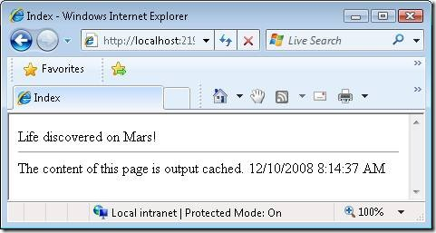
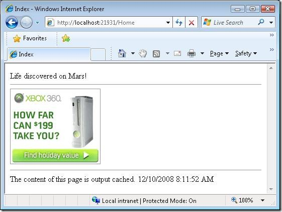

Adding Dynamic Content to a Cached Page (C#)
====================
by [Microsoft](https://github.com/microsoft)

> Learn how to mix dynamic and cached content in the same page. Post-cache substitution enables you to display dynamic content, such as banner advertisements or news items, within a page that has been output cached.

By taking advantage of output caching, you can dramatically improve the performance of an ASP.NET MVC application. Instead of regenerating a page each and every time the page is requested, the page can be generated once and cached in memory for multiple users.

But there is a problem. What if you need to display dynamic content in the page? For example, imagine that you want to display a banner advertisement in the page. You don't want the banner advertisement to be cached so that every user sees the very same advertisement. You wouldn't make any money that way!

Fortunately, there is an easy solution. You can take advantage of a feature of the ASP.NET framework called *post-cache substitution*. Post-cache substitution enables you to substitute dynamic content in a page that has been cached in memory.

Normally, when you output cache a page by using the [OutputCache] attribute, the page is cached on both the server and the client (the web browser). When you use post-cache substitution, a page is cached only on the server.

#### Using Post-Cache Substitution

Using post-cache substitution requires two steps. First, you need to define a method that returns a string that represents the dynamic content that you want to display in the cached page. Next, you call the HttpResponse.WriteSubstitution() method to inject the dynamic content into the page.

Imagine, for example, that you want to randomly display different news items in a cached page. The class in Listing 1 exposes a single method, named RenderNews(), that randomly returns one news item from a list of three news items.

**Listing 1 – Models\News.cs**

[!code-csharp[Main](adding-dynamic-content-to-a-cached-page-cs/samples/sample1.cs)]

To take advantage of post-cache substitution, you call the HttpResponse.WriteSubstitution() method. The WriteSubstitution() method sets up the code to replace a region of the cached page with dynamic content. The WriteSubstitution() method is used to display the random news item in the view in Listing 2.

**Listing 2 – Views\Home\Index.aspx**

[!code-aspx[Main](adding-dynamic-content-to-a-cached-page-cs/samples/sample2.aspx)]

The RenderNews method is passed to the WriteSubstitution() method. Notice that the RenderNews method is not called (there are no parentheses). Instead a reference to the method is passed to WriteSubstitution().

The Index view is cached. The view is returned by the controller in Listing 3. Notice that the Index() action is decorated with an [OutputCache] attribute that causes the Index view to be cached for 60 seconds.

**Listing 3 – Controllers\HomeController.cs**

[!code-csharp[Main](adding-dynamic-content-to-a-cached-page-cs/samples/sample3.cs)]

Even though the Index view is cached, different random news items are displayed when you request the Index page. When you request the Index page, the time displayed by the page does not change for 60 seconds (see Figure 1). The fact that the time does not change proves that the page is cached. However, the content injected by the WriteSubstitution() method – the random news item – changes with each request .

**Figure 1 – Injecting dynamic news items in a cached page**

#### Using Post-Cache Substitution in Helper Methods

An easier way to take advantage of post-cache substitution is to encapsulate the call to the WriteSubstitution() method within a custom helper method. This approach is illustrated by the helper method in Listing 4.

**Listing 4 – AdHelper.cs**

[!code-csharp[Main](adding-dynamic-content-to-a-cached-page-cs/samples/sample4.cs)]

Listing 4 contains a static class that exposes two methods: RenderBanner() and RenderBannerInternal(). The RenderBanner() method represents the actual helper method. This method extends the standard ASP.NET MVC HtmlHelper class so that you can call Html.RenderBanner() in a view just like any other helper method.

The RenderBanner() method calls the HttpResponse.WriteSubstitution() method passing the RenderBannerInternal() method to the WriteSubsitution() method.

The RenderBannerInternal() method is a private method. This method won't be exposed as a helper method. The RenderBannerInternal() method randomly returns one banner advertisement image from a list of three banner advertisement images.

The modified Index view in Listing 5 illustrates how you can use the RenderBanner() helper method. Notice that an additional &lt;%@ Import %&gt; directive is included at the top of the view to import the MvcApplication1.Helpers namespace. If you neglect to import this namespace, then the RenderBanner() method won't appear as a method on the Html property.

**Listing 5 – Views\Home\Index.aspx (with RenderBanner() method)**

[!code-aspx[Main](adding-dynamic-content-to-a-cached-page-cs/samples/sample5.aspx)]

When you request the page rendered by the view in Listing 5, a different banner advertisement is displayed with each request (see Figure 2). The page is cached, but the banner advertisement is injected dynamically by the RenderBanner() helper method.

**Figure 2 – The Index view displaying a random banner advertisement**

#### Summary

This tutorial explained how you can dynamically update content in a cached page. You learned how to use the HttpResponse.WriteSubstitution() method to enable dynamic content to be injected in a cached page. You also learned how to encapsulate the call to the WriteSubstitution() method within an HTML helper method.

Take advantage of caching whenever possible – it can have a dramatic impact on the performance of your web applications. As explained in this tutorial, you can take advantage of caching even when you need to display dynamic content in your pages.

## 

## 

>[!div class="step-by-step"]
[Previous](improving-performance-with-output-caching-cs.md)
[Next](creating-a-controller-cs.md)