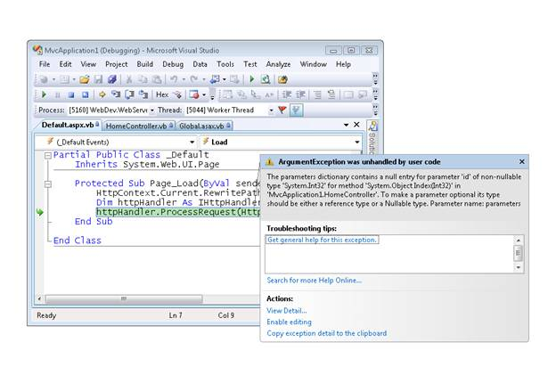

ASP.NET MVC Routing Overview (VB)
====================
by [Stephen Walther](https://github.com/StephenWalther)

> In this tutorial, Stephen Walther shows how the ASP.NET MVC framework maps browser requests to controller actions.

In this tutorial, you are introduced to an important feature of every ASP.NET MVC application called *ASP.NET Routing*. The ASP.NET Routing module is responsible for mapping incoming browser requests to particular MVC controller actions. By the end of this tutorial, you will understand how the standard route table maps requests to controller actions.

## Using the Default Route Table

When you create a new ASP.NET MVC application, the application is already configured to use ASP.NET Routing. ASP.NET Routing is setup in two places.

First, ASP.NET Routing is enabled in your application's Web configuration file (Web.config file). There are four sections in the configuration file that are relevant to routing: the system.web.httpModules section, the system.web.httpHandlers section, the system.webserver.modules section, and the system.webserver.handlers section. Be careful not to delete these sections because without these sections routing will no longer work.

Second, and more importantly, a route table is created in the application's Global.asax file. The Global.asax file is a special file that contains event handlers for ASP.NET application lifecycle events. The route table is created during the Application Start event.

The file in Listing 1 contains the default Global.asax file for an ASP.NET MVC application.

**Listing 1 - Global.asax.vb**

[!code-vb[Main](asp-net-mvc-routing-overview-vb/samples/sample1.vb)]

When an MVC application first starts, the Application\_Start() method is called. This method, in turn, calls the RegisterRoutes() method. The RegisterRoutes() method creates the route table.

The default route table contains a single route (named Default). The Default route maps the first segment of a URL to a controller name, the second segment of a URL to a controller action, and the third segment to a parameter named **id**.

Imagine that you enter the following URL into your web browser's address bar:

/Home/Index/3

The Default route maps this URL to the following parameters:

- controller = Home

- action = Index

- id = 3

When you request the URL /Home/Index/3, the following code is executed:

HomeController.Index(3)

The Default route includes defaults for all three parameters. If you don't supply a controller, then the controller parameter defaults to the value **Home**. If you don't supply an action, the action parameter defaults to the value **Index**. Finally, if you don't supply an id, the id parameter defaults to an empty string.

Let's look at a few examples of how the Default route maps URLs to controller actions. Imagine that you enter the following URL into your browser address bar:

/Home

Because of the Default route parameter defaults, entering this URL will cause the Index() method of the HomeController class in Listing 2 to be called.

**Listing 2 - HomeController.vb**

[!code-vb[Main](asp-net-mvc-routing-overview-vb/samples/sample2.vb)]

In Listing 2, the HomeController class includes a method named Index() that accepts a single parameter named Id. The URL /Home causes the Index() method to be called with the value Nothing as the value of the Id parameter.

Because of the way that the MVC framework invokes controller actions, the URL /Home also matches the Index() method of the HomeController class in Listing 3.

**Listing 3 - HomeController.vb (Index action with no parameter)**

[!code-vb[Main](asp-net-mvc-routing-overview-vb/samples/sample3.vb)]

The Index() method in Listing 3 does not accept any parameters. The URL /Home will cause this Index() method to be called. The URL /Home/Index/3 also invokes this method (the Id is ignored).

The URL /Home also matches the Index() method of the HomeController class in Listing 4.

**Listing 4 - HomeController.vb (Index action with nullable parameter)**

[!code-vb[Main](asp-net-mvc-routing-overview-vb/samples/sample4.vb)]

In Listing 4, the Index() method has one Integer parameter. Because the parameter is a nullable parameter (can have the value Nothing), the Index() can be called without raising an error.

Finally, invoking the Index() method in Listing 5 with the URL /Home causes an exception since the Id parameter *is not* a nullable parameter. If you attempt to invoke the Index() method then you get the error displayed in Figure 1.

**Listing 5 - HomeController.vb (Index action with Id parameter)**

[!code-vb[Main](asp-net-mvc-routing-overview-vb/samples/sample5.vb)]

**Figure 01**: Invoking a controller action that expects a parameter value ([Click to view full-size image](asp-net-mvc-routing-overview-vb/_static/image2.png))

The URL /Home/Index/3, on the other hand, works just fine with the Index controller action in Listing 5. The request /Home/Index/3 causes the Index() method to be called with an Id parameter that has the value 3.

## Summary

The goal of this tutorial was to provide you with a brief introduction to ASP.NET Routing. We examined the default route table that you get with a new ASP.NET MVC application. You learned how the default route maps URLs to controller actions.

>[!div class="step-by-step"]
[Previous](creating-an-action-cs.md)
[Next](understanding-action-filters-vb.md)