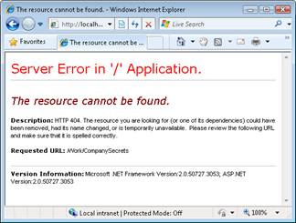

Creating an Action (C#)
====================
by [Microsoft](https://github.com/microsoft)

> Learn how to add a new action to an ASP.NET MVC controller. Learn about the requirements for a method to be an action.

The goal of this tutorial is to explain how you can create a new controller action. You learn about the requirements of an action method. You also learn how to prevent a method from being exposed as an action.

## Adding an Action to a Controller

You add a new action to a controller by adding a new method to the controller. For example, the controller in Listing 1 contains an action named Index() and an action named SayHello(). Both methods are exposed as actions.

**Listing 1 - Controllers\HomeController.cs**

[!code-csharp[Main](creating-an-action-cs/samples/sample1.cs)]

In order to be exposed to the universe as an action, a method must meet certain requirements:

- The method must be public.
- The method cannot be a static method.
- The method cannot be an extension method.
- The method cannot be a constructor, getter, or setter.
- The method cannot have open generic types.
- The method is not a method of the controller base class.
- The method cannot contain **ref** or **out** parameters.

Notice that there are no restrictions on the return type of a controller action. A controller action can return a string, a DateTime, an instance of the Random class, or void. The ASP.NET MVC framework will convert any return type that is not an action result into a string and render the string to the browser.

When you add any method that does not violate these requirements to a controller, the method is exposed as a controller action. Be careful here. A controller action can be invoked by anyone connected to the Internet. Do not, for example, create a DeleteMyWebsite() controller action.

## Preventing a Public Method from Being Invoked

If you need to create a public method in a controller class and you don't want to expose the method as a controller action then you can prevent the method from being invoked by using the [NonAction] attribute. For example, the controller in Listing 2 contains a public method named CompanySecrets() that is decorated with the [NonAction] attribute.

**Listing 2 - Controllers\WorkController.cs**

[!code-csharp[Main](creating-an-action-cs/samples/sample2.cs)]

If you attempt to invoke the CompanySecrets() controller action by typing /Work/CompanySecrets into the address bar of your browser then you'll get the error message in Figure 1.

**Figure 01**: Invoking a NonAction method([Click to view full-size image](creating-an-action-cs/_static/image2.png))

>[!div class="step-by-step"]
[Previous](creating-a-controller-cs.md)
[Next](asp-net-mvc-routing-overview-vb.md)