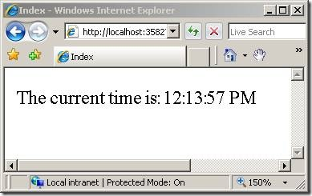

Improving Performance with Output Caching (C#)
====================
by [Microsoft](https://github.com/microsoft)

> In this tutorial, you learn how you can dramatically improve the performance of your ASP.NET MVC web applications by taking advantage of output caching. You learn how to cache the result returned from a controller action so that the same content does not need to be created each and every time a new user invokes the action.

The goal of this tutorial is to explain how you can dramatically improve the performance of an ASP.NET MVC application by taking advantage of the output cache. The output cache enables you to cache the content returned by a controller action. That way, the same content does not need to be generated each and every time the same controller action is invoked.

Imagine, for example, that your ASP.NET MVC application displays a list of database records in a view named Index. Normally, each and every time that a user invokes the controller action that returns the Index view, the set of database records must be retrieved from the database by executing a database query.

If, on the other hand, you take advantage of the output cache then you can avoid executing a database query every time any user invokes the same controller action. The view can be retrieved from the cache instead of being regenerated from the controller action. Caching enables you to avoid performing redundant work on the server.

## Enabling Output Caching

You enable output caching by adding an [OutputCache] attribute to either an individual controller action or an entire controller class. For example, the controller in Listing 1 exposes an action named Index(). The output of the Index() action is cached for 10 seconds.

**Listing 1 – Controllers\HomeController.cs**

[!code-csharp[Main](improving-performance-with-output-caching-cs/samples/sample1.cs)]

In the Beta versions of ASP.NET MVC, output caching does not work for a URL like [http://www.MySite.com/](http://www.mysite.com/). Instead, you must enter a URL like [http://www.MySite.com/Home/Index](http://www.mysite.com/Home/Index). 

In Listing 1, the output of the Index() action is cached for 10 seconds. If you prefer, you can specify a much longer cache duration. For example, if you want to cache the output of a controller action for one day then you can specify a cache duration of 86400 seconds (60 seconds \* 60 minutes \* 24 hours).

There is no guarantee that content will be cached for the amount of time that you specify. When memory resources become low, the cache starts evicting content automatically.

The Home controller in Listing 1 returns the Index view in Listing 2. There is nothing special about this view. The Index view simply displays the current time (see Figure 1).

**Listing 2 – Views\Home\Index.aspx**

[!code-aspx[Main](improving-performance-with-output-caching-cs/samples/sample2.aspx)]

**Figure 1 – Cached Index view**

If you invoke the Index() action multiple times by entering the URL /Home/Index in the address bar of your browser and hitting the Refresh/Reload button in your browser repeatedly, then the time displayed by the Index view won't change for 10 seconds. The same time is displayed because the view is cached.

It is important to understand that the same view is cached for everyone who visits your application. Anyone who invokes the Index() action will get the same cached version of the Index view. This means that the amount of work that the web server must perform to serve the Index view is dramatically reduced.

The view in Listing 2 happens to be doing something really simple. The view just displays the current time. However, you could just as easily cache a view that displays a set of database records. In that case, the set of database records would not need to be retrieved from the database each and every time the controller action that returns the view is invoked. Caching can reduce the amount of work that both your web server and database server must perform.

Don't use the page &lt;%@ OutputCache %&gt; directive in an MVC view. This directive is bleeding over from the Web Forms world and should not be used in an ASP.NET MVC application.

## Where Content is Cached

By default, when you use the [OutputCache] attribute, content is cached in three locations: the web server, any proxy servers, and the web browser. You can control exactly where content is cached by modifying the Location property of the [OutputCache] attribute.

You can set the Location property to any one of the following values:

> · Any
> 
> · Client
> 
> · Downstream
> 
> · Server
> 
> · None
> 
> · ServerAndClient

By default, the Location property has the value Any. However, there are situations in which you might want to cache only on the browser or only on the server. For example, if you are caching information that is personalized for each user then you should not cache the information on the server. If you are displaying different information to different users then you should cache the information only on the client.

For example, the controller in Listing 3 exposes an action named GetName() that returns the current user name. If Jack logs into the website and invokes the GetName() action then the action returns the string "Hi Jack". If, subsequently, Jill logs into the website and invokes the GetName() action then she also will get the string "Hi Jack". The string is cached on the web server for all users after Jack initially invokes the controller action.

**Listing 3 – Controllers\BadUserController.cs**

[!code-csharp[Main](improving-performance-with-output-caching-cs/samples/sample3.cs)]

Most likely, the controller in Listing 3 does not work the way that you want. You don't want to display the message "Hi Jack" to Jill.

You should never cache personalized content in the server cache. However, you might want to cache the personalized content in the browser cache to improve performance. If you cache content in the browser, and a user invokes the same controller action multiple times, then the content can be retrieved from the browser cache instead of the server.

The modified controller in Listing 4 caches the output of the GetName() action. However, the content is cached only on the browser and not on the server. That way, when multiple users invoke the GetName() method, each person gets their own user name and not another person's user name.

**Listing 4 – Controllers\UserController.cs**

[!code-csharp[Main](improving-performance-with-output-caching-cs/samples/sample4.cs)]

Notice that the [OutputCache] attribute in Listing 4 includes a Location property set to the value OutputCacheLocation.Client. The [OutputCache] attribute also includes a NoStore property. The NoStore property is used to inform proxy servers and browser that they should not store a permanent copy of the cached content.

## Varying the Output Cache

In some situations, you might want different cached versions of the very same content. Imagine, for example, that you are creating a master/detail page. The master page displays a list of movie titles. When you click a title, you get details for the selected movie.

If you cache the details page, then the details for the same movie will be displayed no matter which movie you click. The first movie selected by the first user will be displayed to all future users.

You can fix this problem by taking advantage of the VaryByParam property of the [OutputCache] attribute. This property enables you to create different cached versions of the very same content when a form parameter or query string parameter varies.

For example, the controller in Listing 5 exposes two actions named Master() and Details(). The Master() action returns a list of movie titles and the Details() action returns the details for the selected movie.

**Listing 5 – Controllers\MoviesController.cs**

[!code-csharp[Main](improving-performance-with-output-caching-cs/samples/sample5.cs)]

The Master() action includes a VaryByParam property with the value "none". When the Master() action is invoked, the same cached version of the Master view is returned. Any form parameters or query string parameters are ignored (see Figure 2).

**Figure 2 – The /Movies/Master view**

**Figure 3 – The /Movies/Details view**

The Details() action includes a VaryByParam property with the value "Id". When different values of the Id parameter are passed to the controller action, different cached versions of the Details view are generated.

It is important to understand that using the VaryByParam property results in more caching and not less. A different cached version of the Details view is created for each different version of the Id parameter.

You can set the VaryByParam property to the following values:

> \* = Create a different cached version whenever a form or query string parameter varies.
> 
> none = Never create different cached versions
> 
> Semicolon list of parameters = Create different cached versions whenever any of the form or query string parameters in the list varies

## Creating a Cache Profile

As an alternative to configuring output cache properties by modifying properties of the [OutputCache] attribute, you can create a cache profile in the web configuration (web.config) file. Creating a cache profile in the web configuration file offers a couple of important advantages.

First, by configuring output caching in the web configuration file, you can control how controller actions cache content in one central location. You can create one cache profile and apply the profile to several controllers or controller actions.

Second, you can modify the web configuration file without recompiling your application. If you need to disable caching for an application that has already been deployed to production, then you can simply modify the cache profiles defined in the web configuration file. Any changes to the web configuration file will be detected automatically and applied.

For example, the &lt;caching&gt; web configuration section in Listing 6 defines a cache profile named Cache1Hour. The &lt;caching&gt; section must appear within the &lt;system.web&gt; section of a web configuration file.

**Listing 6 – Caching section for web.config**

[!code-xml[Main](improving-performance-with-output-caching-cs/samples/sample6.xml)]

The controller in Listing 7 illustrates how you can apply the Cache1Hour profile to a controller action with the [OutputCache] attribute.

**Listing 7 – Controllers\ProfileController.cs**

[!code-csharp[Main](improving-performance-with-output-caching-cs/samples/sample7.cs)]

If you invoke the Index() action exposed by the controller in Listing 7 then the same time will be returned for 1 hour.

## Summary

Output caching provides you with a very easy method of dramatically improving the performance of your ASP.NET MVC applications. In this tutorial, you learned how to use the [OutputCache] attribute to cache the output of controller actions. You also learned how to modify properties of the [OutputCache] attribute such as the Duration and VaryByParam properties to modify how content gets cached. Finally, you learned how to define cache profiles in the web configuration file.

>[!div class="step-by-step"]
[Previous](understanding-action-filters-cs.md)
[Next](adding-dynamic-content-to-a-cached-page-cs.md)