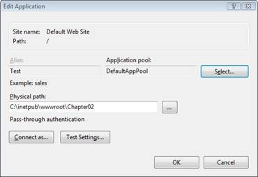
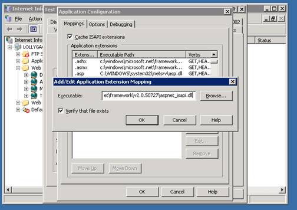

Using ASP.NET MVC with Different Versions of IIS (C#)
====================
by [Microsoft](https://github.com/microsoft)

> In this tutorial, you learn how to use ASP.NET MVC, and URL Routing, with different versions of Internet Information Services. You learn different strategies for using ASP.NET MVC with IIS 7.0 (classic mode), IIS 6.0, and earlier versions of IIS.

The ASP.NET MVC framework depends on ASP.NET Routing to route browser requests to controller actions. In order to take advantage of ASP.NET Routing, you might have to perform additional configuration steps on your web server. It all depends on the version of Internet Information Services (IIS) and the request processing mode for your application.

Here's a summary of the different versions of IIS:

- IIS 7.0 (integrated mode) - No special configuration necessary to use ASP.NET Routing.
- IIS 7.0 (classic mode) - You need to perform special configuration to use ASP.NET Routing.
- IIS 6.0 or below - You need to perform special configuration to use ASP.NET Routing.

The latest version of IIS is version 7.5 (on Win7). IIS 7 of IIS is included with Windows Server 2008 AND VISTA/SP1 and higher. You also can install IIS 7.0 on any version of the Vista operating system except Home Basic (see [https://technet.microsoft.com/en-us/library/cc731179%28WS.10%29.aspx](https://technet.microsoft.com/en-us/library/cc731179%28WS.10%29.aspx)).

IIS 7.0 supports two modes for processing requests. You can use integrated mode or classic mode. You don't need to perform any special configuration steps when using IIS 7.0 in integrated mode. However, you do need to perform additional configuration when using IIS 7.0 in classic mode.

Microsoft Windows Server 2003 includes IIS 6.0. You cannot upgrade IIS 6.0 to IIS 7.0 when using the Windows Server 2003 operating system. You must perform additional configuration steps when using IIS 6.0.

Microsoft Windows XP Professional includes IIS 5.1. You must perform additional configuration steps when using IIS 5.1.

Finally, Microsoft Windows 2000 and Microsoft Windows 2000 Professional includes IIS 5.0. You must perform additional configuration steps when using IIS 5.0.

## Integrated versus Classic Mode

IIS 7.0 can process requests using two different request processing modes: integrated and classic. Integrated mode provides better performance and more features. Classic mode is included for backwards compatibility with earlier versions of IIS.

The request processing mode is determined by the application pool. You can determine which processing mode is being used by a particular web application by determining the application pool associated with the application. Follow these steps:

1. Launch the Internet Information Services Manager
2. In the Connections window, select an application
3. In the Actions window, click the **Basic Settings** link to open the Edit Application dialog box (see Figure 1)
4. Take note of the Application pool selected.

By default, IIS is configured to support two application pools: **DefaultAppPool** and **Classic .NET AppPool**. If DefaultAppPool is selected, then your application is running in integrated request processing mode. If Classic .NET AppPool is selected, your application is running in classic request processing mode.

**Figure 1**: Detecting the request processing mode([Click to view full-size image](using-asp-net-mvc-with-different-versions-of-iis-cs/_static/image2.png))

Notice that you can modify the request processing mode within the Edit Application dialog box. Click the Select button and change the application pool associated with the application. Realize that there are compatibility issues when changing an ASP.NET application from classic to integrated mode. For more information, see the following articles:

- Upgrading ASP.NET 1.1 to IIS 7.0 on Windows Vista and Windows Server 2008 -- [https://www.iis.net/learn/application-frameworks/building-and-running-aspnet-applications/upgrading-aspnet-11-to-iis-on-windows-vista-and-windows-server-2008](https://www.iis.net/learn/application-frameworks/building-and-running-aspnet-applications/upgrading-aspnet-11-to-iis-on-windows-vista-and-windows-server-2008)
- ASP.NET Integration With IIS 7.0 - [https://www.iis.net/learn/application-frameworks/building-and-running-aspnet-applications/aspnet-integration-with-iis](https://www.iis.net/learn/application-frameworks/building-and-running-aspnet-applications/aspnet-integration-with-iis)

If an ASP.NET application is using the DefaultAppPool, then you don't need to perform any additional steps to get ASP.NET Routing (and therefore ASP.NET MVC) to work. However, if the ASP.NET application is configured to use the Classic .NET AppPool then keep reading, you have more work to do.

## Using ASP.NET MVC with Older Versions of IIS

If you need to use ASP.NET MVC with an older version of IIS than IIS 7.0, or you need to use IIS 7.0 in classic mode, then you have two options. First, you can modify the route table to use file extensions. For example, instead of requesting a URL like /Store/Details, you would request a URL like /Store.aspx/Details.

The second option is to create something called a *wildcard script map*. A wildcard script map enables you to map every request into the ASP.NET framework.

If you don't have access to your web server (for example, your ASP.NET MVC application is being hosted by an Internet Service Provider) then you'll need to use the first option. If you don't want to modify the appearance of your URLs, and you have access to your web server, then you can use the second option.

We explore each option in detail in the following sections.

## Adding Extensions to the Route Table

The easiest way to get ASP.NET Routing to work with older versions of IIS is to modify your route table in the Global.asax file. The default and unmodified Global.asax file in Listing 1 configures one route named the Default route.

**Listing 1 - Global.asax (unmodified)**

[!code-csharp[Main](using-asp-net-mvc-with-different-versions-of-iis-cs/samples/sample1.cs)]

The Default route configured in Listing 1 enables you to route URLs that look like this:

/Home/Index

/Product/Details/3

/Product

Unfortunately, older versions of IIS won't pass these requests to the ASP.NET framework. Therefore, these requests won't get routed to a controller. For example, if you make a browser request for the URL /Home/Index then you'll get the error page in Figure 2.

**Figure 2**: Receiving a 404 Not Found error([Click to view full-size image](using-asp-net-mvc-with-different-versions-of-iis-cs/_static/image4.png))

Older versions of IIS only map certain requests to the ASP.NET framework. The request must be for a URL with the right file extension. For example, a request for /SomePage.aspx gets mapped to the ASP.NET framework. However, a request for /SomePage.htm does not.

Therefore, to get ASP.NET Routing to work, we must modify the Default route so that it includes a file extension that is mapped to the ASP.NET framework.

This is done using a script named `registermvc.wsf`. It was included with the ASP.NET MVC 1 release in `C:\Program Files\Microsoft ASP.NET\ASP.NET MVC\Scripts`, but as of ASP.NET 2 this script has been moved to the ASP.NET Futures, available at [http://aspnet.codeplex.com/releases/view/39978](http://aspnet.codeplex.com/releases/view/39978).

Executing this script registers a new .mvc extension with IIS. After you register the .mvc extension, you can modify your routes in the Global.asax file so that the routes use the .mvc extension.

The modified Global.asax file in Listing 2 works with older versions of IIS.

**Listing 2 - Global.asax (modified with extensions)**

[!code-csharp[Main](using-asp-net-mvc-with-different-versions-of-iis-cs/samples/sample2.cs)]

**Important**: remember to build your ASP.NET MVC Application again after changing the Global.asax file.

There are two important changes to the Global.asax file in Listing 2. There are now two routes defined in the Global.asax. The URL pattern for the Default route, the first route, now looks like:

{controller}.mvc/{action}/{id}

The addition of the .mvc extension changes the type of files that the ASP.NET Routing module intercepts. With this change, the ASP.NET MVC application now routes requests like the following:

/Home.mvc/Index/

/Product.mvc/Details/3

/Product.mvc/

The second route, the Root route, is new. This URL pattern for the Root route is an empty string. This route is necessary for matching requests made against the root of your application. For example, the Root route will match a request that looks like this:

[http://www.YourApplication.com/](http://www.YourApplication.com/)

After making these modifications to your route table, you'll need to make sure that all of the links in your application are compatible with these new URL patterns. In other words, make sure that all of your links include the .mvc extension. If you use the Html.ActionLink() helper method to generate your links, then you should not need to make any changes.

Instead of using the registermvc.wcf script, you can add a new extension to IIS that is mapped to the ASP.NET framework by hand. When adding a new extension yourself, make sure that the checkbox labeled **Verify that file exists** is not checked.

## Hosted Server

You don't always have access to your web server. For example, if you are hosting your ASP.NET MVC application using an Internet Hosting Provider, then you won't necessarily have access to IIS.

In that case, you should use one of the existing file extensions that are mapped to the ASP.NET framework. Examples of file extensions mapped to ASP.NET include the .aspx, .axd, and .ashx extensions.

For example, the modified Global.asax file in Listing 3 uses the .aspx extension instead of the .mvc extension.

**Listing 3 - Global.asax (modified with .aspx extensions)**

[!code-csharp[Main](using-asp-net-mvc-with-different-versions-of-iis-cs/samples/sample3.cs)]

The Global.asax file in Listing 3 is exactly the same as the previous Global.asax file except for the fact that it uses the .aspx extension instead of the .mvc extension. You don't have to perform any setup on your remote web server to use the .aspx extension.

## Creating a Wildcard Script Map

If you don't want to modify the URLs for your ASP.NET MVC application, and you have access to your web server, then you have an additional option. You can create a wildcard script map that maps all requests to the web server to the ASP.NET framework. That way, you can use the default ASP.NET MVC route table with IIS 7.0 (in classic mode) or IIS 6.0.

Be aware that this option causes IIS to intercept every request made against the web server. This includes requests for images, classic ASP pages, and HTML pages. Therefore, enabling a wildcard script map to ASP.NET does have performance implications.

Here's how you enable a wildcard script map for IIS 7.0:

1. Select your application in the Connections window
2. Make sure that the **Features** view is selected
3. Double-click the **Handler Mappings** button
4. Click the **Add Wildcard Script Map** link (see Figure 3)
5. Enter the path to the aspnet\_isapi.dll file (You can copy this path from the PageHandlerFactory script map)
6. Enter the name MVC
7. Click the **OK** button

**Figure 3**: Creating a wildcard script map with IIS 7.0([Click to view full-size image](using-asp-net-mvc-with-different-versions-of-iis-cs/_static/image6.png))

Follow these steps to create a wildcard script map with IIS 6.0:

1. Right-click a website and select Properties
2. Select the **Home Directory** tab
3. Click the **Configuration** button
4. Select the **Mappings** tab
5. Click the **Insert** button (see Figure 4)
6. Paste the path to the aspnet\_isapi.dll into the Executable field (you can copy this path from the script map for .aspx files)
7. Uncheck the checkbox labeled **Verify that file exists**
8. Click the **OK** button

**Figure 4**: Creating a wildcard script map with IIS 6.0([Click to view full-size image](using-asp-net-mvc-with-different-versions-of-iis-cs/_static/image8.png))

After you enable wildcard script maps, you need to modify the route table in the Global.asax file so that it includes a Root route. Otherwise, you'll get the error page in Figure 5 when you make a request for the root page of your application. You can use the modified Global.asax file in Listing 4.

**Figure 5**: Missing Root route error([Click to view full-size image](using-asp-net-mvc-with-different-versions-of-iis-cs/_static/image10.png))

**Listing 4 - Global.asax (modified with Root route)**

[!code-csharp[Main](using-asp-net-mvc-with-different-versions-of-iis-cs/samples/sample4.cs)]

After you enable a wildcard script map for either IIS 7.0 or IIS 6.0, you can make requests that work with the default route table that look like this:

/

/Home/Index

/Product/Details/3

/Product

## Summary

The goal of this tutorial was to explain how you can use ASP.NET MVC when using an older version of IIS (or IIS 7.0 in classic mode). We discussed two methods of getting ASP.NET Routing to work with older versions of IIS: Modify the default route table or create a wildcard script map.

The first option requires you to modify the URLs used in your ASP.NET MVC application. One very significant advantage of this first option is that you do not need access to a web server in order to modify the route table. That means that you can use this first option even when hosting your ASP.NET MVC application with an Internet hosting company.

The second option is to create a wildcard script map. The advantage of this second option is that you do not need to modify your URLs. The disadvantage of this second option is that it can impact the performance of your ASP.NET MVC application.

>[!div class="step-by-step"]
[Next](using-asp-net-mvc-with-different-versions-of-iis-vb.md)