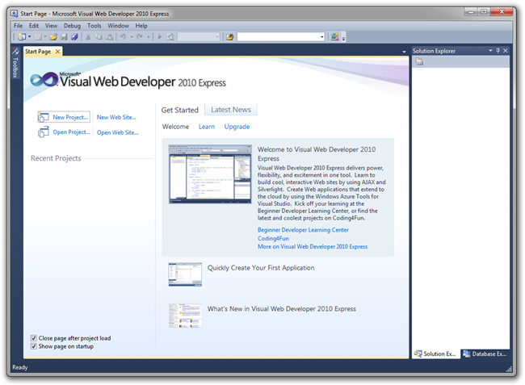
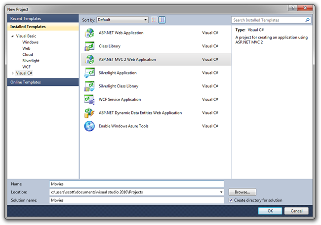
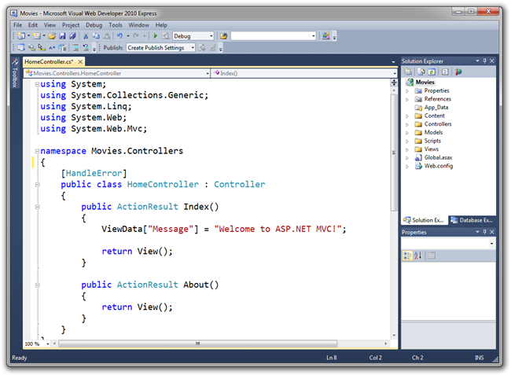
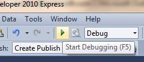
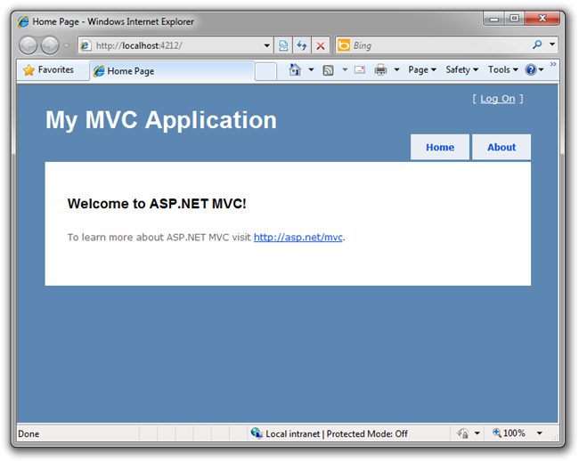

Intro to ASP.NET MVC
====================
by [Scott Hanselman](https://github.com/shanselman)

> > [!NOTE]
> > An updated version if this tutorial is available [here](../../getting-started/introduction/getting-started.md) using [Visual Studio 2013](https://www.microsoft.com/visualstudio/eng/2013-downloads). The new tutorial uses ASP.NET MVC 5, which provides many improvements over this tutorial.
> 
> 
> This is a beginner tutorial that introduces the basics of ASP.NET MVC. You'll create a simple web application that reads and writes from a database. Visit the [ASP.NET MVC learning center](../../../index.md) to find other ASP.NET MVC tutorials and samples.

Let's make our first ASP.NET MVC Web Application using [Visual Web Developer 2010 Express](https://www.microsoft.com/express/Web/). We'll make a little Movie list application that will let us create and list movies.

## What You'll Build

Here are two screenshots of the application you'll build. You will have a simple table of movies with various columns.

And you'll have a Create Form so we can add movies to the list.

## Skills You'll Learn

This tutorial will teach you the basics of building an ASP.NET MVC Web Application using Visual Studio. You'll learn:

- How to create a new ASP.NET MVC Project
- How to create a new Database with SQL Server
- How to create ASP.NET MVC Controllers and Views
- How to retrieve and display data
- How to edit data and enable data validation
- How to update the database schema

## Get Started

Start by running Visual Web Developer 2010 Express (I'll call it "VWD" from now on) and select New Project from the Start Screen.

Visual Web Developer is an IDE, or Integrated Developer Environment. Just like you use Microsoft Word to write documents, you'll use an IDE to create applications. There's a toolbar along the top showing various options available to you, as well as the menu you could also have used to Select File | New project.

## Creating Your First Application

You can create applications using Visual Basic or Visual C#. For now, Select Visual C# on the left, then pick "ASP.NET MVC 2 Web Application." Name your project "Movies" and click OK.

On the right-hand side is the Solution Explorer showing all the files and folders in your application. The big window in the middle is where you edit your code and spend most of your time. Visual Studio used a default template for the ASP.NET MVC project you just created, so you have a working application right now without doing anything! This is a simple "Hello World! project, and it is a good place to start for our application.

Select the "play" button to the toolbar.

It's a green arrow pointing to the right that will compile your program and start your application in a web browser.

*NOTE: You can instead press F5 on your keyboard, or select Debug-&gt;Start Debugging from the "Debug" menu.*

This will cause Visual Web Developer to start a development web-server and run our web application (there are no configuration or manual steps required to enable this). It will then launch a browser and configure it to browse the application's home-page. Notice below that the address bar of the browser says "localhost", and not something like example.com. That's because localhost always points to your own local computer - which in this case is running the application we just built.

Out of the box this default template gives you two pages to visit and a basic login page. Let's change how this application works and learn a little bit about ASP.NET MVC in the process. Close your browser and lets change some code.

>[!div class="step-by-step"]
[Next](getting-started-with-mvc-part2.md)