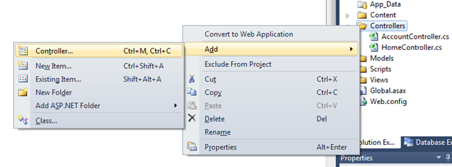
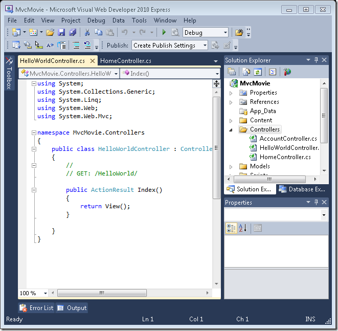
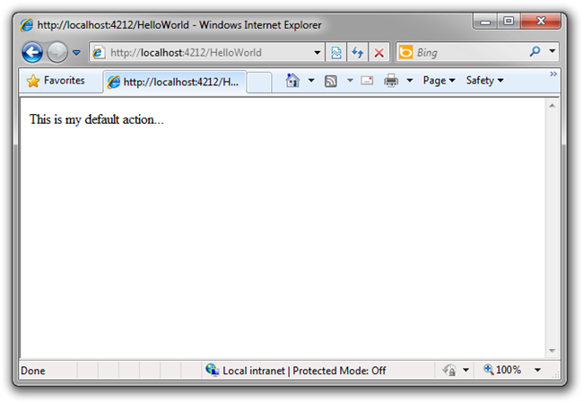
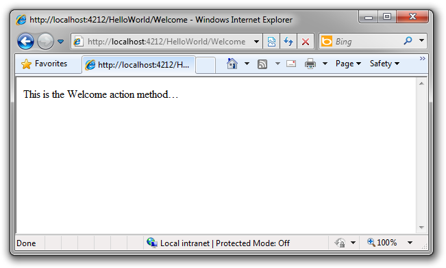

Adding a Controller
====================
by [Scott Hanselman](https://github.com/shanselman)

> > [!NOTE]
> > An updated version if this tutorial is available [here](../../getting-started/introduction/getting-started.md) using [Visual Studio 2013](https://www.microsoft.com/visualstudio/eng/2013-downloads). The new tutorial uses ASP.NET MVC 5, which provides many improvements over this tutorial.
> 
> 
> This is a beginner tutorial that introduces the basics of ASP.NET MVC. You'll create a simple web application that reads and writes from a database. Visit the [ASP.NET MVC learning center](../../../index.md) to find other ASP.NET MVC tutorials and samples.

MVC stands for Model, View, Controller. MVC is a pattern for developing applications such that each part has a responsibility that is different from another.

- Model: The data of your application
- Views: The template files your application will use to dynamically generate HTML responses.
- Controllers: Classes that handle incoming URL requests to the application, retrieve model data, and then specify view templates that render a response back to the client

We'll be covering all these concepts in this tutorial and show you how to use them to build an application.

Let's create a new controller by right-clicking the controllers folder in the solution Explorer and selecting Add Controller.

Name your new controller "HelloWorldController" and click Add.

Notice in the Solution Explorer on the right that a new file has been created for you called HelloWorldController.cs and that file is now opened in the **IDE**.

Create two new methods that look like this inside of your new public class HelloWorldController. We'll return a string of HTML directly from our controller as an example.

[!code-csharp[Main](getting-started-with-mvc-part2/samples/sample1.cs)]

Your Controller is named HelloWorldController and your new Method is called Index. Run your application again, just as before (click the play button or press F5 to do this). Once your browser has started up, change the path in the address bar to `http://localhost:xx/HelloWorld` where xx is whatever number your computer has chosen. Now your browser should look like the screenshot below. In our method above we returned a string passed into a method called "Content." We told the system just returns some HTML, and it did!

ASP.NET MVC invokes different Controller classes (and different Action methods within them) depending on the incoming URL. The default mapping logic used by ASP.NET MVC uses a format like this to control what code is run:

/[Controller]/[ActionName]/[Parameters]

The first part of the URL determines the Controller class to execute. So /HelloWorld maps to the HelloWorldController class. The second part of the URL determines the Action method on the class to execute. So /HelloWorld/Index would cause the Index() method of the HelloWorldcontroller class to execute. Notice that we only had to visit /HelloWorld above and the method Index was implied. This is because a method named "Index" is the default method that will be called on a controller if one is not explicitly specified.

Now, let's visit `http://localhost:xx/HelloWorld/Welcome.` Now our Welcome Method has executed and returned its HTML string.

Again, /[Controller]/[ActionName]/[Parameters] so Controller is HelloWorld and Welcome is the Method in this case. We haven't done Parameters yet.

Let's modify our sample slightly so that we can pass some information in from the URL to our controller, for example like this: /HelloWorld/Welcome?name=Scott&amp;numtimes=4. Change your Welcome method to include two parameters and update it like below. Note that we've used the C# optional parameter feature to indicate that the parameter numTimes should default to 1 if it's not passed in.

[!code-csharp[Main](getting-started-with-mvc-part2/samples/sample2.cs)]

Run your application and visit `http://localhost:xx/HelloWorld/Welcome?name=Scott&numtimes=4` changing the value of name and numtimes as you like. The system automatically mapped the named parameters from your query string in the address bar to parameters in your method.

In both these examples the controller has been doing all the work, and has been returning HTML directly. Ordinarily we don't want our Controllers returning HTML directly - since that ends up being very cumbersome to code. Instead we'll typically use a separate View template file to help generate the HTML response. Let's look at how we can do this. Close your browser and return to the IDE.

>[!div class="step-by-step"]
[Previous](getting-started-with-mvc-part1.md)
[Next](getting-started-with-mvc-part3.md)