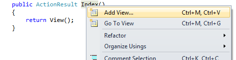
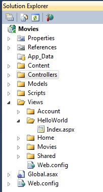
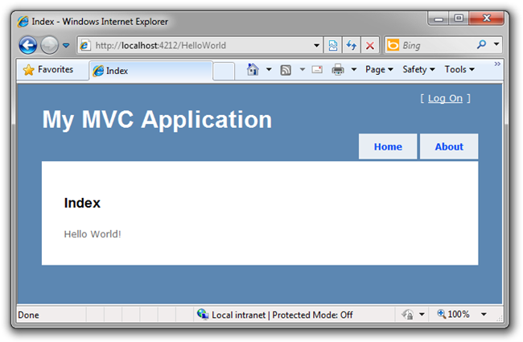
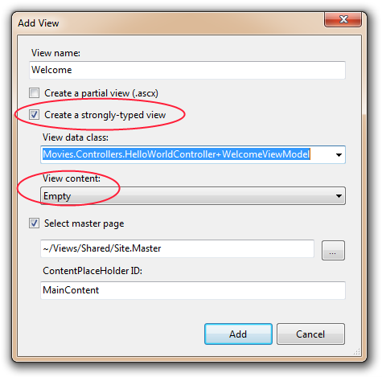
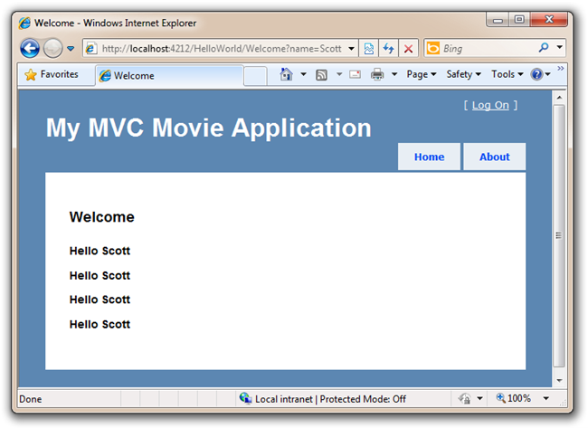

Adding a View
====================
by [Scott Hanselman](https://github.com/shanselman)

> This is a beginner tutorial that introduces the basics of ASP.NET MVC. You'll create a simple web application that reads and writes from a database. Visit the [ASP.NET MVC learning center](../../../index.md) to find other ASP.NET MVC tutorials and samples.

In this section we are going to look at how we can have our HelloWorldController class use a View template file to cleanly encapsulate generating HTML responses back to a client.

Let's start by using a View template with our Index method. Our method is called Index and it's in the HelloWorldController. Currently our Index() method returns a string with a message that is hardcoded within the Controller class.

[!code-csharp[Main](getting-started-with-mvc-part3/samples/sample1.cs)]

Let's now change the Index method to instead look like this:

[!code-csharp[Main](getting-started-with-mvc-part3/samples/sample2.cs)]

Let's now add a View template to our project that we can use for our Index() method. To do this, right-click with your mouse somewhere in the middle of the Index method and click Add View...

This will bring up the "Add View" dialog which provides us some options for how we want to create a view template that can be used by our Index method. For now, don't change anything, and just click the Add button.

After you click Add, a new folder and a new file will appear in the Solution Folder, as seen here. I now have a HelloWorld folder under Views, and an Index.aspx file inside that folder.

The new Index file is also already opened and ready for editing. Add some text under the first &lt;h2&gt;Index&lt;/h2&gt; like "Hello World."

[!code-html[Main](getting-started-with-mvc-part3/samples/sample3.html)]

Run your application and visit [`http://localhost:xx/HelloWorld`](http://localhostxx) again in your browser. The Index method in our controller in this example didn't do any work, but did call "return View()" which indicated that we wanted to use a view template file to render a response back to the client. Because we did not explicitly specify the name of the view template file to use, ASP.NET MVC defaulted to using the Index.aspx view file within the \Views\HelloWorld folder. Now we see the string we hard-coded in our View.

Looks pretty good. However, notice that the Browser's title says "Index" and the big title on the page says "My MVC Application." Let's change those.

### Changing Views and Master Pages

First, let's change the text "My MVC Application." That text is shared and appears on every page. It actually appears in only one place in our code, even though it's on every page in our app. Go to the /Views/Shared folder in the Solution Explorer and open the Site.Master file. This file is called a Master Page and it's the shared "shell" that all our other pages use.

Notice some text that says ContentPlaceholder "MainContent" in this file.

[!code-aspx[Main](getting-started-with-mvc-part3/samples/sample4.aspx)]

That placeholder is where all the pages you create will show up, "wrapped" in the master page. Try changing the title, then run your app and visit multiple pages. You'll notice that your one change appears on multiple pages.

[!code-html[Main](getting-started-with-mvc-part3/samples/sample5.html)]

Now every page will have the Primary Heading - that's H1 - of "My MVC Movie Application." That handles the white text at the top there that's shared across all the pages.

Here is the Site.Master in its entirety with our changed title:

[!code-aspx[Main](getting-started-with-mvc-part3/samples/sample6.aspx)]

Now, let's change the title of the Index page.

Open /HelloWorld/Index.aspx. There's two places to change. First, the Title that appears in the title of the browser, then the secondary header - that's H2 - as well. I'll make them each slightly different so you can see which bit of code changes which part of the app.

[!code-aspx[Main](getting-started-with-mvc-part3/samples/sample7.aspx)]

Run your app and visit /Movies. Notice that the browser title, the primary heading and the secondary headings have changed. It's easy to make big changes in your app with small changes to your view.

Our little bit of "data" (in this case the "Hello World!" message) was hard coded though. We've got V (Views) and we've got C (Controllers), but no M (Model) yet. We'll shortly walk through how create a database and retrieve model data from it.

## Passing a ViewModel

Before we go to a database and talk about Models, though, let's first talk about "ViewModels." These are objects that represent what a View template requires to render an HTML response back to a client. They are typically created and passed by a Controller class to a View template, and should only contain the data that the View template requires - and no more.

Previously with our HelloWorld sample, our Welcome() action method took a name and a numTimes parameter and output it to the browser. Rather than have the Controller continue to render this response directly,let's instead make a small class to hold that data and then pass it over to a View template to render back the HTML response using it. This way the Controller is concerned with one thing and the View template another – enabling us to maintain clean "separation of concerns" within our application.

Return to the HelloWorldController.cs file and add a new "WelcomeViewModel" class and change the Welcome method inside your controller. Here is the complete HelloWorldController.cs with the new class in the same file.

[!code-csharp[Main](getting-started-with-mvc-part3/samples/sample8.cs)]

Even though it's on multiple lines, our Welcome method is really only two code statements. The first statement packages up our two parameters into a ViewModel object, and the second passes the resulting object onto the View.

Now we need a Welcome View template! Right click in the Welcome method and select Add View. This time, we'll check "Create a strongly-typed view" and select our WelcomeViewModel class from the drop down list. This new view will only know about WelcomeViewModels and no other types of objects.

> *NOTE: You'll need to have compiled once after adding your WelcomeViewModel for to show up in the drop down list.*

Here's what your Add View dialog should look like. Click the Add button. 

Add this code under the &lt;h2&gt; in your new Welcome.aspx. We'll make a loop and say Hello as many times as the user says we should!

[!code-aspx[Main](getting-started-with-mvc-part3/samples/sample9.aspx)]

Also, notice while you're typing that because we told this View about the WelcomeViewModel (they are married, remember?) that we get helpful Intellisense each time we reference our Model object as seen in the screenshot below:

Run your application and visit `http://localhost:xx/HelloWorld/Welcome?name=Scott&numtimes=4` again. Now we're taking data from the URL, it's passed into our Controller automatically, our Controller packages up the data into a ViewModel and passes that object onto our View. The View than displays the data as HTML to the user.

Well, that was a kind of an "M" for Model, but not the database kind. Let's take what we've learned and create a database of Movies.

>[!div class="step-by-step"]
[Previous](getting-started-with-mvc-part2.md)
[Next](getting-started-with-mvc-part4.md)