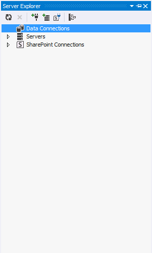
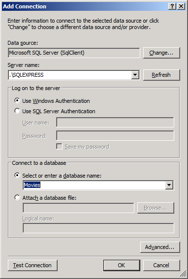
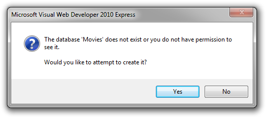
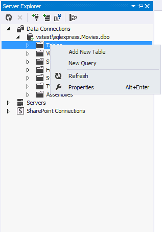
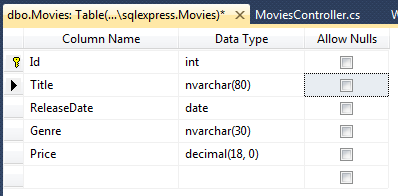
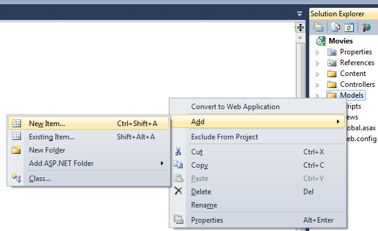
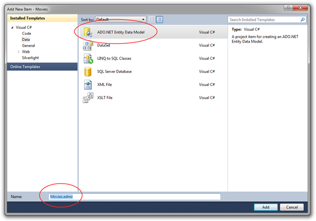
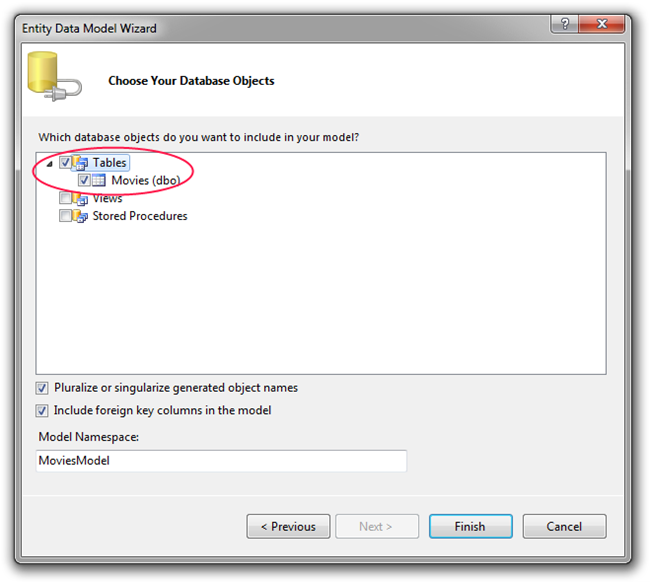

Creating a Database
====================
by [Scott Hanselman](https://github.com/shanselman)

> This is a beginner tutorial that introduces the basics of ASP.NET MVC. You'll create a simple web application that reads and writes from a database. Visit the [ASP.NET MVC learning center](../../../index.md) to find other ASP.NET MVC tutorials and samples.

In this section we are going to create a new SQL Express database that we'll use to store and retrieve our movie data. From within the Visual Web Developer IDE, select View | Server Explorer. Right click on Data Connections and click Add Connection...

In the Choose Data Source dialog, select Microsoft SQL Server and select Continue.

In the Add Connection dialog, enter ".\SQLEXPRESS" for your Server Name, and enter "Movies" as the name for your new database.

Click OK and you'll be asked if you want to create that database. Select yes.

Now you've got an empty database in Server Explorer.

Right click on Tables and click Add Table. The Table Designer will appear. Add columns for Id, Title, ReleaseDate, Genre, and Price. Right click on the ID column and click set Primary Key. Here's what my design areas looks like.

Also, select the Id column and under Column Properties below change "Identity Specification" to "Yes."

When you've got it done, click the Save icon in the toolbar or select File | Save from the menu, and name your table "**Movie**" (singular). We've got a database and a table!

Go back to Server Explorer and right click the Movie table, then select "Show Table Data." Enter a few movies so our database has some data.

## Creating a Model

Now, switch back to the Solution Explorer on the right hand side of the IDE and right-click on the Models folder and select Add | New Item.

We're going to create an Entity Model from our new database. This will add a set of classes to our project that makes it easy for us to query and manipulate the data within our database. Select the Data node on the left-hand side of the dialog, and then select the ADO.NET Entity Data Model item template. Name it Movies.edmx.

Click the "Add" button. This will then launch the "Entity Data Model Wizard".

In the new dialog that pops up, select Generate from Database. Since we've just made a database, we'll only need to tell the Entity Framework about our new database and its table. Click Next to save our database connection in our web application's configuration. Now, check the Tables and Movie checkbox and click Finish.

Now we can see our new Movie table in the Entity Framework Designer and access it from code.

On the design surface you can see a "Movie" class. This class maps to the "Movie" table in our database, and each property within it maps to a column with the table. Each instance of a "Movie" class will correspond to a row within the "Movie" table.

If you don't like the default naming and mapping conventions used by the Entity Framework, you can use the Entity Framework designer to change or customize them. For this application we'll use the defaults and just save the file as-is.

Now, let's work with some real data!

>[!div class="step-by-step"]
[Previous](getting-started-with-mvc-part3.md)
[Next](getting-started-with-mvc-part5.md)