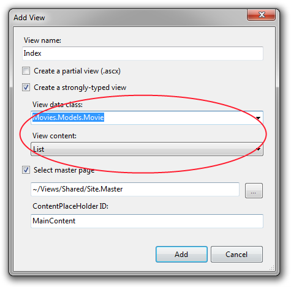
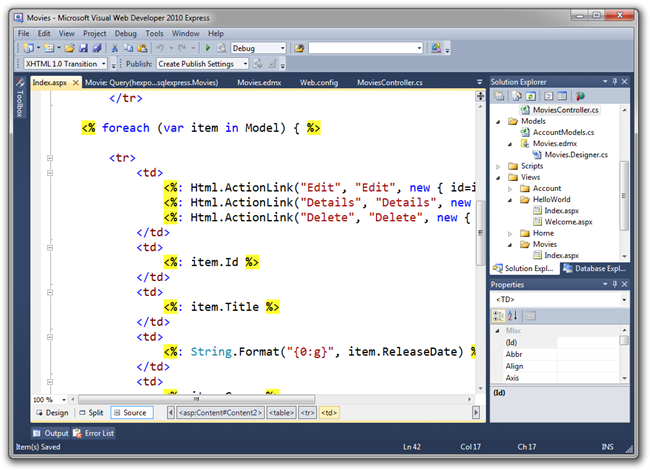
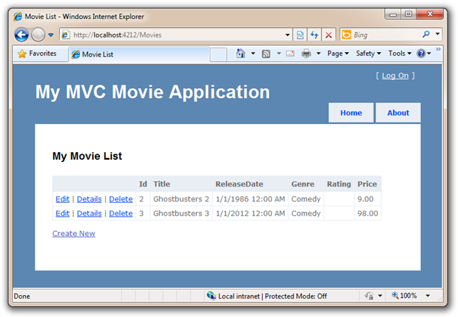
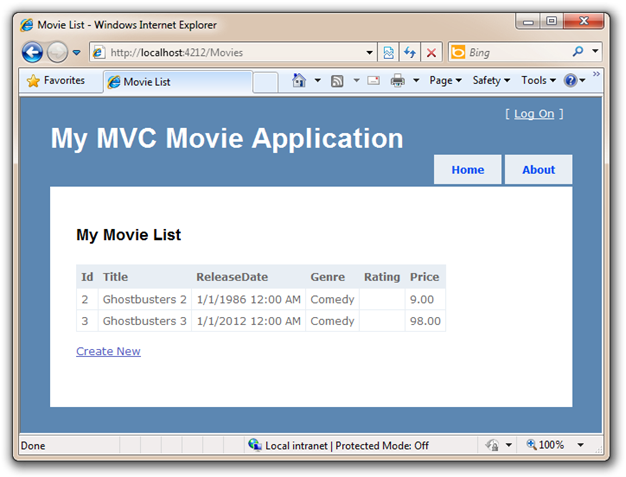

Accessing your Model's Data from a Controller
====================
by [Scott Hanselman](https://github.com/shanselman)

> This is a beginner tutorial that introduces the basics of ASP.NET MVC. You'll create a simple web application that reads and writes from a database. Visit the [ASP.NET MVC learning center](../../../index.md) to find other ASP.NET MVC tutorials and samples.

In this section we are going to create a new MoviesController class, and write some code that retrieves our Movie data and displays it back to the browser using a View template.

Right click on the Controllers folder and make a new MoviesController.

This will create a new "MoviesController.cs" file underneath our \Controllers folder within our project. Let's update the MovieController to retrieve the list of movies from our newly populated database.

[!code-csharp[Main](getting-started-with-mvc-part5/samples/sample1.cs)]

We are performing a LINQ query so that we only retrieve movies released after the summer of 1984. We'll need a View template to render this list of movies back, so right-click in the method and select Add View to create it.

Within the Add View dialog we'll indicate that we are passing a List&lt;Movies.Models.Movie&gt; to our View template. Unlike the previous times we used the Add View dialog and chose to create an "Empty" template, this time we'll indicate that we want Visual Studio to automatically "scaffold" a view template for us with some default content. We'll do this by selecting the "List" item within the "View content dropdown menu.

Remember, when you have a created a new class you'll need to compile your application for it to show up in the Add View Dialog.

Click add and the system will automatically generate the code for a View for us that displays our list of movies. This is a good time to change the &lt;h2&gt; heading to something like "My Movie List" like we did earlier with the Hello World view.

Run your application and visit /Movies in the address bar. Now we've retrieved data from the database using a basic query inside the Controller and returned the data to a View that knows about Movies. That View then spins through the list of Movies and creates a table of data for us.

We won't be implementing Edit, Details and Delete functionality with this application - so we don't need the default links that the scaffold template created for us. Open up the /Movies/Index.aspx file and remove them.

Here is the source code for what our updated View template should look like once we make these changes:

[!code-aspx[Main](getting-started-with-mvc-part5/samples/sample2.aspx)]

It's creating links that we won't need, so we'll delete them for this example. We will keep our Create New link though, as that's next! Here's what our app looks like with that column removed.

We now have a simple listing of our movie data. However, if we click the "Create New" link, we'll get an error as it's not hooked up! Let's implement a Create Action method and enable a user to enter new movies in our database.

>[!div class="step-by-step"]
[Previous](getting-started-with-mvc-part4.md)
[Next](getting-started-with-mvc-part6.md)