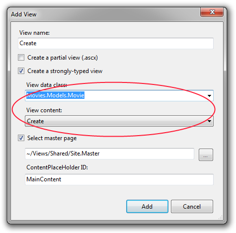
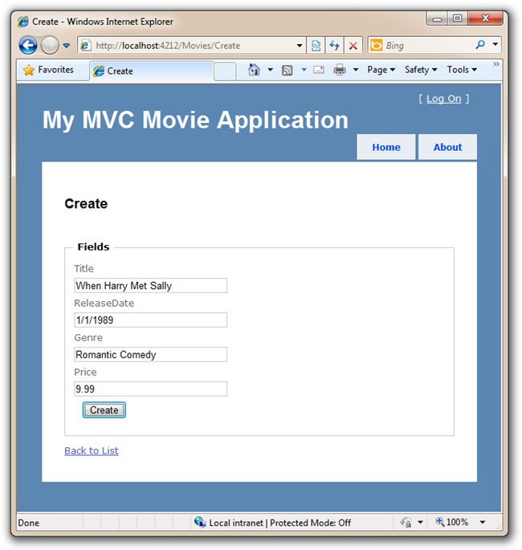
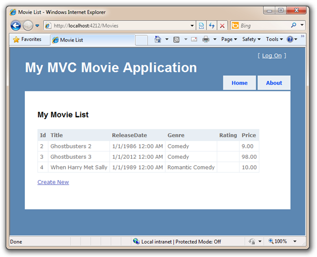

Adding a Create Method and Create View
====================
by [Scott Hanselman](https://github.com/shanselman)

> This is a beginner tutorial that introduces the basics of ASP.NET MVC. You'll create a simple web application that reads and writes from a database. Visit the [ASP.NET MVC learning center](../../../index.md) to find other ASP.NET MVC tutorials and samples.

In this section we are going to implement the support necessary to enable users to create new movies in our database. We'll do this by implementing the /Movies/Create URL action.

Implementing the /Movies/Create URL is a two step process. When a user first visits the /Movies/Create URL we want to show them an HTML form that they can fill out to enter a new movie. Then, when the user submits the form and posts the data back to the server, we want to retrieve the posted contents and save it into our database.

We'll implement these two steps within two Create() methods within our MoviesController class. One method will show the &lt;form&gt; that the user should fill out to create a new movie. The second method will handle processing the posted data when the user submits the &lt;form&gt; back to the server, and save a new Movie within our database.

Below is the code we'll add to our MoviesController class to implement this:

[!code-csharp[Main](getting-started-with-mvc-part6/samples/sample1.cs)]

The above code contains all of the code that we'll need within our Controller.

Let's now implement the Create View template that we'll use to display a form to the user. We'll right click in the first Create method and select "Add View" to create the view template for our Movie form.

We'll select that we are going to pass the view template a "Movie" as its view data class, and indicate that we want to "scaffold" a "Create" template.

After you click the Add button, \Movies\Create.aspx View template will be created for you. Because we selected "Create" from the "view content" dropdown, the Add View dialog automatically "scaffolded" some default content for us. The scaffolding created an HTML &lt;form&gt;, a place for validation error messages to go, and since scaffolding knows about Movies, it created Label and Fields for each property of our class.

[!code-aspx[Main](getting-started-with-mvc-part6/samples/sample2.aspx)]

Since our database automatically gives a Movie an ID, let's remove those fields that reference model.Id from our Create View. Remove the 7 lines after &lt;legend&gt;Fields&lt;/legend&gt; as they show the ID field that we don't want.

Let's now create a new movie and add it to the database. We'll do this by running the application again and visit the "/Movies" URL and click the "Create" link to add a new Movie.

When we click the Create button, we'll be posting back (via HTTP POST) the data on this form to the /Movies/Create method that we just created. Just like when the system automatically took the "numTimes" and "name " parameter out of the URL and mapped them to parameters on a method earlier, the system will automatically take the Form Fields from a POST and map them to an object. In this case, values from fields in HTML like "ReleaseDate" and "Title" will automatically be put into the correct properties of a new instance of a Movie.

Let's look at the second Create method from our MoviesController again. Notice how it takes a "Movie" object as an argument:

[!code-csharp[Main](getting-started-with-mvc-part6/samples/sample3.cs)]

This Movie object was then passed to the [HttpPost] version of our Create action method, and we saved it in the database and then redirected the user back to the Index() action method which will show the saved result in the movie list:

We aren't checking if our movies are correct, though, and the database won't allow us to save a movie with no Title. It'd be nice if we could tell the user that before the database threw an error. We'll do this next by adding validation support to our application.

>[!div class="step-by-step"]
[Previous](getting-started-with-mvc-part5.md)
[Next](getting-started-with-mvc-part7.md)