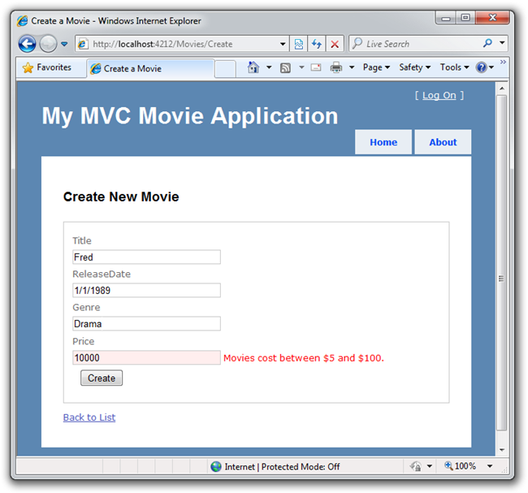
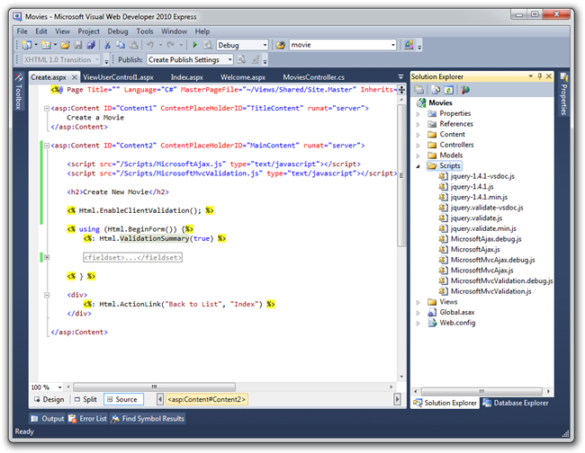
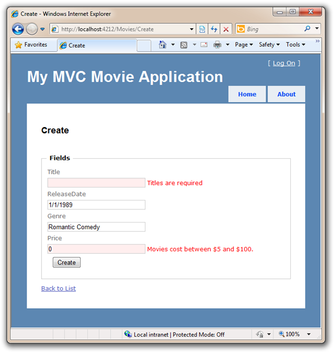

Adding Validation to the Model
====================
by [Scott Hanselman](https://github.com/shanselman)

> This is a beginner tutorial that introduces the basics of ASP.NET MVC. You'll create a simple web application that reads and writes from a database. Visit the [ASP.NET MVC learning center](../../../index.md) to find other ASP.NET MVC tutorials and samples.

In this section we are going to implement the support necessary to enable input validation within our application. We'll ensure that our database content is always correct, and provide helpful error messages to end users when they try and enter Movie data which is not valid. We'll begin by adding a little validation logic to the Movie class.

Right click on the Model folder and select Add Class. Name your class Movie.

When we created the Movie Entity Model earlier, the IDE created a Movie class. In fact, part of the Movie class can be in one file and part in another. This is called a Partial Class. We're going to extend the Movie class from another file.

We'll create a partial movie class that points to a "buddy class" with some attributes that will give validation hints to the system. We'll mark the Title and Price as Required, and also insist that the Price be within a certain range. Right click the Models folder and select Add Class. Name your class Movie and Click the OK button. Here's what our partial Movie class looks like.

[!code-csharp[Main](getting-started-with-mvc-part7/samples/sample1.cs)]

Re-Run your application and try to enter a movie with a price over 100. You'll get an error after you've submitted the form. The error is caught on the server side and occurs after the Form is POSTed. Notice how ASP.NET MVC's built-in HTML helpers were smart enough to display the error message and maintain the values for us within the textbox elements:

This works great, but it'd be nice if we could tell the user on the client-side, immediately, before the server gets involved.

Let's enable some client-side validation with JavaScript.

## Adding Client-Side Validation

Since our Movie class already has some validation attributes, we'll just need to add a few JavaScript files to our Create.aspx View template and add a line of code to enable client-side validation to take place.

From within VWD go our Views/Movie folder and open up Create.aspx.

Open up the Scripts folder in the Solution Explorer and drag the following three scripts to within the &lt;head&gt; tag.

- MicrosoftAjax.js
- MicrosoftMvcValidation.js

You want these script files to appear in this order.

[!code-html[Main](getting-started-with-mvc-part7/samples/sample2.html)]

Also, add this single line above the Html.BeginForm:

[!code-aspx[Main](getting-started-with-mvc-part7/samples/sample3.aspx)]

Here's the code shown within the IDE.

Run your application and visit /Movies/Create again, and click Create without entering any data. The error messages appear immediately without the page flash that we associate with sending data all the way back to the server. This is because ASP.NET MVC is now validating the input on both the client (using JavaScript) and on the server.

This is looking good! Let's now add one additional column to the database.

>[!div class="step-by-step"]
[Previous](getting-started-with-mvc-part6.md)
[Next](getting-started-with-mvc-part8.md)