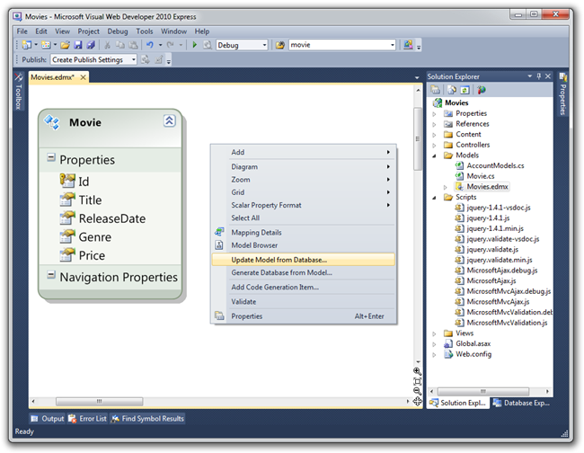
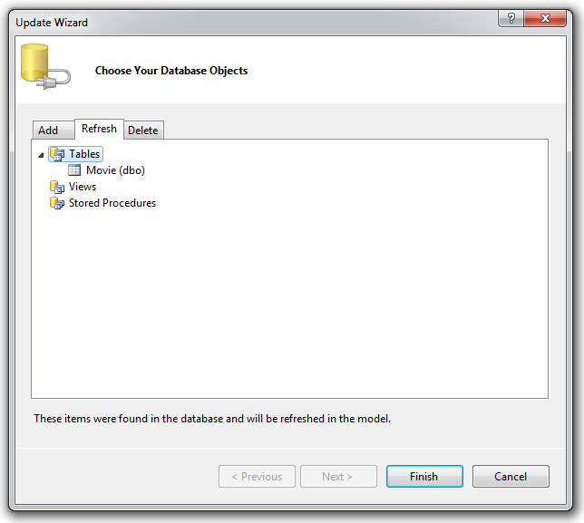
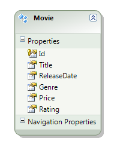
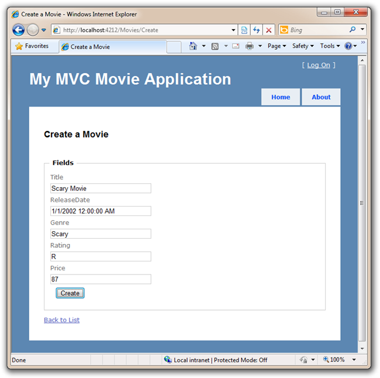

Adding a Column to the Model
====================
by [Scott Hanselman](https://github.com/shanselman)

> This is a beginner tutorial that introduces the basics of ASP.NET MVC. You'll create a simple web application that reads and writes from a database. Visit the [ASP.NET MVC learning center](../../../index.md) to find other ASP.NET MVC tutorials and samples.

In this section we are going to walk through how we can make changes to the schema of our database, and handle the changes within our application.

Let's add a "Rating" Colum to the Movie table. Go back to the IDE and click the Database Explorer. Right click the Movie table and select Open Table Definition.

Add a "Rating" column as seen below. Since we don't have any Ratings now, the column can allow nulls. Click Save.

Next, return to the Solution Explorer and open up the Movies.edmx file (which is in the \Models folder). Right click on the design surface (the white area) and select Update Model from Database.

This will launch the "Update Wizard". Click the Refresh tab within it and click Finish. Our Movie model class will then be updated with the new column.

After clicking Finish, you can see the new Rating Column has been added to the Movie Entity in our model.

We've added a column in the database model, but the Views don't know about it.

## Update Views with Model Changes

There are a few ways we could update our view templates to reflect the new Rating column. Since we created these Views by generating them via the Add View dialog, we could delete them and recreate them again. However, typically people will have already made modifications to their View templates from the initial scaffolded generation and will want to add or delete fields manually, just as we did with the ID field for Create.

Open up the \Views\Movies\Index.aspx template and add a &lt;th&gt;Rating&lt;/th&gt; to the head of the Movie table. I added mine after Genre. Then, in the same column position but lower down, add a line to output our new Rating.

[!code-aspx[Main](getting-started-with-mvc-part8/samples/sample1.aspx)]

Our final Index.aspx template will look like this:

[!code-aspx[Main](getting-started-with-mvc-part8/samples/sample2.aspx)]

Let's then open up the \Views\Movies\Create.aspx template and add a Label and Textbox for our new Rating property:

[!code-aspx[Main](getting-started-with-mvc-part8/samples/sample3.aspx)]

Our final Create.aspx template will look like this, and let's change our browser's title and secondary &lt;h2&gt; title to something like "Create a Movie" while we're in here!

[!code-aspx[Main](getting-started-with-mvc-part8/samples/sample4.aspx)]

Run your app and now you've got a new field in the database that's been added to the Create page. Add a new Movie - this time with a Rating - and click Create.

After you click Create, you're sent to the Index page where you new Movie is listed with the new Rating Column in the database

This basic tutorial got you started making Controllers, associating them with Views and passing around hard-coded data. Then we created and designed a Database and put some data it in. We retrieved the data from the database and displayed it in an HTML table. Then we added a Create form that let the user add data to the database themselves from within the Web Application. We added validation, then made the validation use JavaScript on the client-side. Finally, we changed the database to include a new column of data, then updated our two pages to create and display this new data.

I now encourage you to move on to our intermediate-level tutorial "[MVC Music Store](../../older-versions/mvc-music-store/mvc-music-store-part-1.md)" as well as the many videos and resources at [https://asp.net/mvc](https://asp.net/mvc) to learn even more about ASP.NET MVC!

Enjoy!

- Scott Hanselman - [http://hanselman.com](http://hanselman.com) and [@shanselman](http://twitter.com/shanselman) on Twitter.

>[!div class="step-by-step"]
[Previous](getting-started-with-mvc-part7.md)