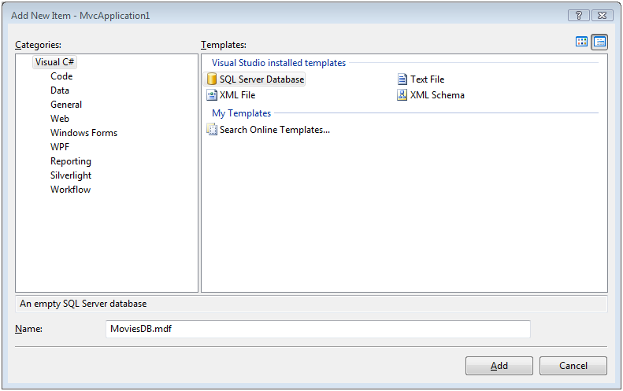
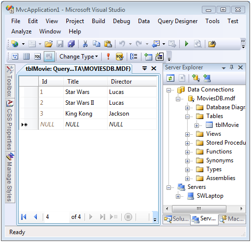

Creating Model Classes with LINQ to SQL (VB)
====================
by [Microsoft](https://github.com/microsoft)

[Download PDF](http://download.microsoft.com/download/1/1/f/11f721aa-d749-4ed7-bb89-a681b68894e6/ASPNET_MVC_Tutorial_10_VB.pdf)

> The goal of this tutorial is to explain one method of creating model classes for an ASP.NET MVC application. In this tutorial, you learn how to build model classes and perform database access by taking advantage of Microsoft LINQ to SQL.

The goal of this tutorial is to explain one method of creating model classes for an ASP.NET MVC application. In this tutorial, you learn how to build model classes and perform database access by taking advantage of Microsoft LINQ to SQL.

In this tutorial, we build a basic Movie database application. We start by creating the Movie database application in the fastest and easiest way possible. We perform all of our data access directly from our controller actions.

Next, you learn how to use the Repository pattern. Using the Repository pattern requires a little more work. However, the advantage of adopting this pattern is that it enables you to build applications that are adaptable to change and can be easily tested.

## What is a Model Class?

An MVC model contains all of the application logic that is not contained in an MVC view or MVC controller. In particular, an MVC model contains all of your application business and data access logic.

You can use a variety of different technologies to implement your data access logic. For example, you can build your data access classes using the Microsoft Entity Framework, NHibernate, Subsonic, or ADO.NET classes.

In this tutorial, I use LINQ to SQL to query and update the database. LINQ to SQL provides you with a very easy method of interacting with a Microsoft SQL Server database. However, it is important to understand that the ASP.NET MVC framework is not tied to LINQ to SQL in any way. ASP.NET MVC is compatible with any data access technology.

## Create a Movie Database

In this tutorial -- in order to illustrate how you can build model classes -- we build a simple Movie database application. The first step is to create a new database. Right-click the App\_Data folder in the Solution Explorer window and select the menu option **Add, New Item**. Select the SQL Server Database template, give it the name MoviesDB.mdf, and click the **Add** button (see Figure 1).

**Figure 01**: Adding a new SQL Server Database ([Click to view full-size image](creating-model-classes-with-linq-to-sql-vb/_static/image3.png))

After you create the new database, you can open the database by double-clicking the MoviesDB.mdf file in the App\_Data folder. Double-clicking the MoviesDB.mdf file opens the Server Explorer window (see Figure 2).

|  | The Server Explorer window is called the Database Explorer window when using Visual Web Developer. |
| --- | --- |

**Figure 02**: Using the Server Explorer window ([Click to view full-size image](creating-model-classes-with-linq-to-sql-vb/_static/image6.png))

We need to add one table to our database that represents our movies. Right-click the Tables folder and select the menu option **Add New Table**. Selecting this menu option opens the Table Designer (see Figure 3).

**Figure 03**: The Table Designer ([Click to view full-size image](creating-model-classes-with-linq-to-sql-vb/_static/image9.png))

We need to add the following columns to our database table:

| **Column Name** | **Data Type** | **Allow Nulls** |
| --- | --- | --- |
| Id | Int | False |
| Title | Nvarchar(200) | False |
| Director | Nvarchar(50) | False |

You need to do two special things to the Id column. First, you need to mark the Id column as a primary key column by selecting the column in the Table Designer and clicking the icon of a key. LINQ to SQL requires you to specify your primary key columns when performing inserts or updates against the database.

Next, you need to mark the Id column as an Identity column by assigning the value Yes to the **Is Identity** property (see Figure 3). An Identity column is a column that is assigned a new number automatically whenever you add a new row of data to a table.

After you make these changes, save the table with the name tblMovie. You can save the table by clicking the Save button.

## Create LINQ to SQL Classes

Our MVC model will contain LINQ to SQL classes that represent the tblMovie database table. The easiest way to create these LINQ to SQL classes is to right-click the Models folder, select **Add, New Item**, select the LINQ to SQL Classes template, give the classes the name Movie.dbml, and click the **Add** button (see Figure 4).

**Figure 04**: Creating LINQ to SQL classes ([Click to view full-size image](creating-model-classes-with-linq-to-sql-vb/_static/image12.png))

Immediately after you create the Movie LINQ to SQL Classes, the Object Relational Designer appears. You can drag database tables from the Server Explorer window onto the Object Relational Designer to create LINQ to SQL Classes that represent particular database tables. We need to add the tblMovie database table onto the Object Relational Designer (see Figure 4).

**Figure 05**: Using the Object Relational Designer ([Click to view full-size image](creating-model-classes-with-linq-to-sql-vb/_static/image15.png))

By default, the Object Relational Designer creates a class with the very same name as the database table that you drag onto the Designer. However, we don't want to call our class tblMovie. Therefore, click the name of the class in the Designer and change the name of the class to Movie.

Finally, remember to click the **Save** button (the picture of the floppy) to save the LINQ to SQL Classes. Otherwise, the LINQ to SQL Classes won't be generated by the Object Relational Designer.

## Using LINQ to SQL in a Controller Action

Now that we have our LINQ to SQL classes, we can use these classes to retrieve data from the database. In this section, you learn how to use LINQ to SQL classes directly within a controller action. We'll display the list of movies from the tblMovies database table in an MVC view.

First, we need to modify the HomeController class. This class can be found in the Controllers folder of your application. Modify the class so it looks like the class in Listing 1.

**Listing 1 – `Controllers\HomeController.vb`**

[!code-vb[Main](creating-model-classes-with-linq-to-sql-vb/samples/sample1.vb)]

The Index() action in Listing 1 uses a LINQ to SQL DataContext class (the MovieDataContext) to represent the MoviesDB database. The MoveDataContext class was generated by the Visual Studio Object Relational Designer.

A LINQ query is performed against the DataContext to retrieve all of the movies from the tblMovies database table. The list of movies is assigned to a local variable named movies. Finally, the list of movies is passed to the view through view data.

In order to show the movies, we next need to modify the Index view. You can find the Index view in the Views\Home\ folder. Update the Index view so that it looks like the view in Listing 2.

**Listing 2 – `Views\Home\Index.aspx`**

[!code-aspx[Main](creating-model-classes-with-linq-to-sql-vb/samples/sample2.aspx)]

Notice that the modified Index view includes an &lt;%@ import namespace %&gt; directive at the top of the view. This directive imports the MvcApplication1 namespace. We need this namespace in order to work with the model classes – in particular, the Movie class -- in the view.

The view in Listing 2 contains a For Each loop that iterates through all of the items represented by the ViewData.Model property. The value of the Title property is displayed for each movie.

Notice that the value of the ViewData.Model property is cast to an IEnumerable. This is necessary in order to loop through the contents of ViewData.Model. Another option here is to create a strongly-typed view. When you create a strongly-typed view, you cast the ViewData.Model property to a particular type in a view's code-behind class.

If you run the application after modifying the HomeController class and the Index view then you will get a blank page. You'll get a blank page because there are no movie records in the tblMovies database table.

In order to add records to the tblMovies database table, right-click the tblMovies database table in the Server Explorer window (Database Explorer window in Visual Web Developer) and select the menu option **Show Table Data**. You can insert movie records by using the grid that appears (see Figure 5).

**Figure 06**: Inserting movies([Click to view full-size image](creating-model-classes-with-linq-to-sql-vb/_static/image18.png))

After you add some database records to the tblMovies table, and you run the application, you'll see the page in Figure 7. All of the movie database records are displayed in a bulleted list.

**Figure 07**: Displaying movies with the Index view([Click to view full-size image](creating-model-classes-with-linq-to-sql-vb/_static/image21.png))

## Using the Repository Pattern

In the previous section, we used LINQ to SQL classes directly within a controller action. We used the MovieDataContext class directly from the Index() controller action. There is nothing wrong with doing this in the case of a simple application. However, working directly with LINQ to SQL in a controller class creates problems when you need to build a more complex application.

Using LINQ to SQL within a controller class makes it difficult to switch data access technologies in the future. For example, you might decide to switch from using Microsoft LINQ to SQL to using the Microsoft Entity Framework as your data access technology. In that case, you would need to rewrite every controller that accesses the database within your application.

Using LINQ to SQL within a controller class also makes it difficult to build unit tests for your application. Normally, you do not want to interact with a database when performing unit tests. You want to use your unit tests to test your application logic and not your database server.

In order to build an MVC application that is more adaptable to future change and that can be more easily tested, you should consider using the Repository pattern. When you use the Repository pattern, you create a separate repository class that contains all of your database access logic.

When you create the repository class, you create an interface that represents all of the methods used by the repository class. Within your controllers, you write your code against the interface instead of the repository. That way, you can implement the repository using different data access technologies in the future.

The interface in Listing 3 is named IMovieRepository and it represents a single method named ListAll().

**Listing 3 – `Models\IMovieRepository.vb`**

[!code-vb[Main](creating-model-classes-with-linq-to-sql-vb/samples/sample3.vb)]

The repository class in Listing 4 implements the IMovieRepository interface. Notice that it contains a method named ListAll() that corresponds to the method required by the IMovieRepository interface.

**Listing 4 – `Models\MovieRepository.vb`**

[!code-vb[Main](creating-model-classes-with-linq-to-sql-vb/samples/sample4.vb)]

Finally, the MoviesController class in Listing 5 uses the Repository pattern. It no longer uses LINQ to SQL classes directly.

**Listing 5 – `Controllers\MoviesController.vb`**

[!code-vb[Main](creating-model-classes-with-linq-to-sql-vb/samples/sample5.vb)]

Notice that the MoviesController class in Listing 5 has two constructors. The first constructor, the parameterless constructor, is called when your application is running. This constructor creates an instance of the MovieRepository class and passes it to the second constructor.

The second constructor has a single parameter: an IMovieRepository parameter. This constructor simply assigns the value of the parameter to a class-level field named \_repository.

The MoviesController class is taking advantage of a software design pattern called the Dependency Injection pattern. In particular, it is using something called Constructor Dependency Injection. You can read more about this pattern by reading the following article by Martin Fowler:

[http://martinfowler.com/articles/injection.html](http://martinfowler.com/articles/injection.html)

Notice that all of the code in the MoviesController class (with the exception of the first constructor) interacts with the IMovieRepository interface instead of the actual MovieRepository class. The code interacts with an abstract interface instead of a concrete implementation of the interface.

If you want to modify the data access technology used by the application then you can simply implement the IMovieRepository interface with a class that uses the alternative database access technology. For example, you could create an EntityFrameworkMovieRepository class or a SubSonicMovieRepository class. Because the controller class is programmed against the interface, you can pass a new implementation of IMovieRepository to the controller class and the class would continue to work.

Furthermore, if you want to test the MoviesController class, then you can pass a fake movie repository class to the MoviesController. You can implement the IMovieRepository class with a class that does not actually access the database but contains all of the required methods of the IMovieRepository interface. That way, you can unit test the MoviesController class without actually accessing a real database.

## Summary

The goal of this tutorial was to demonstrate how you can create MVC model classes by taking advantage of Microsoft LINQ to SQL. We examined two strategies for displaying database data in an ASP.NET MVC application. First, we created LINQ to SQL classes and used the classes directly within a controller action. Using LINQ to SQL classes within a controller enables you to quickly and easily display database data in an MVC application.

Next, we explored a slightly more difficult, but definitely more virtuous, path for displaying database data. We took advantage of the Repository pattern and placed all of our database access logic in a separate repository class. In our controller, we wrote all of our code against an interface instead of a concrete class. The advantage of the Repository pattern is that it enables us to easily change database access technologies in the future and it enables us to easily test our controller classes.

>[!div class="step-by-step"]
[Previous](creating-model-classes-with-the-entity-framework-vb.md)
[Next](displaying-a-table-of-database-data-vb.md)