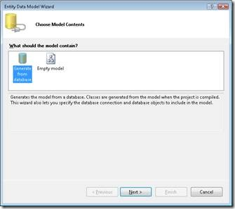
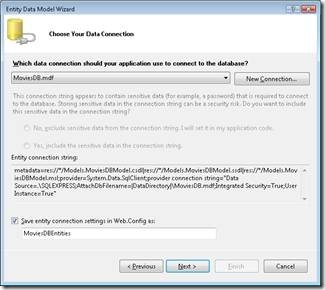
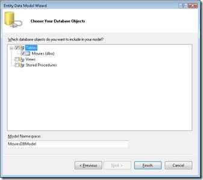

Creating Model Classes with the Entity Framework (C#)
====================
by [Microsoft](https://github.com/microsoft)

> In this tutorial, you learn how to use ASP.NET MVC with the Microsoft Entity Framework. You learn how to use the Entity Wizard to create an ADO.NET Entity Data Model. Over the course of this tutorial, we build a web application that illustrates how to select, insert, update, and delete database data by using the Entity Framework.

The goal of this tutorial is to explain how you can create data access classes using the Microsoft Entity Framework when building an ASP.NET MVC application. This tutorial assumes no previous knowledge of the Microsoft Entity Framework. By the end of this tutorial, you'll understand how to use the Entity Framework to select, insert, update, and delete database records.

The Microsoft Entity Framework is an Object Relational Mapping (O/RM) tool that enables you to generate a data access layer from a database automatically. The Entity Framework enables you to avoid the tedious work of building your data access classes by hand.

In order to illustrate how you can use the Microsoft Entity Framework with ASP.NET MVC, we'll build a simple sample application. We'll create a Movie Database application that enables you to display and edit movie database records.

This tutorial assumes that you have Visual Studio 2008 or Visual Web Developer 2008 with Service Pack 1. You need Service Pack 1 in order to use the Entity Framework. You can download Visual Studio 2008 Service Pack 1 or Visual Web Developer with Service Pack 1 from the following address:

> [https://www.asp.net/downloads/](https://www.asp.net/downloads)

> [!NOTE] 
> 
> There is no essential connection between ASP.NET MVC and the Microsoft Entity Framework. There are several alternatives to the Entity Framework that you can use with ASP.NET MVC. For example, you can build your MVC Model classes using other O/RM tools such as Microsoft LINQ to SQL, NHibernate, or SubSonic.

## Creating the Movie Sample Database

The Movie Database application uses a database table named Movies that contains the following columns:

| Column Name | Data Type | Allow Nulls? | Is Primary Key? |
| --- | --- | --- | --- |
| Id | int | False | True |
| Title | nvarchar(100) | False | False |
| Director | nvarchar(100) | False | False |

You can add this table to an ASP.NET MVC project by following these steps:

1. Right-click the App\_Data folder in the Solution Explorer window and select the menu option **Add, New Item.**
2. From the **Add New Item** dialog box, select **SQL Server Database**, give the database the name MoviesDB.mdf, and click the **Add** button.
3. Double-click the MoviesDB.mdf file to open the Server Explorer/Database Explorer window.
4. Expand the MoviesDB.mdf database connection, right-click the Tables folder, and select the menu option **Add New Table**.
5. In the Table Designer, add the Id, Title, and Director columns.
6. Click the **Save** button (it has the icon of the floppy) to save the new table with the name Movies.

After you create the Movies database table, you should add some sample data to the table. Right-click the Movies table and select the menu option **Show Table Data**. You can enter fake movie data into the grid that appears.

## Creating the ADO.NET Entity Data Model

In order to use the Entity Framework, you need to create an Entity Data Model. You can take advantage of the Visual Studio *Entity Data Model Wizard* to generate an Entity Data Model from a database automatically.

Follow these steps:

1. Right-click the Models folder in the Solution Explorer window and select the menu option **Add, New Item**.
2. In the **Add New Item** dialog, select the Data category (see Figure 1).
3. Select the **ADO.NET Entity Data Model** template, give the Entity Data Model the name MoviesDBModel.edmx, and click the **Add** button. Clicking the **Add** button launches the Data Model Wizard.
4. In the **Choose Model Contents** step, choose the **Generate from a database** option and click the **Next** button (see Figure 2).
5. In the **Choose Your Data Connection** step, select the MoviesDB.mdf database connection, enter the entities connection settings name MoviesDBEntities, and click the **Next** button (see Figure 3).
6. In the **Choose Your Database Objects** step, select the Movie database table and click the **Finish** button (see Figure 4).

After you complete these steps, the ADO.NET Entity Data Model Designer (Entity Designer) opens.

**Figure 1 – Creating a new Entity Data Model**

**Figure 2 – Choose Model Contents Step**

**Figure 3 – Choose Your Data Connection**

**Figure 4 – Choose Your Database Objects**

#### Modifying the ADO.NET Entity Data Model

After you create an Entity Data Model, you can modify the model by taking advantage of the Entity Designer (see Figure 5). You can open the Entity Designer at any time by double-clicking the MoviesDBModel.edmx file contained in the Models folder within the Solution Explorer window.

**Figure 5 – The ADO.NET Entity Data Model Designer**

For example, you can use the Entity Designer to change the names of the classes that the Entity Model Data Wizard generates. The Wizard created a new data access class named Movies. In other words, the Wizard gave the class the very same name as the database table. Because we will use this class to represent a particular Movie instance, we should rename the class from Movies to Movie.

If you want to rename an entity class, you can double-click on the class name in the Entity Designer and enter a new name (see Figure 6). Alternatively, you can change the name of an entity in the Properties window after selecting an entity in the Entity Designer.

**Figure 6 – Changing an entity name**

Remember to save your Entity Data Model after making a modification by clicking the Save button (the icon of the floppy disk). Behind the scenes, the Entity Designer generates a set of C# classes. You can view these classes by opening the MoviesDBModel.Designer.cs file from the Solution Explorer window.

Don't modify the code in the Designer.cs file since your changes will be overwritten the next time you use the Entity Designer. If you want to extend the functionality of the entity classes defined in the Designer.cs file then you can create *partial classes* in separate files.

#### Selecting Database Records with the Entity Framework

Let's start building our Movie Database application by creating a page that displays a list of movie records. The Home controller in Listing 1 exposes an action named Index(). The Index() action returns all of the movie records from the Movie database table by taking advantage of the Entity Framework.

**Listing 1 – Controllers\HomeController.cs**

[!code-csharp[Main](creating-model-classes-with-the-entity-framework-cs/samples/sample1.cs)]

Notice that the controller in Listing 1 includes a constructor. The constructor initializes a class-level field named \_db. The \_db field represents the database entities generated by the Microsoft Entity Framework. The \_db field is an instance of the MoviesDBEntities class that was generated by the Entity Designer.

In order to use theMoviesDBEntities class in the Home controller, you must import the MovieEntityApp.Models namespace (*MVCProjectName*.Models).

The \_db field is used within the Index() action to retrieve the records from the Movies database table. The expression \_db.MovieSet represents all of the records from the Movies database table. The ToList() method is used to convert the set of movies into a generic collection of Movie objects (List&lt;Movie&gt;).

The movie records are retrieved with the help of LINQ to Entities. The Index() action in Listing 1 uses LINQ *method syntax* to retrieve the set of database records. If you prefer, you can use LINQ *query syntax* instead. The following two statements do the very same thing:

[!code-csharp[Main](creating-model-classes-with-the-entity-framework-cs/samples/sample2.cs)]

Use whichever LINQ syntax – method syntax or query syntax – that you find most intuitive. There is no difference in performance between the two approaches – the only difference is style.

The view in Listing 2 is used to display the movie records.

**Listing 2 – Views\Home\Index.aspx**

[!code-aspx[Main](creating-model-classes-with-the-entity-framework-cs/samples/sample3.aspx)]

The view in Listing 2 contains a **foreach** loop that iterates through each movie record and displays the values of the movie record's Title and Director properties. Notice that an Edit and Delete link is displayed next to each record. Furthermore, an Add Movie link appears at the bottom of the view (see Figure 7).

**Figure 7 – The Index view**

The Index view is a *typed view*. The Index view includes a &lt;%@ Page %&gt; directive with an *Inherits* attribute that casts the Model property to a strongly typed generic List collection of Movie objects (List&lt;Movie).

## Inserting Database Records with the Entity Framework

You can use the Entity Framework to make it easy to insert new records into a database table. Listing 3 contains two new actions added to the Home controller class that you can use to insert new records into the Movie database table.

**Listing 3 – Controllers\HomeController.cs (Add methods)**

[!code-csharp[Main](creating-model-classes-with-the-entity-framework-cs/samples/sample4.cs)]

The first Add() action simply returns a view. The view contains a form for adding a new movie database record (see Figure 8). When you submit the form, the second Add() action is invoked.

Notice that the second Add() action is decorated with the AcceptVerbs attribute. This action can be invoked only when performing an HTTP POST operation. In other words, this action can only be invoked when posting an HTML form.

The second Add() action creates a new instance of the Entity Framework Movie class with the help of the ASP.NET MVC TryUpdateModel() method. The TryUpdateModel() method takes the fields in the FormCollection passed to the Add() method and assigns the values of these HTML form fields to the Movie class.

When using the Entity Framework, you must supply a "white list" of properties when using the TryUpdateModel or UpdateModel methods to update the properties of an entity class.

Next, the Add() action performs some simple form validation. The action verifies that both the Title and Director properties have values. If there is a validation error, then a validation error message is added to ModelState.

If there are no validation errors then a new movie record is added to the Movies database table with the help of the Entity Framework. The new record is added to the database with the following two lines of code:

[!code-csharp[Main](creating-model-classes-with-the-entity-framework-cs/samples/sample5.cs)]

The first line of code adds the new Movie entity to the set of movies being tracked by the Entity Framework. The second line of code saves whatever changes have been made to the Movies being tracked back to the underlying database.

**Figure 8 – The Add view**

#### Updating Database Records with the Entity Framework

You can follow almost the same approach to edit a database record with the Entity Framework as the approach that we just followed to insert a new database record. Listing 4 contains two new controller actions named Edit(). The first Edit() action returns an HTML form for editing a movie record. The second Edit() action attempts to update the database.

**Listing 4 – Controllers\HomeController.cs (Edit methods)**

[!code-csharp[Main](creating-model-classes-with-the-entity-framework-cs/samples/sample6.cs)]

The second Edit() action starts by retrieving the Movie record from the database that matches the Id of the movie being edited. The following LINQ to Entities statement grabs the first database record that matches a particular Id:

[!code-csharp[Main](creating-model-classes-with-the-entity-framework-cs/samples/sample7.cs)]

Next, the TryUpdateModel() method is used to assign the values of the HTML form fields to the properties of the movie entity. Notice that a white list is supplied to specify the exact properties to update.

Next, some simple validation is performed to verify that both the Movie Title and Director properties have values. If either property is missing a value, then a validation error message is added to ModelState and ModelState.IsValid returns the value false.

Finally, if there are no validation errors, then the underlying Movies database table is updated with any changes by calling the SaveChanges() method.

When editing database records, you need to pass the Id of the record being edited to the controller action that performs the database update. Otherwise, the controller action will not know which record to update in the underlying database. The Edit view, contained in Listing 5, includes a hidden form field that represents the Id of the database record being edited.

**Listing 5 – Views\Home\Edit.aspx**

[!code-aspx[Main](creating-model-classes-with-the-entity-framework-cs/samples/sample8.aspx)]

## Deleting Database Records with the Entity Framework

The final database operation, which we need to tackle in this tutorial, is deleting database records. You can use the controller action in Listing 6 to delete a particular database record.

**Listing 6 -- \Controllers\HomeController.cs (Delete action)**

[!code-csharp[Main](creating-model-classes-with-the-entity-framework-cs/samples/sample9.cs)]

The Delete() action first retrieves the Movie entity that matches the Id passed to the action. Next, the movie is deleted from the database by calling the DeleteObject() method followed by the SaveChanges() method. Finally, the user is redirected back to the Index view.

## Summary

The purpose of this tutorial was to demonstrate how you can build database-driven web applications by taking advantage of ASP.NET MVC and the Microsoft Entity Framework. You learned how to build an application that enables you to select, insert, update, and delete database records.

First, we discussed how you can use the Entity Data Model Wizard to generate an Entity Data Model from within Visual Studio. Next, you learn how to use LINQ to Entities to retrieve a set of database records from a database table. Finally, we used the Entity Framework to insert, update, and delete database records.

>[!div class="step-by-step"]
[Next](creating-model-classes-with-linq-to-sql-cs.md)