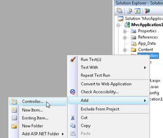
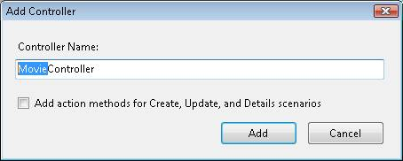
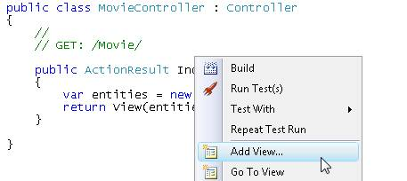
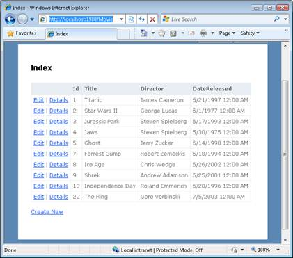

Displaying a Table of Database Data (C#)
====================
by [Microsoft](https://github.com/microsoft)

[Download PDF](http://download.microsoft.com/download/1/1/f/11f721aa-d749-4ed7-bb89-a681b68894e6/ASPNET_MVC_Tutorial_11_CS.pdf)

> In this tutorial, I demonstrate two methods of displaying a set of database records. I show two methods of formatting a set of database records in an HTML table. First, I show how you can format the database records directly within a view. Next, I demonstrate how you can take advantage of partials when formatting database records.

The goal of this tutorial is to explain how you can display an HTML table of database data in an ASP.NET MVC application. First, you learn how to use the scaffolding tools included in Visual Studio to generate a view that displays a set of records automatically. Next, you learn how to use a partial as a template when formatting database records.

## Create the Model Classes

We are going to display the set of records from the Movies database table. The Movies database table contains the following columns:

| **Column Name** | **Data Type** | **Allow Nulls** |
| --- | --- | --- |
| Id | Int | False |
| Title | Nvarchar(200) | False |
| Director | NVarchar(50) | False |
| DateReleased | DateTime | False |

In order to represent the Movies table in our ASP.NET MVC application, we need to create a model class. In this tutorial, we use the Microsoft Entity Framework to create our model classes.

> [!NOTE] 
> 
> In this tutorial, we use the Microsoft Entity Framework. However, it is important to understand that you can use a variety of different technologies to interact with a database from an ASP.NET MVC application including LINQ to SQL, NHibernate, or ADO.NET.

Follow these steps to launch the Entity Data Model Wizard:

1. Right-click the Models folder in the Solution Explorer window and the select the menu option **Add, New Item**.
2. Select the **Data** category and select the **ADO.NET Entity Data Model** template.
3. Give your data model the name *MoviesDBModel.edmx* and click the **Add** button.

After you click the Add button, the Entity Data Model Wizard appears (see Figure 1). Follow these steps to complete the wizard:

1. In the **Choose Model Contents** step, select the **Generate from database** option.
2. In the **Choose Your Data Connection** step, use the *MoviesDB.mdf* data connection and the name *MoviesDBEntities* for the connection settings. Click the **Next** button.
3. In the **Choose Your Database Objects** step, expand the Tables node, select the Movies table. Enter the namespace *Models* and click the **Finish** button.

**Figure 01**: Creating LINQ to SQL classes ([Click to view full-size image](displaying-a-table-of-database-data-cs/_static/image2.png))

After you complete the Entity Data Model Wizard, the Entity Data Model Designer opens. The Designer should display the Movies entity (see Figure 2).

**Figure 02**: The Entity Data Model Designer ([Click to view full-size image](displaying-a-table-of-database-data-cs/_static/image4.png))

We need to make one change before we continue. The Entity Data Wizard generates a model class named *Movies* that represents the Movies database table. Because we'll use the Movies class to represent a particular movie, we need to modify the name of the class to be *Movie* instead of *Movies* (singular rather than plural).

Double-click the name of the class on the designer surface and change the name of the class from Movies to Movie. After making this change, click the **Save** button (the icon of the floppy disk) to generate the Movie class.

## Create the Movies Controller

Now that we have a way to represent our database records, we can create a controller that returns the collection of movies. Within the Visual Studio Solution Explorer window, right-click the Controllers folder and select the menu option **Add, Controller** (see Figure 3).

**Figure 03**: The Add Controller Menu ([Click to view full-size image](displaying-a-table-of-database-data-cs/_static/image6.png))

When the **Add Controller** dialog appears, enter the controller name MovieController (see Figure 4). Click the **Add** button to add the new controller.

**Figure 04**: The Add Controller dialog([Click to view full-size image](displaying-a-table-of-database-data-cs/_static/image8.png))

We need to modify the Index() action exposed by the Movie controller so that it returns the set of database records. Modify the controller so that it looks like the controller in Listing 1.

**Listing 1 – Controllers\MovieController.cs**

[!code-csharp[Main](displaying-a-table-of-database-data-cs/samples/sample1.cs)]

In Listing 1, the MoviesDBEntities class is used to represent the MoviesDB database. To use this class, you need to import the MvcApplication1.Models namespace like this:

using MvcApplication1.Models;

The expression *entities.MovieSet.ToList()* returns the set of all movies from the Movies database table.

## Create the View

The easiest way to display a set of database records in an HTML table is to take advantage of the scaffolding provided by Visual Studio.

Build your application by selecting the menu option **Build, Build Solution**. You must build your application before opening the **Add View** dialog or your data classes won't appear in the dialog.

Right-click the Index() action and select the menu option **Add View** (see Figure 5).

**Figure 05**: Adding a view ([Click to view full-size image](displaying-a-table-of-database-data-cs/_static/image10.png))

In the **Add View** dialog, check the checkbox labeled **Create a strongly-typed view**. Select the Movie class as the **view data class**. Select *List* as the **view content** (see Figure 6). Selecting these options will generate a strongly-typed view that displays a list of movies.

**Figure 06**: The Add View dialog([Click to view full-size image](displaying-a-table-of-database-data-cs/_static/image12.png))

After you click the **Add** button, the view in Listing 2 is generated automatically. This view contains the code required to iterate through the collection of movies and display each of the properties of a movie.

**Listing 2 – Views\Movie\Index.aspx**

[!code-aspx[Main](displaying-a-table-of-database-data-cs/samples/sample2.aspx)]

You can run the application by selecting the menu option **Debug, Start Debugging** (or hitting the F5 key). Running the application launches Internet Explorer. If you navigate to the /Movie URL then you'll see the page in Figure 7.

**Figure 07**: A table of movies([Click to view full-size image](displaying-a-table-of-database-data-cs/_static/image14.png))

If you don't like anything about the appearance of the grid of database records in Figure 7 then you can simply modify the Index view. For example, you can change the *DateReleased* header to *Date Released* by modifying the Index view.

## Create a Template with a Partial

When a view gets too complicated, it is a good idea to start breaking the view into partials. Using partials makes your views easier to understand and maintain. We'll create a partial that we can use as a template to format each of the movie database records.

Follow these steps to create the partial:

1. Right-click the Views\Movie folder and select the menu option **Add View**.
2. Check the checkbox labeled *Create a partial view (.ascx)*.
3. Name the partial *MovieTemplate*.
4. Check the checkbox labeled **Create a strongly-typed view**.
5. Select Movie as the *view data class*.
6. Select Empty as the *view content*.
7. Click the **Add** button to add the partial to your project.

After you complete these steps, modify the MovieTemplate partial to look like Listing 3.

**Listing 3 – Views\Movie\MovieTemplate.ascx**

[!code-aspx[Main](displaying-a-table-of-database-data-cs/samples/sample3.aspx)]

The partial in Listing 3 contains a template for a single row of records.

The modified Index view in Listing 4 uses the MovieTemplate partial.

**Listing 4 – Views\Movie\Index.aspx**

[!code-aspx[Main](displaying-a-table-of-database-data-cs/samples/sample4.aspx)]

The view in Listing 4 contains a foreach loop that iterates through all of the movies. For each movie, the MovieTemplate partial is used to format the movie. The MovieTemplate is rendered by calling the RenderPartial() helper method.

The modified Index view renders the very same HTML table of database records. However, the view has been greatly simplified.

The RenderPartial() method is different than most of the other helper methods because it does not return a string. Therefore, you must call the RenderPartial() method using &lt;% Html.RenderPartial(); %&gt; instead of &lt;%= Html.RenderPartial(); %&gt;.

## Summary

The goal of this tutorial was to explain how you can display a set of database records in an HTML table. First, you learned how to return a set of database records from a controller action by taking advantage of the Microsoft Entity Framework. Next, you learned how to use Visual Studio scaffolding to generate a view that displays a collection of items automatically. Finally, you learned how to simplify the view by taking advantage of a partial. You learned how to use a partial as a template so that you can format each database record.

>[!div class="step-by-step"]
[Previous](creating-model-classes-with-linq-to-sql-cs.md)
[Next](performing-simple-validation-cs.md)