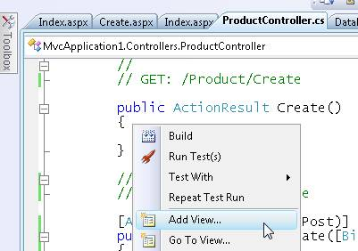
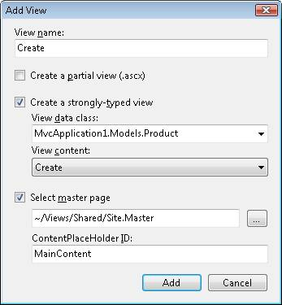
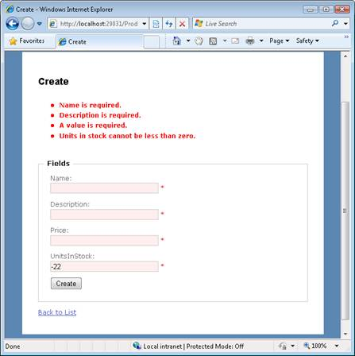

Performing Simple Validation (C#)
====================
by [Stephen Walther](https://github.com/StephenWalther)

> Learn how to perform validation in an ASP.NET MVC application. In this tutorial, Stephen Walther introduces you to model state and the validation HTML helpers.

The goal of this tutorial is to explain how you can perform validation within an ASP.NET MVC application. For example, you learn how to prevent someone from submitting a form that does not contain a value for a required field. You learn how to use model state and the validation HTML helpers.

## Understanding Model State

You use model state - or more accurately, the model state dictionary - to represent validation errors. For example, the Create() action in Listing 1 validates the properties of a Product class before adding the Product class to a database.

I'm not recommending that you add your validation or database logic to a controller. A controller should contain only logic related to application flow control. We are taking a shortcut to keep things simple.

**Listing 1 - Controllers\ProductController.cs**

[!code-csharp[Main](performing-simple-validation-cs/samples/sample1.cs)]

In Listing 1, the Name, Description, and UnitsInStock properties of the Product class are validated. If any of these properties fail a validation test then an error is added to the model state dictionary (represented by the ModelState property of the Controller class).

If there are any errors in model state then the ModelState.IsValid property returns false. In that case, the HTML form for creating a new product is redisplayed. Otherwise, if there are no validation errors, the new Product is added to the database.

## Using the Validation Helpers

The ASP.NET MVC framework includes two validation helpers: the Html.ValidationMessage() helper and the Html.ValidationSummary() helper. You use these two helpers in a view to display validation error messages.

The Html.ValidationMessage() and Html.ValidationSummary() helpers are used in the Create and Edit views that are generated automatically by the ASP.NET MVC scaffolding. Follow these steps to generate the Create view:

1. Right-click the Create() action in the Product controller and select the menu option **Add View** (see Figure 1).
2. In the **Add View** dialog, check the checkbox labeled **Create a strongly-typed view** (see Figure 2).
3. From the **View data class** dropdown list, select the Product class.
4. From the **View content** dropdown list, select Create.
5. Click the **Add** button.

Make sure that you build your application before adding a view. Otherwise, the list of classes won't appear in the **View data class** dropdown list.

**Figure 01**: Adding a view([Click to view full-size image](performing-simple-validation-cs/_static/image2.png))

**Figure 02**: Creating a strongly-typed view ([Click to view full-size image](performing-simple-validation-cs/_static/image4.png))

After you complete these steps, you get the Create view in Listing 2.

**Listing 2 - Views\Product\Create.aspx**

[!code-aspx[Main](performing-simple-validation-cs/samples/sample2.aspx)]

In Listing 2, the Html.ValidationSummary() helper is called immediately above the HTML form. This helper is used to display a list of validation error messages. The Html.ValidationSummary() helper renders the errors in a bulleted list.

The Html.ValidationMessage() helper is called next to each of the HTML form fields. This helper is used to display an error message right next to a form field. In the case of Listing 2, the Html.ValidationMessage() helper displays an asterisk when there is an error.

The page in Figure 3 illustrates the error messages rendered by the validation helpers when the form is submitted with missing fields and invalid values.

**Figure 03**: The Create view submitted with problems ([Click to view full-size image](performing-simple-validation-cs/_static/image6.png))

Notice that the appearance of the HTML input fields are also modified when there is a validation error. The Html.TextBox() helper renders a *class="input-validation-error"* attribute when there is a validation error associated with the property rendered by the Html.TextBox() helper.

There are three cascading style sheet classes used to control the appearance of validation errors:

- input-validation-error - Applied to the &lt;input&gt; tag rendered by Html.TextBox() helper.
- field-validation-error - Applied to the &lt;span&gt; tag rendered by the Html.ValidationMessage() helper.
- validation-summary-errors - Applied to the &lt;ul&gt; tag rendered by the Html.ValidationSumamry() helper.

You can modify these cascading style sheet classes, and therefore modify the appearance of the validation errors, by modifying the Site.css file located in the Content folder.

> [!NOTE] 
> 
> The HtmlHelper class includes read-only static properties for retrieving the names of the validation related CSS classes. These static properties are named ValidationInputCssClassName, ValidationFieldCssClassName, and ValidationSummaryCssClassName.

## Prebinding Validation and Postbinding Validation

If you submit the HTML form for creating a Product, and you enter an invalid value for the price field and no value for the UnitsInStock field, then you'll get the validation messages displayed in Figure 4. Where do these validation error messages come from?

**Figure 04**: Prebinding Validation Errors([Click to view full-size image](performing-simple-validation-cs/_static/image8.png))

There are actually two types of validation error messages - those generated before the HTML form fields are bound to a class and those generated after the form fields are bound to the class. In other words, there are prebinding validation errors and postbinding validation errors.

The Create() action exposed by the Product controller in Listing 1 accepts an instance of the Product class. The signature of the Create method looks like this:

[!code-csharp[Main](performing-simple-validation-cs/samples/sample3.cs)]

The values of the HTML form fields from the Create form are bound to the productToCreate class by something called a model binder. The default model binder adds an error message to model state automatically when it cannot bind a form field to a form property.

The default model binder cannot bind the string "apple" to the Price property of the Product class. You can't assign a string to a decimal property. Therefore, the model binder adds an error to model state.

The default model binder also cannot assign a null value to a property that does not accept nulls. In particular, the model binder cannot assign a null value to the UnitsInStock property. Once again, the model binder gives up and adds an error message to model state.

If you want to customize the appearance of these prebinding error messages then you need to create resource strings for these messages.

## Summary

The goal of this tutorial was to describe the basic mechanics of validation in the ASP.NET MVC framework. You learned how to use model state and the validation HTML helpers. We also discussed the distinction between prebinding and postbinding validation. In other tutorials, we'll discuss various strategies for moving your validation code out of your controllers and into your model classes.

>[!div class="step-by-step"]
[Previous](displaying-a-table-of-database-data-cs.md)
[Next](validating-with-the-idataerrorinfo-interface-cs.md)