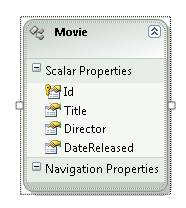
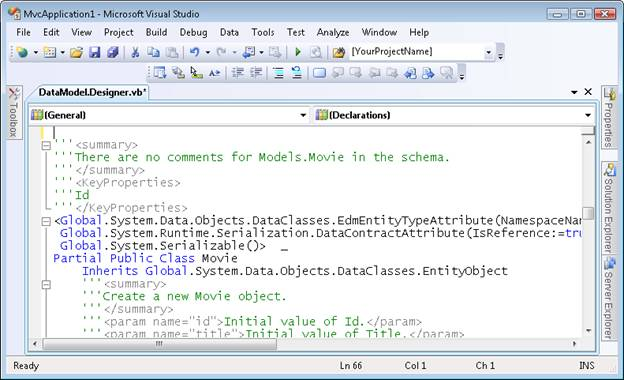

Validating with the IDataErrorInfo Interface (VB)
====================
by [Stephen Walther](https://github.com/StephenWalther)

> Stephen Walther shows you how to display custom validation error messages by implementing the IDataErrorInfo interface in a model class.

The goal of this tutorial is to explain one approach to performing validation in an ASP.NET MVC application. You learn how to prevent someone from submitting an HTML form without providing values for required form fields. In this tutorial, you learn how to perform validation by using the IErrorDataInfo interface.

## Assumptions

In this tutorial, I'll use the MoviesDB database and the Movies database table. This table has the following columns:

| **Column Name** | **Data Type** | **Allow Nulls** |
| --- | --- | --- |
| Id | Int | False |
| Title | Nvarchar(100) | False |
| Director | Nvarchar(100) | False |
| DateReleased | DateTime | False |

In this tutorial, I use the Microsoft Entity Framework to generate my database model classes. The Movie class generated by the Entity Framework is displayed in Figure 1.

**Figure 01**: The Movie entity([Click to view full-size image](validating-with-the-idataerrorinfo-interface-vb/_static/image2.png))

> [!NOTE] 
> 
> To learn more about using the Entity Framework to generate your database model classes, see my tutorial entitled Creating Model Classes with the Entity Framework.

## The Controller Class

We use the Home controller to list movies and create new movies. The code for this class is contained in Listing 1.

**Listing 1 - Controllers\HomeController.vb**

[!code-vb[Main](validating-with-the-idataerrorinfo-interface-vb/samples/sample1.vb)]

The Home controller class in Listing 1 contains two Create() actions. The first action displays the HTML form for creating a new movie. The second Create() action performs the actual insert of the new movie into the database. The second Create() action is invoked when the form displayed by the first Create() action is submitted to the server.

Notice that the second Create() action contains the following lines of code:

[!code-vb[Main](validating-with-the-idataerrorinfo-interface-vb/samples/sample2.vb)]

The IsValid property returns false when there is a validation error. In that case, the Create view that contains the HTML form for creating a movie is redisplayed.

## Creating a Partial Class

The Movie class is generated by the Entity Framework. You can see the code for the Movie class if you expand the MoviesDBModel.edmx file in the Solution Explorer window and open the MoviesDBModel.Designer.vb file in the Code Editor (see Figure 2).

**Figure 02**: The code for the Movie entity([Click to view full-size image](validating-with-the-idataerrorinfo-interface-vb/_static/image4.png))

The Movie class is a partial class. That means that we can add another partial class with the same name to extend the functionality of the Movie class. We'll add our validation logic to the new partial class.

Add the class in Listing 2 to the Models folder.

**Listing 2 - Models\Movie.vb**

[!code-vb[Main](validating-with-the-idataerrorinfo-interface-vb/samples/sample3.vb)]

Notice that the class in Listing 2 includes the *partial* modifier. Any methods or properties that you add to this class become part of the Movie class generated by the Entity Framework.

## Adding OnChanging and OnChanged Partial Methods

When the Entity Framework generates an entity class, the Entity Framework adds partial methods to the class automatically. The Entity Framework generates OnChanging and OnChanged partial methods that correspond to each property of the class.

In the case of the Movie class, the Entity Framework creates the following methods:

- OnIdChanging
- OnIdChanged
- OnTitleChanging
- OnTitleChanged
- OnDirectorChanging
- OnDirectorChanged
- OnDateReleasedChanging
- OnDateReleasedChanged

The OnChanging method is called right before the corresponding property is changed. The OnChanged method is called right after the property is changed.

You can take advantage of these partial methods to add validation logic to the Movie class. The update Movie class in Listing 3 verifies that the Title and Director properties are assigned nonempty values.

> [!NOTE] 
> 
> A partial method is a method defined in a class that you are not required to implement. If you don't implement a partial method then the compiler removes the method signature and all calls to the method so there are no run-time costs associated with the partial method. In the Visual Studio Code Editor, you can add a partial method by typing the keyword *partial* followed by a space to view a list of partials to implement.

**Listing 3 - Models\Movie.vb**

[!code-vb[Main](validating-with-the-idataerrorinfo-interface-vb/samples/sample4.vb)]

For example, if you attempt to assign an empty string to the Title property, then an error message is assigned to a Dictionary named \_errors.

At this point, nothing actually happens when you assign an empty string to the Title property and an error is added to the private \_errors field. We need to implement the IDataErrorInfo interface to expose these validation errors to the ASP.NET MVC framework.

## Implementing the IDataErrorInfo Interface

The IDataErrorInfo interface has been part of the .NET framework since the first version. This interface is a very simple interface:

[!code-vb[Main](validating-with-the-idataerrorinfo-interface-vb/samples/sample5.vb)]

If a class implements the IDataErrorInfo interface, the ASP.NET MVC framework will use this interface when creating an instance of the class. For example, the Home controller Create() action accepts an instance of the Movie class:

[!code-vb[Main](validating-with-the-idataerrorinfo-interface-vb/samples/sample6.vb)]

The ASP.NET MVC framework creates the instance of the Movie passed to the Create() action by using a model binder (the DefaultModelBinder). The model binder is responsible for creating an instance of the Movie object by binding the HTML form fields to an instance of the Movie object.

The DefaultModelBinder detects whether or not a class implements the IDataErrorInfo interface. If a class implements this interface then the model binder invokes the IDataErrorInfo.this indexer for each property of the class. If the indexer returns an error message then the model binder adds this error message to model state automatically.

The DefaultModelBinder also checks the IDataErrorInfo.Error property. This property is intended to represent non-property specific validation errors associated with the class. For example, you might want to enforce a validation rule that depends on the values of multiple properties of the Movie class. In that case, you would return a validation error from the Error property.

The updated Movie class in Listing 4 implements the IDataErrorInfo interface.

**Listing 4 - Models\Movie.vb (implements IDataErrorInfo)**

[!code-vb[Main](validating-with-the-idataerrorinfo-interface-vb/samples/sample7.vb)]

In Listing 4, the indexer property checks the \_errors collection to see if it contains a key that corresponds to the property name passed to the indexer. If there is no validation error associated with the property then an empty string is returned.

You don't need to modify the Home controller in any way to use the modified Movie class. The page displayed in Figure 3 illustrates what happens when no value is entered for the Title or Director form fields.

**Figure 03**: A form with missing values ([Click to view full-size image](validating-with-the-idataerrorinfo-interface-vb/_static/image6.png))

Notice that the DateReleased value is validated automatically. Because the DateReleased property does not accept NULL values, the DefaultModelBinder generates a validation error for this property automatically when it does not have a value. If you want to modify the error message for the DateReleased property then you need to create a custom model binder.

## Summary

In this tutorial, you learned how to use the IDataErrorInfo interface to generate validation error messages. First, we created a partial Movie class that extends the functionality of the partial Movie class generated by the Entity Framework. Next, we added validation logic to the Movie class OnTitleChanging() and OnDirectorChanging() partial methods. Finally, we implemented the IDataErrorInfo interface in order to expose these validation messages to the ASP.NET MVC framework.

>[!div class="step-by-step"]
[Previous](performing-simple-validation-vb.md)
[Next](validating-with-a-service-layer-vb.md)