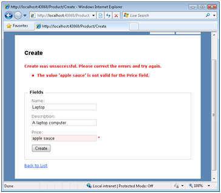

Validation with the Data Annotation Validators (VB)
====================
by [Microsoft](https://github.com/microsoft)

> Take advantage of the Data Annotation Model Binder to perform validation within an ASP.NET MVC application. Learn how to use the different types of validator attributes and work with them in the Microsoft Entity Framework.

In this tutorial, you learn how to use the Data Annotation validators to perform validation in an ASP.NET MVC application. The advantage of using the Data Annotation validators is that they enable you to perform validation simply by adding one or more attributes – such as the Required or StringLength attribute – to a class property.

Before you can use the Data Annotation validators, you must download the Data Annotations Model Binder. You can download the Data Annotations Model Binder Sample from the CodePlex website by clicking [here](http://aspnet.codeplex.com/Release/ProjectReleases.aspx?ReleaseId=24471).

It is important to understand that the Data Annotations Model Binder is not an official part of the Microsoft ASP.NET MVC framework. Although the Data Annotations Model Binder was created by the Microsoft ASP.NET MVC team, Microsoft does not offer official product support for the Data Annotations Model Binder described and used in this tutorial.

## Using the Data Annotation Model Binder

In order to use the Data Annotations Model Binder in an ASP.NET MVC application, you first need to add a reference to the Microsoft.Web.Mvc.DataAnnotations.dll assembly and the System.ComponentModel.DataAnnotations.dll assembly. Select the menu option **Project, Add Reference**. Next click the **Browse** tab and browse to the location where you downloaded (and unzipped) the Data Annotations Model Binder sample (see **Figure 1**).

**Figure 1**: Adding a reference to the Data Annotations Model Binder ([Click to view full-size image](validation-with-the-data-annotation-validators-vb/_static/image3.png))

Select both the Microsoft.Web.Mvc.DataAnnotations.dll assembly and the System.ComponentModel.DataAnnotations.dll assembly and click the **OK** button.

You cannot use the System.ComponentModel.DataAnnotations.dll assembly included with .NET Framework Service Pack 1 with the Data Annotations Model Binder. You must use the version of the System.ComponentModel.DataAnnotations.dll assembly included with the Data Annotations Model Binder Sample download.

Finally, you need to register the DataAnnotations Model Binder in the Global.asax file. Add the following line of code to the Application\_Start() event handler so that the Application\_Start() method looks like this:

[!code-vb[Main](validation-with-the-data-annotation-validators-vb/samples/sample1.vb)]

This line of code registers the DataAnnotationsModelBinder as the default model binder for the entire ASP.NET MVC application.

## Using the Data Annotation Validator Attributes

When you use the Data Annotations Model Binder, you use validator attributes to perform validation. The System.ComponentModel.DataAnnotations namespace includes the following validator attributes:

- Range – Enables you to validate whether the value of a property falls between a specified range of values.
- ReqularExpression – Enables you to validate whether the value of a property matches a specified regular expression pattern.
- Required – Enables you to mark a property as required.
- StringLength – Enables you to specify a maximum length for a string property.
- Validation – The base class for all validator attributes.

> [!NOTE] 
> 
> If your validation needs are not satisfied by any of the standard validators then you always have the option of creating a custom validator attribute by inheriting a new validator attribute from the base Validation attribute.

The Product class in **Listing 1** illustrates how to use these validator attributes. The Name, Description, and UnitPrice properties are marked as required. The Name property must have a string length that is less than 10 characters. Finally, the UnitPrice property must match a regular expression pattern that represents a currency amount.

[!code-vb[Main](validation-with-the-data-annotation-validators-vb/samples/sample2.vb)]

**Listing 1**: Models\Product.vb

The Product class illustrates how to use one additional attribute: the DisplayName attribute. The DisplayName attribute enables you to modify the name of the property when the property is displayed in an error message. Instead of displaying the error message "The UnitPrice field is required" you can display the error message "The Price field is required".

> [!NOTE] 
> 
> If you want to completely customize the error message displayed by a validator then you can assign a custom error message to the validator's ErrorMessage property like this: `<Required(ErrorMessage:="This field needs a value!")>`

You can use the Product class in **Listing 1** with the Create() controller action in **Listing 2**. This controller action redisplays the Create view when model state contains any errors.

[!code-vb[Main](validation-with-the-data-annotation-validators-vb/samples/sample3.vb)]

**Listing 2**: Controllers\ProductController.vb

Finally, you can create the view in **Listing 3** by right-clicking the Create() action and selecting the menu option **Add View**. Create a strongly-typed view with the Product class as the model class. Select **Create** from the view content dropdown list (see **Figure 2**).

**Figure 2**: Adding the Create View

[!code-aspx[Main](validation-with-the-data-annotation-validators-vb/samples/sample4.aspx)]

**Listing 3**: Views\Product\Create.aspx

> [!NOTE] 
> 
> Remove the Id field from the Create form generated by the **Add View** menu option. Because the Id field corresponds to an Identity column, you don't want to allow users to enter a value for this field.

If you submit the form for creating a Product and you do not enter values for the required fields, then the validation error messages in **Figure 3** are displayed.

**Figure 3**: Missing required fields

If you enter an invalid currency amount, then the error message in **Figure 4** is displayed.

**Figure 4**: Invalid currency amount

## Using Data Annotation Validators with the Entity Framework

If you are using the Microsoft Entity Framework to generate your data model classes then you cannot apply the validator attributes directly to your classes. Because the Entity Framework Designer generates the model classes, any changes you make to the model classes will be overwritten the next time you make any changes in the Designer.

If you want to use the validators with the classes generated by the Entity Framework then you need to create meta data classes. You apply the validators to the meta data class instead of applying the validators to the actual class.

For example, imagine that you have created a Movie class using the Entity Framework (see **Figure 5**). Imagine, furthermore, that you want to make the Movie Title and Director properties required properties. In that case, you can create the partial class and meta data class in **Listing 4**.

**Figure 5**: Movie class generated by Entity Framework

[!code-vb[Main](validation-with-the-data-annotation-validators-vb/samples/sample5.vb)]

**Listing 4**: Models\Movie.vb

The file in **Listing 4** contains two classes named Movie and MovieMetaData. The Movie class is a partial class. It corresponds to the partial class generated by the Entity Framework that is contained in the DataModel.Designer.vb file.

Currently, the .NET framework does not support partial properties. Therefore, there is no way to apply the validator attributes to the properties of the Movie class defined in the DataModel.Designer.vb file by applying the validator attributes to the properties of the Movie class defined in the file in **Listing 4**.

Notice that the Movie partial class is decorated with a MetadataType attribute that points at the MovieMetaData class. The MovieMetaData class contains proxy properties for the properties of the Movie class.

The validator attributes are applied to the properties of the MovieMetaData class. The Title, Director, and DateReleased properties are all marked as required properties. The Director property must be assigned a string that contains less than 5 characters. Finally, the DisplayName attribute is applied to the DateReleased property to display an error message like "The Date Released field is required." instead of the error "The DateReleased field is required."

> [!NOTE] 
> 
> Notice that the proxy properties in the MovieMetaData class do not need to represent the same types as the corresponding properties in the Movie class. For example, the Director property is a string property in the Movie class and an object property in the MovieMetaData class.

The page in **Figure 6** illustrates the error messages returned when you enter invalid values for the Movie properties.

**Figure 6**: Using validators with the Entity Framework ([Click to view full-size image](validation-with-the-data-annotation-validators-vb/_static/image14.png))

## Summary

In this tutorial, you learned how to take advantage of the Data Annotation Model Binder to perform validation within an ASP.NET MVC application. You learned how to use the different types of validator attributes such as the Required and StringLength attributes. You also learned how to use these attributes when working with the Microsoft Entity Framework.

>[!div class="step-by-step"]
[Previous](validating-with-a-service-layer-vb.md)