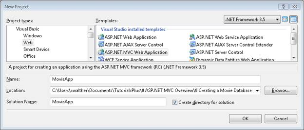
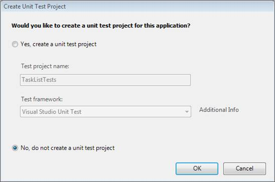
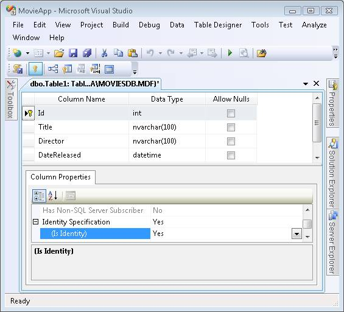
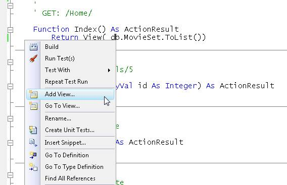
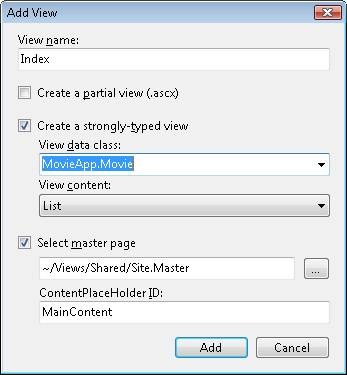
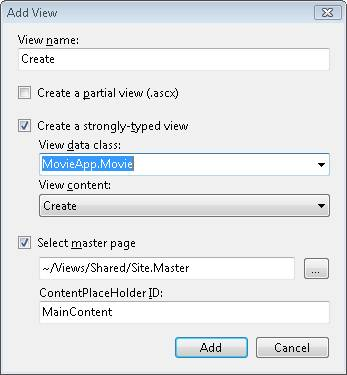
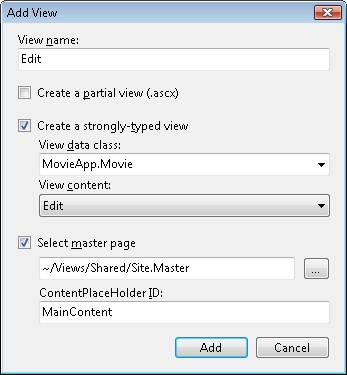

Create a Movie Database Application in 15 Minutes with ASP.NET MVC (VB)
====================
by [Stephen Walther](https://github.com/StephenWalther)

[Download Code](http://download.microsoft.com/download/7/2/8/728F8794-E59A-4D18-9A56-7AD2DB05BD9D/MovieApp_VB.zip)

> Stephen Walther builds an entire database-driven ASP.NET MVC application from start to finish. This tutorial is a great introduction for people who are new to the ASP.NET MVC Framework and who want to get a sense of the process of building an ASP.NET MVC application.

The purpose of this tutorial is to give you a sense of "what it is like" to build an ASP.NET MVC application. In this tutorial, I blast through building an entire ASP.NET MVC application from start to finish. I show you how to build a simple database-driven application that illustrates how you can list, create, and edit database records.

To simplify the process of building our application, we'll take advantage of the scaffolding features of Visual Studio 2008. We'll let Visual Studio generate the initial code and content for our controllers, models, and views.

If you have worked with Active Server Pages or ASP.NET, then you should find ASP.NET MVC very familiar. ASP.NET MVC views are very much like the pages in an Active Server Pages application. And, just like a traditional ASP.NET Web Forms application, ASP.NET MVC provides you with full access to the rich set of languages and classes provided by the .NET framework.

My hope is that this tutorial will give you a sense of how the experience of building an ASP.NET MVC application is both similar and different than the experience of building an Active Server Pages or ASP.NET Web Forms application.

## Overview of the Movie Database Application

Because our goal is to keep things simple, we'll build a very simple Movie Database application. Our simple Movie Database application will allow us to do three things:

1. List a set of movie database records
2. Create a new movie database record
3. Edit an existing movie database record

Again, because we want to keep things simple, we'll take advantage of the minimum number of features of the ASP.NET MVC framework needed to build our application. For example, we won't be taking advantage of Test-Driven Development.

In order to create our application, we need to complete each of the following steps:

1. Create the ASP.NET MVC Web Application Project
2. Create the database
3. Create the database model
4. Create the ASP.NET MVC controller
5. Create the ASP.NET MVC views

## Preliminaries

You'll need either Visual Studio 2008 or Visual Web Developer 2008 Express to build an ASP.NET MVC application. You also need to download the ASP.NET MVC framework.

If you don't own Visual Studio 2008, then you can download a 90 day trial version of Visual Studio 2008 from this website:

[https://msdn.microsoft.com/en-us/vs2008/products/cc268305.aspx](https://msdn.microsoft.com/en-us/vs2008/products/cc268305.aspx)

Alternatively, you can create ASP.NET MVC applications with Visual Web Developer Express 2008. If you decide to use Visual Web Developer Express then you must have Service Pack 1 installed. You can download Visual Web Developer 2008 Express with Service Pack 1 from this website:

[https://www.microsoft.com/downloads/details.aspx?FamilyId=BDB6391C-05CA-4036-9154-6DF4F6DEBD14&amp;displaylang=en](https://www.microsoft.com/downloads/details.aspx?FamilyId=BDB6391C-05CA-4036-9154-6DF4F6DEBD14&amp;displaylang=en)

After you install either Visual Studio 2008 or Visual Web Developer 2008, you need to install the ASP.NET MVC framework. You can download the ASP.NET MVC framework from the following website:

[https://www.asp.net/mvc/](../../../index.md)

> [!NOTE] 
> 
> Instead of downloading the ASP.NET framework and the ASP.NET MVC framework individually, you can take advantage of the Web Platform Installer. The Web Platform Installer is an application that enables you to easily manage the installed applications are your computer:
> 
> [https://www.microsoft.com/web/gallery/Install.aspx](https://www.microsoft.com/web/gallery/Install.aspx)

## Creating an ASP.NET MVC Web Application Project

Let's start by creating a new ASP.NET MVC Web Application project in Visual Studio 2008. Select the menu option **File, New Project** and you will see the New Project dialog box in Figure 1. Select Visual Basic as the programming language and select the ASP.NET MVC Web Application project template. Give your project the name MovieApp and click the OK button.

**Figure 01**: The New Project dialog box ([Click to view full-size image](create-a-movie-database-application-in-15-minutes-with-asp-net-mvc-vb/_static/image2.png))

Make sure that you select .NET Framework 3.5 from the dropdown list at the top of the New Project dialog or the ASP.NET MVC Web Application project template won't appear.

Whenever you create a new MVC Web Application project, Visual Studio prompts you to create a separate unit test project. The dialog in Figure 2 appears. Because we won't be creating tests in this tutorial because of time constraints (and, yes, we should feel a little guilty about this) select the **No** option and click the **OK** button.

> [!NOTE] 
> 
> Visual Web Developer does not support test projects.

**Figure 02**: The Create Unit Test Project dialog ([Click to view full-size image](create-a-movie-database-application-in-15-minutes-with-asp-net-mvc-vb/_static/image4.png))

An ASP.NET MVC application has a standard set of folders: a Models, Views, and Controllers folder. You can see this standard set of folders in the Solution Explorer window. We'll need to add files to each of the Models, Views, and Controllers folders in order to build our Movie Database application.

When you create a new MVC application with Visual Studio, you get a sample application. Because we want to start from scratch, we need to delete the content for this sample application. You need to delete the following file and the following folder:

- Controllers\HomeController.vb
- Views\Home

## Creating the Database

We need to create a database to hold our movie database records. Luckily, Visual Studio includes a free database named SQL Server Express. Follow these steps to create the database:

1. Right-click the App\_Data folder in the Solution Explorer window and select the menu option **Add, New Item**.
2. Select the **Data** category and select the **SQL Server Database** template (see Figure 3).
3. Name your new database *MoviesDB.mdf* and click the **Add** button.

After you create your database, you can connect to the database by double-clicking the MoviesDB.mdf file located in the App\_Data folder. Double-clicking the MoviesDB.mdf file opens the Server Explorer window.

> [!NOTE] 
> 
> The Server Explorer window is named the Database Explorer window in the case of Visual Web Developer.

**Figure 03**: Creating a Microsoft SQL Server Database ([Click to view full-size image](create-a-movie-database-application-in-15-minutes-with-asp-net-mvc-vb/_static/image6.png))

Next, we need to create a new database table. From within the Sever Explorer window, right-click the Tables folder and select the menu option **Add New Table**. Selecting this menu option opens the database table designer. Create the following database columns:

| **Column Name** | **Data Type** | **Allow Nulls** |
| --- | --- | --- |
| Id | Int | False |
| Title | Nvarchar(100) | False |
| Director | Nvarchar(100) | False |
| DateReleased | DateTime | False |

The first column, the Id column, has two special properties. First, you need to mark the Id column as the primary key column. After selecting the Id column, click the **Set Primary Key** button (it is the icon that looks like a key). Second, you need to mark the Id column as an Identity column. In the Column Properties window, scroll down to the Identity Specification section and expand it. Change the **Is Identity** property to the value **Yes**. When you are finished, the table should look like Figure 4.

**Figure 04**: The Movies database table ([Click to view full-size image](create-a-movie-database-application-in-15-minutes-with-asp-net-mvc-vb/_static/image8.png))

The final step is to save the new table. Click the Save button (the icon of the floppy) and give the new table the name Movies.

After you finish creating the table, add some movie records to the table. Right-click the Movies table in the Server Explorer window and select the menu option **Show Table Data**. Enter a list of your favorite movies (see Figure 5).

**Figure 05**: Entering movie records ([Click to view full-size image](create-a-movie-database-application-in-15-minutes-with-asp-net-mvc-vb/_static/image10.png))

## Creating the Model

We next need to create a set of classes to represent our database. We need to create a database model. We'll take advantage of the Microsoft Entity Framework to generate the classes for our database model automatically.

> [!NOTE] 
> 
> The ASP.NET MVC framework is not tied to the Microsoft Entity Framework. You can create your database model classes by taking advantage of a variety of Object Relational Mapping (OR/M) tools including LINQ to SQL, Subsonic, and NHibernate.

Follow these steps to launch the Entity Data Model Wizard:

1. Right-click the Models folder in the Solution Explorer window and the select the menu option **Add, New Item**.
2. Select the **Data** category and select the **ADO.NET Entity Data Model** template.
3. Give your data model the name *MoviesDBModel.edmx* and click the **Add** button.

After you click the Add button, the Entity Data Model Wizard appears (see Figure 6). Follow these steps to complete the wizard:

1. In the **Choose Model Contents** step, select the **Generate from database** option.
2. In the **Choose Your Data Connection** step, use the *MoviesDB.mdf* data connection and the name *MoviesDBEntities* for the connection settings. Click the **Next** button.
3. In the **Choose Your Database Objects** step, expand the Tables node, select the Movies table. Enter the namespace *MovieApp.Models* and click the **Finish** button.

**Figure 06**: Generating a database model with the Entity Data Model Wizard ([Click to view full-size image](create-a-movie-database-application-in-15-minutes-with-asp-net-mvc-vb/_static/image12.png))

After you complete the Entity Data Model Wizard, the Entity Data Model Designer opens. The Designer should display the Movies database table (see Figure 7).

**Figure 07**: The Entity Data Model Designer ([Click to view full-size image](create-a-movie-database-application-in-15-minutes-with-asp-net-mvc-vb/_static/image14.png))

We need to make one change before we continue. The Entity Data Wizard generates a model class named Movies that represents the Movies database table. Because we'll use the Movies class to represent a particular movie, we need to modify the name of the class to be *Movie* instead of *Movies* (singular rather than plural).

Double-click the name of the class on the designer surface and change the name of the class from Movies to Movie. After making this change, click the **Save** button (the icon of the floppy disk) to generate the Movie class.

## Creating the ASP.NET MVC Controller

The next step is to create the ASP.NET MVC controller. A controller is responsible for controlling how a user interacts with an ASP.NET MVC application.

Follow these steps:

1. In the Solution Explorer window, right-click the Controllers folder and select the menu option **Add, Controller**.
2. In the Add Controller dialog, enter the name *HomeController* and check the checkbox labeled **Add action methods for Create, Update, and Details scenarios** (see Figure 8).
3. Click the **Add** button to add the new controller to your project.

After you complete these steps, the controller in Listing 1 is created. Notice that it contains methods named Index, Details, Create, and Edit. In the following sections, we'll add the necessary code to get these methods to work.

**Figure 08**: Adding a new ASP.NET MVC Controller ([Click to view full-size image](create-a-movie-database-application-in-15-minutes-with-asp-net-mvc-vb/_static/image16.png))

**Listing 1 – Controllers\HomeController.vb**

[!code-vb[Main](create-a-movie-database-application-in-15-minutes-with-asp-net-mvc-vb/samples/sample1.vb)]

## Listing Database Records

The Index() method of the Home controller is the default method for an ASP.NET MVC application. When you run an ASP.NET MVC application, the Index() method is the first controller method that is called.

We'll use the Index() method to display the list of records from the Movies database table. We'll take advantage of the database model classes that we created earlier to retrieve the movie database records with the Index() method.

I've modified the HomeController class in Listing 2 so that it contains a new private field named \_db. The MoviesDBEntities class represents our database model and we'll use this class to communicate with our database.

I've also modified the Index() method in Listing 2. The Index() method uses the MoviesDBEntities class to retrieve all of the movie records from the Movies database table. The expression *\_db.MovieSet.ToList()* returns a list of all of the movie records from the Movies database table.

The list of movies is passed to the view. Anything that gets passed to the View() method gets passed to the view as view data.

**Listing 2 – Controllers/HomeController.vb (modified Index method)**

[!code-vb[Main](create-a-movie-database-application-in-15-minutes-with-asp-net-mvc-vb/samples/sample2.vb)]

The Index() method returns a view named Index. We need to create this view to display the list of movie database records. Follow these steps:

You should build your project (select the menu option **Build, Build Solution**) before opening the **Add View** dialog or no classes will appear in the **View data class** dropdown list.

1. Right-click the Index() method in the code editor and select the menu option **Add View** (see Figure 9).
2. In the Add View dialog, verify that the checkbox labeled **Create a strongly-typed view** is checked.
3. From the **View content** dropdown list, select the value *List*.
4. From the **View data class** dropdown list, select the value *MovieApp.Movie*.
5. Click the Add button to create the new view (see Figure 10).

After you complete these steps, a new view named Index.aspx is added to the Views\Home folder. The contents of the Index view are included in Listing 3.

**Figure 09**: Adding a view from a controller action ([Click to view full-size image](create-a-movie-database-application-in-15-minutes-with-asp-net-mvc-vb/_static/image18.png))

**Figure 10**: Creating a new view with the Add View dialog ([Click to view full-size image](create-a-movie-database-application-in-15-minutes-with-asp-net-mvc-vb/_static/image20.png))

[!code-aspx[Main](create-a-movie-database-application-in-15-minutes-with-asp-net-mvc-vb/samples/sample3.aspx)]

The Index view displays all of the movie records from the Movies database table within an HTML table. The view contains a For Each loop that iterates through each movie represented by the ViewData.Model property. If you run your application by hitting the F5 key, then you'll see the web page in Figure 11.

**Figure 11**: The Index view ([Click to view full-size image](create-a-movie-database-application-in-15-minutes-with-asp-net-mvc-vb/_static/image22.png))

## Creating New Database Records

The Index view that we created in the previous section includes a link for creating new database records. Let's go ahead and implement the logic and create the view necessary for creating new movie database records.

The Home controller contains two methods named Create(). The first Create() method has no parameters. This overload of the Create() method is used to display the HTML form for creating a new movie database record.

The second Create() method has a FormCollection parameter. This overload of the Create() method is called when the HTML form for creating a new movie is posted to the server. Notice that this second Create() method has an AcceptVerbs attribute that prevents the method from being called unless an HTTP Post operation is performed.

This second Create() method has been modified in the updated HomeController class in Listing 4. The new version of the Create() method accepts a Movie parameter and contains the logic for inserting a new movie into the Movies database table.

> [!NOTE] 
> 
> Notice the Bind attribute. Because we don't want to update the Movie Id property from HTML form, we need to explicitly exclude this property.

**Listing 4 – Controllers\HomeController.vb (modified Create method)**

[!code-vb[Main](create-a-movie-database-application-in-15-minutes-with-asp-net-mvc-vb/samples/sample4.vb)]

Visual Studio makes it easy to create the form for creating a new movie database record (see Figure 12). Follow these steps:

1. Right-click the Create() method in the code editor and select the menu option **Add View**.
2. Verify that the checkbox labeled **Create a strongly-typed view** is checked.
3. From the **View content** dropdown list, select the value *Create*.
4. From the **View data class** dropdown list, select the value *MovieApp.Movie*.
5. Click the **Add** button to create the new view.

**Figure 12**: Adding the Create view ([Click to view full-size image](create-a-movie-database-application-in-15-minutes-with-asp-net-mvc-vb/_static/image24.png))

Visual Studio generates the view in Listing 5 automatically. This view contains an HTML form that includes fields that correspond to each of the properties of the Movie class.

**Listing 5 – Views\Home\Create.aspx**

[!code-aspx[Main](create-a-movie-database-application-in-15-minutes-with-asp-net-mvc-vb/samples/sample5.aspx)]

> [!NOTE] 
> 
> The HTML form generated by the Add View dialog generates an Id form field. Because the Id column is an Identity column, we don't need this form field and you can safely remove it.

After you add the Create view, you can add new Movie records to the database. Run your application by pressing the F5 key and click the Create New link to see the form in Figure 13. If you complete and submit the form, a new movie database record is created.

Notice that you get form validation automatically. If you neglect to enter a release date for a movie, or you enter an invalid release date, then the form is redisplayed and the release date field is highlighted.

**Figure 13**: Creating a new movie database record ([Click to view full-size image](create-a-movie-database-application-in-15-minutes-with-asp-net-mvc-vb/_static/image26.png))

## Editing Existing Database Records

In the previous sections, we discussed how you can list and create new database records. In this final section, we discuss how you can edit existing database records.

First, we need to generate the Edit form. This step is easy since Visual Studio will generate the Edit form for us automatically. Open the HomeController.vb class in the Visual Studio code editor and follow these steps:

1. Right-click the Edit() method in the code editor and select the menu option **Add View** (see Figure 14).
2. Check the checkbox labeled **Create a strongly-typed view**.
3. From the **View content** dropdown list, select the value *Edit*.
4. From the **View data class** dropdown list, select the value *MovieApp.Movie*.
5. Click the **Add** button to create the new view.

Completing these steps adds a new view named Edit.aspx to the Views\Home folder. This view contains an HTML form for editing a movie record.

**Figure 14**: Adding the Edit view ([Click to view full-size image](create-a-movie-database-application-in-15-minutes-with-asp-net-mvc-vb/_static/image28.png))

> [!NOTE] 
> 
> The Edit view contains an HTML form field that corresponds to the Movie Id property. Because you don't want people editing the value of the Id property, you should remove this form field.

Finally, we need to modify the Home controller so that it supports editing a database record. The updated HomeController class is contained in Listing 6.

**Listing 6 – Controllers\HomeController.vb (Edit methods)**

[!code-vb[Main](create-a-movie-database-application-in-15-minutes-with-asp-net-mvc-vb/samples/sample6.vb)]

In Listing 6, I've added additional logic to both overloads of the Edit() method. The first Edit() method returns the movie database record that corresponds to the Id parameter passed to the method. The second overload performs the updates to a movie record in the database.

Notice that you must retrieve the original movie, and then call ApplyPropertyChanges(), to update the existing movie in the database.

## Summary

The purpose of this tutorial was to give you a sense of the experience of building an ASP.NET MVC application. I hope that you discovered that building an ASP.NET MVC web application is very similar to the experience of building an Active Server Pages or ASP.NET application.

In this tutorial, we examined only the most basic features of the ASP.NET MVC framework. In future tutorials, we dive deeper into topics such as controllers, controller actions, views, view data, and HTML helpers.

>[!div class="step-by-step"]
[Previous](create-a-movie-database-application-in-15-minutes-with-asp-net-mvc-cs.md)