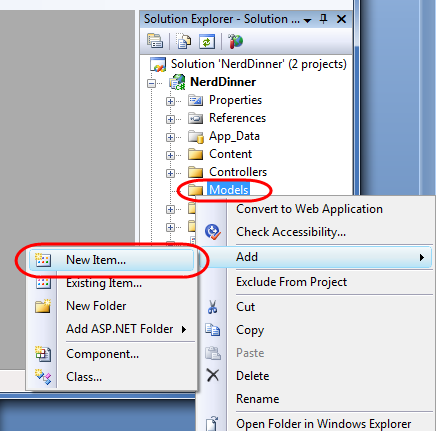
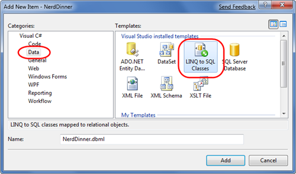
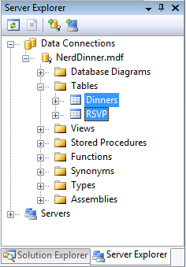
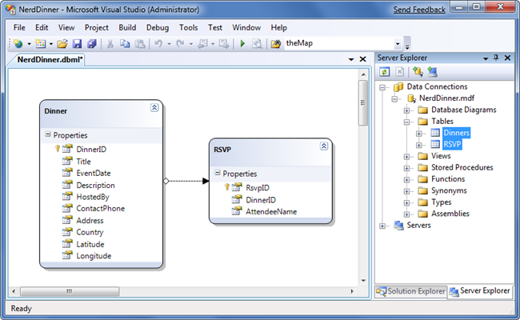
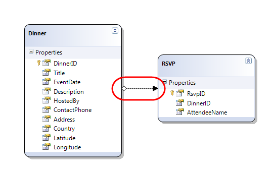
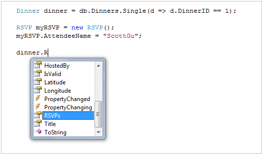
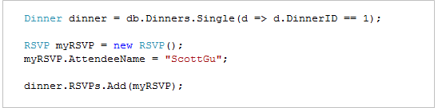
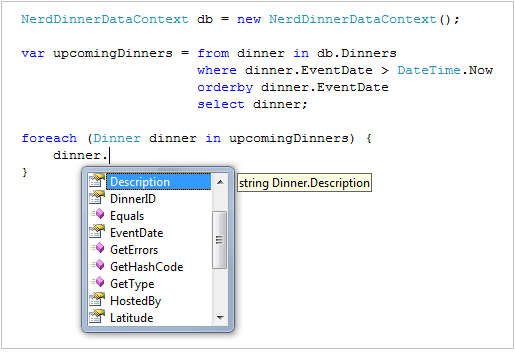
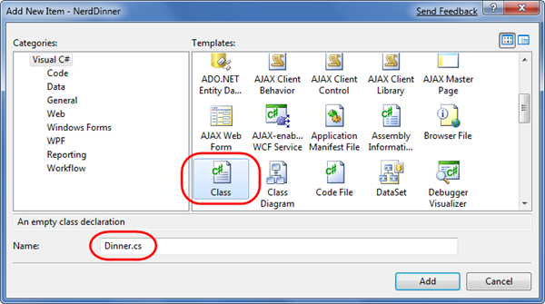

Build a Model with Business Rule Validations
====================
by [Microsoft](https://github.com/microsoft)

[Download PDF](http://aspnetmvcbook.s3.amazonaws.com/aspnetmvc-nerdinner_v1.pdf)

> This is step 3 of a free ["NerdDinner" application tutorial](introducing-the-nerddinner-tutorial.md) that walks-through how to build a small, but complete, web application using ASP.NET MVC 1.
> 
> Step 3 shows how to create a model that we can use to both query and update the database for our NerdDinner application.
> 
> If you are using ASP.NET MVC 3, we recommend you follow the [Getting Started With MVC 3](../../older-versions/getting-started-with-aspnet-mvc3/cs/intro-to-aspnet-mvc-3.md) or [MVC Music Store](../../older-versions/mvc-music-store/mvc-music-store-part-1.md) tutorials.

## NerdDinner Step 3: Building the Model

In a model-view-controller framework the term "model" refers to the objects that represent the data of the application, as well as the corresponding domain logic that integrates validation and business rules with it. The model is in many ways the "heart" of an MVC-based application, and as we'll see later fundamentally drives the behavior of it.

The ASP.NET MVC framework supports using any data access technology, and developers can choose from a variety of rich .NET data options to implement their models including: LINQ to Entities, LINQ to SQL, NHibernate, LLBLGen Pro, SubSonic, WilsonORM, or just raw ADO.NET DataReaders or DataSets.

For our NerdDinner application we are going to use LINQ to SQL to create a simple model that corresponds fairly closely to our database design, and adds some custom validation logic and business rules. We will then implement a repository class that helps abstract away the data persistence implementation from the rest of the application, and enables us to easily unit test it.

### LINQ to SQL

LINQ to SQL is an ORM (object relational mapper) that ships as part of .NET 3.5.

LINQ to SQL provides an easy way to map database tables to .NET classes we can code against. For our NerdDinner application we'll use it to map the Dinners and RSVP tables within our database to Dinner and RSVP classes. The columns of the Dinners and RSVP tables will correspond to properties on the Dinner and RSVP classes. Each Dinner and RSVP object will represent a separate row within the Dinners or RSVP tables in the database.

LINQ to SQL allows us to avoid having to manually construct SQL statements to retrieve and update Dinner and RSVP objects with database data. Instead, we'll define the Dinner and RSVP classes, how they map to/from the database, and the relationships between them. LINQ to SQL will then takes care of generating the appropriate SQL execution logic to use at runtime when we interact and use them.

We can use the LINQ language support within VB and C# to write expressive queries that retrieve Dinner and RSVP objects from the database. This minimizes the amount of data code we need to write, and allows us to build really clean applications.

### Adding LINQ to SQL Classes to our project

We'll begin by right-clicking on the "Models" folder within our project, and select the **Add-&gt;New Item** menu command:

This will bring up the "Add New Item" dialog. We'll filter by the "Data" category and select the "LINQ to SQL Classes" template within it:

We'll name the item "NerdDinner" and click the "Add" button. Visual Studio will add a NerdDinner.dbml file under our \Models directory, and then open the LINQ to SQL object relational designer:

### Creating Data Model Classes with LINQ to SQL

LINQ to SQL enables us to quickly create data model classes from existing database schema. To-do this we'll open the NerdDinner database in the Server Explorer, and select the Tables we want to model in it:

We can then drag the tables onto the LINQ to SQL designer surface. When we do this LINQ to SQL will automatically create Dinner and RSVP classes using the schema of the tables (with class properties that map to the database table columns):

By default the LINQ to SQL designer automatically "pluralizes" table and column names when it creates classes based on a database schema. For example: the "Dinners" table in our example above resulted in a "Dinner" class. This class naming helps make our models consistent with .NET naming conventions, and I usually find that having the designer fix this up convenient (especially when adding lots of tables). If you don't like the name of a class or property that the designer generates, though, you can always override it and change it to any name you want. You can do this either by editing the entity/property name in-line within the designer or by modifying it via the property grid.

By default the LINQ to SQL designer also inspects the primary key/foreign key relationships of the tables, and based on them automatically creates default "relationship associations" between the different model classes it creates. For example, when we dragged the Dinners and RSVP tables onto the LINQ to SQL designer a one-to-many relationship association between the two was inferred based on the fact that the RSVP table had a foreign-key to the Dinners table (this is indicated by the arrow in the designer):

The above association will cause LINQ to SQL to add a strongly typed "Dinner" property to the RSVP class that developers can use to access the Dinner associated with a given RSVP. It will also cause the Dinner class to have a "RSVPs" collection property that enables developers to retrieve and update RSVP objects associated with a particular Dinner.

Below you can see an example of intellisense within Visual Studio when we create a new RSVP object and add it to a Dinner's RSVPs collection. Notice how LINQ to SQL automatically added a "RSVPs" collection on the Dinner object:

By adding the RSVP object to the Dinner's RSVPs collection we are telling LINQ to SQL to associate a foreign-key relationship between the Dinner and the RSVP row in our database:

If you don't like how the designer has modeled or named a table association, you can override it. Just click on the association arrow within the designer and access its properties via the property grid to rename, delete or modify it. For our NerdDinner application, though, the default association rules work well for the data model classes we are building and we can just use the default behavior.

### NerdDinnerDataContext Class

Visual Studio will automatically create .NET classes that represent the models and database relationships defined using the LINQ to SQL designer. A LINQ to SQL DataContext class is also generated for each LINQ to SQL designer file added to the solution. Because we named our LINQ to SQL class item "NerdDinner", the DataContext class created will be called "NerdDinnerDataContext". This NerdDinnerDataContext class is the primary way we will interact with the database.

Our NerdDinnerDataContext class exposes two properties - "Dinners" and "RSVPs" - that represent the two tables we modeled within the database. We can use C# to write LINQ queries against those properties to query and retrieve Dinner and RSVP objects from the database.

The following code demonstrates how to instantiate a NerdDinnerDataContext object and perform a LINQ query against it to obtain a sequence of Dinners that occur in the future. Visual Studio provides full intellisense when writing the LINQ query, and the objects returned from it are strongly-typed and also support intellisense:

In addition to allowing us to query for Dinner and RSVP objects, a NerdDinnerDataContext also automatically tracks any changes we subsequently make to the Dinner and RSVP objects we retrieve through it. We can use this functionality to easily save the changes back to the database - without having to write any explicit SQL update code.

For example, the code below demonstrates how to use a LINQ query to retrieve a single Dinner object from the database, update two of the Dinner properties, and then save the changes back to the database:

[!code-csharp[Main](build-a-model-with-business-rule-validations/samples/sample1.cs)]

The NerdDinnerDataContext object in the code above automatically tracked the property changes made to the Dinner object we retrieved from it. When we called the "SubmitChanges()" method, it will execute an appropriate SQL "UPDATE" statement to the database to persist the updated values back.

### Creating a DinnerRepository Class

For small applications it is sometimes fine to have Controllers work directly against a LINQ to SQL DataContext class, and embed LINQ queries within the Controllers. As applications get larger, though, this approach becomes cumbersome to maintain and test. It can also lead to us duplicating the same LINQ queries in multiple places.

One approach that can make applications easier to maintain and test is to use a "repository" pattern. A repository class helps encapsulate data querying and persistence logic, and abstracts away the implementation details of the data persistence from the application. In addition to making application code cleaner, using a repository pattern can make it easier to change data storage implementations in the future, and it can help facilitate unit testing an application without requiring a real database.

For our NerdDinner application we'll define a DinnerRepository class with the below signature:

[!code-csharp[Main](build-a-model-with-business-rule-validations/samples/sample2.cs)]

*Note: Later in this chapter we'll extract an IDinnerRepository interface from this class and enable dependency injection with it on our Controllers. To begin with, though, we are going to start simple and just work directly with the DinnerRepository class.*

To implement this class we'll right-click on our "Models" folder and choose the **Add-&gt;New Item** menu command. Within the "Add New Item" dialog we'll select the "Class" template and name the file "DinnerRepository.cs":

We can then implement our DinnerRespository class using the code below:

[!code-csharp[Main](build-a-model-with-business-rule-validations/samples/sample3.cs)]

### Retrieving, Updating, Inserting and Deleting using the DinnerRepository class

Now that we've created our DinnerRepository class, let's look at a few code examples that demonstrate common tasks we can do with it:

#### Querying Examples

The code below retrieves a single Dinner using the DinnerID value:

[!code-csharp[Main](build-a-model-with-business-rule-validations/samples/sample4.cs)]

The code below retrieves all upcoming dinners and loops over them:

[!code-csharp[Main](build-a-model-with-business-rule-validations/samples/sample5.cs)]

#### Insert and Update Examples

The code below demonstrates adding two new dinners. Additions/modifications to the repository aren't committed to the database until the "Save()" method is called on it. LINQ to SQL automatically wraps all changes in a database transaction – so either all changes happen or none of them do when our repository saves:

[!code-csharp[Main](build-a-model-with-business-rule-validations/samples/sample6.cs)]

The code below retrieves an existing Dinner object, and modifies two properties on it. The changes are committed back to the database when the "Save()" method is called on our repository:

[!code-csharp[Main](build-a-model-with-business-rule-validations/samples/sample7.cs)]

The code below retrieves a dinner and then adds an RSVP to it. It does this using the RSVPs collection on the Dinner object that LINQ to SQL created for us (because there is a primary-key/foreign-key relationship between the two in the database). This change is persisted back to the database as a new RSVP table row when the "Save()" method is called on the repository:

[!code-csharp[Main](build-a-model-with-business-rule-validations/samples/sample8.cs)]

#### Delete Example

The code below retrieves an existing Dinner object, and then marks it to be deleted. When the "Save()" method is called on the repository it will commit the delete back to the database:

[!code-csharp[Main](build-a-model-with-business-rule-validations/samples/sample9.cs)]

### Integrating Validation and Business Rule Logic with Model Classes

Integrating validation and business rule logic is a key part of any application that works with data.

#### Schema Validation

When model classes are defined using the LINQ to SQL designer, the datatypes of the properties in the data model classes correspond to the datatypes of the database table. For example: if the "EventDate" column in the Dinners table is a "datetime", the data model class created by LINQ to SQL will be of type "DateTime" (which is a built-in .NET datatype). This means you will get compile errors if you attempt to assign an integer or boolean to it from code, and it will raise an error automatically if you attempt to implicitly convert a non-valid string type to it at runtime.

LINQ to SQL will also automatically handles escaping SQL values for you when using strings - which helps protect you against SQL injection attacks when using it.

#### Validation and Business Rule Logic

Schema validation is useful as a first step, but is rarely sufficient. Most real-world scenarios require the ability to specify richer validation logic that can span multiple properties, execute code, and often have awareness of a model's state (for example: is it being created /updated/deleted, or within a domain-specific state like "archived"). There are a variety of different patterns and frameworks that can be used to define and apply validation rules to model classes, and there are several .NET based frameworks out there that can be used to help with this. You can use pretty much any of them within ASP.NET MVC applications.

For the purposes of our NerdDinner application, we'll use a relatively simple and straight-forward pattern where we expose an IsValid property and a GetRuleViolations() method on our Dinner model object. The IsValid property will return true or false depending on whether the validation and business rules are all valid. The GetRuleViolations() method will return a list of any rule errors.

We'll implement IsValid and GetRuleViolations() for our Dinner model by adding a "partial class" to our project. Partial classes can be used to add methods/properties/events to classes maintained by a VS designer (like the Dinner class generated by the LINQ to SQL designer) and help avoid the tool from messing with our code. We can add a new partial class to our project by right-clicking on the \Models folder, and then select the "Add New Item" menu command. We can then choose the "Class" template within the "Add New Item" dialog and name it Dinner.cs.

Clicking the "Add" button will add a Dinner.cs file to our project and open it within the IDE. We can then implement a basic rule/validation enforcement framework using the below code:

[!code-csharp[Main](build-a-model-with-business-rule-validations/samples/sample10.cs)]

A few notes about the above code:

- The Dinner class is prefaced with a "partial" keyword – which means the code contained within it will be combined with the class generated/maintained by the LINQ to SQL designer and compiled into a single class.
- The RuleViolation class is a helper class we'll add to the project that allows us to provide more details about a rule violation.
- The Dinner.GetRuleViolations() method causes our validation and business rules to be evaluated (we'll implement them shortly). It then returns back a sequence of RuleViolation objects that provide more details about any rule errors.
- The Dinner.IsValid property provides a convenient helper property that indicates whether the Dinner object has any active RuleViolations. It can be proactively checked by a developer using the Dinner object at anytime (and does not raise an exception).
- The Dinner.OnValidate() partial method is a hook that LINQ to SQL provides that allows us to be notified anytime the Dinner object is about to be persisted within the database. Our OnValidate() implementation above ensures that the Dinner has no RuleViolations before it is saved. If it is in an invalid state it raises an exception, which will cause LINQ to SQL to abort the transaction.

This approach provides a simple framework that we can integrate validation and business rules into. For now let's add the below rules to our GetRuleViolations() method:

[!code-csharp[Main](build-a-model-with-business-rule-validations/samples/sample11.cs)]

We are using the "yield return" feature of C# to return a sequence of any RuleViolations. The first six rule checks above simply enforce that string properties on our Dinner cannot be null or empty. The last rule is a little more interesting, and calls a PhoneValidator.IsValidNumber() helper method that we can add to our project to verify that the ContactPhone number format matches the Dinner's country.

We can use .NET's regular expression support to implement this phone validation support. Below is a simple PhoneValidator implementation that we can add to our project that enables us to add country-specific Regex pattern checks:

[!code-csharp[Main](build-a-model-with-business-rule-validations/samples/sample12.cs)]

#### Handling Validation and Business Logic Violations

Now that we've added the above validation and business rule code, any time we try to create or update a Dinner, our validation logic rules will be evaluated and enforced.

Developers can write code like below to proactively determine if a Dinner object is valid, and retrieve a list of all violations in it without raising any exceptions:

[!code-csharp[Main](build-a-model-with-business-rule-validations/samples/sample13.cs)]

If we attempt to save a Dinner in an invalid state, an exception will be raised when we call the Save() method on the DinnerRepository. This occurs because LINQ to SQL automatically calls our Dinner.OnValidate() partial method before it saves the Dinner's changes, and we added code to Dinner.OnValidate() to raise an exception if any rule violations exist in the Dinner. We can catch this exception and reactively retrieve a list of the violations to fix:

[!code-csharp[Main](build-a-model-with-business-rule-validations/samples/sample14.cs)]

Because our validation and business rules are implemented within our model layer, and not within the UI layer, they will be applied and used across all scenarios within our application. We can later change or add business rules and have all code that works with our Dinner objects honor them.

Having the flexibility to change business rules in one place, without having these changes ripple throughout the application and UI logic, is a sign of a well-written application, and a benefit that an MVC framework helps encourage.

### Next Step

We've now got a model that we can use to both query and update our database.

Let's now add some controllers and views to the project that we can use to build an HTML UI experience around it.

>[!div class="step-by-step"]
[Previous](create-a-database.md)
[Next](use-controllers-and-views-to-implement-a-listingdetails-ui.md)