Create a Database
====================
by [Microsoft](https://github.com/microsoft)

[Download PDF](http://aspnetmvcbook.s3.amazonaws.com/aspnetmvc-nerdinner_v1.pdf)

> This is step 2 of a free ["NerdDinner" application tutorial](introducing-the-nerddinner-tutorial.md) that walks-through how to build a small, but complete, web application using ASP.NET MVC 1.
> 
> Step 2 shows the steps to create the database holding all of the dinner and RSVP data for our NerdDinner application.
> 
> If you are using ASP.NET MVC 3, we recommend you follow the [Getting Started With MVC 3](../../older-versions/getting-started-with-aspnet-mvc3/cs/intro-to-aspnet-mvc-3.md) or [MVC Music Store](../../older-versions/mvc-music-store/mvc-music-store-part-1.md) tutorials.

## NerdDinner Step 2: Creating the Database

We'll be using a database to store all of the Dinner and RSVP data for our NerdDinner application.

The steps below show creating the database using the free SQL Server Express edition (which you can easily install using V2 of the [Microsoft Web Platform Installer](https://www.microsoft.com/web/downloads/platform.aspx)). All of the code we'll write works with both SQL Server Express and the full SQL Server.

### Creating a new SQL Server Express database

We'll begin by right-clicking on our web project, and then select the **Add-&gt;New Item** menu command:

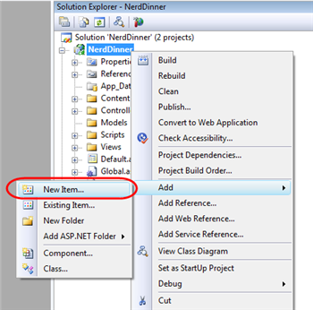

This will bring up Visual Studio's "Add New Item" dialog. We'll filter by the "Data" category and select the "SQL Server Database" item template:

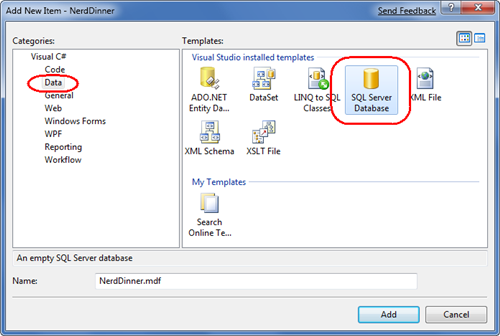

We'll name the SQL Server Express database we want to create "NerdDinner.mdf" and hit ok. Visual Studio will then ask us if we want to add this file to our \App\_Data directory (which is a directory already setup with both read and write security ACLs):

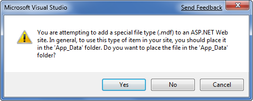

We'll click "Yes" and our new database will be created and added to our Solution Explorer:

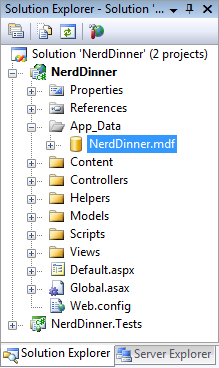

### Creating Tables within our Database

We now have a new empty database. Let's add some tables to it.

To do this we'll navigate to the "Server Explorer" tab window within Visual Studio, which enables us to manage databases and servers. SQL Server Express databases stored in the \App\_Data folder of our application will automatically show up within the Server Explorer. We can optionally use the "Connect to Database" icon on the top of the "Server Explorer" window to add additional SQL Server databases (both local and remote) to the list as well:

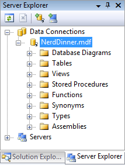

We will add two tables to our NerdDinner database – one to store our Dinners, and the other to track RSVP acceptances to them. We can create new tables by right-clicking on the "Tables" folder within our database and choosing the "Add New Table" menu command:

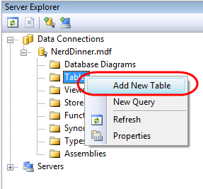

This will open up a table designer that allows us to configure the schema of our table. For our "Dinners" table we will add 10 columns of data:

We want the "DinnerID" column to be a unique primary key for the table. We can configure this by right-clicking on the "DinnerID" column and choosing the "Set Primary Key" menu item:

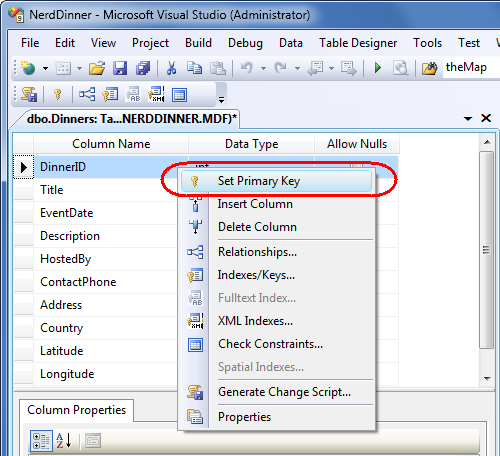

In addition to making DinnerID a primary key, we also want configure it as an "identity" column whose value is automatically incremented as new rows of data are added to the table (meaning the first inserted Dinner row will have a DinnerID of 1, the second inserted row will have a DinnerID of 2, etc).

We can do this by selecting the "DinnerID" column and then use the "Column Properties" editor to set the "(Is Identity)" property on the column to "Yes". We will use the standard identity defaults (start at 1 and increment 1 on each new Dinner row):

We'll then save our table by typing Ctrl-S or by using the **File-&gt;Save** menu command. This will prompt us to name the table. We'll name it "Dinners":

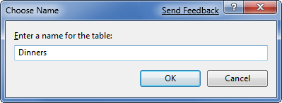

Our new Dinners table will then show up within our database in the server explorer.

We'll then repeat the above steps and create a "RSVP" table. This table with have 3 columns. We will setup the RsvpID column as the primary key, and also make it an identity column:

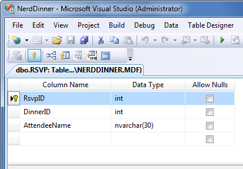

We'll save it and give it the name "RSVP".

### Setting up a Foreign Key Relationship between Tables

We now have two tables within our database. Our last schema design step will be to setup a "one-to-many" relationship between these two tables – so that we can associate each Dinner row with zero or more RSVP rows that apply to it. We will do this by configuring the RSVP table's "DinnerID" column to have a foreign-key relationship to the "DinnerID" column in the "Dinners" table.

To do this we'll open up the RSVP table within the table designer by double-clicking it in the server explorer. We'll then select the "DinnerID" column within it, right-click, and choose the "Relationshps…" context menu command:

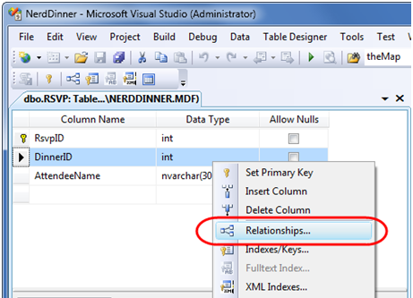

This will bring up a dialog that we can use to setup relationships between tables:

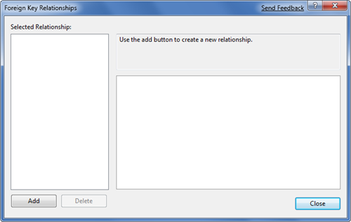

We'll click the "Add" button to add a new relationship to the dialog. Once a relationship has been added, we'll expand the "Tables and Column Specification" tree-view node within the property grid to the right of the dialog, and then click the "…" button to the right of it:

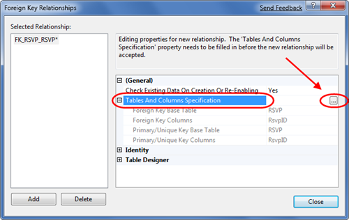

Clicking the "…" button will bring up another dialog that allows us to specify which tables and columns are involved in the relationship, as well as allow us to name the relationship.

We will change the Primary Key Table to be "Dinners", and select the "DinnerID" column within the Dinners table as the primary key. Our RSVP table will be the foreign-key table, and the RSVP.DinnerID column will be associated as the foreign-key:

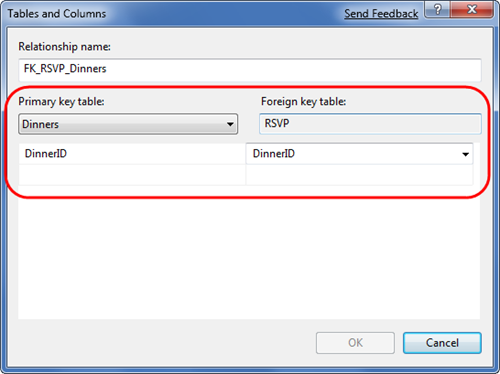

Now each row in the RSVP table will be associated with a row in the Dinner table. SQL Server will maintain referential integrity for us – and prevent us from adding a new RSVP row if it does not point to a valid Dinner row. It will also prevent us from deleting a Dinner row if there are still RSVP rows referring to it.

### Adding Data to our Tables

Let's finish by adding some sample data to our Dinners table. We can add data to a table by right-clicking on it within the Server Explorer and choosing the "Show Table Data" command:

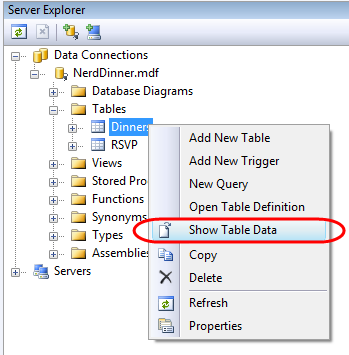

We'll add a few rows of Dinner data that we can use later as we start implementing the application:

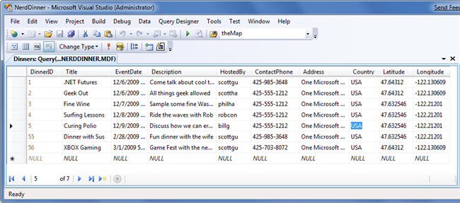

### Next Step

We've finished creating our database. Let's now create model classes that we can use to query and update it.

>[!div class="step-by-step"]
[Previous](create-a-new-aspnet-mvc-project.md)
[Next](build-a-model-with-business-rule-validations.md)