Create a New ASP.NET MVC Project
====================
by [Microsoft](https://github.com/microsoft)

[Download PDF](http://aspnetmvcbook.s3.amazonaws.com/aspnetmvc-nerdinner_v1.pdf)

> This is step 1 of a free ["NerdDinner" application tutorial](introducing-the-nerddinner-tutorial.md) that walks-through how to build a small, but complete, web application using ASP.NET MVC 1.
> 
> Step 1 shows you how to put the basic NerdDinner application structure in place.
> 
> If you are using ASP.NET MVC 3, we recommend you follow the [Getting Started With MVC 3](../../older-versions/getting-started-with-aspnet-mvc3/cs/intro-to-aspnet-mvc-3.md) or [MVC Music Store](../../older-versions/mvc-music-store/mvc-music-store-part-1.md) tutorials.

## NerdDinner Step 1: File-&gt;New Project

We'll begin our NerdDinner application by selecting the **File-&gt;New Project** menu item within either Visual Studio 2008 or the free Visual Web Developer 2008 Express.

This will bring up the "New Project" dialog. To create a new ASP.NET MVC application, we'll select the "Web" node on the left-hand side of the dialog and then choose the "ASP.NET MVC Web Application" project template on the right:

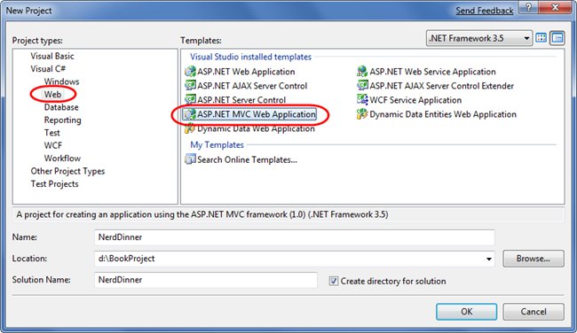

*Important: Make sure you've downloaded and installed ASP.NET MVC - otherwise it won't show up in the New Project dialog. You can use V2 of the [Microsoft Web Platform Installer](https://www.microsoft.com/web/downloads/platform.aspx) if you haven't installed it yet (ASP.NET MVC is available within the "Web Platform-&gt;Frameworks and Runtimes" section).*

We'll name the new project we are going to create "NerdDinner" and then click the "ok" button to create it.

When we click "ok" Visual Studio will bring up an additional dialog that prompts us to optionally create a unit test project for the new application as well. This unit test project enables us to create automated tests that verify the functionality and behavior of our application (something we'll cover how to-do later in this tutorial).

The "Test framework" dropdown in the above dialog is populated with all available ASP.NET MVC unit test project templates installed on the machine. Versions can be downloaded for NUnit, MBUnit, and XUnit. The built-in Visual Studio Unit Test framework is also supported.

*Note: The Visual Studio Unit Test Framework is only available with Visual Studio 2008 Professional and higher versions. If you are using VS 2008 Standard Edition or Visual Web Developer 2008 Express you will need to download and install the NUnit, MBUnit or XUnit extensions for ASP.NET MVC in order for this dialog to be shown. The dialog will not display if there aren't any test frameworks installed.*

We'll use the default "NerdDinner.Tests" name for the test project we create, and use the "Visual Studio Unit Test" framework option. When we click the "ok" button Visual Studio will create a solution for us with two projects in it - one for our web application and one for our unit tests:

### Examining the NerdDinner directory structure

When you create a new ASP.NET MVC application with Visual Studio, it automatically adds a number of files and directories to the project:

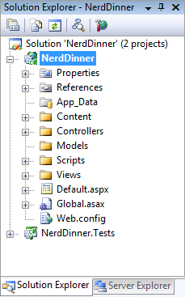

ASP.NET MVC projects by default have six top-level directories:

| **Directory** | **Purpose** |
| --- | --- |
| **/Controllers** | Where you put Controller classes that handle URL requests |
| **/Models** | Where you put classes that represent and manipulate data |
| **/Views** | Where you put UI template files that are responsible for rendering output |
| **/Scripts** | Where you put JavaScript library files and scripts (.js) |
| **/Content** | Where you put CSS and image files, and other non-dynamic/non-JavaScript content |
| **/App\_Data** | Where you store data files you want to read/write. |

ASP.NET MVC does not require this structure. In fact, developers working on large applications will typically partition the application up across multiple projects to make it more manageable (for example: data model classes often go in a separate class library project from the web application). The default project structure, however, does provide a nice default directory convention that we can use to keep our application concerns clean.

When we expand the /Controllers directory we'll find that Visual Studio added two controller classes – HomeController and AccountController – by default to the project:

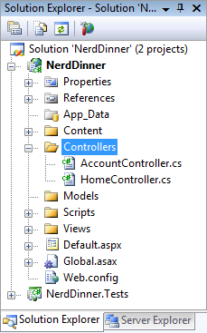

When we expand the /Views directory, we'll find three sub-directories – /Home, /Account and /Shared – as well as several template files within them were also added to the project by default:

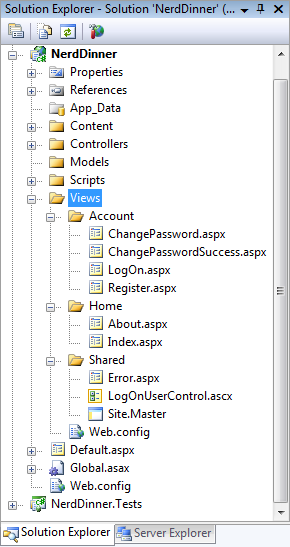

When we expand the /Content and /Scripts directories, we'll find a Site.css file that is used to style all HTML on the site, as well as JavaScript libraries that can enable ASP.NET AJAX and jQuery support within the application:

When we expand the NerdDinner.Tests project we'll find two classes that contain unit tests for our controller classes:

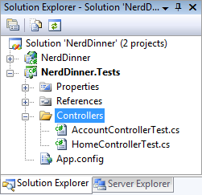

These default files added by Visual Studio provide us with a basic structure for a working application - complete with home page, about page, account login/logout/registration pages, and an unhandled error page (all wired-up and working out of the box).

### Running the NerdDinner Application

We can run the project by choosing either the **Debug-&gt;Start Debugging** or **Debug-&gt;Start Without Debugging** menu items:

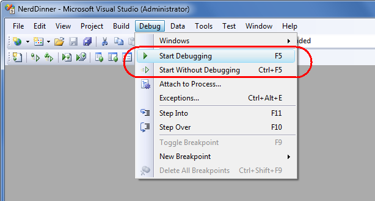

This will launch the built-in ASP.NET Web-server that comes with Visual Studio, and run our application:

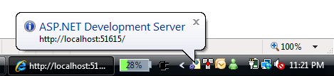

Below is the home page for our new project (URL: "/") when it runs:

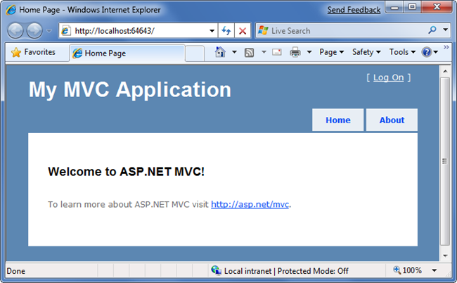

Clicking the "About" tab displays an about page (URL: "/Home/About"):

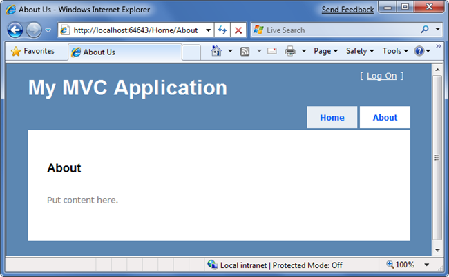

Clicking the "Log On" link on the top-right takes us to a Login page (URL: "/Account/LogOn")

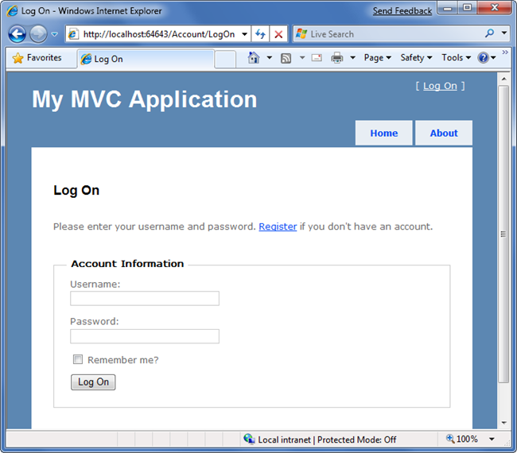

If we don't have a login account we can click the register link (URL: "/Account/Register") to create one:

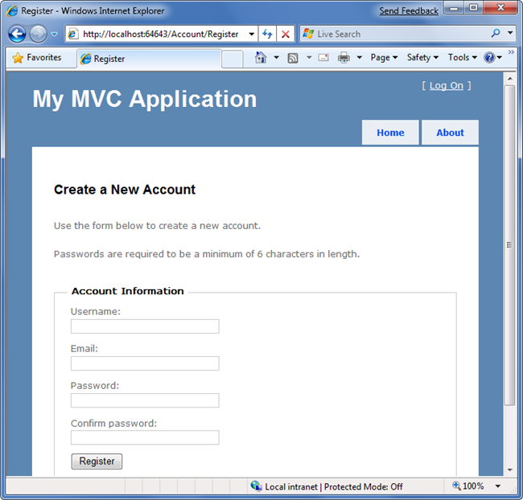

The code to implement the above home, about, and logout/ register functionality was added by default when we created our new project. We'll use it as the starting point of our application.

### Testing the NerdDinner Application

If we are using the Professional Edition or higher version of Visual Studio 2008, we can use the built-in unit testing IDE support within Visual Studio to test the project:

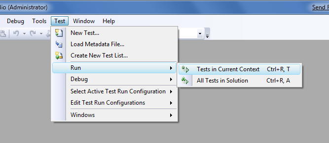

Choosing one of the above options will open the "Test Results" pane within the IDE and provide us with pass/fail status on the 27 unit tests included in our new project that cover the built-in functionality:

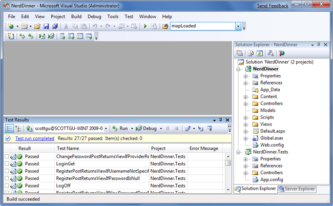

Later in this tutorial we'll talk more about automated testing and add additional unit tests that cover the application functionality we implement.

### Next Step

We've now got a basic application structure in place. Let's now [create a database to store our application data](create-a-database.md).

>[!div class="step-by-step"]
[Previous](introducing-the-nerddinner-tutorial.md)
[Next](create-a-database.md)