Enable Automated Unit Testing
====================
by [Microsoft](https://github.com/microsoft)

[Download PDF](http://aspnetmvcbook.s3.amazonaws.com/aspnetmvc-nerdinner_v1.pdf)

> This is step 12 of a free ["NerdDinner" application tutorial](introducing-the-nerddinner-tutorial.md) that walks-through how to build a small, but complete, web application using ASP.NET MVC 1.
> 
> Step 12 shows how to develop a suite of automated unit tests that verify our NerdDinner functionality, and which will give us the confidence to make changes and improvements to the application in the future.
> 
> If you are using ASP.NET MVC 3, we recommend you follow the [Getting Started With MVC 3](../../older-versions/getting-started-with-aspnet-mvc3/cs/intro-to-aspnet-mvc-3.md) or [MVC Music Store](../../older-versions/mvc-music-store/mvc-music-store-part-1.md) tutorials.

## NerdDinner Step 12: Unit Testing

Let's develop a suite of automated unit tests that verify our NerdDinner functionality, and which will give us the confidence to make changes and improvements to the application in the future.

### Why Unit Test?

On the drive into work one morning you have a sudden flash of inspiration about an application you are working on. You realize there is a change you can implement that will make the application dramatically better. It might be a refactoring that cleans up the code, adds a new feature, or fixes a bug.

The question that confronts you when you arrive at your computer is – "how safe is it to make this improvement?" What if making the change has side effects or breaks something? The change might be simple and only take a few minutes to implement, but what if it takes hours to manually test out all of the application scenarios? What if you forget to cover a scenario and a broken application goes into production? Is making this improvement really worth all the effort?

Automated unit tests can provide a safety net that enables you to continually enhance your applications, and avoid being afraid of the code you are working on. Having automated tests that quickly verify functionality enables you to code with confidence – and empower you to make improvements you might otherwise not have felt comfortable doing. They also help create solutions that are more maintainable and have a longer lifetime - which leads to a much higher return on investment.

The ASP.NET MVC Framework makes it easy and natural to unit test application functionality. It also enables a Test Driven Development (TDD) workflow that enables test-first based development.

### NerdDinner.Tests Project

When we created our NerdDinner application at the beginning of this tutorial, we were prompted with a dialog asking whether we wanted to create a unit test project to go along with the application project:

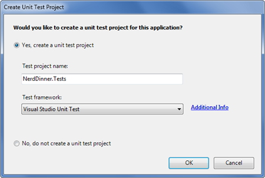

We kept the "Yes, create a unit test project" radio button selected – which resulted in a "NerdDinner.Tests" project being added to our solution:

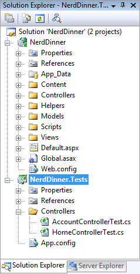

The NerdDinner.Tests project references the NerdDinner application project assembly, and enables us to easily add automated tests to it that verify the application functionality.

### Creating Unit Tests for our Dinner Model Class

Let's add some tests to our NerdDinner.Tests project that verify the Dinner class we created when we built our model layer.

We'll start by creating a new folder within our test project called "Models" where we'll place our model-related tests. We'll then right-click on the folder and choose the **Add-&gt;New Test** menu command. This will bring up the "Add New Test" dialog.

We'll choose to create a "Unit Test" and name it "DinnerTest.cs":

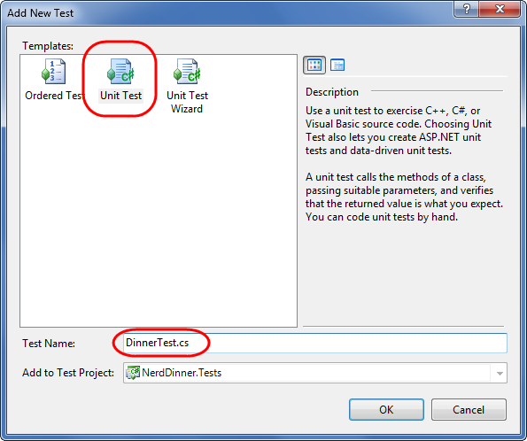

When we click the "ok" button Visual Studio will add (and open) a DinnerTest.cs file to the project:

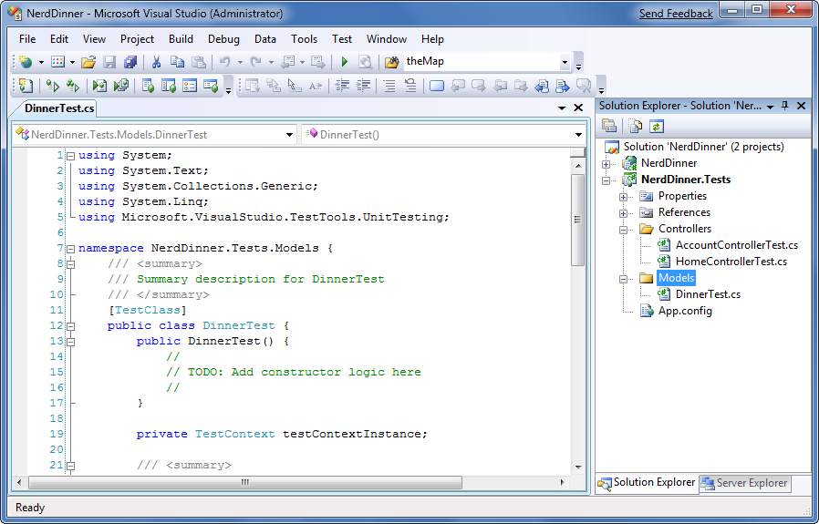

The default Visual Studio unit test template has a bunch of boiler-plate code within it that I find a little messy. Let's clean it up to just contain the code below:

[!code-csharp[Main](enable-automated-unit-testing/samples/sample1.cs)]

The [TestClass] attribute on the DinnerTest class above identifies it as a class that will contain tests, as well as optional test initialization and teardown code. We can define tests within it by adding public methods that have a [TestMethod] attribute on them.

Below are the first of two tests we'll add that exercise our Dinner class. The first test verifies that our Dinner is invalid if a new Dinner is created without all properties being set correctly. The second test verifies that our Dinner is valid when a Dinner has all properties set with valid values:

[!code-csharp[Main](enable-automated-unit-testing/samples/sample2.cs)]

You'll notice above that our test names are very explicit (and somewhat verbose). We are doing this because we might end up creating hundreds or thousands of small tests, and we want to make it easy to quickly determine the intent and behavior of each of them (especially when we are looking through a list of failures in a test runner). The test names should be named after the functionality they are testing. Above we are using a "Noun\_Should\_Verb" naming pattern.

We are structuring the tests using the "AAA" testing pattern – which stands for "Arrange, Act, Assert":

- Arrange: Setup the unit being tested
- Act: Exercise the unit under test and capture results
- Assert: Verify the behavior

When we write tests we want to avoid having the individual tests do too much. Instead each test should verify only a single concept (which will make it much easier to pinpoint the cause of failures). A good guideline is to try and only have a single assert statement for each test. If you have more than one assert statement in a test method, make sure they are all being used to test the same concept. When in doubt, make another test.

### Running Tests

Visual Studio 2008 Professional (and higher editions) includes a built-in test runner that can be used to run Visual Studio Unit Test projects within the IDE. We can select the **Test-&gt;Run-&gt;All Tests in Solution** menu command (or type Ctrl R, A) to run all of our unit tests. Or alternatively we can position our cursor within a specific test class or test method and use the **Test-&gt;Run-&gt;Tests in Current Context** menu command (or type Ctrl R, T) to run a subset of the unit tests.

Let's position our cursor within the DinnerTest class and type "Ctrl R, T" to run the two tests we just defined. When we do this a "Test Results" window will appear within Visual Studio and we'll see the results of our test run listed within it:

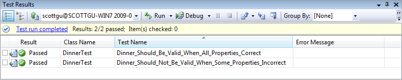

*Note: The VS test results window does not show the Class Name column by default. You can add this by right-clicking within the Test Results window and using the Add/Remove Columns menu command.*

Our two tests took only a fraction of a second to run – and as you can see they both passed. We can now go on and augment them by creating additional tests that verify specific rule validations, as well as cover the two helper methods - IsUserHost() and IsUserRegisterd() – that we added to the Dinner class. Having all these tests in place for the Dinner class will make it much easier and safer to add new business rules and validations to it in the future. We can add our new rule logic to Dinner, and then within seconds verify that it hasn't broken any of our previous logic functionality.

Notice how using a descriptive test name makes it easy to quickly understand what each test is verifying. I recommend using the **Tools-&gt;Options** menu command, opening the Test Tools-&gt;Test Execution configuration screen, and checking the "Double-clicking a failed or inconclusive unit test result displays the point of failure in the test" checkbox. This will allow you to double-click on a failure in the test results window and jump immediately to the assert failure.

### Creating DinnersController Unit Tests

Let's now create some unit tests that verify our DinnersController functionality. We'll start by right-clicking on the "Controllers" folder within our Test project and then choose the **Add-&gt;New Test** menu command. We'll create a "Unit Test" and name it "DinnersControllerTest.cs".

We'll create two test methods that verify the Details() action method on the DinnersController. The first will verify that a View is returned when an existing Dinner is requested. The second will verify that a "NotFound" view is returned when a non-existent Dinner is requested:

[!code-csharp[Main](enable-automated-unit-testing/samples/sample3.cs)]

The above code compiles clean. When we run the tests, though, they both fail:

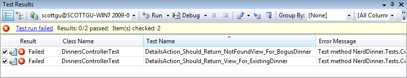

If we look at the error messages, we'll see that the reason the tests failed was because our DinnersRepository class was unable to connect to a database. Our NerdDinner application is using a connection-string to a local SQL Server Express file which lives under the \App\_Data directory of the NerdDinner application project. Because our NerdDinner.Tests project compiles and runs in a different directory then the application project, the relative path location of our connection-string is incorrect.

We *could* fix this by copying the SQL Express database file to our test project, and then add an appropriate test connection-string to it in the App.config of our test project. This would get the above tests unblocked and running.

Unit testing code using a real database, though, brings with it a number of challenges. Specifically:

- It significantly slows down the execution time of unit tests. The longer it takes to run tests, the less likely you are to execute them frequently. Ideally you want your unit tests to be able to be run in seconds – and have it be something you do as naturally as compiling the project.
- It complicates the setup and cleanup logic within tests. You want each unit test to be isolated and independent of others (with no side effects or dependencies). When working against a real database you have to be mindful of state and reset it between tests.

Let's look at a design pattern called "dependency injection" that can help us work around these issues and avoid the need to use a real database with our tests.

### Dependency Injection

Right now DinnersController is tightly "coupled" to the DinnerRepository class. "Coupling" refers to a situation where a class explicitly relies on another class in order to work:

[!code-csharp[Main](enable-automated-unit-testing/samples/sample4.cs)]

Because the DinnerRepository class requires access to a database, the tightly coupled dependency the DinnersController class has on the DinnerRepository ends up requiring us to have a database in order for the DinnersController action methods to be tested.

We can get around this by employing a design pattern called "dependency injection" – which is an approach where dependencies (like repository classes that provide data access) are no longer implicitly created within classes that use them. Instead, dependencies can be explicitly passed to the class that uses them using constructor arguments. If the dependencies are defined using interfaces, we then have the flexibility to pass in "fake" dependency implementations for unit test scenarios. This enables us to create test-specific dependency implementations that do not actually require access to a database.

To see this in action, let's implement dependency injection with our DinnersController.

#### Extracting an IDinnerRepository interface

Our first step will be to create a new IDinnerRepository interface that encapsulates the repository contract our controllers require to retrieve and update Dinners.

We can define this interface contract manually by right-clicking on the \Models folder, and then choosing the **Add-&gt;New Item** menu command and creating a new interface named IDinnerRepository.cs.

Alternatively we can use the refactoring tools built-into Visual Studio Professional (and higher editions) to automatically extract and create an interface for us from our existing DinnerRepository class. To extract this interface using VS, simply position the cursor in the text editor on the DinnerRepository class, and then right-click and choose the **Refactor-&gt;Extract Interface** menu command:

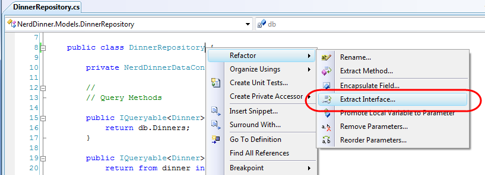

This will launch the "Extract Interface" dialog and prompt us for the name of the interface to create. It will default to IDinnerRepository and automatically select all public methods on the existing DinnerRepository class to add to the interface:

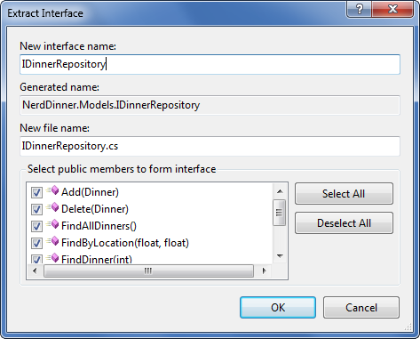

When we click the "ok" button, Visual Studio will add a new IDinnerRepository interface to our application:

[!code-csharp[Main](enable-automated-unit-testing/samples/sample5.cs)]

And our existing DinnerRepository class will be updated so that it implements the interface:

[!code-csharp[Main](enable-automated-unit-testing/samples/sample6.cs)]

#### Updating DinnersController to support constructor injection

We'll now update the DinnersController class to use the new interface.

Currently DinnersController is hard-coded such that its "dinnerRepository" field is always a DinnerRepository class:

[!code-csharp[Main](enable-automated-unit-testing/samples/sample7.cs)]

We'll change it so that the "dinnerRepository" field is of type IDinnerRepository instead of DinnerRepository. We'll then add two public DinnersController constructors. One of the constructors allows an IDinnerRepository to be passed as an argument. The other is a default constructor that uses our existing DinnerRepository implementation:

[!code-csharp[Main](enable-automated-unit-testing/samples/sample8.cs)]

Because ASP.NET MVC by default creates controller classes using default constructors, our DinnersController at runtime will continue to use the DinnerRepository class to perform data access.

We can now update our unit tests, though, to pass in a "fake" dinner repository implementation using the parameter constructor. This "fake" dinner repository will not require access to a real database, and instead will use in-memory sample data.

#### Creating the FakeDinnerRepository class

Let's create a FakeDinnerRepository class.

We'll begin by creating a "Fakes" directory within our NerdDinner.Tests project and then add a new FakeDinnerRepository class to it (right-click on the folder and choose **Add-&gt;New Class**):

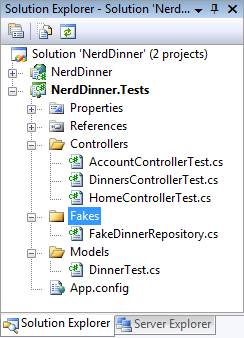

We'll update the code so that the FakeDinnerRepository class implements the IDinnerRepository interface. We can then right-click on it and choose the "Implement interface IDinnerRepository" context menu command:

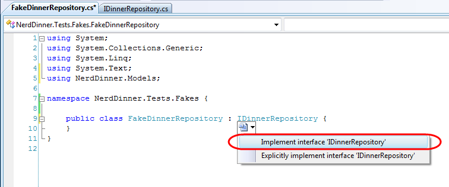

This will cause Visual Studio to automatically add all of the IDinnerRepository interface members to our FakeDinnerRepository class with default "stub out" implementations:

[!code-csharp[Main](enable-automated-unit-testing/samples/sample9.cs)]

We can then update the FakeDinnerRepository implementation to work off of an in-memory List&lt;Dinner&gt; collection passed to it as a constructor argument:

[!code-csharp[Main](enable-automated-unit-testing/samples/sample10.cs)]

We now have a fake IDinnerRepository implementation that does not require a database, and can instead work off an in-memory list of Dinner objects.

#### Using the FakeDinnerRepository with Unit Tests

Let's return to the DinnersController unit tests that failed earlier because the database wasn't available. We can update the test methods to use a FakeDinnerRepository populated with sample in-memory Dinner data to the DinnersController using the code below:

[!code-csharp[Main](enable-automated-unit-testing/samples/sample11.cs)]

And now when we run these tests they both pass:

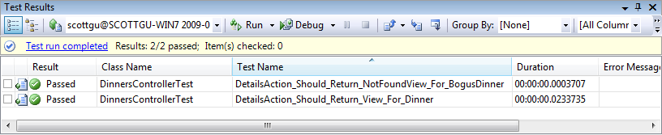

Best of all, they take only a fraction of a second to run, and do not require any complicated setup/cleanup logic. We can now unit test all of our DinnersController action method code (including listing, paging, details, create, update and delete) without ever needing to connect to a real database.

| **Side Topic: Dependency Injection Frameworks** |
| --- |
| Performing manual dependency injection (like we are above) works fine, but does become harder to maintain as the number of dependencies and components in an application increases. Several dependency injection frameworks exist for .NET that can help provide even more dependency management flexibility. These frameworks, also sometimes called "Inversion of Control" (IoC) containers, provide mechanisms that enable an additional level of configuration support for specifying and passing dependencies to objects at runtime (most often using constructor injection). Some of the more popular OSS Dependency Injection / IOC frameworks in .NET include: AutoFac, Ninject, Spring.NET, StructureMap, and Windsor. ASP.NET MVC exposes extensibility APIs that enable developers to participate in the resolution and instantiation of controllers, and which enables Dependency Injection / IoC frameworks to be cleanly integrated within this process. Using a DI/IOC framework would also enable us to remove the default constructor from our DinnersController – which would completely remove the coupling between it and the DinnerRepositorys. We won't be using a dependency injection / IOC framework with our NerdDinner application. But it is something we could consider for the future if the NerdDinner code-base and capabilities grew. |

### Creating Edit Action Unit Tests

Let's now create some unit tests that verify the Edit functionality of the DinnersController. We'll start by testing the HTTP-GET version of our Edit action:

[!code-csharp[Main](enable-automated-unit-testing/samples/sample12.cs)]

We'll create a test that verifies that a View backed by a DinnerFormViewModel object is rendered back when a valid dinner is requested:

[!code-csharp[Main](enable-automated-unit-testing/samples/sample13.cs)]

When we run the test, though, we'll find that it fails because a null reference exception is thrown when the Edit method accesses the User.Identity.Name property to perform the Dinner.IsHostedBy() check.

The User object on the Controller base class encapsulates details about the logged-in user, and is populated by ASP.NET MVC when it creates the controller at runtime. Because we are testing the DinnersController outside of a web-server environment, the User object isn't set (hence the null reference exception).

### Mocking the User.Identity.Name property

Mocking frameworks make testing easier by enabling us to dynamically create fake versions of dependent objects that support our tests. For example, we can use a mocking framework in our Edit action test to dynamically create a User object that our DinnersController can use to lookup a simulated username. This will avoid a null reference from being thrown when we run our test.

There are many .NET mocking frameworks that can be used with ASP.NET MVC (you can see a list of them here: [http://www.mockframeworks.com/](http://www.mockframeworks.com/)). For testing our NerdDinner application we'll use an open source mocking framework called "Moq", which can be downloaded for free from [http://www.mockframeworks.com/moq](http://www.mockframeworks.com/moq).

Once downloaded, we'll add a reference in our NerdDinner.Tests project to the Moq.dll assembly:

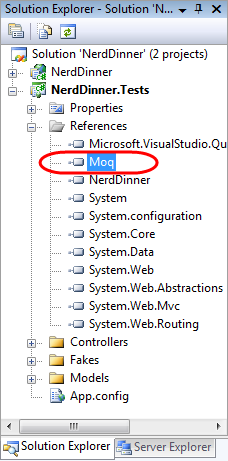

We'll then add a "CreateDinnersControllerAs(username)" helper method to our test class that takes a username as a parameter, and which then "mocks" the User.Identity.Name property on the DinnersController instance:

[!code-csharp[Main](enable-automated-unit-testing/samples/sample14.cs)]

Above we are using Moq to create a Mock object that fakes a ControllerContext object (which is what ASP.NET MVC passes to Controller classes to expose runtime objects like User, Request, Response, and Session). We are calling the "SetupGet" method on the Mock to indicate that the HttpContext.User.Identity.Name property on ControllerContext should return the username string we passed to the helper method.

We can mock any number of ControllerContext properties and methods. To illustrate this I've also added a SetupGet() call for the Request.IsAuthenticated property (which isn't actually needed for the tests below – but which helps illustrate how you can mock Request properties). When we are done we assign an instance of the ControllerContext mock to the DinnersController our helper method returns.

We can now write unit tests that use this helper method to test Edit scenarios involving different users:

[!code-csharp[Main](enable-automated-unit-testing/samples/sample15.cs)]

And now when we run the tests they pass:

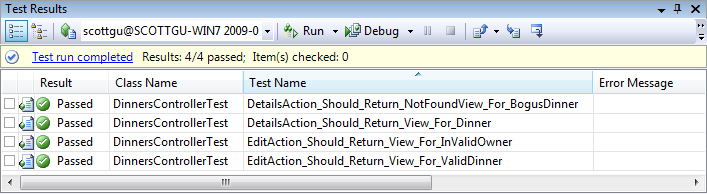

### Testing UpdateModel() scenarios

We've created tests that cover the HTTP-GET version of the Edit action. Let's now create some tests that verify the HTTP-POST version of the Edit action:

[!code-csharp[Main](enable-automated-unit-testing/samples/sample16.cs)]

The interesting new testing scenario for us to support with this action method is its usage of the UpdateModel() helper method on the Controller base class. We are using this helper method to bind form-post values to our Dinner object instance.

Below are two tests that demonstrates how we can supply form posted values for the UpdateModel() helper method to use. We'll do this by creating and populating a FormCollection object, and then assign it to the "ValueProvider" property on the Controller.

The first test verifies that on a successful save the browser is redirected to the details action. The second test verifies that when invalid input is posted the action redisplays the edit view again with an error message.

[!code-csharp[Main](enable-automated-unit-testing/samples/sample17.cs)]

### Testing Wrap-Up

We've covered the core concepts involved in unit testing controller classes. We can use these techniques to easily create hundreds of simple tests that verify the behavior of our application.

Because our controller and model tests do not require a real database, they are extremely fast and easy to run. We'll be able to execute hundreds of automated tests in seconds, and immediately get feedback as to whether a change we made broke something. This will help provide us the confidence to continually improve, refactor, and refine our application.

We covered testing as the last topic in this chapter – but not because testing is something you should do at the end of a development process! On the contrary, you should write automated tests as early as possible in your development process. Doing so enables you to get immediate feedback as you develop, helps you think thoughtfully about your application's use case scenarios, and guides you to design your application with clean layering and coupling in mind.

A later chapter in the book will discuss Test Driven Development (TDD), and how to use it with ASP.NET MVC. TDD is an iterative coding practice where you first write the tests that your resulting code will satisfy. With TDD you begin each feature by creating a test that verifies the functionality you are about to implement. Writing the unit test first helps ensure that you clearly understand the feature and how it is supposed to work. Only after the test is written (and you have verified that it fails) do you then implement the actual functionality the test verifies. Because you've already spent time thinking about the use case of how the feature is supposed to work, you will have a better understanding of the requirements and how best to implement them. When you are done with the implementation you can re-run the test – and get immediate feedback as to whether the feature works correctly. We'll cover TDD more in Chapter 10.

### Next Step

Some final wrap up comments.

>[!div class="step-by-step"]
[Previous](use-ajax-to-implement-mapping-scenarios.md)
[Next](nerddinner-wrap-up.md)