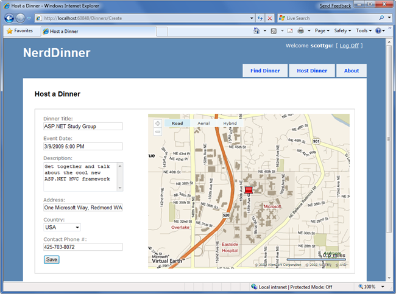

NerdDinner Wrap Up
====================
by [Microsoft](https://github.com/microsoft)

[Download PDF](http://aspnetmvcbook.s3.amazonaws.com/aspnetmvc-nerdinner_v1.pdf)

> This is the conclusion of the NerdDinner tutorial, and provides you with information on how to learn more.
> 
> If you are using ASP.NET MVC 3, we recommend you follow the [Getting Started With MVC 3](../../older-versions/getting-started-with-aspnet-mvc3/cs/intro-to-aspnet-mvc-3.md) or [MVC Music Store](../../older-versions/mvc-music-store/mvc-music-store-part-1.md) tutorials.

Our NerdDinner application is now complete and ready to deploy on the web.

We used a broad set of ASP.NET MVC features to build NerdDinner. Hopefully the process of developing it shed some light on how the core ASP.NET MVC features work, and provided context on how these features integrate together within an application.

### Learning More

This NerdDinner tutorial is the first chapter of the new [Professional ASP.NET MVC 1.0](https://www.amazon.com/gp/product/0470384611?ie=UTF8&amp;tag=scoblo04-20&amp;linkCode=xm2&amp;camp=1789&amp;creativeASIN=0470384611) book from Wrox Press.

You can read the rest of the book to learn even more about ASP.NET MVC.

You can also find great ASP.NET MVC tutorials and videos at: [https://www.asp.net/mvc](../../../index.md) Other great ASP.NET MVC books will shortly be published. I will update this page to include links to additional books as they become available.

Hope this helps,

Scott

>[!div class="step-by-step"]
[Previous](enable-automated-unit-testing.md)