Provide CRUD (Create, Read, Update, Delete) Data Form Entry Support
====================
by [Microsoft](https://github.com/microsoft)

[Download PDF](http://aspnetmvcbook.s3.amazonaws.com/aspnetmvc-nerdinner_v1.pdf)

> This is step 5 of a free ["NerdDinner" application tutorial](introducing-the-nerddinner-tutorial.md) that walks-through how to build a small, but complete, web application using ASP.NET MVC 1.
> 
> Step 5 shows how to take our DinnersController class further by enable support for editing, creating and deleting Dinners with it as well.
> 
> If you are using ASP.NET MVC 3, we recommend you follow the [Getting Started With MVC 3](../../older-versions/getting-started-with-aspnet-mvc3/cs/intro-to-aspnet-mvc-3.md) or [MVC Music Store](../../older-versions/mvc-music-store/mvc-music-store-part-1.md) tutorials.

## NerdDinner Step 5: Create, Update, Delete Form Scenarios

We've introduced controllers and views, and covered how to use them to implement a listing/details experience for Dinners on site. Our next step will be to take our DinnersController class further and enable support for editing, creating and deleting Dinners with it as well.

### URLs handled by DinnersController

We previously added action methods to DinnersController that implemented support for two URLs: */Dinners* and */Dinners/Details/[id]*.

| **URL** | **VERB** | **Purpose** |
| --- | --- | --- |
| */Dinners/* | GET | Display an HTML list of upcoming dinners. |
| */Dinners/Details/[id]* | GET | Display details about a specific dinner. |

We will now add action methods to implement three additional URLs: */Dinners/Edit/[id], /Dinners/Create,*and*/Dinners/Delete/[id]*. These URLs will enable support for editing existing Dinners, creating new Dinners, and deleting Dinners.

We will support both HTTP GET and HTTP POST verb interactions with these new URLs. HTTP GET requests to these URLs will display the initial HTML view of the data (a form populated with the Dinner data in the case of "edit", a blank form in the case of "create", and a delete confirmation screen in the case of "delete"). HTTP POST requests to these URLs will save/update/delete the Dinner data in our DinnerRepository (and from there to the database).

| **URL** | **VERB** | **Purpose** |
| --- | --- | --- |
| */Dinners/Edit/[id]* | GET | Display an editable HTML form populated with Dinner data. |
| POST | Save the form changes for a particular Dinner to the database. |
| */Dinners/Create* | GET | Display an empty HTML form that allows users to define new Dinners. |
| POST | Create a new Dinner and save it in the database. |
| */Dinners/Delete/[id]* | GET | Display delete confirmation screen. |
| POST | Deletes the specified dinner from the database. |

### Edit Support

Let's begin by implementing the "edit" scenario.

#### The HTTP-GET Edit Action Method

We'll start by implementing the HTTP "GET" behavior of our edit action method. This method will be invoked when the */Dinners/Edit/[id]* URL is requested. Our implementation will look like:

[!code-csharp[Main](provide-crud-create-read-update-delete-data-form-entry-support/samples/sample1.cs)]

The code above uses the DinnerRepository to retrieve a Dinner object. It then renders a View template using the Dinner object. Because we haven't explicitly passed a template name to the *View()* helper method, it will use the convention based default path to resolve the view template: /Views/Dinners/Edit.aspx.

Let's now create this view template. We will do this by right-clicking within the Edit method and selecting the "Add View" context menu command:

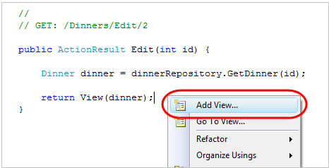

Within the "Add View" dialog we'll indicate that we are passing a Dinner object to our view template as its model, and choose to auto-scaffold an "Edit" template:

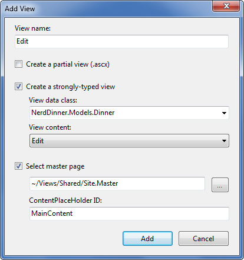

When we click the "Add" button, Visual Studio will add a new "Edit.aspx" view template file for us within the "\Views\Dinners" directory. It will also open up the new "Edit.aspx" view template within the code-editor – populated with an initial "Edit" scaffold implementation like below:

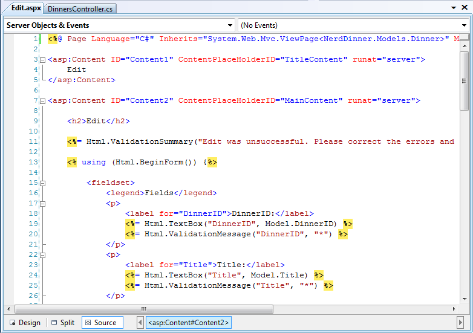

Let's make a few changes to the default "edit" scaffold generated, and update the edit view template to have the content below (which removes a few of the properties we don't want to expose):

[!code-aspx[Main](provide-crud-create-read-update-delete-data-form-entry-support/samples/sample2.aspx)]

When we run the application and request the *"/Dinners/Edit/1"* URL we will see the following page:

The HTML markup generated by our view looks like below. It is standard HTML – with a &lt;form&gt; element that performs an HTTP POST to the */Dinners/Edit/1* URL when the "Save" &lt;input type="submit"/&gt; button is pushed. A HTML &lt;input type="text"/&gt; element has been output for each editable property:

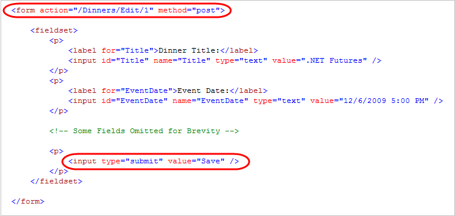

#### Html.BeginForm() and Html.TextBox() Html Helper Methods

Our "Edit.aspx" view template is using several "Html Helper" methods: Html.ValidationSummary(), Html.BeginForm(), Html.TextBox(), and Html.ValidationMessage(). In addition to generating HTML markup for us, these helper methods provide built-in error handling and validation support.

##### Html.BeginForm() helper method

The Html.BeginForm() helper method is what output the HTML &lt;form&gt; element in our markup. In our Edit.aspx view template you'll notice that we are applying a C# "using" statement when using this method. The open curly brace indicates the beginning of the &lt;form&gt; content, and the closing curly brace is what indicates the end of the &lt;/form&gt; element:

[!code-csharp[Main](provide-crud-create-read-update-delete-data-form-entry-support/samples/sample3.cs)]

Alternatively, if you find the "using" statement approach unnatural for a scenario like this, you can use a Html.BeginForm() and Html.EndForm() combination (which does the same thing):

[!code-aspx[Main](provide-crud-create-read-update-delete-data-form-entry-support/samples/sample4.aspx)]

Calling Html.BeginForm() without any parameters will cause it to output a form element that does an HTTP-POST to the current request's URL. That is why our Edit view generates a *&lt;form action="/Dinners/Edit/1" method="post"&gt;* element. We could have alternatively passed explicit parameters to Html.BeginForm() if we wanted to post to a different URL.

##### Html.TextBox() helper method

Our Edit.aspx view uses the Html.TextBox() helper method to output &lt;input type="text"/&gt; elements:

[!code-aspx[Main](provide-crud-create-read-update-delete-data-form-entry-support/samples/sample5.aspx)]

The Html.TextBox() method above takes a single parameter – which is being used to specify both the id/name attributes of the &lt;input type="text"/&gt; element to output, as well as the model property to populate the textbox value from. For example, the Dinner object we passed to the Edit view had a "Title" property value of ".NET Futures", and so our Html.TextBox("Title") method call output: *&lt;input id="Title" name="Title" type="text" value=".NET Futures" /&gt;*.

Alternatively, we can use the first Html.TextBox() parameter to specify the id/name of the element, and then explicitly pass in the value to use as a second parameter:

[!code-aspx[Main](provide-crud-create-read-update-delete-data-form-entry-support/samples/sample6.aspx)]

Often we'll want to perform custom formatting on the value that is output. The String.Format() static method built-into .NET is useful for these scenarios. Our Edit.aspx view template is using this to format the EventDate value (which is of type DateTime) so that it doesn't show seconds for the time:

[!code-aspx[Main](provide-crud-create-read-update-delete-data-form-entry-support/samples/sample7.aspx)]

A third parameter to Html.TextBox() can optionally be used to output additional HTML attributes. The code-snippet below demonstrates how to render an additional size="30" attribute and a class="mycssclass" attribute on the &lt;input type="text"/&gt; element. Note how we are escaping the name of the class attribute using a "@" character because "class" is a reserved keyword in C#:

[!code-aspx[Main](provide-crud-create-read-update-delete-data-form-entry-support/samples/sample8.aspx)]

#### Implementing the HTTP-POST Edit Action Method

We now have the HTTP-GET version of our Edit action method implemented. When a user requests the */Dinners/Edit/1* URL they receive an HTML page like the following:

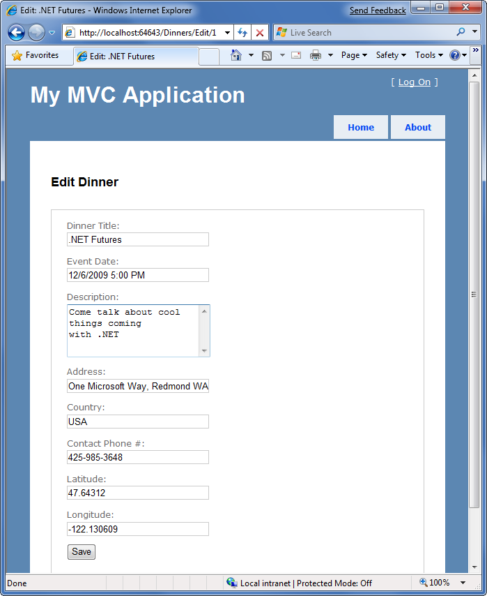

Pressing the "Save" button causes a form post to the */Dinners/Edit/1* URL, and submits the HTML &lt;input&gt; form values using the HTTP POST verb. Let's now implement the HTTP POST behavior of our edit action method – which will handle saving the Dinner.

We'll begin by adding an overloaded "Edit" action method to our DinnersController that has an "AcceptVerbs" attribute on it that indicates it handles HTTP POST scenarios:

[!code-csharp[Main](provide-crud-create-read-update-delete-data-form-entry-support/samples/sample9.cs)]

When the [AcceptVerbs] attribute is applied to overloaded action methods, ASP.NET MVC automatically handles dispatching requests to the appropriate action method depending on the incoming HTTP verb. HTTP POST requests to */Dinners/Edit/[id]* URLs will go to the above Edit method, while all other HTTP verb requests to */Dinners/Edit/[id]*URLs will go to the first Edit method we implemented (which did not have an [AcceptVerbs] attribute).

| **Side Topic: Why differentiate via HTTP verbs?** |
| --- |
| You might ask – why are we using a single URL and differentiating its behavior via the HTTP verb? Why not just have two separate URLs to handle loading and saving edit changes? For example: /Dinners/Edit/[id] to display the initial form and /Dinners/Save/[id] to handle the form post to save it? The downside with publishing two separate URLs is that in cases where we post to /Dinners/Save/2, and then need to redisplay the HTML form because of an input error, the end-user will end up having the /Dinners/Save/2 URL in their browser's address bar (since that was the URL the form posted to). If the end-user bookmarks this redisplayed page to their browser favorites list, or copy/pastes the URL and emails it to a friend, they will end up saving a URL that won't work in the future (since that URL depends on post values). By exposing a single URL (like: /Dinners/Edit/[id]) and differentiating the processing of it by HTTP verb, it is safe for end-users to bookmark the edit page and/or send the URL to others. |

#### Retrieving Form Post Values

There are a variety of ways we can access posted form parameters within our HTTP POST "Edit" method. One simple approach is to just use the Request property on the Controller base class to access the form collection and retrieve the posted values directly:

[!code-csharp[Main](provide-crud-create-read-update-delete-data-form-entry-support/samples/sample10.cs)]

The above approach is a little verbose, though, especially once we add error handling logic.

A better approach for this scenario is to leverage the built-in *UpdateModel()* helper method on the Controller base class. It supports updating the properties of an object we pass it using the incoming form parameters. It uses reflection to determine the property names on the object, and then automatically converts and assigns values to them based on the input values submitted by the client.

We could use the UpdateModel() method to simplify our HTTP-POST Edit Action using this code:

[!code-csharp[Main](provide-crud-create-read-update-delete-data-form-entry-support/samples/sample11.cs)]

We can now visit the */Dinners/Edit/1* URL, and change the title of our Dinner:

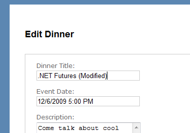

When we click the "Save" button, we'll perform a form post to our Edit action, and the updated values will be persisted in the database. We will then be redirected to the Details URL for the Dinner (which will display the newly saved values):

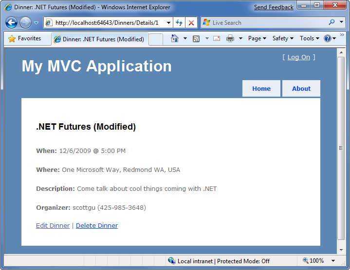

#### Handling Edit Errors

Our current HTTP-POST implementation works fine – except when there are errors.

When a user makes a mistake editing a form, we need to make sure that the form is redisplayed with an informative error message that guides them to fix it. This includes cases where an end-user posts incorrect input (for example: a malformed date string), as well as cases where the input format is valid but there is a business rule violation. When errors occur the form should preserve the input data the user originally entered so that they don't have to refill their changes manually. This process should repeat as many times as necessary until the form successfully completes.

ASP.NET MVC includes some nice built-in features that make error handling and form redisplay easy. To see these features in action let's update our Edit action method with the following code:

[!code-csharp[Main](provide-crud-create-read-update-delete-data-form-entry-support/samples/sample12.cs)]

The above code is similar to our previous implementation – except that we are now wrapping a try/catch error handling block around our work. If an exception occurs either when calling UpdateModel(), or when we try and save the DinnerRepository (which will raise an exception if the Dinner object we are trying to save is invalid because of a rule violation within our model), our catch error handling block will execute. Within it we loop over any rule violations that exist in the Dinner object and add them to a ModelState object (which we'll discuss shortly). We then redisplay the view.

To see this working let's re-run the application, edit a Dinner, and change it to have an empty Title, an EventDate of "BOGUS", and use a UK phone number with a country value of USA. When we press the "Save" button our HTTP POST Edit method will not be able to save the Dinner (because there are errors) and will redisplay the form:

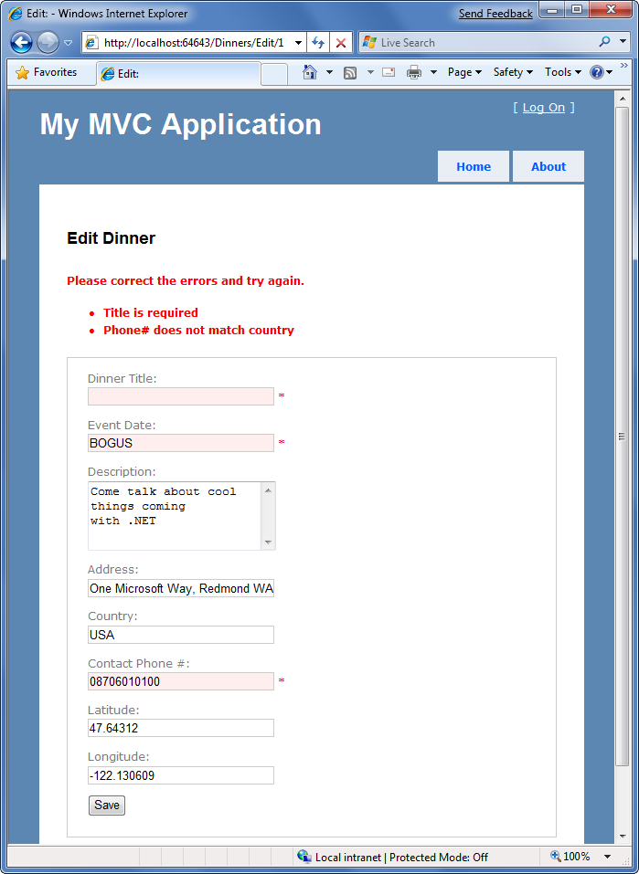

Our application has a decent error experience. The text elements with the invalid input are highlighted in red, and validation error messages are displayed to the end user about them. The form is also preserving the input data the user originally entered – so that they don't have to refill anything.

How, you might ask, did this occur? How did the Title, EventDate, and ContactPhone textboxes highlight themselves in red and know to output the originally entered user values? And how did error messages get displayed in the list at the top? The good news is that this didn't occur by magic - rather it was because we used some of the built-in ASP.NET MVC features that make input validation and error handling scenarios easy.

#### Understanding ModelState and the Validation HTML Helper Methods

Controller classes have a "ModelState" property collection which provides a way to indicate that errors exist with a model object being passed to a View. Error entries within the ModelState collection identify the name of the model property with the issue (for example: "Title", "EventDate", or "ContactPhone"), and allow a human-friendly error message to be specified (for example: "Title is required").

The *UpdateModel()* helper method automatically populates the ModelState collection when it encounters errors while trying to assign form values to properties on the model object. For example, our Dinner object's EventDate property is of type DateTime. When the UpdateModel() method was unable to assign the string value "BOGUS" to it in the scenario above, the UpdateModel() method added an entry to the ModelState collection indicating an assignment error had occurred with that property.

Developers can also write code to explicitly add error entries into the ModelState collection like we are doing below within our "catch" error handling block, which is populating the ModelState collection with entries based on the active Rule Violations in the Dinner object:

[!code-csharp[Main](provide-crud-create-read-update-delete-data-form-entry-support/samples/sample13.cs)]

#### Html Helper Integration with ModelState

HTML helper methods - like Html.TextBox() - check the ModelState collection when rendering output. If an error for the item exists, they render the user-entered value and a CSS error class.

For example, in our "Edit" view we are using the Html.TextBox() helper method to render the EventDate of our Dinner object:

[!code-aspx[Main](provide-crud-create-read-update-delete-data-form-entry-support/samples/sample14.aspx)]

When the view was rendered in the error scenario, the Html.TextBox() method checked the ModelState collection to see if there were any errors associated with the "EventDate" property of our Dinner object. When it determined that there was an error it rendered the submitted user input ("BOGUS") as the value, and added a css error class to the &lt;input type="textbox"/&gt; markup it generated:

[!code-html[Main](provide-crud-create-read-update-delete-data-form-entry-support/samples/sample15.html)]

You can customize the appearance of the css error class to look however you want. The default CSS error class – "input-validation-error" – is defined in the *\content\site.css* stylesheet and looks like below:

[!code-css[Main](provide-crud-create-read-update-delete-data-form-entry-support/samples/sample16.css)]

This CSS rule is what caused our invalid input elements to be highlighted like below:

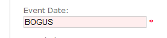

##### Html.ValidationMessage() Helper Method

The Html.ValidationMessage() helper method can be used to output the ModelState error message associated with a particular model property:

[!code-aspx[Main](provide-crud-create-read-update-delete-data-form-entry-support/samples/sample17.aspx)]

The above code outputs: *&lt;span class="field-validation-error"&gt; The value ‘BOGUS' is invalid&lt;/span&gt;*

The Html.ValidationMessage() helper method also supports a second parameter that allows developers to override the error text message that is displayed:

[!code-aspx[Main](provide-crud-create-read-update-delete-data-form-entry-support/samples/sample18.aspx)]

The above code outputs: *&lt;span class="field-validation-error"&gt;\*&lt;/span&gt;*instead of the default error text when an error is present for the EventDate property.

##### Html.ValidationSummary() Helper Method

The Html.ValidationSummary() helper method can be used to render a summary error message, accompanied by a &lt;ul&gt;&lt;li/&gt;&lt;/ul&gt; list of all detailed error messages in the ModelState collection:

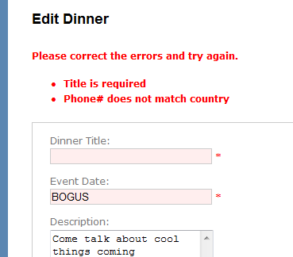

The Html.ValidationSummary() helper method takes an optional string parameter – which defines a summary error message to display above the list of detailed errors:

[!code-aspx[Main](provide-crud-create-read-update-delete-data-form-entry-support/samples/sample19.aspx)]

You can optionally use CSS to override what the error list looks like.

#### Using a AddRuleViolations Helper Method

Our initial HTTP-POST Edit implementation used a foreach statement within its catch block to loop over the Dinner object's Rule Violations and add them to the controller's ModelState collection:

[!code-csharp[Main](provide-crud-create-read-update-delete-data-form-entry-support/samples/sample20.cs)]

We can make this code a little cleaner by adding a "ControllerHelpers" class to the NerdDinner project, and implement an "AddRuleViolations" extension method within it that adds a helper method to the ASP.NET MVC ModelStateDictionary class. This extension method can encapsulate the logic necessary to populate the ModelStateDictionary with a list of RuleViolation errors:

[!code-csharp[Main](provide-crud-create-read-update-delete-data-form-entry-support/samples/sample21.cs)]

We can then update our HTTP-POST Edit action method to use this extension method to populate the ModelState collection with our Dinner Rule Violations.

#### Complete Edit Action Method Implementations

The code below implements all of the controller logic necessary for our Edit scenario:

[!code-csharp[Main](provide-crud-create-read-update-delete-data-form-entry-support/samples/sample22.cs)]

The nice thing about our Edit implementation is that neither our Controller class nor our View template has to know anything about the specific validation or business rules being enforced by our Dinner model. We can add additional rules to our model in the future and do not have to make any code changes to our controller or view in order for them to be supported. This provides us with the flexibility to easily evolve our application requirements in the future with a minimum of code changes.

### Create Support

We've finished implementing the "Edit" behavior of our DinnersController class. Let's now move on to implement the "Create" support on it – which will enable users to add new Dinners.

#### The HTTP-GET Create Action Method

We'll begin by implementing the HTTP "GET" behavior of our create action method. This method will be called when someone visits the */Dinners/Create* URL. Our implementation looks like:

[!code-csharp[Main](provide-crud-create-read-update-delete-data-form-entry-support/samples/sample23.cs)]

The code above creates a new Dinner object, and assigns its EventDate property to be one week in the future. It then renders a View that is based on the new Dinner object. Because we haven't explicitly passed a name to the *View()* helper method, it will use the convention based default path to resolve the view template: /Views/Dinners/Create.aspx.

Let's now create this view template. We can do this by right-clicking within the Create action method and selecting the "Add View" context menu command. Within the "Add View" dialog we'll indicate that we are passing a Dinner object to the view template, and choose to auto-scaffold a "Create" template:

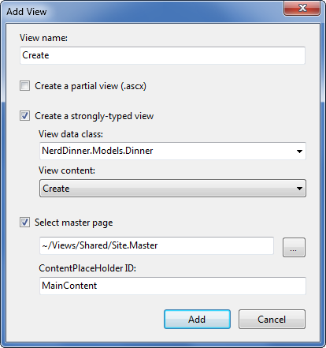

When we click the "Add" button, Visual Studio will save a new scaffold-based "Create.aspx" view to the "\Views\Dinners" directory, and open it up within the IDE:

Let's make a few changes to the default "create" scaffold file that was generated for us, and modify it up to look like below:

[!code-aspx[Main](provide-crud-create-read-update-delete-data-form-entry-support/samples/sample24.aspx)]

And now when we run our application and access the *"/Dinners/Create"* URL within the browser it will render UI like below from our Create action implementation:

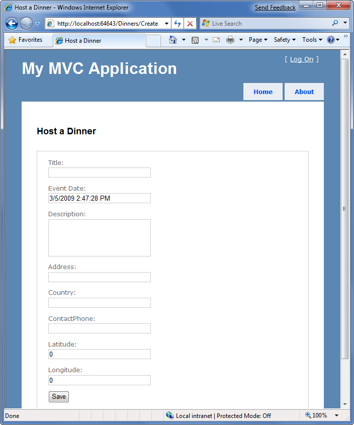

#### Implementing the HTTP-POST Create Action Method

We have the HTTP-GET version of our Create action method implemented. When a user clicks the "Save" button it performs a form post to the */Dinners/Create* URL, and submits the HTML &lt;input&gt; form values using the HTTP POST verb.

Let's now implement the HTTP POST behavior of our create action method. We'll begin by adding an overloaded "Create" action method to our DinnersController that has an "AcceptVerbs" attribute on it that indicates it handles HTTP POST scenarios:

[!code-csharp[Main](provide-crud-create-read-update-delete-data-form-entry-support/samples/sample25.cs)]

There are a variety of ways we can access the posted form parameters within our HTTP-POST enabled "Create" method.

One approach is to create a new Dinner object and then use the *UpdateModel()* helper method (like we did with the Edit action) to populate it with the posted form values. We can then add it to our DinnerRepository, persist it to the database, and redirect the user to our Details action to show the newly created Dinner using the code below:

[!code-csharp[Main](provide-crud-create-read-update-delete-data-form-entry-support/samples/sample26.cs)]

Alternatively, we can use an approach where we have our Create() action method take a Dinner object as a method parameter. ASP.NET MVC will then automatically instantiate a new Dinner object for us, populate its properties using the form inputs, and pass it to our action method:

[!code-csharp[Main](provide-crud-create-read-update-delete-data-form-entry-support/samples/sample27.cs)]

Our action method above verifies that the Dinner object has been successfully populated with the form post values by checking the ModelState.IsValid property. This will return false if there are input conversion issues (for example: a string of "BOGUS" for the EventDate property), and if there are any issues our action method redisplays the form.

If the input values are valid, then the action method attempts to add and save the new Dinner to the DinnerRepository. It wraps this work within a try/catch block and redisplays the form if there are any business rule violations (which would cause the dinnerRepository.Save() method to raise an exception).

To see this error handling behavior in action, we can request the */Dinners/Create* URL and fill out details about a new Dinner. Incorrect input or values will cause the create form to be redisplayed with the errors highlighted like below:

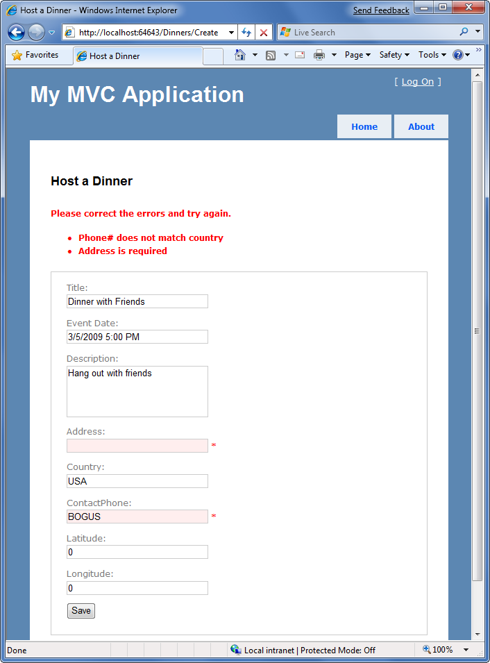

Notice how our Create form is honoring the exact same validation and business rules as our Edit form. This is because our validation and business rules were defined in the model, and were not embedded within the UI or controller of the application. This means we can later change/evolve our validation or business rules in a single place and have them apply throughout our application. We will not have to change any code within either our Edit or Create action methods to automatically honor any new rules or modifications to existing ones.

When we fix the input values and click the "Save" button again, our addition to the DinnerRepository will succeed, and a new Dinner will be added to the database. We will then be redirected to the */Dinners/Details/[id]* URL – where we will be presented with details about the newly created Dinner:

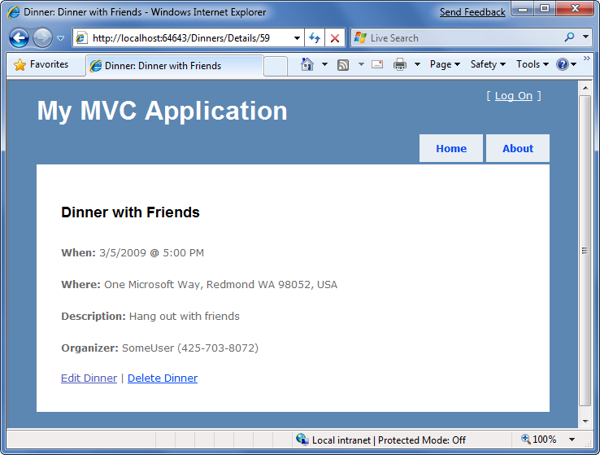

### Delete Support

Let's now add "Delete" support to our DinnersController.

#### The HTTP-GET Delete Action Method

We'll begin by implementing the HTTP GET behavior of our delete action method. This method will get called when someone visits the */Dinners/Delete/[id]* URL. Below is the implementation:

[!code-csharp[Main](provide-crud-create-read-update-delete-data-form-entry-support/samples/sample28.cs)]

The action method attempts to retrieve the Dinner to be deleted. If the Dinner exists it renders a View based on the Dinner object. If the object doesn't exist (or has already been deleted) it returns a View that renders the "NotFound" view template we created earlier for our "Details" action method.

We can create the "Delete" view template by right-clicking within the Delete action method and selecting the "Add View" context menu command. Within the "Add View" dialog we'll indicate that we are passing a Dinner object to our view template as its model, and choose to create an empty template:

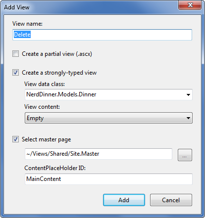

When we click the "Add" button, Visual Studio will add a new "Delete.aspx" view template file for us within our "\Views\Dinners" directory. We'll add some HTML and code to the template to implement a delete confirmation screen like below:

[!code-aspx[Main](provide-crud-create-read-update-delete-data-form-entry-support/samples/sample29.aspx)]

The code above displays the title of the Dinner to be deleted, and outputs a &lt;form&gt; element that does a POST to the /Dinners/Delete/[id] URL if the end-user clicks the "Delete" button within it.

When we run our application and access the *"/Dinners/Delete/[id]"* URL for a valid Dinner object it renders UI like below:

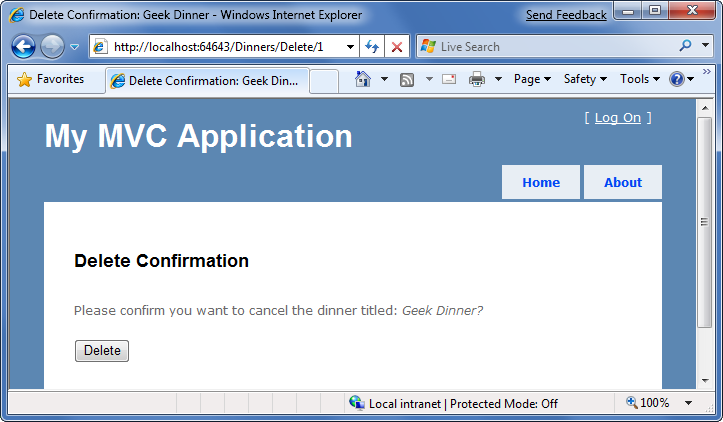

| **Side Topic: Why are we doing a POST?** |
| --- |
| You might ask – why did we go through the effort of creating a &lt;form&gt; within our Delete confirmation screen? Why not just use a standard hyperlink to link to an action method that does the actual delete operation? The reason is because we want to be careful to guard against web-crawlers and search engines discovering our URLs and inadvertently causing data to be deleted when they follow the links. HTTP-GET based URLs are considered "safe" for them to access/crawl, and they are supposed to not follow HTTP-POST ones. A good rule is to make sure you always put destructive or data modifying operations behind HTTP-POST requests. |

#### Implementing the HTTP-POST Delete Action Method

We now have the HTTP-GET version of our Delete action method implemented which displays a delete confirmation screen. When an end user clicks the "Delete" button it will perform a form post to the */Dinners/Dinner/[id]* URL.

Let's now implement the HTTP "POST" behavior of the delete action method using the code below:

[!code-csharp[Main](provide-crud-create-read-update-delete-data-form-entry-support/samples/sample30.cs)]

The HTTP-POST version of our Delete action method attempts to retrieve the dinner object to delete. If it can't find it (because it has already been deleted) it renders our "NotFound" template. If it finds the Dinner, it deletes it from the DinnerRepository. It then renders a "Deleted" template.

To implement the "Deleted" template we'll right-click in the action method and choose the "Add View" context menu. We'll name our view "Deleted" and have it be an empty template (and not take a strongly-typed model object). We'll then add some HTML content to it:

[!code-aspx[Main](provide-crud-create-read-update-delete-data-form-entry-support/samples/sample31.aspx)]

And now when we run our application and access the *"/Dinners/Delete/[id]"* URL for a valid Dinner object it will render our Dinner delete confirmation screen like below:

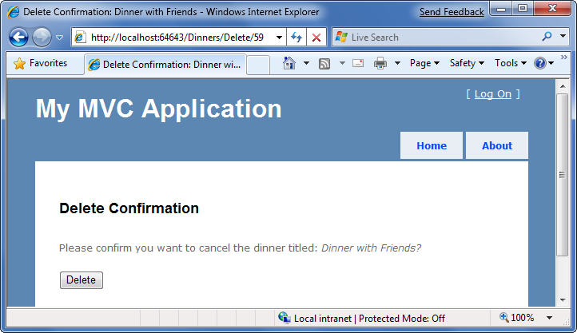

When we click the "Delete" button it will perform an HTTP-POST to the */Dinners/Delete/[id]* URL, which will delete the Dinner from our database, and display our "Deleted" view template:

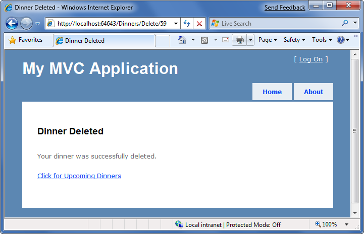

### Model Binding Security

We've discussed two different ways to use the built-in model-binding features of ASP.NET MVC. The first using the UpdateModel() method to update properties on an existing model object, and the second using ASP.NET MVC's support for passing model objects in as action method parameters. Both of these techniques are very powerful and extremely useful.

This power also brings with it responsibility. It is important to always be paranoid about security when accepting any user input, and this is also true when binding objects to form input. You should be careful to always HTML encode any user-entered values to avoid HTML and JavaScript injection attacks, and be careful of SQL injection attacks (note: we are using LINQ to SQL for our application, which automatically encodes parameters to prevent these types of attacks). You should never rely on client-side validation alone, and always employ server-side validation to guard against hackers attempting to send you bogus values.

One additional security item to make sure you think about when using the binding features of ASP.NET MVC is the scope of the objects you are binding. Specifically, you want to make sure you understand the security implications of the properties you are allowing to be bound, and make sure you only allow those properties that really should be updatable by an end-user to be updated.

By default, the UpdateModel() method will attempt to update all properties on the model object that match incoming form parameter values. Likewise, objects passed as action method parameters also by default can have all of their properties set via form parameters.

#### Locking down binding on a per-usage basis

You can lock down the binding policy on a per-usage basis by providing an explicit "include list" of properties that can be updated. This can be done by passing an extra string array parameter to the UpdateModel() method like below:

[!code-csharp[Main](provide-crud-create-read-update-delete-data-form-entry-support/samples/sample32.cs)]

Objects passed as action method parameters also support a [Bind] attribute that enables an "include list" of allowed properties to be specified like below:

[!code-csharp[Main](provide-crud-create-read-update-delete-data-form-entry-support/samples/sample33.cs)]

#### Locking down binding on a type basis

You can also lock down the binding rules on a per-type basis. This allows you to specify the binding rules once, and then have them apply in all scenarios (including both UpdateModel and action method parameter scenarios) across all controllers and action methods.

You can customize the per-type binding rules by adding a [Bind] attribute onto a type, or by registering it within the Global.asax file of the application (useful for scenarios where you don't own the type). You can then use the Bind attribute's Include and Exclude properties to control which properties are bindable for the particular class or interface.

We'll use this technique for the Dinner class in our NerdDinner application, and add a [Bind] attribute to it that restricts the list of bindable properties to the following:

[!code-csharp[Main](provide-crud-create-read-update-delete-data-form-entry-support/samples/sample34.cs)]

Notice we are not allowing the RSVPs collection to be manipulated via binding, nor are we allowing the DinnerID or HostedBy properties to be set via binding. For security reasons we'll instead only manipulate these particular properties using explicit code within our action methods.

### CRUD Wrap-Up

ASP.NET MVC includes a number of built-in features that help with implementing form posting scenarios. We used a variety of these features to provide CRUD UI support on top of our DinnerRepository.

We are using a model-focused approach to implement our application. This means that all our validation and business rule logic is defined within our model layer – and not within our controllers or views. Neither our Controller class nor our View templates know anything about the specific business rules being enforced by our Dinner model class.

This will keep our application architecture clean and make it easier to test. We can add additional business rules to our model layer in the future and *not have to make any code changes* to our Controller or View in order for them to be supported. This is going to provide us with a great deal of agility to evolve and change our application in the future.

Our DinnersController now enables Dinner listings/details, as well as create, edit and delete support. The complete code for the class can be found below:

[!code-csharp[Main](provide-crud-create-read-update-delete-data-form-entry-support/samples/sample35.cs)]

### Next Step

We now have basic CRUD (Create, Read, Update and Delete) support implement within our DinnersController class.

Let's now look at how we can use ViewData and ViewModel classes to enable even richer UI on our forms.

>[!div class="step-by-step"]
[Previous](use-controllers-and-views-to-implement-a-listingdetails-ui.md)
[Next](use-viewdata-and-implement-viewmodel-classes.md)