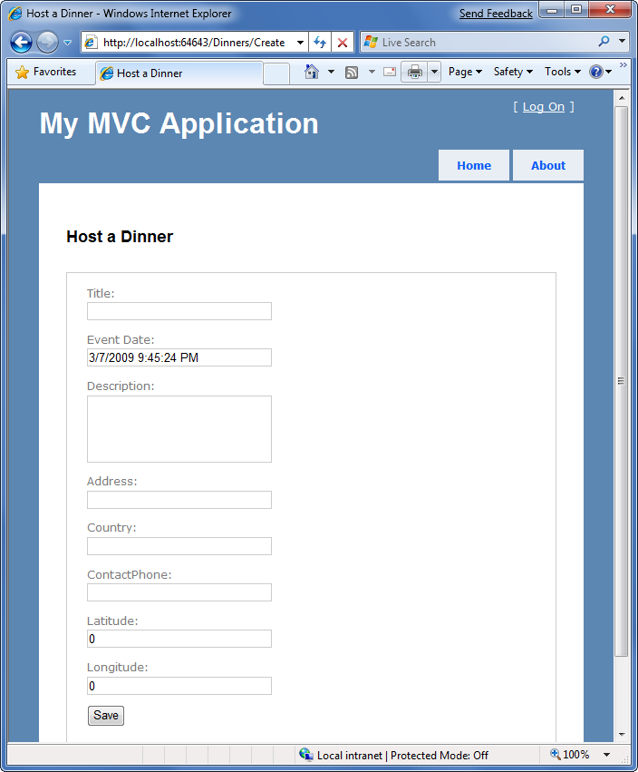
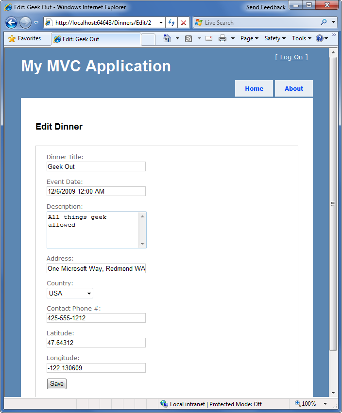
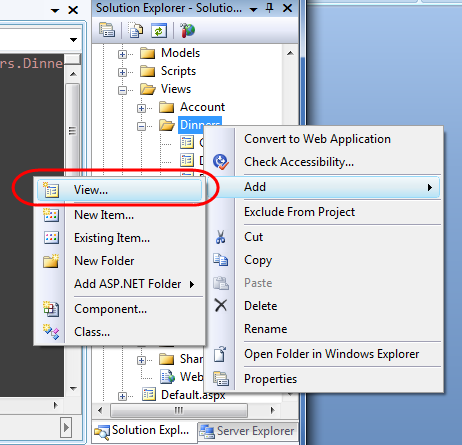
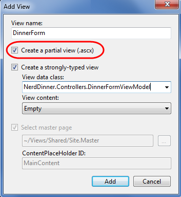
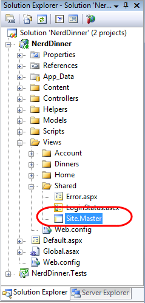
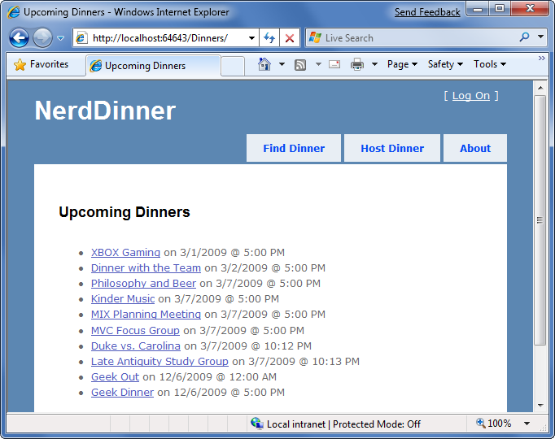
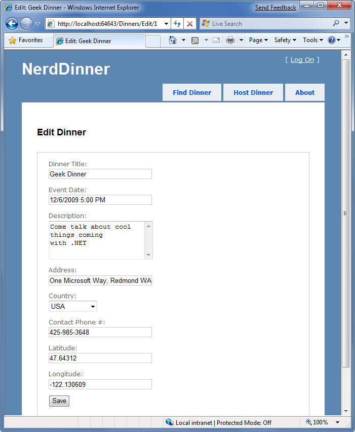

Re-use UI Using Master Pages and Partials
====================
by [Microsoft](https://github.com/microsoft)

[Download PDF](http://aspnetmvcbook.s3.amazonaws.com/aspnetmvc-nerdinner_v1.pdf)

> This is step 7 of a free ["NerdDinner" application tutorial](introducing-the-nerddinner-tutorial.md) that walks-through how to build a small, but complete, web application using ASP.NET MVC 1.
> 
> Step 7 looks at ways we can apply the "DRY Principle" within our view templates to eliminate code duplication, using partial view templates and master pages.
> 
> If you are using ASP.NET MVC 3, we recommend you follow the [Getting Started With MVC 3](../../older-versions/getting-started-with-aspnet-mvc3/cs/intro-to-aspnet-mvc-3.md) or [MVC Music Store](../../older-versions/mvc-music-store/mvc-music-store-part-1.md) tutorials.

## NerdDinner Step 7: Partials and Master Pages

One of the design philosophies ASP.NET MVC embraces is the "Do Not Repeat Yourself" principle (commonly referred to as "DRY"). A DRY design helps eliminate the duplication of code and logic, which ultimately makes applications faster to build and easier to maintain.

We've already seen the DRY principle applied in several of our NerdDinner scenarios. A few examples: our validation logic is implemented within our model layer, which enables it to be enforced across both edit and create scenarios in our controller; we are re-using the "NotFound" view template across the Edit, Details and Delete action methods; we are using a convention- naming pattern with our view templates, which eliminates the need to explicitly specify the name when we call the View() helper method; and we are re-using the DinnerFormViewModel class for both Edit and Create action scenarios.

Let's now look at ways we can apply the "DRY Principle" within our view templates to eliminate code duplication there as well.

### Re-visiting our Edit and Create View Templates

Currently we are using two different view templates – "Edit.aspx" and "Create.aspx" – to display our Dinner form UI. A quick visual comparison of them highlights how similar they are. Below is what the create form looks like:

And here is what our "Edit" form looks like:

Not much of a difference is there? Other than the title and header text, the form layout and input controls are identical.

If we open up the "Edit.aspx" and "Create.aspx" view templates we'll find that they contain identical form layout and input control code. This duplication means we end up having to make changes twice anytime we introduce or change a new Dinner property - which is not good.

### Using Partial View Templates

ASP.NET MVC supports the ability to define "partial view" templates that can be used to encapsulate view rendering logic for a sub-portion of a page. "Partials" provide a useful way to define view rendering logic once, and then re-use it in multiple places across an application.

To help "DRY-up" our Edit.aspx and Create.aspx view template duplication, we can create a partial view template named "DinnerForm.ascx" that encapsulates the form layout and input elements common to both. We'll do this by right-clicking on our /Views/Dinners directory and choosing the "Add-&gt;View" menu command:

This will display the "Add View" dialog. We'll name the new view we want to create "DinnerForm", select the "Create a partial view" checkbox within the dialog, and indicate that we will pass it a DinnerFormViewModel class:

When we click the "Add" button, Visual Studio will create a new "DinnerForm.ascx" view template for us within the "\Views\Dinners" directory.

We can then copy/paste the duplicate form layout / input control code from our Edit.aspx/ Create.aspx view templates into our new "DinnerForm.ascx" partial view template:

[!code-aspx[Main](re-use-ui-using-master-pages-and-partials/samples/sample1.aspx)]

We can then update our Edit and Create view templates to call the DinnerForm partial template and eliminate the form duplication. We can do this by calling Html.RenderPartial("DinnerForm") within our view templates:

##### Create.aspx

[!code-aspx[Main](re-use-ui-using-master-pages-and-partials/samples/sample2.aspx)]

##### Edit.aspx

[!code-aspx[Main](re-use-ui-using-master-pages-and-partials/samples/sample3.aspx)]

You can explicitly qualify the path of the partial template you want when calling Html.RenderPartial (for example: ~Views/Dinners/DinnerForm.ascx"). In our code above, though, we are taking advantage of the convention-based naming pattern within ASP.NET MVC, and just specifying "DinnerForm" as the name of the partial to render. When we do this ASP.NET MVC will look first in the convention-based views directory (for DinnersController this would be /Views/Dinners). If it doesn't find the partial template there it will then look for it in the /Views/Shared directory.

When Html.RenderPartial() is called with just the name of the partial view, ASP.NET MVC will pass to the partial view the same Model and ViewData dictionary objects used by the calling view template. Alternatively, there are overloaded versions of Html.RenderPartial() that enable you to pass an alternate Model object and/or ViewData dictionary for the partial view to use. This is useful for scenarios where you only want to pass a subset of the full Model/ViewModel.

| **Side Topic: Why &lt;% %&gt; instead of &lt;%= %&gt;?** |
| --- |
| One of the subtle things you might have noticed with the code above is that we are using a &lt;% %&gt; block instead of a &lt;%= %&gt; block when calling Html.RenderPartial(). &lt;%= %&gt; blocks in ASP.NET indicate that a developer wants to render a specified value (for example: &lt;%= "Hello" %&gt; would render "Hello"). &lt;% %&gt; blocks instead indicate that the developer wants to execute code, and that any rendered output within them must be done explicitly (for example: &lt;% Response.Write("Hello") %&gt;. The reason we are using a &lt;% %&gt; block with our Html.RenderPartial code above is because the Html.RenderPartial() method doesn't return a string, and instead outputs the content directly to the calling view template's output stream. It does this for performance efficiency reasons, and by doing so it avoids the need to create a (potentially very large) temporary string object. This reduces memory usage and improves overall application throughput. One common mistake when using Html.RenderPartial() is to forget to add a semi-colon at the end of the call when it is within a &lt;% %&gt; block. For example, this code will cause a compiler error: &lt;% Html.RenderPartial("DinnerForm") %&gt; You instead need to write: &lt;% Html.RenderPartial("DinnerForm"); %&gt; This is because &lt;% %&gt; blocks are self-contained code statements, and when using C# code statements need to be terminated with a semi-colon. |

### Using Partial View Templates to Clarify Code

We created the "DinnerForm" partial view template to avoid duplicating view rendering logic in multiple places. This is the most common reason to create partial view templates.

Sometimes it still makes sense to create partial views even when they are only being called in a single place. Very complicated view templates can often become much easier to read when their view rendering logic is extracted and partitioned into one or more well named partial templates.

For example, consider the below code-snippet from the Site.master file in our project (which we will be looking at shortly). The code is relatively straight-forward to read – partly because the logic to display a login/logout link at the top right of the screen is encapsulated within the "LogOnUserControl" partial:

[!code-aspx[Main](re-use-ui-using-master-pages-and-partials/samples/sample4.aspx)]

Whenever you find yourself getting confused trying to understand the html/code markup within a view-template, consider whether it wouldn't be clearer if some of it was extracted and refactored into well-named partial views.

### Master Pages

In addition to supporting partial views, ASP.NET MVC also supports the ability to create "master page" templates that can be used to define the common layout and top-level html of a site. Content placeholder controls can then be added to the master page to identify replaceable regions that can be overridden or "filled in" by views. This provides a very effective (and DRY) way to apply a common layout across an application.

By default, new ASP.NET MVC projects have a master page template automatically added to them. This master page is named "Site.master" and lives within the \Views\Shared\ folder:

The default Site.master file looks like below. It defines the outer html of the site, along with a menu for navigation at the top. It contains two replaceable content placeholder controls – one for the title, and the other for where the primary content of a page should be replaced:

[!code-aspx[Main](re-use-ui-using-master-pages-and-partials/samples/sample5.aspx)]

All of the view templates we've created for our NerdDinner application ("List", "Details", "Edit", "Create", "NotFound", etc) have been based on this Site.master template. This is indicated via the "MasterPageFile" attribute that was added by default to the top &lt;% @ Page %&gt; directive when we created our views using the "Add View" dialog:

[!code-aspx[Main](re-use-ui-using-master-pages-and-partials/samples/sample6.aspx)]

What this means is that we can change the Site.master content, and have the changes automatically be applied and used when we render any of our view templates.

Let's update our Site.master's header section so that the header of our application is "NerdDinner" instead of "My MVC Application". Let's also update our navigation menu so that the first tab is "Find a Dinner" (handled by the HomeController's Index() action method), and let's add a new tab called "Host a Dinner" (handled by the DinnersController's Create() action method):

[!code-aspx[Main](re-use-ui-using-master-pages-and-partials/samples/sample7.aspx)]

When we save the Site.master file and refresh our browser we'll see our header changes show up across all views within our application. For example:

And with the */Dinners/Edit/[id]* URL:

### Next Step

Partials and master pages provide very flexible options that enable you to cleanly organize views. You'll find that they help you avoid duplicating view content/ code, and make your view templates easier to read and maintain.

Let's now revisit the listing scenario we built earlier and enable scalable paging support.

>[!div class="step-by-step"]
[Previous](use-viewdata-and-implement-viewmodel-classes.md)
[Next](implement-efficient-data-paging.md)