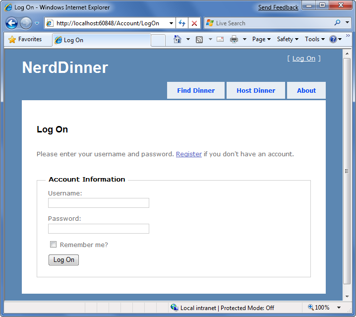
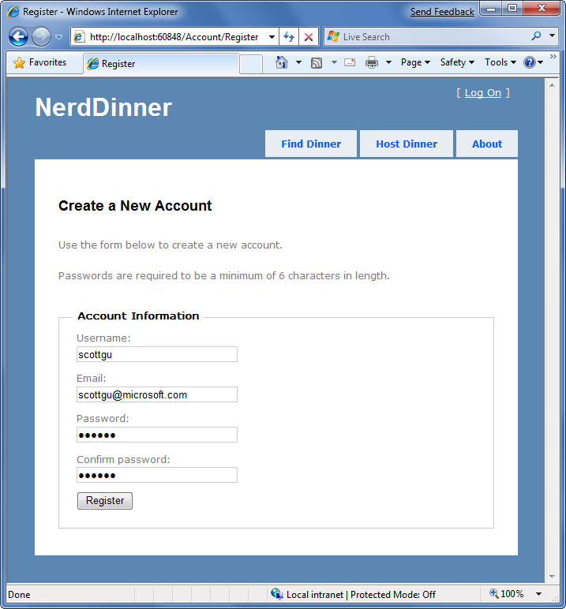
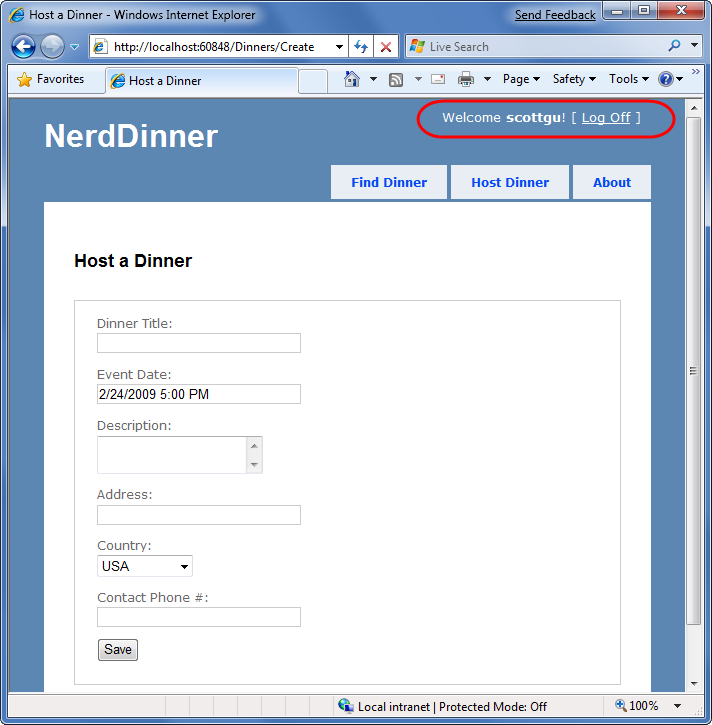
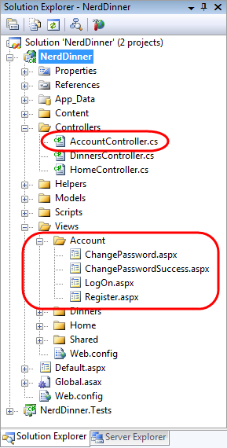
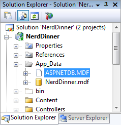
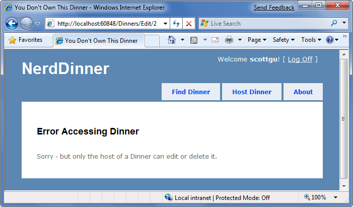
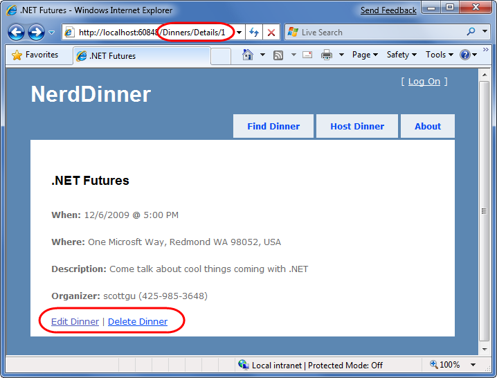

Secure Applications Using Authentication and Authorization
====================
by [Microsoft](https://github.com/microsoft)

[Download PDF](http://aspnetmvcbook.s3.amazonaws.com/aspnetmvc-nerdinner_v1.pdf)

> This is step 9 of a free ["NerdDinner" application tutorial](introducing-the-nerddinner-tutorial.md) that walks-through how to build a small, but complete, web application using ASP.NET MVC 1.
> 
> Step 9 shows how to add authentication and authorization to secure our NerdDinner application, so that users need to register and login to the site to create new dinners, and only the user who is hosting a dinner can edit it later.
> 
> If you are using ASP.NET MVC 3, we recommend you follow the [Getting Started With MVC 3](../../older-versions/getting-started-with-aspnet-mvc3/cs/intro-to-aspnet-mvc-3.md) or [MVC Music Store](../../older-versions/mvc-music-store/mvc-music-store-part-1.md) tutorials.

## NerdDinner Step 9: Authentication and Authorization

Right now our NerdDinner application grants anyone visiting the site the ability to create and edit the details of any dinner. Let's change this so that users need to register and login to the site to create new dinners, and add a restriction so that only the user who is hosting a dinner can edit it later.

To enable this we'll use authentication and authorization to secure our application.

### Understanding Authentication and Authorization

*Authentication* is the process of identifying and validating the identity of a client accessing an application. Put more simply, it is about identifying "who" the end-user is when they visit a website. ASP.NET supports multiple ways to authenticate browser users. For Internet web applications, the most common authentication approach used is called "Forms Authentication". Forms Authentication enables a developer to author an HTML login form within their application, and then validate the username/password an end-user submits against a database or other password credential store. If the username/password combination is correct, the developer can then ask ASP.NET to issue an encrypted HTTP cookie to identify the user across future requests. We'll by using forms authentication with our NerdDinner application.

*Authorization* is the process of determining whether an authenticated user has permission to access a particular URL/resource or to perform some action. For example, within our NerdDinner application we'll want to authorize that only users who are logged in can access the */Dinners/Create* URL and create new Dinners. We'll also want to add authorization logic so that only the user who is hosting a dinner can edit it – and deny edit access to all other users.

### Forms Authentication and the AccountController

The default Visual Studio project template for ASP.NET MVC automatically enables forms authentication when new ASP.NET MVC applications are created. It also automatically adds a pre-built account login page implementation to the project – which makes it really easy to integrate security within a site.

The default Site.master master page displays a "Log On" link at the top-right of the site when the user accessing it is not authenticated:

Clicking the "Log On" link takes a user to the */Account/LogOn* URL:

Visitors who haven't registered can do so by clicking the "Register" link – which will take them to the */Account/Register* URL and allow them to enter account details:

Clicking the "Register" button will create a new user within the ASP.NET Membership system, and authenticate the user onto the site using forms authentication.

When a user is logged-in, the Site.master changes the top-right of the page to output a "Welcome [username]!" message and renders a "Log Off" link instead of a "Log On" one. Clicking the "Log Off" link logs out the user:

The above login, logout, and registration functionality is implemented within the AccountController class that was added to our project by Visual Studio when it created the project. The UI for the AccountController is implemented using view templates within the \Views\Account directory:

The AccountController class uses the ASP.NET Forms Authentication system to issue encrypted authentication cookies, and the ASP.NET Membership API to store and validate usernames/passwords. The ASP.NET Membership API is extensible and enables any password credential store to be used. ASP.NET ships with built-in membership provider implementations that store username/passwords within a SQL database, or within Active Directory.

We can configure which membership provider our NerdDinner application should use by opening the "web.config" file at the root of the project and looking for the &lt;membership&gt; section within it. The default web.config added when the project was created registers the SQL membership provider, and configures it to use a connection-string named "ApplicationServices" to specify the database location.

The default "ApplicationServices" connection string (which is specified within the &lt;connectionStrings&gt; section of the web.config file) is configured to use SQL Express. It points to a SQL Express database named "ASPNETDB.MDF" under the application's "App\_Data" directory. If this database doesn't exist the first time the Membership API is used within the application, ASP.NET will automatically create the database and provision the appropriate membership database schema within it:

If instead of using SQL Express we wanted to use a full SQL Server instance (or connect to a remote database), all we'd need to-do is to update the "ApplicationServices" connection string within the web.config file and make sure that the appropriate membership schema has been added to the database it points at. You can run the "aspnet\_regsql.exe" utility within the \Windows\Microsoft.NET\Framework\v2.0.50727\ directory to add the appropriate schema for membership and the other ASP.NET application services to a database.

### Authorizing the /Dinners/Create URL using the [Authorize] filter

We didn't have to write any code to enable a secure authentication and account management implementation for the NerdDinner application. Users can register new accounts with our application, and login/logout of the site.

Now we can add authorization logic to the application, and use the authentication status and username of visitors to control what they can and can't do within the site. Let's begin by adding authorization logic to the "Create" action methods of our DinnersController class. Specifically, we will require that users accessing the */Dinners/Create* URL must be logged in. If they aren't logged in we'll redirect them to the login page so that they can sign-in.

Implementing this logic is pretty easy. All we need to-do is to add an [Authorize] filter attribute to our Create action methods like so:

[!code-csharp[Main](secure-applications-using-authentication-and-authorization/samples/sample1.cs)]

ASP.NET MVC supports the ability to create "action filters" that can be used to implement re-usable logic that can be declaratively applied to action methods. The [Authorize] filter is one of the built-in action filters provided by ASP.NET MVC, and it enables a developer to declaratively apply authorization rules to action methods and controller classes.

When applied without any parameters (like above) the [Authorize] filter enforces that the user making the action method request must be logged in – and it will automatically redirect the browser to the login URL if they aren't. When doing this redirect the originally requested URL is passed as a querystring argument (for example: /Account/LogOn?ReturnUrl=%2fDinners%2fCreate). The AccountController will then redirect the user back to the originally requested URL once they login.

The [Authorize] filter optionally supports the ability to specify a "Users" or "Roles" property that can be used to require that the user is both logged in and within a list of allowed users or a member of an allowed security role. For example, the code below only allows two specific users, "scottgu" and "billg", to access the /Dinners/Create URL:

[!code-csharp[Main](secure-applications-using-authentication-and-authorization/samples/sample2.cs)]

Embedding specific user names within code tends to be pretty un-maintainable though. A better approach is to define higher-level "roles" that the code checks against, and then to map users into the role using either a database or active directory system (enabling the actual user mapping list to be stored externally from the code). ASP.NET includes a built-in role management API as well as a built-in set of role providers (including ones for SQL and Active Directory) that can help perform this user/role mapping. We could then update the code to only allow users within a specific "admin" role to access the /Dinners/Create URL:

[!code-csharp[Main](secure-applications-using-authentication-and-authorization/samples/sample3.cs)]

### Using the User.Identity.Name property when Creating Dinners

We can retrieve the username of the currently logged-in user of a request using the User.Identity.Name property exposed on the Controller base class.

Earlier when we implemented the HTTP-POST version of our Create() action method we had hardcoded the "HostedBy" property of the Dinner to a static string. We can now update this code to instead use the User.Identity.Name property, as well as automatically add an RSVP for the host creating the Dinner:

[!code-csharp[Main](secure-applications-using-authentication-and-authorization/samples/sample4.cs)]

Because we have added an [Authorize] attribute to the Create() method, ASP.NET MVC ensures that the action method only executes if the user visiting the /Dinners/Create URL is logged in on the site. As such, the User.Identity.Name property value will always contain a valid username.

### Using the User.Identity.Name property when Editing Dinners

Let's now add some authorization logic that restricts users so that they can only edit the properties of dinners they themselves are hosting.

To help with this, we'll first add an "IsHostedBy(username)" helper method to our Dinner object (within the Dinner.cs partial class we built earlier). This helper method returns true or false depending on whether a supplied username matches the Dinner HostedBy property, and encapsulates the logic necessary to perform a case-insensitive string comparison of them:

[!code-csharp[Main](secure-applications-using-authentication-and-authorization/samples/sample5.cs)]

We'll then add an [Authorize] attribute to the Edit() action methods within our DinnersController class. This will ensure that users must be logged in to request a */Dinners/Edit/[id]* URL.

We can then add code to our Edit methods that uses the Dinner.IsHostedBy(username) helper method to verify that the logged-in user matches the Dinner host. If the user is not the host, we'll display an "InvalidOwner" view and terminate the request. The code to do this looks like below:

[!code-csharp[Main](secure-applications-using-authentication-and-authorization/samples/sample6.cs)]

We can then right-click on the \Views\Dinners directory and choose the Add-&gt;View menu command to create a new "InvalidOwner" view. We'll populate it with the below error message:

[!code-aspx[Main](secure-applications-using-authentication-and-authorization/samples/sample7.aspx)]

And now when a user attempts to edit a dinner they don't own, they'll get an error message:

We can repeat the same steps for the Delete() action methods within our controller to lock down permission to delete Dinners as well, and ensure that only the host of a Dinner can delete it.

### Showing/Hiding Edit and Delete Links

We are linking to the Edit and Delete action method of our DinnersController class from our Details URL:

Currently we are showing the Edit and Delete action links regardless of whether the visitor to the details URL is the host of the dinner. Let's change this so that the links are only displayed if the visiting user is the owner of the dinner.

The Details() action method within our DinnersController retrieves a Dinner object and then passes it as the model object to our view template:

[!code-csharp[Main](secure-applications-using-authentication-and-authorization/samples/sample8.cs)]

We can update our view template to conditionally show/hide the Edit and Delete links by using the Dinner.IsHostedBy() helper method like below:

[!code-aspx[Main](secure-applications-using-authentication-and-authorization/samples/sample9.aspx)]

#### Next Steps

Let's now look at how we can enable authenticated users to RSVP for dinners using AJAX.

>[!div class="step-by-step"]
[Previous](implement-efficient-data-paging.md)
[Next](use-ajax-to-deliver-dynamic-updates.md)