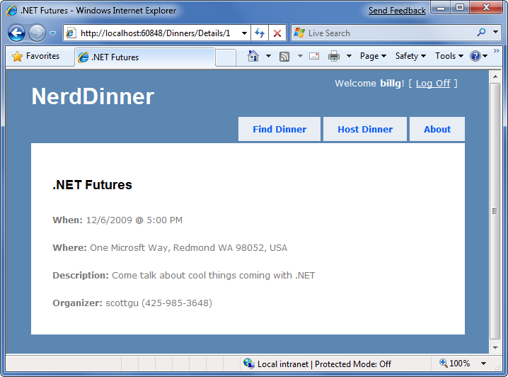
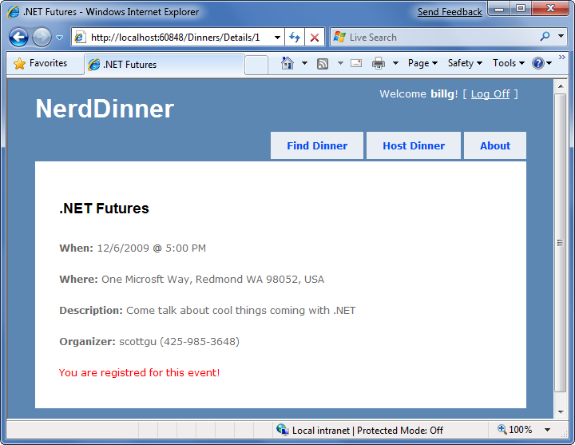
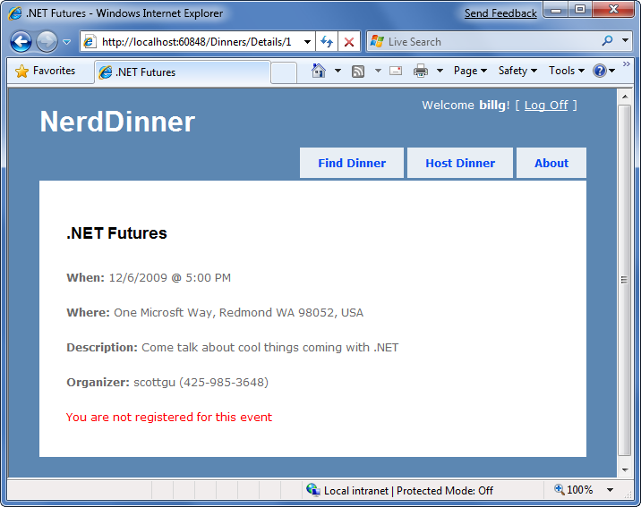
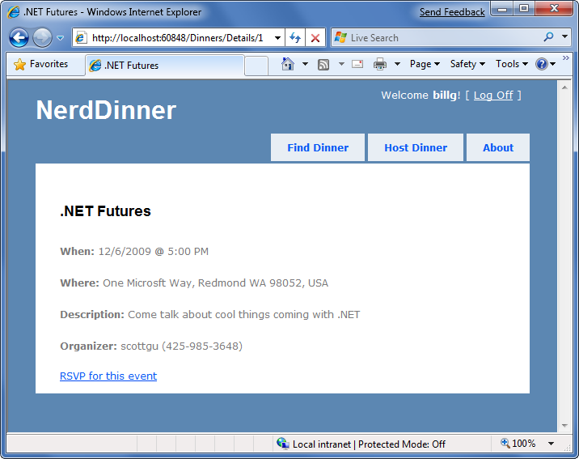
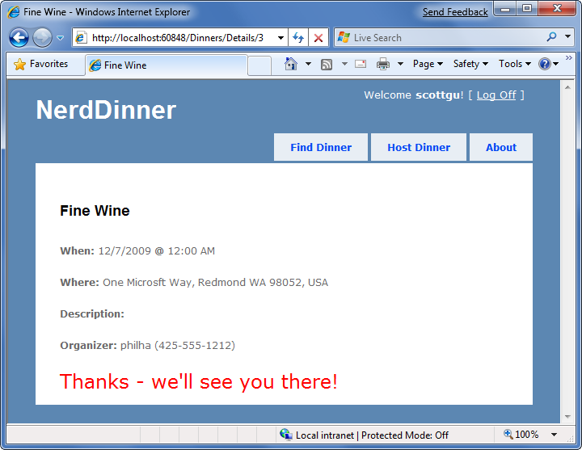

Use AJAX to Deliver Dynamic Updates
====================
by [Microsoft](https://github.com/microsoft)

[Download PDF](http://aspnetmvcbook.s3.amazonaws.com/aspnetmvc-nerdinner_v1.pdf)

> This is step 10 of a free ["NerdDinner" application tutorial](introducing-the-nerddinner-tutorial.md) that walks-through how to build a small, but complete, web application using ASP.NET MVC 1.
> 
> Step 10 implements support for logged-in users to RSVP their interest in attending a dinner, using an Ajax-based approach integrated within the dinner details page.
> 
> If you are using ASP.NET MVC 3, we recommend you follow the [Getting Started With MVC 3](../../older-versions/getting-started-with-aspnet-mvc3/cs/intro-to-aspnet-mvc-3.md) or [MVC Music Store](../../older-versions/mvc-music-store/mvc-music-store-part-1.md) tutorials.

## NerdDinner Step 10: AJAX Enabling RSVPs Accepts

Let's now implement support for logged-in users to RSVP their interest in attending a dinner. We'll enable this using an AJAX-based approach integrated within the dinner details page.

### Indicating whether the user is RSVP'd

Users can visit the */Dinners/Details/[id*] URL to see details about a particular dinner:

The Details() action method is implemented like so:

[!code-csharp[Main](use-ajax-to-deliver-dynamic-updates/samples/sample1.cs)]

Our first step to implement RSVP support will be to add an "IsUserRegistered(username)" helper method to our Dinner object (within the Dinner.cs partial class we built earlier). This helper method returns true or false depending on whether the user is currently RSVP'd for the Dinner:

[!code-csharp[Main](use-ajax-to-deliver-dynamic-updates/samples/sample2.cs)]

We can then add the following code to our Details.aspx view template to display an appropriate message indicating whether the user is registered or not for the event:

[!code-html[Main](use-ajax-to-deliver-dynamic-updates/samples/sample3.html)]

And now when a user visits a Dinner they are registered for they'll see this message:

And when they visit a Dinner they are not registered for they'll see the below message:

### Implementing the Register Action Method

Let's now add the functionality necessary to enable users to RSVP for a dinner from the details page.

To implement this, we'll create a new "RSVPController" class by right-clicking on the \Controllers directory and choosing the Add-&gt;Controller menu command.

We'll implement a "Register" action method within the new RSVPController class that takes an id for a Dinner as an argument, retrieves the appropriate Dinner object, checks to see if the logged-in user is currently in the list of users who have registered for it, and if not adds an RSVP object for them:

[!code-csharp[Main](use-ajax-to-deliver-dynamic-updates/samples/sample4.cs)]

Notice above how we are returning a simple string as the output of the action method. We could have embedded this message within a view template – but since it is so small we'll just use the Content() helper method on the controller base class and return a string message like above.

### Calling the RSVPForEvent Action Method using AJAX

We'll use AJAX to invoke the Register action method from our Details view. Implementing this is pretty easy. First we'll add two script library references:

[!code-html[Main](use-ajax-to-deliver-dynamic-updates/samples/sample5.html)]

The first library references the core ASP.NET AJAX client-side script library. This file is approximately 24k in size (compressed) and contains core client-side AJAX functionality. The second library contains utility functions that integrate with ASP.NET MVC's built-in AJAX helper methods (which we'll use shortly).

We can then update the view template code we added earlier so that instead of outputing a "You are not registered for this event" message, we instead render a link that when pushed performs an AJAX call that invokes our RSVPForEvent action method on our RSVP controller and RSVPs the user:

[!code-aspx[Main](use-ajax-to-deliver-dynamic-updates/samples/sample6.aspx)]

The Ajax.ActionLink() helper method used above is built-into ASP.NET MVC and is similar to the Html.ActionLink() helper method except that instead of performing a standard navigation it makes an AJAX call to the action method when the link is clicked. Above we are calling the "Register" action method on the "RSVP" controller and passing the DinnerID as the "id" parameter to it. The final AjaxOptions parameter we are passing indicates that we want to take the content returned from the action method and update the HTML &lt;div&gt; element on the page whose id is "rsvpmsg".

And now when a user browses to a dinner they aren't registered for yet they'll see a link to RSVP for it:

If they click the "RSVP for this event" link they'll make an AJAX call to the Register action method on the RSVP controller, and when it completes they'll see an updated message like below:

The network bandwidth and traffic involved when making this AJAX call is really lightweight. When the user clicks on the "RSVP for this event" link, a small HTTP POST network request is made to the */Dinners/Register/1* URL that looks like below on the wire:

[!code-console[Main](use-ajax-to-deliver-dynamic-updates/samples/sample7.cmd)]

And the response from our Register action method is simply:

[!code-console[Main](use-ajax-to-deliver-dynamic-updates/samples/sample8.cmd)]

This lightweight call is fast and will work even over a slow network.

### Adding a jQuery Animation

The AJAX functionality we implemented works well and fast. Sometimes it can happen so fast, though, that a user might not notice that the RSVP link has been replaced with new text. To make the outcome a little more obvious we can add a simple animation to draw attention to the update message.

The default ASP.NET MVC project template includes jQuery – an excellent (and very popular) open source JavaScript library that is also supported by Microsoft. jQuery provides a number of features, including a nice HTML DOM selection and effects library.

To use jQuery we'll first add a script reference to it. Because we are going to be using jQuery within a variety of places within our site, we'll add the script reference within our Site.master master page file so that all pages can use it.

[!code-html[Main](use-ajax-to-deliver-dynamic-updates/samples/sample9.html)]

*Tip: make sure you have installed the JavaScript intellisense hotfix for VS 2008 SP1 that enables richer intellisense support for JavaScript files (including jQuery). You can download it from: http://tinyurl.com/vs2008javascripthotfix*

Code written using JQuery often uses a global "$()" JavaScript method that retrieves one or more HTML elements using a CSS selector. For example, *$("#rsvpmsg")* selects any HTML element with the id of rsvpmsg, while *$(".something")* would select all elements with the "something" CSS class name. You can also write more advanced queries like "return all of the checked radio buttons" using a selector query like: *$("input[@type=radio][@checked]")*.

Once you've selected elements, you can call methods on them to take action, like hiding them: *$("#rsvpmsg").hide();*

For our RSVP scenario, we'll define a simple JavaScript function named "AnimateRSVPMessage" that selects the "rsvpmsg" &lt;div&gt; and animates the size of its text content. The below code starts the text small and then causes it to increase over a 400 milliseconds timeframe:

[!code-html[Main](use-ajax-to-deliver-dynamic-updates/samples/sample10.html)]

We can then wire-up this JavaScript function to be called after our AJAX call successfully completes by passing its name to our Ajax.ActionLink() helper method (via the AjaxOptions "OnSuccess" event property):

[!code-aspx[Main](use-ajax-to-deliver-dynamic-updates/samples/sample11.aspx)]

And now when the "RSVP for this event" link is clicked and our AJAX call completes successfully, the content message sent back will animate and grow large:

In addition to providing an "OnSuccess" event, the AjaxOptions object exposes OnBegin, OnFailure, and OnComplete events that you can handle (along with a variety of other properties and useful options).

### Cleanup - Refactor out a RSVP Partial View

Our details view template is starting to get a little long, which overtime will make it a little harder to understand. To help improve the code readability, let's finish up by creating a partial view – RSVPStatus.ascx – that encapsulate all of the RSVP view code for our Details page.

We can do this by right-clicking on the \Views\Dinners folder and then choosing the Add-&gt;View menu command. We'll have it take a Dinner object as its strongly-typed ViewModel. We can then copy/paste the RSVP content from our Details.aspx view into it.

Once we've done that, let's also create another partial view – EditAndDeleteLinks.ascx - that encapsulates our Edit and Delete link view code. We'll also have it take a Dinner object as its strongly-typed ViewModel, and copy/paste the Edit and Delete logic from our Details.aspx view into it.

Our details view template can then just include two Html.RenderPartial() method calls at the bottom:

[!code-aspx[Main](use-ajax-to-deliver-dynamic-updates/samples/sample12.aspx)]

This makes the code cleaner to read and maintain.

### Next Step

Let's now look at how we can use AJAX even further and add interactive mapping support to our application.

>[!div class="step-by-step"]
[Previous](secure-applications-using-authentication-and-authorization.md)
[Next](use-ajax-to-implement-mapping-scenarios.md)