Use AJAX to Implement Mapping Scenarios
====================
by [Microsoft](https://github.com/microsoft)

[Download PDF](http://aspnetmvcbook.s3.amazonaws.com/aspnetmvc-nerdinner_v1.pdf)

> This is step 11 of a free ["NerdDinner" application tutorial](introducing-the-nerddinner-tutorial.md) that walks-through how to build a small, but complete, web application using ASP.NET MVC 1.
> 
> Step 11 shows how to integrate AJAX mapping support into our NerdDinner application, enabling users who are creating, editing or viewing dinners to see the location of the dinner graphically.
> 
> If you are using ASP.NET MVC 3, we recommend you follow the [Getting Started With MVC 3](../../older-versions/getting-started-with-aspnet-mvc3/cs/intro-to-aspnet-mvc-3.md) or [MVC Music Store](../../older-versions/mvc-music-store/mvc-music-store-part-1.md) tutorials.

## NerdDinner Step 11: Integrating an AJAX Map

We'll now make our application a little more visually exciting by integrating AJAX mapping support. This will enable users who are creating, editing or viewing dinners to see the location of the dinner graphically.

### Creating a Map Partial View

We are going to use mapping functionality in several places within our application. To keep our code DRY we'll encapsulate the common map functionality within a single partial template that we can re-use across multiple controller actions and views. We'll name this partial view "map.ascx" and create it within the \Views\Dinners directory.

We can create the map.ascx partial by right-clicking on the \Views\Dinners directory and choosing the Add-&gt;View menu command. We'll name the view "Map.ascx", check it as a partial view, and indicate that we are going to pass it a strongly-typed "Dinner" model class:

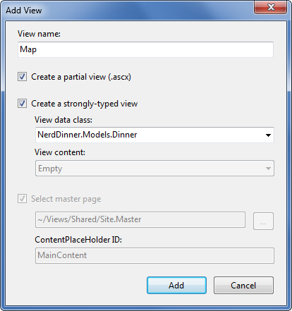

When we click the "Add" button our partial template will be created. We'll then update the Map.ascx file to have the following content:

[!code-aspx[Main](use-ajax-to-implement-mapping-scenarios/samples/sample1.aspx)]

The first &lt;script&gt; reference points to the Microsoft Virtual Earth 6.2 mapping library. The second &lt;script&gt; reference points to a map.js file that we will shortly create which will encapsulate our common Javascript mapping logic. The &lt;div id="theMap"&gt; element is the HTML container that Virtual Earth will use to host the map.

We then have an embedded &lt;script&gt; block that contains two JavaScript functions specific to this view. The first function uses jQuery to wire-up a function that executes when the page is ready to run client-side script. It calls a LoadMap() helper function that we'll define within our Map.js script file to load the virtual earth map control. The second function is a callback event handler that adds a pin to the map that identifies a location.

Notice how we are using a server-side &lt;%= %&gt; block within the client-side script block to embed the latitude and longitude of the Dinner we want to map into the JavaScript. This is a useful technique to output dynamic values that can be used by client-side script (without requiring a separate AJAX call back to the server to retrieve the values – which makes it faster). The &lt;%= %&gt; blocks will execute when the view is rendering on the server – and so the output of the HTML will just end up with embedded JavaScript values (for example: var latitude = 47.64312;).

### Creating a Map.js utility library

Let's now create the Map.js file that we can use to encapsulate the JavaScript functionality for our map (and implement the LoadMap and LoadPin methods above). We can do this by right-clicking on the \Scripts directory within our project, and then choose the "Add-&gt;New Item" menu command, select the JScript item, and name it "Map.js".

Below is the JavaScript code we'll add to the Map.js file that will interact with Virtual Earth to display our map and add locations pins to it for our dinners:

[!code-javascript[Main](use-ajax-to-implement-mapping-scenarios/samples/sample2.js)]

### Integrating the Map with Create and Edit Forms

We'll now integrate the Map support with our existing Create and Edit scenarios. The good news is that this is pretty easy to-do, and doesn't require us to change any of our Controller code. Because our Create and Edit views share a common "DinnerForm" partial view to implement the dinner form UI, we can add the map in one place and have both our Create and Edit scenarios use it.

All we need to-do is to open the \Views\Dinners\DinnerForm.ascx partial view and update it to include our new map partial. Below is what the updated DinnerForm will look like once the map is added (note: the HTML form elements are omitted from the code snippet below for brevity):

[!code-aspx[Main](use-ajax-to-implement-mapping-scenarios/samples/sample3.aspx)]

The DinnerForm partial above takes an object of type "DinnerFormViewModel" as its model type (because it needs both a Dinner object, as well as a SelectList to populate the dropdownlist of countries). Our Map partial just needs an object of type "Dinner" as its model type, and so when we render the map partial we are passing just the Dinner sub-property of DinnerFormViewModel to it:

[!code-aspx[Main](use-ajax-to-implement-mapping-scenarios/samples/sample4.aspx)]

The JavaScript function we've added to the partial uses jQuery to attach a "blur" event to the "Address" HTML textbox. You've probably heard of "focus" events that fire when a user clicks or tabs into a textbox. The opposite is a "blur" event that fires when a user exits a textbox. The above event handler clears the latitude and longitude textbox values when this happens, and then plots the new address location on our map. A callback event handler that we defined within the map.js file will then update the longitude and latitude textboxes on our form using values returned by virtual earth based on the address we gave it.

And now when we run our application again and click the "Host Dinner" tab we'll see a default map displayed along with our standard Dinner form elements:

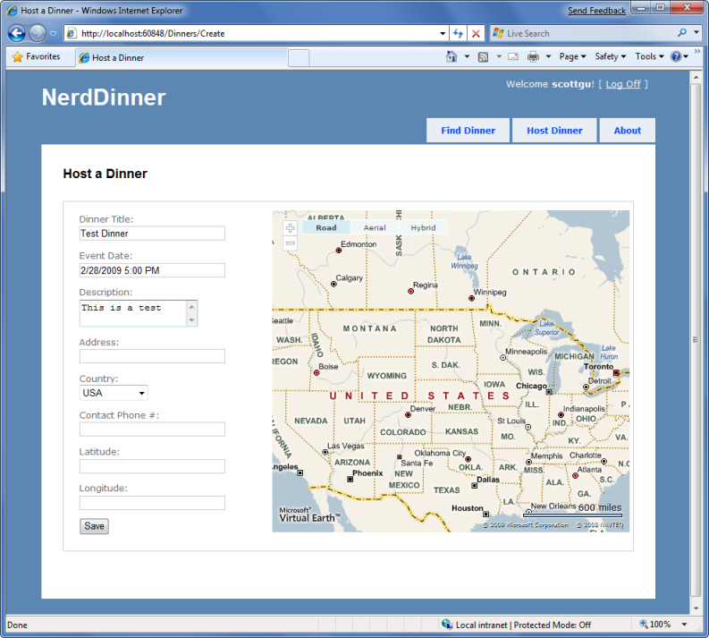

When we type in an address, and then tab away, the map will dynamically update to display the location, and our event handler will populate the latitude/longitude textboxes with the location values:

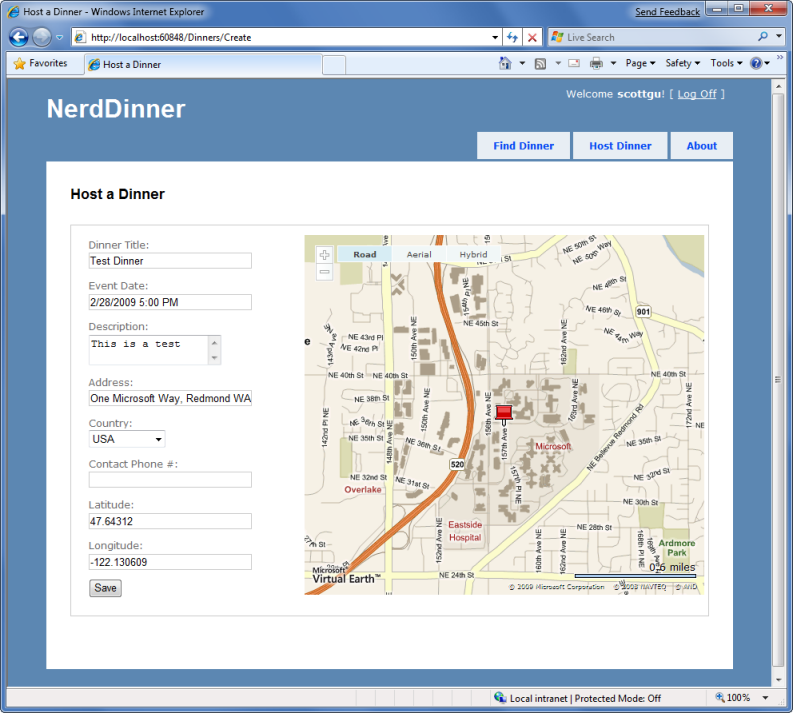

If we save the new dinner and then open it again for editing, we'll find that the map location is displayed when the page loads:

Every time the address field is changed, the map and the latitude/longitude coordinates will update.

Now that the map displays the Dinner location, we can also change the Latitude and Longitude form fields from being visible textboxes to instead be hidden elements (since the map is automatically updating them each time an address is entered). To-do this we'll switch from using the Html.TextBox() HTML helper to using the Html.Hidden() helper method:

[!code-aspx[Main](use-ajax-to-implement-mapping-scenarios/samples/sample5.aspx)]

And now our forms are a little more user-friendly and avoid displaying the raw latitude/longitude (while still storing them with each Dinner in the database):

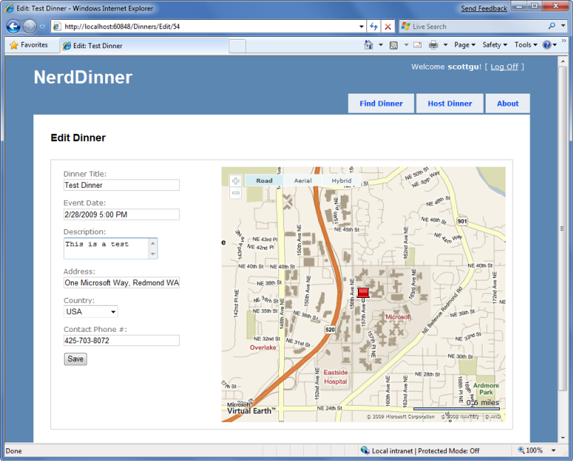

### Integrating the Map with the Details View

Now that we have the map integrated with our Create and Edit scenarios, let's also integrate it with our Details scenario. All we need to-do is to call &lt;% Html.RenderPartial("map"); %&gt; within the Details view.

Below is what the source code to the complete Details view (with map integration) looks like:

[!code-aspx[Main](use-ajax-to-implement-mapping-scenarios/samples/sample6.aspx)]

And now when a user navigates to a /Dinners/Details/[id] URL they'll see details about the dinner, the location of the dinner on the map (complete with a push-pin that when hovered over displays the title of the dinner and the address of it), and have an AJAX link to RSVP for it:

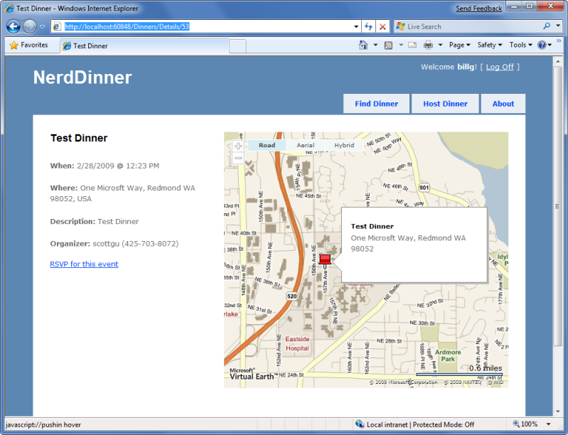

### Implementing Location Search in our Database and Repository

To finish off our AJAX implementation, let's add a Map to the home page of the application that allows users to graphically search for dinners near them.

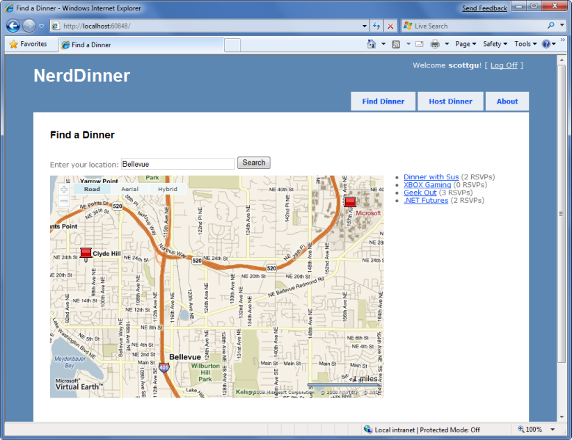

We'll begin by implementing support within our database and data repository layer to efficiently perform a location-based radius search for Dinners. We could use the new [geospatial features of SQL 2008](https://www.microsoft.com/sqlserver/2008/en/us/spatial-data.aspx) to implement this, or alternatively we can use a SQL function approach that Gary Dryden discussed in article here: [http://www.codeproject.com/KB/cs/distancebetweenlocations.aspx](http://www.codeproject.com/KB/cs/distancebetweenlocations.aspx) and Rob Conery blogged about using with LINQ to SQL here: [http://blog.wekeroad.com/2007/08/30/linq-and-geocoding/](http://blog.wekeroad.com/2007/08/30/linq-and-geocoding/)

To implement this technique, we will open the "Server Explorer" within Visual Studio, select the NerdDinner database, and then right-click on the "functions" sub-node under it and choose to create a new "Scalar-valued function":

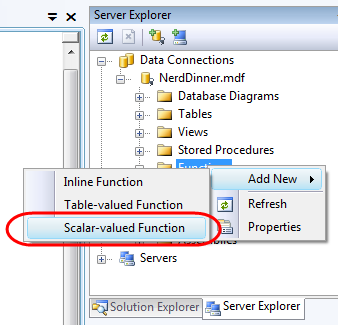

We'll then paste in the following DistanceBetween function:

[!code-sql[Main](use-ajax-to-implement-mapping-scenarios/samples/sample7.sql)]

We'll then create a new table-valued function in SQL Server that we'll call "NearestDinners":

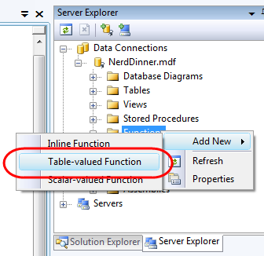

This "NearestDinners" table function uses the DistanceBetween helper function to return all Dinners within 100 miles of the latitude and longitude we supply it:

[!code-sql[Main](use-ajax-to-implement-mapping-scenarios/samples/sample8.sql)]

To call this function, we'll first open up the LINQ to SQL designer by double-clicking on the NerdDinner.dbml file within our \Models directory:

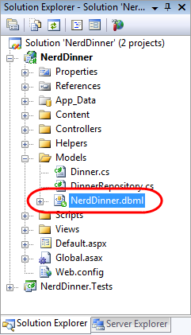

We'll then drag the NearestDinners and DistanceBetween functions onto the LINQ to SQL designer, which will cause them to be added as methods on our LINQ to SQL NerdDinnerDataContext class:

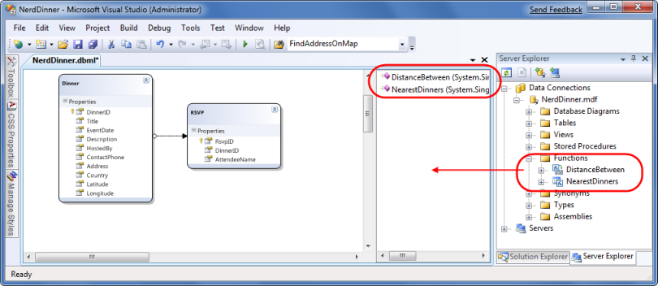

We can then expose a "FindByLocation" query method on our DinnerRepository class that uses the NearestDinner function to return upcoming Dinners that are within 100 miles of the specified location:

[!code-csharp[Main](use-ajax-to-implement-mapping-scenarios/samples/sample9.cs)]

### Implementing a JSON-based AJAX Search Action Method

We'll now implement a controller action method that takes advantage of the new FindByLocation() repository method to return back a list of Dinner data that can be used to populate a map. We'll have this action method return back the Dinner data in a JSON (JavaScript Object Notation) format so that it can be easily manipulated using JavaScript on the client.

To implement this, we'll create a new "SearchController" class by right-clicking on the \Controllers directory and choosing the Add-&gt;Controller menu command. We'll then implement a "SearchByLocation" action method within the new SearchController class like below:

[!code-csharp[Main](use-ajax-to-implement-mapping-scenarios/samples/sample10.cs)]

The SearchController's SearchByLocation action method internally calls the FindByLocation method on DinnerRespository to get a list of nearby dinners. Rather than return the Dinner objects directly to the client, though, it instead returns JsonDinner objects. The JsonDinner class exposes a subset of Dinner properties (for example: for security reasons it doesn't disclose the names of the people who have RSVP'd for a dinner). It also includes an RSVPCount property that doesn't exist on Dinner– and which is dynamically calculated by counting the number of RSVP objects associated with a particular dinner.

We are then using the Json() helper method on the Controller base class to return the sequence of dinners using a JSON-based wire format. JSON is a standard text format for representing simple data-structures. Below is an example of what a JSON-formatted list of two JsonDinner objects looks like when returned from our action method:

[!code-json[Main](use-ajax-to-implement-mapping-scenarios/samples/sample11.json)]

### Calling the JSON-based AJAX method using jQuery

We are now ready to update the home page of the NerdDinner application to use the SearchController's SearchByLocation action method. To-do this, we'll open the /Views/Home/Index.aspx view template and update it to have a textbox, search button, our map, and a &lt;div&gt; element named dinnerList:

[!code-aspx[Main](use-ajax-to-implement-mapping-scenarios/samples/sample12.aspx)]

We can then add two JavaScript functions to the page:

[!code-html[Main](use-ajax-to-implement-mapping-scenarios/samples/sample13.html)]

The first JavaScript function loads the map when the page first loads. The second JavaScript function wires up a JavaScript click event handler on the search button. When the button is pressed it calls the FindDinnersGivenLocation() JavaScript function which we'll add to our Map.js file:

[!code-javascript[Main](use-ajax-to-implement-mapping-scenarios/samples/sample14.js)]

This FindDinnersGivenLocation() function calls map.Find() on the Virtual Earth Control to center it on the entered location. When the virtual earth map service returns, the map.Find() method invokes the callbackUpdateMapDinners callback method we passed it as the final argument.

The callbackUpdateMapDinners() method is where the real work is done. It uses jQuery's $.post() helper method to perform an AJAX call to our SearchController's SearchByLocation() action method – passing it the latitude and longitude of the newly centered map. It defines an inline function that will be called when the $.post() helper method completes, and the JSON-formatted dinner results returned from the SearchByLocation() action method will be passed it using a variable called "dinners". It then does a foreach over each returned dinner, and uses the dinner's latitude and longitude and other properties to add a new pin on the map. It also adds a dinner entry to the HTML list of dinners to the right of the map. It then wires-up a hover event for both the pushpins and the HTML list so that details about the dinner are displayed when a user hovers over them:

[!code-html[Main](use-ajax-to-implement-mapping-scenarios/samples/sample15.html)]

And now when we run the application and visit the home-page we'll be presented with a map. When we enter the name of a city the map will display the upcoming dinners near it:

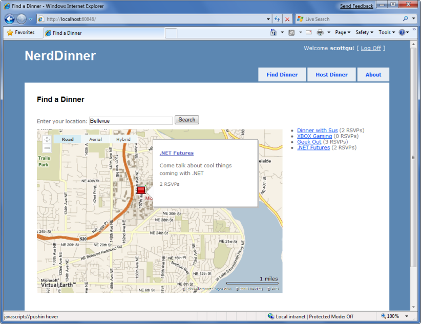

Hovering over a dinner will display details about it.

Clicking the Dinner title either in the bubble or on the right-hand side in the HTML list will navigate us to the dinner – which we can then optionally RSVP for:

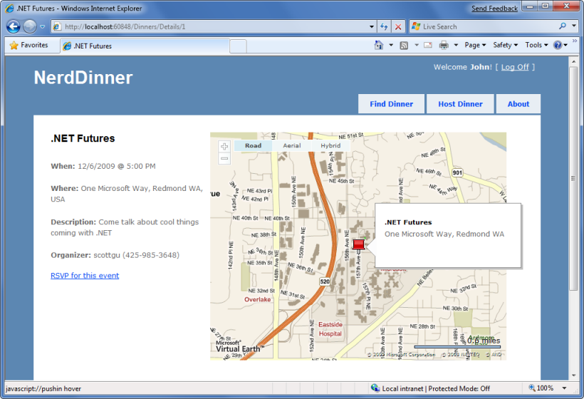

### Next Step

We've now implemented all the application functionality of our NerdDinner application. Let's now look at how we can enable automated unit testing of it.

>[!div class="step-by-step"]
[Previous](use-ajax-to-deliver-dynamic-updates.md)
[Next](enable-automated-unit-testing.md)