Use Controllers and Views to Implement a Listing/Details UI
====================
by [Microsoft](https://github.com/microsoft)

[Download PDF](http://aspnetmvcbook.s3.amazonaws.com/aspnetmvc-nerdinner_v1.pdf)

> This is step 4 of a free ["NerdDinner" application tutorial](introducing-the-nerddinner-tutorial.md) that walks-through how to build a small, but complete, web application using ASP.NET MVC 1.
> 
> Step 4 shows how to add a Controller to the application that takes advantage of our model to provide users with a data listing/details navigation experience for dinners on our NerdDinner site.
> 
> If you are using ASP.NET MVC 3, we recommend you follow the [Getting Started With MVC 3](../../older-versions/getting-started-with-aspnet-mvc3/cs/intro-to-aspnet-mvc-3.md) or [MVC Music Store](../../older-versions/mvc-music-store/mvc-music-store-part-1.md) tutorials.

## NerdDinner Step 4: Controllers and Views

With traditional web frameworks (classic ASP, PHP, ASP.NET Web Forms, etc), incoming URLs are typically mapped to files on disk. For example: a request for a URL like "/Products.aspx" or "/Products.php" might be processed by a "Products.aspx" or "Products.php" file.

Web-based MVC frameworks map URLs to server code in a slightly different way. Instead of mapping incoming URLs to files, they instead map URLs to methods on classes. These classes are called "Controllers" and they are responsible for processing incoming HTTP requests, handling user input, retrieving and saving data, and determining the response to send back to the client (display HTML, download a file, redirect to a different URL, etc).

Now that we have built up a basic model for our NerdDinner application, our next step will be to add a Controller to the application that takes advantage of it to provide users with a data listing/details navigation experience for Dinners on our site.

### Adding a DinnersController Controller

We'll begin by right-clicking on the "Controllers" folder within our web project, and then select the **Add-&gt;Controller** menu command (you can also execute this command by typing Ctrl-M, Ctrl-C):

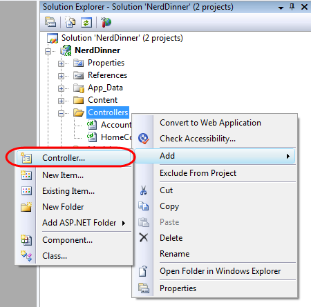

This will bring up the "Add Controller" dialog:

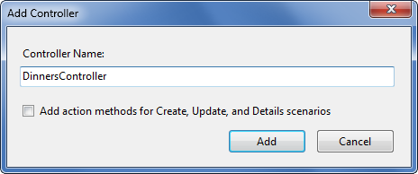

We'll name the new controller "DinnersController" and click the "Add" button. Visual Studio will then add a DinnersController.cs file under our \Controllers directory:

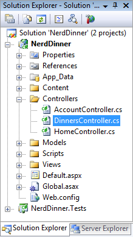

It will also open up the new DinnersController class within the code-editor.

### Adding Index() and Details() Action Methods to the DinnersController Class

We want to enable visitors using our application to browse a list of upcoming dinners, and allow them to click on any Dinner in the list to see specific details about it. We'll do this by publishing the following URLs from our application:

| **URL** | **Purpose** |
| --- | --- |
| */Dinners/* | Display an HTML list of upcoming dinners |
| */Dinners/Details/[id]* | Display details about a specific dinner indicated by an "id" parameter embedded within the URL – which will match the DinnerID of the dinner in the database. For example: /Dinners/Details/2 would display an HTML page with details about the Dinner whose DinnerID value is 2. |

We will publish initial implementations of these URLs by adding two public "action methods" to our DinnersController class like below:

[!code-csharp[Main](use-controllers-and-views-to-implement-a-listingdetails-ui/samples/sample1.cs)]

We'll then run the NerdDinner application and use our browser to invoke them. Typing in the *"/Dinners/"* URL will cause our *Index()* method to run, and it will send back the following response:

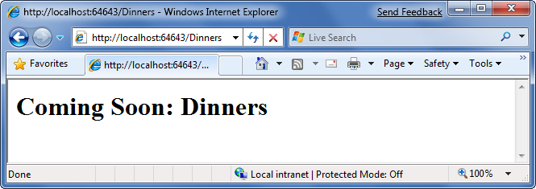

Typing in the *"/Dinners/Details/2"* URL will cause our *Details()* method to run, and send back the following response:

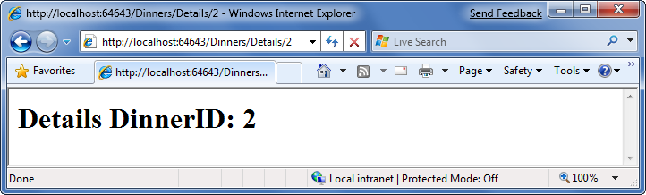

You might be wondering - how did ASP.NET MVC know to create our DinnersController class and invoke those methods? To understand that let's take a quick look at how routing works.

### Understanding ASP.NET MVC Routing

ASP.NET MVC includes a powerful URL routing engine that provides a lot of flexibility in controlling how URLs are mapped to controller classes. It allows us to completely customize how ASP.NET MVC chooses which controller class to create, which method to invoke on it, as well as configure different ways that variables can be automatically parsed from the URL/Querystring and passed to the method as parameter arguments. It delivers the flexibility to totally optimize a site for SEO (search engine optimization) as well as publish any URL structure we want from an application.

By default, new ASP.NET MVC projects come with a preconfigured set of URL routing rules already registered. This enables us to easily get started on an application without having to explicitly configure anything. The default routing rule registrations can be found within the "Application" class of our projects – which we can open by double-clicking the "Global.asax" file in the root of our project:

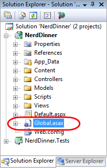

The default ASP.NET MVC routing rules are registered within the "RegisterRoutes" method of this class:

[!code-csharp[Main](use-controllers-and-views-to-implement-a-listingdetails-ui/samples/sample2.cs)]

The "routes.MapRoute()" method call above registers a default routing rule that maps incoming URLs to controller classes using the URL format: "/{controller}/{action}/{id}" – where "controller" is the name of the controller class to instantiate, "action" is the name of a public method to invoke on it, and "id" is an optional parameter embedded within the URL that can be passed as an argument to the method. The third parameter passed to the "MapRoute()" method call is a set of default values to use for the controller/action/id values in the event that they are not present in the URL (Controller = "Home", Action="Index", Id="").

Below is a table that demonstrates how a variety of URLs are mapped using the default "*/{controllers}/{action}/{id}"*route rule:

| **URL** | **Controller Class** | **Action Method** | **Parameters Passed** |
| --- | --- | --- | --- |
| */Dinners/Details/2* | DinnersController | Details(id) | id=2 |
| */Dinners/Edit/5* | DinnersController | Edit(id) | id=5 |
| */Dinners/Create* | DinnersController | Create() | N/A |
| */Dinners* | DinnersController | Index() | N/A |
| */Home* | HomeController | Index() | N/A |
| */* | HomeController | Index() | N/A |

The last three rows show the default values (Controller = Home, Action = Index, Id = "") being used. Because the "Index" method is registered as the default action name if one isn't specified, the "/Dinners" and "/Home" URLs cause the Index() action method to be invoked on their Controller classes. Because the "Home" controller is registered as the default controller if one isn't specified, the "/" URL causes the HomeController to be created, and the Index() action method on it to be invoked.

If you don't like these default URL routing rules, the good news is that they are easy to change - just edit them within the RegisterRoutes method above. For our NerdDinner application, though, we aren't going to change any of the default URL routing rules – instead we'll just use them as-is.

### Using the DinnerRepository from our DinnersController

Let's now replace our current implementation of the DinnersController's Index() and Details() action methods with implementations that use our model.

We'll use the DinnerRepository class we built earlier to implement the behavior. We'll begin by adding a "using" statement that references the "NerdDinner.Models" namespace, and then declare an instance of our DinnerRepository as a field on our DinnerController class.

Later in this chapter we'll introduce the concept of "Dependency Injection" and show another way for our Controllers to obtain a reference to a DinnerRepository that enables better unit testing – but for right now we'll just create an instance of our DinnerRepository inline like below.

[!code-csharp[Main](use-controllers-and-views-to-implement-a-listingdetails-ui/samples/sample3.cs)]

Now we are ready to generate a HTML response back using our retrieved data model objects.

### Using Views with our Controller

While it is possible to write code within our action methods to assemble HTML and then use the *Response.Write()* helper method to send it back to the client, that approach becomes fairly unwieldy quickly. A much better approach is for us to only perform application and data logic inside our DinnersController action methods, and to then pass the data needed to render a HTML response to a separate "view" template that is responsible for outputting the HTML representation of it. As we'll see in a moment, a "view" template is a text file that typically contains a combination of HTML markup and embedded rendering code.

Separating our controller logic from our view rendering brings several big benefits. In particular it helps enforce a clear "separation of concerns" between the application code and UI formatting/rendering code. This makes it much easier to unit-test application logic in isolation from UI rendering logic. It makes it easier to later modify the UI rendering templates without having to make application code changes. And it can make it easier for developers and designers to collaborate together on projects.

We can update our DinnersController class to indicate that we want to use a view template to send back an HTML UI response by changing the method signatures of our two action methods from having a return type of "void" to instead have a return type of "ActionResult". We can then call the *View()* helper method on the Controller base class to return back a "ViewResult" object like below:

[!code-csharp[Main](use-controllers-and-views-to-implement-a-listingdetails-ui/samples/sample4.cs)]

The signature of the *View()* helper method we are using above looks like below:

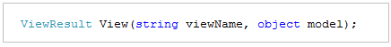

The first parameter to the *View()* helper method is the name of the view template file we want to use to render the HTML response. The second parameter is a model object that contains the data that the view template needs in order to render the HTML response.

Within our Index() action method we are calling the *View()* helper method and indicating that we want to render an HTML listing of dinners using an "Index" view template. We are passing the view template a sequence of Dinner objects to generate the list from:

[!code-csharp[Main](use-controllers-and-views-to-implement-a-listingdetails-ui/samples/sample5.cs)]

Within our Details() action method we attempt to retrieve a Dinner object using the id provided within the URL. If a valid Dinner is found we call the *View()* helper method, indicating we want to use a "Details" view template to render the retrieved Dinner object. If an invalid dinner is requested, we render a helpful error message that indicates that the Dinner doesn't exist using a "NotFound" view template (and an overloaded version of the *View()* helper method that just takes the template name):

[!code-csharp[Main](use-controllers-and-views-to-implement-a-listingdetails-ui/samples/sample6.cs)]

Let's now implement the "NotFound", "Details", and "Index" view templates.

### Implementing the "NotFound" View Template

We'll begin by implementing the "NotFound" view template – which displays a friendly error message indicating that the requested dinner can't be found.

We'll create a new view template by positioning our text cursor within a controller action method, and then right click and choose the "Add View" menu command (we can also execute this command by typing Ctrl-M, Ctrl-V):

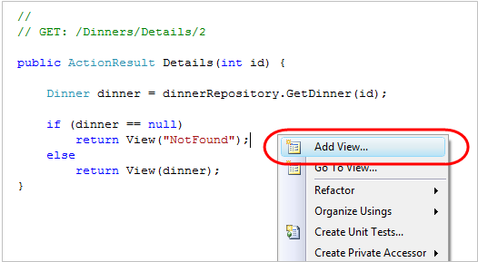

This will bring up an "Add View" dialog like below. By default the dialog will pre-populate the name of the view to create to match the name of the action method the cursor was in when the dialog was launched (in this case "Details"). Because we want to first implement the "NotFound" template, we'll override this view name and set it to instead be "NotFound":

When we click the "Add" button, Visual Studio will create a new "NotFound.aspx" view template for us within the "\Views\Dinners" directory (which it will also create if the directory doesn't already exist):

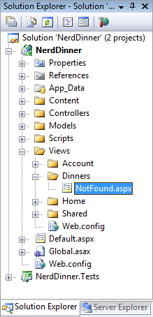

It will also open up our new "NotFound.aspx" view template within the code-editor:

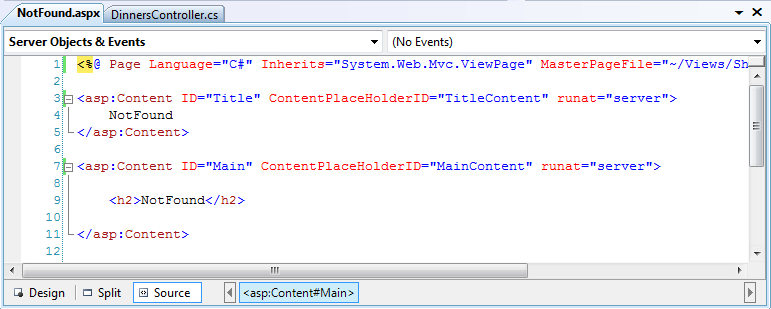

View templates by default have two "content regions" where we can add content and code. The first allows us to customize the "title" of the HTML page sent back. The second allows us to customize the "main content" of the HTML page sent back.

To implement our "NotFound" view template we'll add some basic content:

[!code-aspx[Main](use-controllers-and-views-to-implement-a-listingdetails-ui/samples/sample7.aspx)]

We can then try it out within the browser. To do this let's request the *"/Dinners/Details/9999"* URL. This will refer to a dinner that doesn't currently exist in the database, and will cause our DinnersController.Details() action method to render our "NotFound" view template:

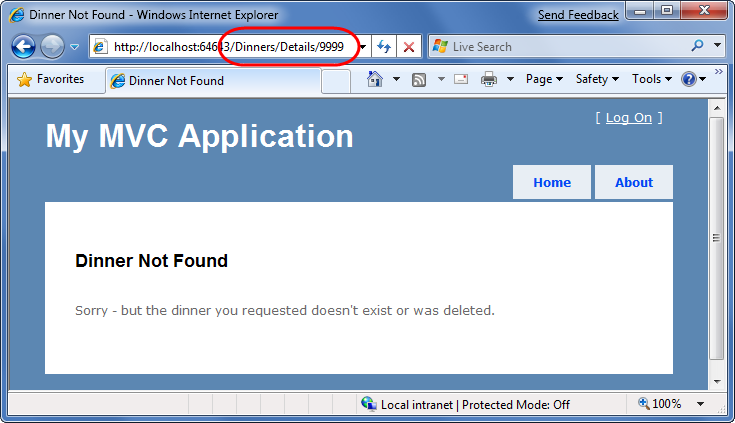

One thing you'll notice in the screen-shot above is that our basic view template has inherited a bunch of HTML that surrounds the main content on the screen. This is because our view-template is using a "master page" template that enables us to apply a consistent layout across all views on the site. We'll discuss how master pages work more in a later part of this tutorial.

### Implementing the "Details" View Template

Let's now implement the "Details" view template – which will generate HTML for a single Dinner model.

We'll do this by positioning our text cursor within the Details action method, and then right click and choose the "Add View" menu command (or press Ctrl-M, Ctrl-V):

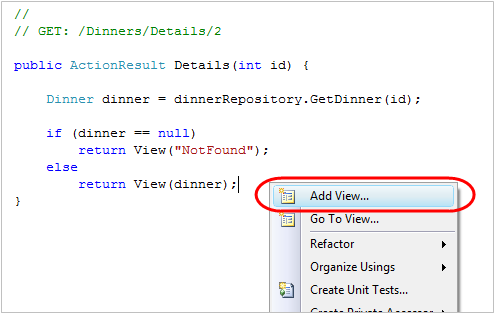

This will bring up the "Add View" dialog. We'll keep the default view name ("Details"). We'll also select the "Create a strongly-typed View" checkbox in the dialog and select (using the combobox dropdown) the name of the model type we are passing from the Controller to the View. For this view we are passing a Dinner object (the fully qualified name for this type is: "NerdDinner.Models.Dinner"):

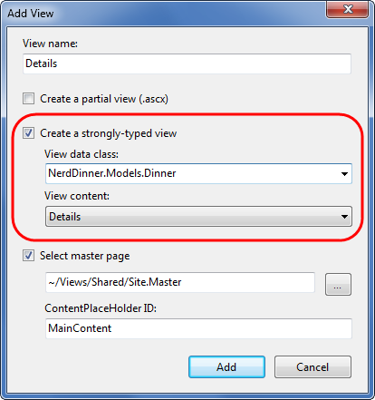

Unlike the previous template, where we chose to create an "Empty View", this time we will choose to automatically "scaffold" the view using a "Details" template. We can indicate this by changing the "View content" drop-down in the dialog above.

"Scaffolding" will generate an initial implementation of our details view template based on the Dinner object we are passing to it. This provides an easy way for us to quickly get started on our view template implementation.

When we click the "Add" button, Visual Studio will create a new "Details.aspx" view template file for us within our "\Views\Dinners" directory:

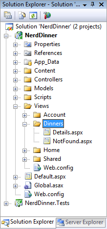

It will also open up our new "Details.aspx" view template within the code-editor. It will contain an initial scaffold implementation of a details view based on a Dinner model. The scaffolding engine uses .NET reflection to look at the public properties exposed on the class passed it, and will add appropriate content based on each type it finds:

[!code-aspx[Main](use-controllers-and-views-to-implement-a-listingdetails-ui/samples/sample8.aspx)]

We can request the *"/Dinners/Details/1"* URL to see what this "details" scaffold implementation looks like in the browser. Using this URL will display one of the dinners we manually added to our database when we first created it:

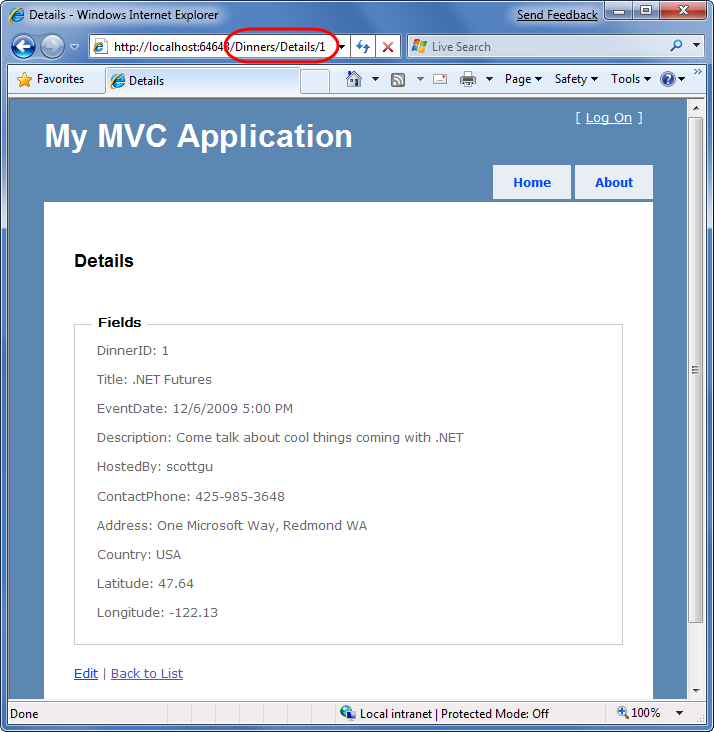

This gets us up and running quickly, and provides us with an initial implementation of our Details.aspx view. We can then go and tweak it to customize the UI to our satisfaction.

When we look at the Details.aspx template more closely, we'll find that it contains static HTML as well as embedded rendering code. &lt;% %&gt; code nuggets execute code when the view template renders, and &lt;%= %&gt; code nuggets execute the code contained within them and then render the result to the output stream of the template.

We can write code within our View that accesses the "Dinner" model object that was passed from our controller using a strongly-typed "Model" property. Visual Studio provides us with full code-intellisense when accessing this "Model" property within the editor:

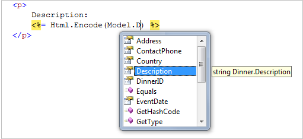

Let's make some tweaks so that the source for our final Details view template looks like below:

[!code-aspx[Main](use-controllers-and-views-to-implement-a-listingdetails-ui/samples/sample9.aspx)]

When we access the *"/Dinners/Details/1"* URL again it will now render like below:

### Implementing the "Index" View Template

Let's now implement the "Index" view template – which will generate a listing of upcoming Dinners. To-do this we'll position our text cursor within the Index action method, and then right click and choose the "Add View" menu command (or press Ctrl-M, Ctrl-V).

Within the "Add View" dialog we'll keep the view template named "Index" and select the "Create a strongly-typed view" checkbox. This time we will choose to automatically generate a "List" view template, and select "NerdDinner.Models.Dinner" as the model type passed to the view (which because we have indicated we are creating a "List" scaffold will cause the Add View dialog to assume we are passing a sequence of Dinner objects from our Controller to the View):

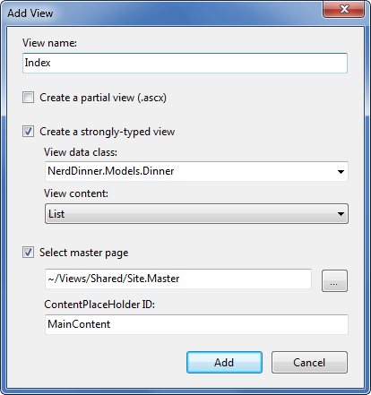

When we click the "Add" button, Visual Studio will create a new "Index.aspx" view template file for us within our "\Views\Dinners" directory. It will "scaffold" an initial implementation within it that provides an HTML table listing of the Dinners we pass to the view.

When we run the application and access the *"/Dinners/"* URL it will render our list of dinners like so:

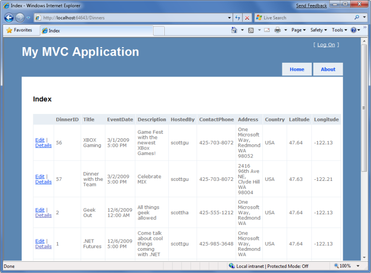

The table solution above gives us a grid-like layout of our Dinner data – which isn't quite what we want for our consumer facing Dinner listing. We can update the Index.aspx view template and modify it to list fewer columns of data, and use a &lt;ul&gt; element to render them instead of a table using the code below:

[!code-aspx[Main](use-controllers-and-views-to-implement-a-listingdetails-ui/samples/sample10.aspx)]

We are using the "var" keyword within the above foreach statement as we loop over each dinner in our Model. Those unfamiliar with C# 3.0 might think that using "var" means that the dinner object is late-bound. It instead means that the compiler is using type-inference against the strongly typed "Model" property (which is of type "IEnumerable&lt;Dinner&gt;") and compiling the local "dinner" variable as a Dinner type – which means we get full intellisense and compile-time checking for it within code blocks:

When we hit refresh on the */Dinners* URL in our browser our updated view now looks like below:

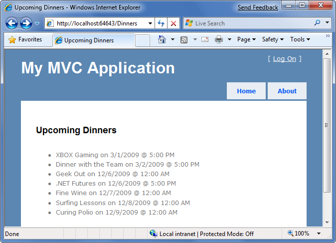

This is looking better – but isn't entirely there yet. Our last step is to enable end-users to click individual Dinners in the list and see details about them. We'll implement this by rendering HTML hyperlink elements that link to the Details action method on our DinnersController.

We can generate these hyperlinks within our Index view in one of two ways. The first is to manually create HTML &lt;a&gt; elements like below, where we embed &lt;% %&gt; blocks within the &lt;a&gt; HTML element:

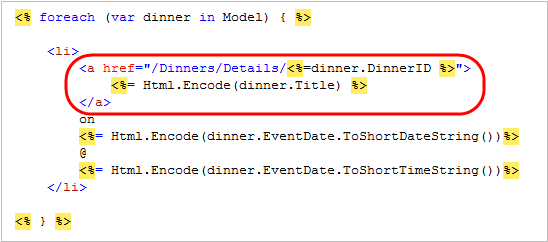

An alternative approach we can use is to take advantage of the built-in "Html.ActionLink()" helper method within ASP.NET MVC that supports programmatically creating an HTML &lt;a&gt; element that links to another action method on a Controller:

[!code-aspx[Main](use-controllers-and-views-to-implement-a-listingdetails-ui/samples/sample11.aspx)]

The first parameter to the Html.ActionLink() helper method is the link-text to display (in this case the title of the dinner), the second parameter is the Controller action name we want to generate the link to (in this case the Details method), and the third parameter is a set of parameters to send to the action (implemented as an anonymous type with property name/values). In this case we are specifying the "id" parameter of the dinner we want to link to, and because the default URL routing rule in ASP.NET MVC is "{Controller}/{Action}/{id}" the Html.ActionLink() helper method will generate the following output:

[!code-html[Main](use-controllers-and-views-to-implement-a-listingdetails-ui/samples/sample12.html)]

For our Index.aspx view we'll use the Html.ActionLink() helper method approach and have each dinner in the list link to the appropriate details URL:

[!code-aspx[Main](use-controllers-and-views-to-implement-a-listingdetails-ui/samples/sample13.aspx)]

And now when we hit the */Dinners* URL our dinner list looks like below:

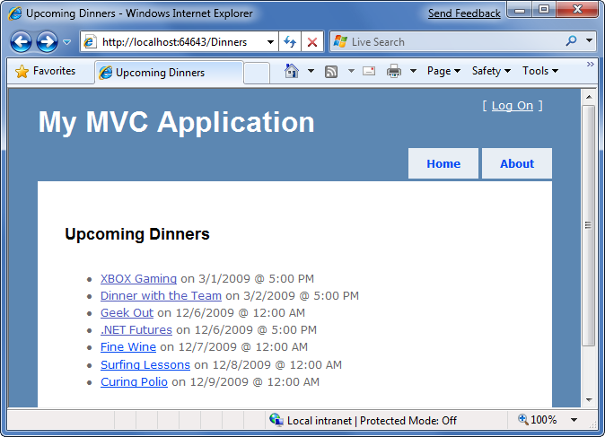

When we click any of the Dinners in the list we'll navigate to see details about it:

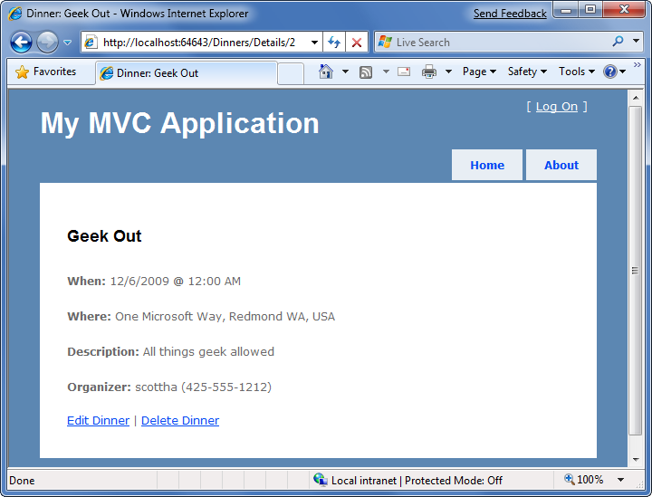

### Convention-based naming and the \Views directory structure

ASP.NET MVC applications by default use a convention-based directory naming structure when resolving view templates. This allows developers to avoid having to fully-qualify a location path when referencing views from within a Controller class. By default ASP.NET MVC will look for the view template file within the *\Views\[ControllerName]\* directory underneath the application.

For example, we've been working on the DinnersController class – which explicitly references three view templates: "Index", "Details" and "NotFound". ASP.NET MVC will by default look for these views within the *\Views\Dinners* directory underneath our application root directory:

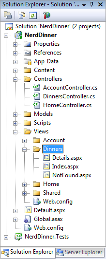

Notice above how there are currently three controller classes within the project (DinnersController, HomeController and AccountController – the last two were added by default when we created the project), and there are three sub-directories (one for each controller) within the \Views directory.

Views referenced from the Home and Accounts controllers will automatically resolve their view templates from the respective *\Views\Home* and *\Views\Account* directories. The *\Views\Shared* sub-directory provides a way to store view templates that are re-used across multiple controllers within the application. When ASP.NET MVC attempts to resolve a view template, it will first check within the *\Views\[Controller]* specific directory, and if it can't find the view template there it will look within the *\Views\Shared* directory.

When it comes to naming individual view templates, the recommended guidance is to have the view template share the same name as the action method that caused it to render. For example, above our "Index" action method is using the "Index" view to render the view result, and the "Details" action method is using the "Details" view to render its results. This makes it easy to quickly see which template is associated with each action.

Developers do not need to explicitly specify the view template name when the view template has the same name as the action method being invoked on the controller. We can instead just pass the model object to the "View()" helper method (without specifying the view name), and ASP.NET MVC will automatically infer that we want to use the *\Views\[ControllerName]\[ActionName]* view template on disk to render it.

This allows us to clean up our controller code a little, and avoid duplicating the name twice in our code:

[!code-csharp[Main](use-controllers-and-views-to-implement-a-listingdetails-ui/samples/sample14.cs)]

The above code is all that is needed to implement a nice Dinner listing/details experience for the site.

#### Next Step

We now have a nice Dinner browsing experience built.

Let's now enable CRUD (Create, Read, Update, Delete) data form editing support.

>[!div class="step-by-step"]
[Previous](build-a-model-with-business-rule-validations.md)
[Next](provide-crud-create-read-update-delete-data-form-entry-support.md)