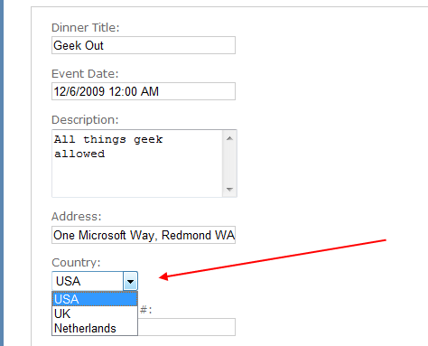
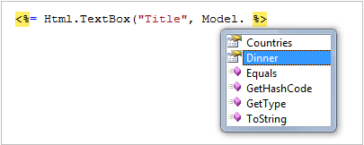
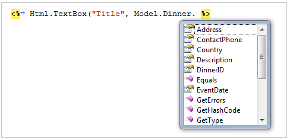

Use ViewData and Implement ViewModel Classes
====================
by [Microsoft](https://github.com/microsoft)

[Download PDF](http://aspnetmvcbook.s3.amazonaws.com/aspnetmvc-nerdinner_v1.pdf)

> This is step 6 of a free ["NerdDinner" application tutorial](introducing-the-nerddinner-tutorial.md) that walks-through how to build a small, but complete, web application using ASP.NET MVC 1.
> 
> Step 6 shows how enable support for richer form editing scenarios, and also discusses two approaches that can be used to pass data from controllers to views: ViewData and ViewModel.
> 
> If you are using ASP.NET MVC 3, we recommend you follow the [Getting Started With MVC 3](../../older-versions/getting-started-with-aspnet-mvc3/cs/intro-to-aspnet-mvc-3.md) or [MVC Music Store](../../older-versions/mvc-music-store/mvc-music-store-part-1.md) tutorials.

## NerdDinner Step 6: ViewData and ViewModel

We've covered a number of form post scenarios, and discussed how to implement create, update and delete (CRUD) support. We'll now take our DinnersController implementation further and enable support for richer form editing scenarios. While doing this we'll discuss two approaches that can be used to pass data from controllers to views: ViewData and ViewModel.

### Passing Data from Controllers to View-Templates

One of the defining characteristics of the MVC pattern is the strict "separation of concerns" it helps enforce between the different components of an application. Models, Controllers and Views each have well defined roles and responsibilities, and they communicate amongst each other in well defined ways. This helps promote testability and code reuse.

When a Controller class decides to render an HTML response back to a client, it is responsible for explicitly passing to the view template all of the data needed to render the response. View templates should never perform any data retrieval or application logic – and should instead limit themselves to only have rendering code that is driven off of the model/data passed to it by the controller.

Right now the model data being passed by our DinnersController class to our view templates is simple and straight-forward – a list of Dinner objects in the case of Index(), and a single Dinner object in the case of Details(), Edit(), Create() and Delete(). As we add more UI capabilities to our application, we are often going to need to pass more than just this data to render HTML responses within our view templates. For example, we might want to change the "Country" field within our Edit and Create views from being an HTML textbox to a dropdownlist. Rather than hard-code the dropdown list of country names in the view template, we might want to generate it from a list of supported countries that we populate dynamically. We will need a way to pass both the Dinner object *and* the list of supported countries from our controller to our view templates.

Let's look at two ways we can accomplish this.

### Using the ViewData Dictionary

The Controller base class exposes a "ViewData" dictionary property that can be used to pass additional data items from Controllers to Views.

For example, to support the scenario where we want to change the "Country" textbox within our Edit view from being an HTML textbox to a dropdownlist, we can update our Edit() action method to pass (in addition to a Dinner object) a SelectList object that can be used as the model of a countries dropdownlist.

[!code-csharp[Main](use-viewdata-and-implement-viewmodel-classes/samples/sample1.cs)]

The constructor of the SelectList above is accepting a list of counties to populate the drop-downlist with, as well as the currently selected value.

We can then update our Edit.aspx view template to use the Html.DropDownList() helper method instead of the Html.TextBox() helper method we used previously:

[!code-aspx[Main](use-viewdata-and-implement-viewmodel-classes/samples/sample2.aspx)]

The Html.DropDownList() helper method above takes two parameters. The first is the name of the HTML form element to output. The second is the "SelectList" model we passed via the ViewData dictionary. We are using the C# "as" keyword to cast the type within the dictionary as a SelectList.

And now when we run our application and access the */Dinners/Edit/1* URL within our browser we'll see that our edit UI has been updated to display a dropdownlist of countries instead of a textbox:

Because we also render the Edit view template from the HTTP-POST Edit method (in scenarios when errors occur), we'll want to make sure that we also update this method to add the SelectList to ViewData when the view template is rendered in error scenarios:

[!code-csharp[Main](use-viewdata-and-implement-viewmodel-classes/samples/sample3.cs)]

And now our DinnersController edit scenario supports a DropDownList.

### Using a ViewModel Pattern

The ViewData dictionary approach has the benefit of being fairly fast and easy to implement. Some developers don't like using string-based dictionaries, though, since typos can lead to errors that will not be caught at compile-time. The un-typed ViewData dictionary also requires using the "as" operator or casting when using a strongly-typed language like C# in a view template.

An alternative approach that we could use is one often referred to as the "ViewModel" pattern. When using this pattern we create strongly-typed classes that are optimized for our specific view scenarios, and which expose properties for the dynamic values/content needed by our view templates. Our controller classes can then populate and pass these view-optimized classes to our view template to use. This enables type-safety, compile-time checking, and editor intellisense within view templates.

For example, to enable dinner form editing scenarios we can create a "DinnerFormViewModel" class like below that exposes two strongly-typed properties: a Dinner object, and the SelectList model needed to populate the countries dropdownlist:

[!code-csharp[Main](use-viewdata-and-implement-viewmodel-classes/samples/sample4.cs)]

We can then update our Edit() action method to create the DinnerFormViewModel using the Dinner object we retrieve from our repository, and then pass it to our view template:

[!code-csharp[Main](use-viewdata-and-implement-viewmodel-classes/samples/sample5.cs)]

We'll then update our view template so that it expects a "DinnerFormViewModel" instead of a "Dinner" object by changing the "inherits" attribute at the top of the edit.aspx page like so:

[!code-cshtml[Main](use-viewdata-and-implement-viewmodel-classes/samples/sample6.cshtml)]

Once we do this, the intellisense of the "Model" property within our view template will be updated to reflect the object model of the DinnerFormViewModel type we are passing it:

We can then update our view code to work off of it. Notice below how we are not changing the names of the input elements we are creating (the form elements will still be named "Title", "Country") – but we are updating the HTML Helper methods to retrieve the values using the DinnerFormViewModel class:

[!code-aspx[Main](use-viewdata-and-implement-viewmodel-classes/samples/sample7.aspx)]

We'll also update our Edit post method to use the DinnerFormViewModel class when rendering errors:

[!code-csharp[Main](use-viewdata-and-implement-viewmodel-classes/samples/sample8.cs)]

We can also update our Create() action methods to re-use the exact same *DinnerFormViewModel* class to enable the countries DropDownList within those as well. Below is the HTTP-GET implementation:

[!code-csharp[Main](use-viewdata-and-implement-viewmodel-classes/samples/sample9.cs)]

Below is the implementation of the HTTP-POST Create method:

[!code-csharp[Main](use-viewdata-and-implement-viewmodel-classes/samples/sample10.cs)]

And now both our Edit and Create screens support drop-downlists for picking the country.

### Custom-shaped ViewModel classes

In the scenario above, our DinnerFormViewModel class directly exposes the Dinner model object as a property, along with a supporting SelectList model property. This approach works fine for scenarios where the HTML UI we want to create within our view template corresponds relatively closely to our domain model objects.

For scenarios where this isn't the case, one option that you can use is to create a custom-shaped ViewModel class whose object model is more optimized for consumption by the view – and which might look completely different from the underlying domain model object. For example, it could potentially expose different property names and/or aggregate properties collected from multiple model objects.

Custom-shaped ViewModel classes can be used both to pass data from controllers to views to render, as well as to help handle form data posted back to a controller's action method. For this later scenario, you might have the action method update a ViewModel object with the form-posted data, and then use the ViewModel instance to map or retrieve an actual domain model object.

Custom-shaped ViewModel classes can provide a great deal of flexibility, and are something to investigate any time you find the rendering code within your view templates or the form-posting code inside your action methods starting to get too complicated. This is often a sign that your domain models don't cleanly correspond to the UI you are generating, and that an intermediate custom-shaped ViewModel class can help.

### Next Step

Let's now look at how we can use partials and master-pages to re-use and share UI across our application.

>[!div class="step-by-step"]
[Previous](provide-crud-create-read-update-delete-data-form-entry-support.md)
[Next](re-use-ui-using-master-pages-and-partials.md)