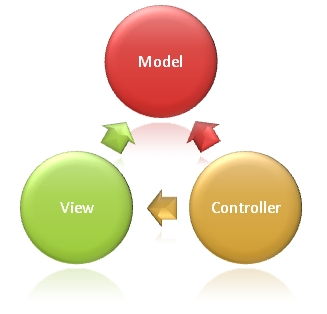

ASP.NET MVC Overview
====================
by [Microsoft](https://github.com/microsoft)

> Learn about the differences between ASP.NET MVC application and ASP.NET Web Forms applications. Learn how to decide when to build an ASP.NET MVC application.

The Model-View-Controller (MVC) architectural pattern separates an application into three main components: the model, the view, and the controller. The ASP.NET MVC framework provides an alternative to the ASP.NET Web Forms pattern for creating MVC-based Web applications. The ASP.NET MVC framework is a lightweight, highly testable presentation framework that (as with Web Forms-based applications) is integrated with existing ASP.NET features, such as master pages and membership-based authentication. The MVC framework is defined in the **System.Web.Mvc** namespace and is a fundamental, supported part of the **System.Web** namespace.   
  
MVC is a standard design pattern that many developers are familiar with. Some types of Web applications will benefit from the MVC framework. Others will continue to use the traditional ASP.NET application pattern that is based on Web Forms and postbacks. Other types of Web applications will combine the two approaches; neither approach excludes the other.   
  
The MVC framework includes the following components:

**Figure 01**: Invoking a controller action that expects a parameter value ([Click to view full-size image](asp-net-mvc-overview/_static/image2.png))

- **Models**. Model objects are the parts of the application that implement the logic for the application s data domain. Often, model objects retrieve and store model state in a database. For example, a Product object might retrieve information from a database, operate on it, and then write updated information back to a Products table in SQL Server.

In small applications, the model is often a conceptual separation instead of a physical one. For example, if the application only reads a data set and sends it to the view, the application does not have a physical model layer and associated classes. In that case, the data set takes on the role of a model object.

- **Views**. Views are the components that display the application s user interface (UI). Typically, this UI is created from the model data. An example would be an edit view of a Products table that displays text boxes, drop-down lists, and check boxes based on the current state of a Products object.

- **Controllers**. Controllers are the components that handle user interaction, work with the model, and ultimately select a view to render that displays UI. In an MVC application, the view only displays information; the controller handles and responds to user input and interaction. For example, the controller handles query-string values, and passes these values to the model, which in turn queries the database by using the values.

The MVC pattern helps you create applications that separate the different aspects of the application (input logic, business logic, and UI logic), while providing a loose coupling between these elements. The pattern specifies where each kind of logic should be located in the application. The UI logic belongs in the view. Input logic belongs in the controller. Business logic belongs in the model. This separation helps you manage complexity when you build an application, because it enables you to focus on one aspect of the implementation at a time. For example, you can focus on the view without depending on the business logic.   
  
In addition to managing complexity, the MVC pattern makes it easier to test applications than it is to test a Web Forms-based ASP.NET Web application. For example, in a Web Forms-based ASP.NET Web application, a single class is used both to display output and to respond to user input. Writing automated tests for Web Forms-based ASP.NET applications can be complex, because to test an individual page, you must instantiate the page class, all its child controls, and additional dependent classes in the application. Because so many classes are instantiated to run the page, it can be hard to write tests that focus exclusively on individual parts of the application. Tests for Web Forms-based ASP.NET applications can therefore be more difficult to implement than tests in an MVC application. Moreover, tests in a Web Forms-based ASP.NET application require a Web server. The MVC framework decouples the components and makes heavy use of interfaces, which makes it possible to test individual components in isolation from the rest of the framework.   
  
The loose coupling between the three main components of an MVC application also promotes parallel development. For instance, one developer can work on the view, a second developer can work on the controller logic, and a third developer can focus on the business logic in the model.

## Deciding When to Create an MVC Application

You must consider carefully whether to implement a Web application by using either the ASP.NET MVC framework or the ASP.NET Web Forms model. The MVC framework does not replace the Web Forms model; you can use either framework for Web applications. (If you have existing Web Forms-based applications, these continue to work exactly as they always have.)   
  
Before you decide to use the MVC framework or the Web Forms model for a specific Web site, weigh the advantages of each approach.

### Advantages of an MVC-Based Web Application

The ASP.NET MVC framework offers the following advantages:

- It makes it easier to manage complexity by dividing an application into the model, the view, and the controller.
- It does not use view state or server-based forms. This makes the MVC framework ideal for developers who want full control over the behavior of an application.
- It uses a Front Controller pattern that processes Web application requests through a single controller. This enables you to design an application that supports a rich routing infrastructure. For more information, see [Front Controller](https://go.microsoft.com/fwlink/?LinkId=106357 "Front Controller") on the MSDN Web site.
- It provides better support for test-driven development (TDD).
- It works well for Web applications that are supported by large teams of developers and Web designers who need a high degree of control over the application behavior.

### Advantages of a Web Forms-Based Web Application

The Web Forms-based framework offers the following advantages:

- It supports an event model that preserves state over HTTP, which benefits line-of-business Web application development. The Web Forms-based application provides dozens of events that are supported in hundreds of server controls.
- It uses a Page Controller pattern that adds functionality to individual pages. For more information, see [Page Controller](https://go.microsoft.com/fwlink/?LinkId=106359 "Page Controller") on the MSDN Web site.
- It uses view state or server-based forms, which can make managing state information easier.
- It works well for small teams of Web developers and designers who want to take advantage of the large number of components available for rapid application development.
- In general, it is less complex for application development, because the components (the **Page** class, controls, and so on) are tightly integrated and usually require less code than the MVC model.

## Features of the ASP.NET MVC Framework

The ASP.NET MVC framework provides the following features:

- Separation of application tasks (input logic, business logic, and UI logic), testability, and test-driven development (TDD) by default. All core contracts in the MVC framework are interface-based and can be tested by using mock objects, which are simulated objects that imitate the behavior of actual objects in the application. You can unit-test the application without having to run the controllers in an ASP.NET process, which makes unit testing fast and flexible. You can use any unit-testing framework that is compatible with the .NET Framework.
- An extensible and pluggable framework. The components of the ASP.NET MVC framework are designed so that they can be easily replaced or customized. You can plug in your own view engine, URL routing policy, action-method parameter serialization, and other components. The ASP.NET MVC framework also supports the use of Dependency Injection (DI) and Inversion of Control (IOC) container models. DI allows you to inject objects into a class, instead of relying on the class to create the object itself. IOC specifies that if an object requires another object, the first objects should get the second object from an outside source such as a configuration file. This makes testing easier.
- A powerful URL-mapping component that lets you build applications that have comprehensible and searchable URLs. URLs do not have to include file-name extensions, and are designed to support URL naming patterns that work well for search engine optimization (SEO) and representational state transfer (REST) addressing.
- Support for using the markup in existing ASP.NET page (.aspx files), user control (.ascx files), and master page (.master files) markup files as view templates. You can use existing ASP.NET features with the ASP.NET MVC framework, such as nested master pages, in-line expressions (&lt;%= %&gt;), declarative server controls, templates, data-binding, localization, and so on.
- Support for existing ASP.NET features. ASP.NET MVC lets you use features such as forms authentication and Windows authentication, URL authorization, membership and roles, output and data caching, session and profile state management, health monitoring, the configuration system, and the provider architecture.