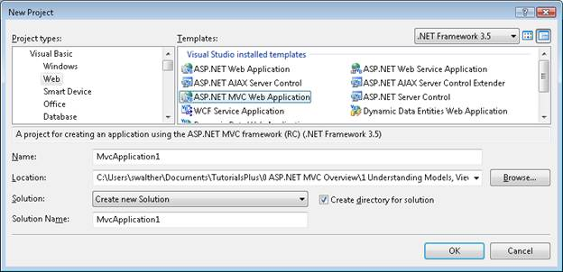
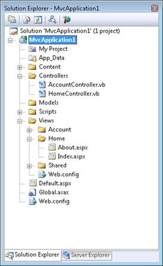
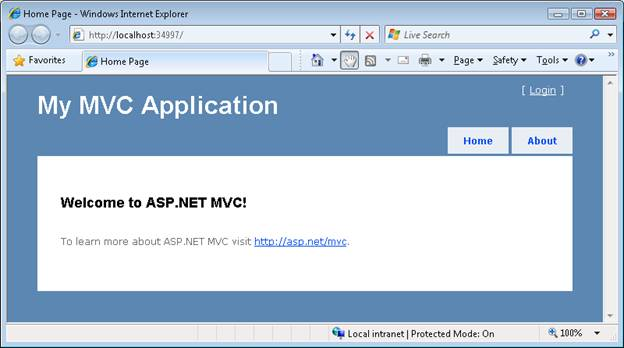

Understanding Models, Views, and Controllers (VB)
====================
by [Stephen Walther](https://github.com/StephenWalther)

> Confused about Models, Views, and Controllers? In this tutorial, Stephen Walther introduces you to the different parts of an ASP.NET MVC application.

This tutorial provides you with a high-level overview of ASP.NET MVC models, views, and controllers. In other words, it explains the M', V', and C' in ASP.NET MVC.

After reading this tutorial, you should understand how the different parts of an ASP.NET MVC application work together. You should also understand how the architecture of an ASP.NET MVC application differs from an ASP.NET Web Forms application or Active Server Pages application.

## The Sample ASP.NET MVC Application

The default Visual Studio template for creating ASP.NET MVC Web Applications includes an extremely simple sample application that can be used to understand the different parts of an ASP.NET MVC application. We take advantage of this simple application in this tutorial.

You create a new ASP.NET MVC application with the MVC template by launching Visual Studio 2008 and selecting the menu option File, New Project (see Figure 1). In the New Project dialog, select your favorite programming language under Project Types (Visual Basic or C#) and select **ASP.NET MVC Web Application** under Templates. Click the OK button.

**Figure 01**: New Project Dialog ([Click to view full-size image](understanding-models-views-and-controllers-vb/_static/image2.png))

When you create a new ASP.NET MVC application, the **Create Unit Test Project** dialog appears (see Figure 2). This dialog enables you to create a separate project in your solution for testing your ASP.NET MVC application. Select the option **No, do not create a unit test project** and click the **OK** button.

**Figure 02**: Create Unit Test Dialog ([Click to view full-size image](understanding-models-views-and-controllers-vb/_static/image4.png))

After the new ASP.NET MVC application is created. You will see several folders and files in the Solution Explorer window. In particular, you'll see three folders named Models, Views, and Controllers. As you might guess from the folder names, these folders contain the files for implementing models, views, and controllers.

If you expand the Controllers folder, you should see a file named AccountController.vb and a file named HomeController.vb. If you expand the Views folder, you should see three subfolders named Account, Home and Shared. If you expand the Home folder, you'll see two additional files named About.aspx and Index.aspx (see Figure 3). These files make up the sample application included with the default ASP.NET MVC template.

**Figure 03**: The Solution Explorer Window ([Click to view full-size image](understanding-models-views-and-controllers-vb/_static/image6.png))

You can run the sample application by selecting the menu option **Debug, Start Debugging**. Alternatively, you can press the F5 key.

When you first run an ASP.NET application, the dialog in Figure 4 appears that recommends that you enable debug mode. Click the OK button and the application will run.

**Figure 04**: Debugging Not Enabled dialog ([Click to view full-size image](understanding-models-views-and-controllers-vb/_static/image8.png))

When you run an ASP.NET MVC application, Visual Studio launches the application in your web browser. The sample application consists of only two pages: the Index page and the About page. When the application first starts, the Index page appears (see Figure 5). You can navigate to the About page by clicking the menu link at the top right of the application.

**Figure 05**: The Index Page ([Click to view full-size image](understanding-models-views-and-controllers-vb/_static/image10.png))

Notice the URLs in the address bar of your browser. For example, when you click the About menu link, the URL in the browser address bar changes to **/Home/About**.

If you close the browser window and return to Visual Studio, you won't be able to find a file with the path Home/About. The files don't exist. How is this possible?

## A URL Does Not Equal a Page

When you build a traditional ASP.NET Web Forms application or an Active Server Pages application, there is a one-to-one correspondence between a URL and a page. If you request a page named SomePage.aspx from the server, then there had better be a page on disk named SomePage.aspx. If the SomePage.aspx file does not exist, you get an ugly **404 - Page Not Found** error.

When building an ASP.NET MVC application, in contrast, there is no correspondence between the URL that you type into your browser's address bar and the files that you find in your application. In an ASP.NET MVC application, a URL corresponds to a controller action instead of a page on disk.

In a traditional ASP.NET or ASP application, browser requests are mapped to pages. In an ASP.NET MVC application, in contrast, browser requests are mapped to controller actions. An ASP.NET Web Forms application is content-centric. An ASP.NET MVC application, in contrast, is application logic centric.

## Understanding ASP.NET Routing

A browser request gets mapped to a controller action through a feature of the ASP.NET framework called *ASP.NET Routing*. ASP.NET Routing is used by the ASP.NET MVC framework to *route* incoming requests to controller actions.

ASP.NET Routing uses a route table to handle incoming requests. This route table is created when your web application first starts. The route table is setup in the Global.asax file. The default MVC Global.asax file is contained in Listing 1.

**Listing 1 - Global.asax**

[!code-vb[Main](understanding-models-views-and-controllers-vb/samples/sample1.vb)]

When an ASP.NET application first starts, the Application\_Start() method is called. In Listing 1, this method calls the RegisterRoutes() method and the RegisterRoutes() method creates the default route table.

The default route table consists of one route. This default route breaks all incoming requests into three segments (a URL segment is anything between forward slashes). The first segment is mapped to a controller name, the second segment is mapped to an action name, and the final segment is mapped to a parameter passed to the action named Id.

For example, consider the following URL:

/Product/Details/3

This URL is parsed into three parameters like this:

Controller = Product

Action = Details

Id = 3

The Default route defined in the Global.asax file includes default values for all three parameters. The default Controller is Home, the default Action is Index, and the default Id is an empty string. With these defaults in mind, consider how the following URL is parsed:

/Employee

This URL is parsed into three parameters like this:

Controller = Employee

Action = Index

Id = ��

Finally, if you open an ASP.NET MVC Application without supplying any URL (for example, `http://localhost`) then the URL is parsed like this:

Controller = Home

Action = Index

Id = ��

The request is routed to the Index() action on the HomeController class.

## Understanding Controllers

A controller is responsible for controlling the way that a user interacts with an MVC application. A controller contains the flow control logic for an ASP.NET MVC application. A controller determines what response to send back to a user when a user makes a browser request.

A controller is just a class (for example, a Visual Basic or C# class). The sample ASP.NET MVC application includes a controller named HomeController.vb located in the Controllers folder. The content of the HomeController.vb file is reproduced in Listing 2.

**Listing 2 - HomeController.cs**

[!code-vb[Main](understanding-models-views-and-controllers-vb/samples/sample2.vb)]

Notice that the HomeController has two methods named Index() and About(). These two methods correspond to the two actions exposed by the controller. The URL /Home/Index invokes the HomeController.Index() method and the URL /Home/About invokes the HomeController.About() method.

Any public method in a controller is exposed as a controller action. You need to be careful about this. This means that any public method contained in a controller can be invoked by anyone with access to the Internet by entering the right URL into a browser.

## Understanding Views

The two controller actions exposed by the HomeController class, Index() and About(), both return a view. A view contains the HTML markup and content that is sent to the browser. A view is the equivalent of a page when working with an ASP.NET MVC application.

You must create your views in the right location. The HomeController.Index() action returns a view located at the following path:

\Views\Home\Index.aspx

The HomeController.About() action returns a view located at the following path:

\Views\Home\About.aspx

In general, if you want to return a view for a controller action, then you need to create a subfolder in the Views folder with the same name as your controller. Within the subfolder, you must create an .aspx file with the same name as the controller action.

The file in Listing 3 contains the About.aspx view.

**Listing 3 - About.aspx**

[!code-aspx[Main](understanding-models-views-and-controllers-vb/samples/sample3.aspx)]

If you ignore the first line in Listing 3, most of the rest of the view consists of standard HTML. You can modify the contents of the view by entering any HTML that you want here.

A view is very similar to a page in Active Server Pages or ASP.NET Web Forms. A view can contain HTML content and scripts. You can write the scripts in your favorite .NET programming language (for example, C# or Visual Basic .NET). You use scripts to display dynamic content such as database data.

## Understanding Models

We have discussed controllers and we have discussed views. The last topic that we need to discuss is models. What is an MVC model?

An MVC model contains all of your application logic that is not contained in a view or a controller. The model should contain all of your application business logic, validation logic, and database access logic. For example, if you are using the Microsoft Entity Framework to access your database, then you would create your Entity Framework classes (your .edmx file) in the Models folder.

A view should contain only logic related to generating the user interface. A controller should only contain the bare minimum of logic required to return the right view or redirect the user to another action (flow control). Everything else should be contained in the model.

In general, you should strive for fat models and skinny controllers. Your controller methods should contain only a few lines of code. If a controller action gets too fat, then you should consider moving the logic out to a new class in the Models folder.

## Summary

This tutorial provided you with a high level overview of the different parts of an ASP.NET MVC web application. You learned how ASP.NET Routing maps incoming browser requests to particular controller actions. You learned how controllers orchestrate how views are returned to the browser. Finally, you learned how models contain application business, validation, and database access logic.