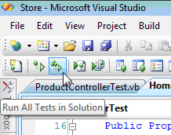
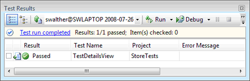

Creating Unit Tests for ASP.NET MVC Applications (VB)
====================
by [Stephen Walther](https://github.com/StephenWalther)

[Download PDF](http://download.microsoft.com/download/8/4/8/84843d8d-1575-426c-bcb5-9d0c42e51416/ASPNET_MVC_Tutorial_07_VB.pdf)

> Learn how to create unit tests for controller actions. In this tutorial, Stephen Walther demonstrates how to test whether a controller action returns a particular view, returns a particular set of data, or returns a different type of action result.

The goal of this tutorial is to demonstrate how you can write unit tests for the controllers in your ASP.NET MVC applications. We discuss how to build three different types of unit tests. You learn how to test the view returned by a controller action, how to test the View Data returned by a controller action, and how to test whether or not one controller action redirects you to a second controller action.

## Creating the Controller under Test

Let's start by creating the controller that we intend to test. The controller, named the `ProductController`, is contained in Listing 1.

**Listing 1 – `ProductController.vb`**

[!code-vb[Main](creating-unit-tests-for-asp-net-mvc-applications-vb/samples/sample1.vb)]

The `ProductController` contains two action methods named `Index()` and `Details()`. Both action methods return a view. Notice that the `Details()` action accepts a parameter named Id.

## Testing the View returned by a Controller

Imagine that we want to test whether or not the `ProductController` returns the right view. We want to make sure that when the `ProductController.Details()` action is invoked, the Details view is returned. The test class in Listing 2 contains a unit test for testing the view returned by the `ProductController.Details()` action.

**Listing 2 – `ProductControllerTest.vb`**

[!code-vb[Main](creating-unit-tests-for-asp-net-mvc-applications-vb/samples/sample2.vb)]

The class in Listing 2 includes a test method named `TestDetailsView()`. This method contains three lines of code. The first line of code creates a new instance of the `ProductController` class. The second line of code invokes the controller's `Details()` action method. Finally, the last line of code checks whether or not the view returned by the `Details()` action is the Details view.

The `ViewResult.ViewName` property represents the name of the view returned by a controller. One big warning about testing this property. There are two ways that a controller can return a view. A controller can explicitly return a view like this:

[!code-vb[Main](creating-unit-tests-for-asp-net-mvc-applications-vb/samples/sample3.vb)]

Alternatively, the name of the view can be inferred from the name of the controller action like this:

[!code-vb[Main](creating-unit-tests-for-asp-net-mvc-applications-vb/samples/sample4.vb)]

This controller action also returns a view named `Details`. However, the name of the view is inferred from the action name. If you want to test the view name, then you must explicitly return the view name from the controller action.

You can run the unit test in Listing 2 by either entering the keyboard combination **Ctrl-R, A** or by clicking the **Run All Tests in Solution** button (see Figure 1). If the test passes, you'll see the Test Results window in Figure 2.

**Figure 01**: Run All Tests in Solution ([Click to view full-size image](creating-unit-tests-for-asp-net-mvc-applications-vb/_static/image3.png))

**Figure 02**: Success! ([Click to view full-size image](creating-unit-tests-for-asp-net-mvc-applications-vb/_static/image6.png))

## Testing the View Data returned by a Controller

An MVC controller passes data to a view by using something called *`View Data`*. For example, imagine that you want to display the details for a particular product when you invoke the `ProductController Details()` action. In that case, you can create an instance of a `Product` class (defined in your model) and pass the instance to the `Details` view by taking advantage of `View Data`.

The modified `ProductController` in Listing 3 includes an updated `Details()` action that returns a Product.

**Listing 3 – `ProductController.vb`**

[!code-vb[Main](creating-unit-tests-for-asp-net-mvc-applications-vb/samples/sample5.vb)]

First, the `Details()` action creates a new instance of the `Product` class that represents a laptop computer. Next, the instance of the `Product` class is passed as the second parameter to the `View()` method.

You can write unit tests to test whether the expected data is contained in view data. The unit test in Listing 4 tests whether or not a Product representing a laptop computer is returned when you call the `ProductController Details()` action method.

**Listing 4 – `ProductControllerTest.vb`**

[!code-vb[Main](creating-unit-tests-for-asp-net-mvc-applications-vb/samples/sample6.vb)]

In Listing 4, the `TestDetailsView()` method tests the View Data returned by invoking the `Details()` method. The `ViewData` is exposed as a property on the `ViewResult` returned by invoking the `Details()` method. The `ViewData.Model` property contains the product passed to the view. The test simply verifies that the product contained in the View Data has the name Laptop.

## Testing the Action Result returned by a Controller

A more complex controller action might return different types of action results depending on the values of the parameters passed to the controller action. A controller action can return a variety of types of action results including a `ViewResult`, `RedirectToRouteResult`, or `JsonResult`.

For example, the modified `Details()` action in Listing 5 returns the `Details` view when you pass a valid product Id to the action. If you pass an invalid product Id -- an Id with a value less than 1 -- then you are redirected to the `Index()` action.

**Listing 5 – `ProductController.vb`**

[!code-vb[Main](creating-unit-tests-for-asp-net-mvc-applications-vb/samples/sample7.vb)]

You can test the behavior of the `Details()` action with the unit test in Listing 6. The unit test in Listing 6 verifies that you are redirected to the `Index` view when an Id with the value -1 is passed to the `Details()` method.

**Listing 6 – `ProductControllerTest.vb`**

[!code-vb[Main](creating-unit-tests-for-asp-net-mvc-applications-vb/samples/sample8.vb)]

When you call the `RedirectToAction()` method in a controller action, the controller action returns a `RedirectToRouteResult`. The test checks whether the `RedirectToRouteResult` will redirect the user to a controller action named `Index`.

## Summary

In this tutorial, you learned how to build unit tests for MVC controller actions. First, you learned how to verify whether the right view is returned by a controller action. You learned how to use the `ViewResult.ViewName` property to verify the name of a view.

Next, we examined how you can test the contents of `View Data`. You learned how to check whether the right product was returned in `View Data` after calling a controller action.

Finally, we discussed how you can test whether different types of action results are returned from a controller action. You learned how to test whether a controller returns a `ViewResult` or a `RedirectToRouteResult`.

>[!div class="step-by-step"]
[Previous](creating-unit-tests-for-asp-net-mvc-applications-cs.md)