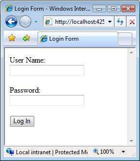

ASP.NET MVC Views Overview (VB)
====================
by [Stephen Walther](https://github.com/StephenWalther)

> What is an ASP.NET MVC View and how does it differ from a HTML page? In this tutorial, Stephen Walther introduces you to Views and demonstrates how you can take advantage of View Data and HTML Helpers within a View.

The purpose of this tutorial is to provide you with a brief introduction to ASP.NET MVC views, view data, and HTML Helpers. By the end of this tutorial, you should understand how to create new views, pass data from a controller to a view, and use HTML Helpers to generate content in a view.

## Understanding Views

Unlike ASP.NET or Active Server Pages, ASP.NET MVC does not include anything that directly corresponds to a page. In an ASP.NET MVC application, there is not a page on disk that corresponds to the path in the URL that you type into the address bar of your browser. The closest thing to a page in an ASP.NET MVC application is something called a *view*.

In an ASP.NET MVC application, incoming browser requests are mapped to controller actions. A controller action might return a view. However, a controller action might perform some other type of action such as redirecting you to another controller action.

Listing 1 contains a simple controller named the HomeController. The HomeController exposes two controller actions named Index() and Details().

**Listing 1 - HomeController.vb**

[!code-vb[Main](asp-net-mvc-views-overview-vb/samples/sample1.vb)]

You can invoke the first action, the Index() action, by typing the following URL into your browser address bar:

/Home/Index

You can invoke the second action, the Details() action, by typing this address into your browser:

/Home/Details

The Index() action returns a view. Most actions that you create will return views. However, an action can return other types of action results. For example, the Details() action returns a RedirectToActionResult that redirects incoming request to the Index() action.

The Index() action contains the following single line of code:

View()

This line of code returns a view that must be located at the following path on your web server:

\Views\Home\Index.aspx

The path to the view is inferred from the name of the controller and the name of the controller action.

If you prefer, you can be explicit about the view. The following line of code returns a view named Fred :

View( Fred )

When this line of code is executed, a view is returned from the following path:

\Views\Home\Fred.aspx

> [!NOTE] 
> 
> If you plan to create unit tests for your ASP.NET MVC application then it is a good idea to be explicit about view names. That way, you can create a unit test to verify that the expected view was returned by a controller action.

## Adding Content to a View

A view is a standard (X)HTML document that can contain scripts. You use scripts to add dynamic content to a view.

For example, the view in Listing 2 displays the current date and time.

**Listing 2 - \Views\Home\Index.aspx**

[!code-aspx[Main](asp-net-mvc-views-overview-vb/samples/sample2.aspx)]

Notice that the body of the HTML page in Listing 2 contains the following script:

&lt;% Response.Write(DateTime.Now)%&gt;

You use the script delimiters &lt;% and %&gt; to mark the beginning and end of a script. This script is written in Visual basic. It displays the current date and time by calling the Response.Write() method to render content to the browser. The script delimiters &lt;% and %&gt; can be used to execute one or more statements.

Since you call Response.Write() so often, Microsoft provides you with a shortcut for calling the Response.Write() method. The view in Listing 3 uses the delimiters &lt;%= and %&gt; as a shortcut for calling Response.Write().

**Listing 3 - Views\Home\Index2.aspx**

[!code-aspx[Main](asp-net-mvc-views-overview-vb/samples/sample3.aspx)]

You can use any .NET language to generate dynamic content in a view. Normally, you�ll use either Visual Basic .NET or C# to write your controllers and views.

## Using HTML Helpers to Generate View Content

To make it easier to add content to a view, you can take advantage of something called an *HTML Helper*. An HTML Helper, typically, is a method that generates a string. You can use HTML Helpers to generate standard HTML elements such as textboxes, links, dropdown lists, and list boxes.

For example, the view in Listing 4 takes advantage of three HTML Helpers -- the BeginForm(), the TextBox() and Password() helpers -- to generate a Login form (see Figure 1).

**Listing 4 -- \Views\Home\Login.aspx**

[!code-aspx[Main](asp-net-mvc-views-overview-vb/samples/sample4.aspx)]

**Figure 01**: A standard Login form ([Click to view full-size image](asp-net-mvc-views-overview-vb/_static/image2.png))

All of the HTML Helpers methods are called on the Html property of the view. For example, you render a TextBox by calling the Html.TextBox() method.

Notice that you use the script delimiters &lt;%= and %&gt; when calling both the Html.TextBox() and Html.Password() helpers. These helpers simply return a string. You need to call Response.Write() in order to render the string to the browser.

Using HTML Helper methods is optional. They make your life easier by reducing the amount of HTML and script that you need to write. The view in Listing 5 renders the exact same form as the view in Listing 4 without using HTML Helpers.

**Listing 5 -- \Views\Home\Login.aspx**

[!code-aspx[Main](asp-net-mvc-views-overview-vb/samples/sample5.aspx)]

You also have the option of creating your own HTML Helpers. For example, you can create a GridView() helper method that displays a set of database records in an HTML table automatically. We explore this topic in the tutorial **Creating Custom HTML Helpers**.

## Using View Data to Pass Data to a View

You use view data to pass data from a controller to a view. Think of view data like a package that you send through the mail. All data passed from a controller to a view must be sent using this package. For example, the controller in Listing 6 adds a message to view data.

**Listing 6 - ProductController.vb**

[!code-vb[Main](asp-net-mvc-views-overview-vb/samples/sample6.vb)]

The controller ViewData property represents a collection of name and value pairs. In Listing 6, the Index() method adds an item to the view data collection named message with the value Hello World!. When the view is returned by the Index() method, the view data is passed to the view automatically.

The view in Listing 7 retrieves the message from the view data and renders the message to the browser.

**Listing 7 -- \Views\Product\Index.aspx**

[!code-aspx[Main](asp-net-mvc-views-overview-vb/samples/sample7.aspx)]

Notice that the view takes advantage of the Html.Encode() HTML Helper method when rendering the message. The Html.Encode() HTML Helper encodes special characters such as &lt; and &gt; into characters that are safe to display in a web page. Whenever you render content that a user submits to a website, you should encode the content to prevent JavaScript injection attacks.

(Because we created the message ourselves in the ProductController, we don�t really need to encode the message. However, it is a good habit to always call the Html.Encode() method when displaying content retrieved from view data within a view.)

In Listing 7, we took advantage of view data to pass a simple string message from a controller to a view. You also can use view data to pass other types of data, such as a collection of database records, from a controller to a view. For example, if you want to display the contents of the Products database table in a view, then you would pass the collection of database records in view data.

You also have the option of passing strongly typed view data from a controller to a view. We explore this topic in the tutorial **Understanding Strongly Typed View Data and Views**.

## Summary

This tutorial provided a brief introduction to ASP.NET MVC views, view data, and HTML Helpers. In the first section, you learned how to add new views to your project. You learned that you must add a view to the right folder in order to call it from a particular controller. Next, we discussed the topic of HTML Helpers. You learned how HTML Helpers enable you to easily generate standard HTML content. Finally, you learned how to take advantage of view data to pass data from a controller to a view.

>[!div class="step-by-step"]
[Previous](passing-data-to-view-master-pages-cs.md)
[Next](creating-custom-html-helpers-vb.md)