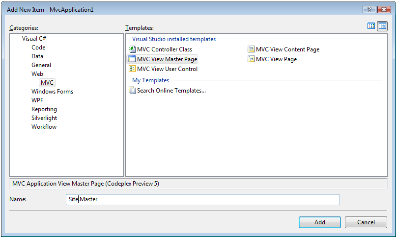
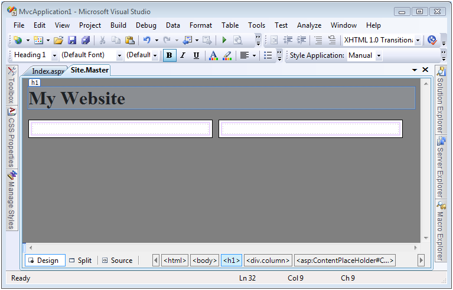
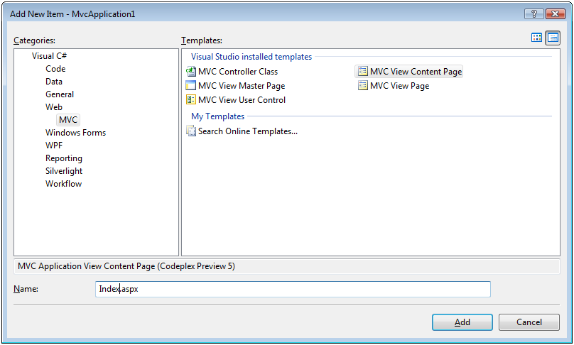
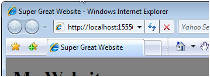

Creating Page Layouts with View Master Pages (C#)
====================
by [Microsoft](https://github.com/microsoft)

[Download PDF](http://download.microsoft.com/download/e/f/3/ef3f2ff6-7424-48f7-bdaa-180ef64c3490/ASPNET_MVC_Tutorial_12_CS.pdf)

> In this tutorial, you learn how to create a common page layout for multiple pages in your application by taking advantage of view master pages. You can use a view master page, for example, to define a two-column page layout and use the two-column layout for all of the pages in your web application.

## Creating Page Layouts with View Master Pages

In this tutorial, you learn how to create a common page layout for multiple pages in your application by taking advantage of view master pages. You can use a view master page, for example, to define a two-column page layout and use the two-column layout for all of the pages in your web application.

You also can take advantage of view master pages to share common content across multiple pages in your application. For example, you can place your website logo, navigation links, and banner advertisements in a view master page. That way, every page in your application would display this content automatically.

In this tutorial, you learn how to create a new view master page and create a new view content page based on the master page.

### Creating a View Master Page

Let's start by creating a view master page that defines a two-column layout. You add a new view master page to an MVC project by right-clicking the Views\Shared folder, selecting the menu option **Add, New Item**, and selecting the **MVC View Master Page** template (see Figure 1).

**Figure 01**: Adding a view master page ([Click to view full-size image](creating-page-layouts-with-view-master-pages-cs/_static/image3.png))

You can create more than one view master page in an application. Each view master page can define a different page layout. For example, you might want certain pages to have a two-column layout and other pages to have a three-column layout.

A view master page looks very much like a standard ASP.NET MVC view. However, unlike a normal view, a view master page contains one or more `<asp:ContentPlaceHolder>` tags. The `<contentplaceholder>` tags are used to mark the areas of the master page that can be overridden in an individual content page.

For example, the view master page in Listing 1 defines a two-column layout. It contains two `<contentplaceholder>` tags. One `<ContentPlaceHolder>` for each column.

**Listing 1 – `Views\Shared\Site.master`**

[!code-aspx[Main](creating-page-layouts-with-view-master-pages-cs/samples/sample1.aspx)]

The body of the view master page in Listing 1 contains two `
` tags that correspond to the two columns. The Cascading Style Sheet column class is applied to both `
` tags. This class is defined in the style sheet declared at the top of the master page. You can preview how the view master page will be rendered by switching to Design view. Click the Design tab at the bottom-left of the source code editor (see Figure 2).

**Figure 02**: Previewing a master page in the designer ([Click to view full-size image](creating-page-layouts-with-view-master-pages-cs/_static/image6.png))

### Creating a View Content Page

After you create a view master page, you can create one or more view content pages based on the view master page. For example, you can create an Index view content page for the Home controller by right-clicking the Views\Home folder, selecting **Add, New Item**, selecting the **MVC View Content Page** template, entering the name Index.aspx, and clicking the **Add** button (see Figure 3).

**Figure 03**: Adding a view content page ([Click to view full-size image](creating-page-layouts-with-view-master-pages-cs/_static/image9.png))

After you click the Add button, a new dialog appears that enables you to select a view master page to associate with the view content page (see Figure 4). You can navigate to the Site.master view master page that we created in the previous section.

**Figure 04**: Selecting a master page ([Click to view full-size image](creating-page-layouts-with-view-master-pages-cs/_static/image12.png))

After you create a new view content page based on the Site.master master page, you get the file in Listing 2.

**Listing 2 – `Views\Home\Index.aspx`**

[!code-aspx[Main](creating-page-layouts-with-view-master-pages-cs/samples/sample2.aspx)]

Notice that this view contains a `<asp:Content>` tag that corresponds to each of the `<asp:ContentPlaceHolder>` tags in the view master page. Each `<asp:Content>` tag includes a ContentPlaceHolderID attribute that points to the particular `<asp:ContentPlaceHolder>` that it overrides.

Notice, furthermore, that the content view page in Listing 2 does not contain any of the normal opening and closing HTML tags. For example, it does not contain the opening and closing `<html>` or `<head>` tags. All of the normal opening and closing tags are contained in the view master page.

Any content that you want to display in a view content page must be placed within a `<asp:Content>` tag. If you place any HTML or other content outside of these tags, then you will get an error when you attempt to view the page.

You don't need to override every `<asp:ContentPlaceHolder>` tag from a master page in a content view page. You only need to override a `<asp:ContentPlaceHolder>` tag when you want to replace the tag with particular content.

For example, the modified Index view in Listing 3 contains only two `<asp:Content>` tags. Each of the `<asp:Content>` tags includes some text.

**Listing 3 – `Views\Home\Index.aspx (modified)`**

[!code-aspx[Main](creating-page-layouts-with-view-master-pages-cs/samples/sample3.aspx)]

When the view in Listing 3 is requested, it renders the page in Figure 5. Notice that the view renders a page with two columns. Notice, furthermore, that the content from the view content page is merged with the content from the view master page

**Figure 05**: The Index view content page ([Click to view full-size image](creating-page-layouts-with-view-master-pages-cs/_static/image15.png))

### Modifying View Master Page Content

One issue that you encounter almost immediately when working with view master pages is the problem of modifying view master page content when different view content pages are requested. For example, you want each page in your web application to have a unique title. However, the title is declared in the view master page and not in the view content page. So, how do you customize the page title for each view content page?

There are two ways that you can modify the title displayed by a view content page. First, you can assign a page title to the title attribute of the `<%@ page %>` directive declared at the top of a view content page. For example, if you want to assign the page title "Super Great Website" to the Index view, then you can include the following directive at the top of the Index view:

[!code-aspx[Main](creating-page-layouts-with-view-master-pages-cs/samples/sample4.aspx)]

When the Index view is rendered to the browser, the desired title appears in the browser title bar:

There is one important requirement that a master view page must satisfy in order for the title attribute to work. The view master page must contain a `<head runat="server">` tag instead of a normal `<head>` tag for its header. If the `<head>` tag does not include the runat="server" attribute then the title won't appear. The default view master page includes the required `<head runat="server">` tag.

An alternative approach to modifying master page content from an individual view content page is to wrap the region that you want to modify in a `<asp:ContentPlaceHolder>` tag. For example, imagine that you want to change not only the title, but also the meta tags, rendered by a master view page. The master view page in Listing 4 contains a `<asp:ContentPlaceHolder>` tag within its `<head>` tag.

**Listing 4 – `Views\Shared\Site2.master`**

[!code-aspx[Main](creating-page-layouts-with-view-master-pages-cs/samples/sample5.aspx)]

Notice that the `<asp:ContentPlaceHolder>` tag in Listing 4 includes default content: a default title and default meta tags. If you don't override this `<asp:ContentPlaceHolder>` tag in an individual view content page, then the default content will be displayed.

The content view page in Listing 5 overrides the `<asp:ContentPlaceHolder>` tag in order to display a custom title and custom meta tags.

**Listing 5 – `Views\Home\Index2.aspx`**

[!code-aspx[Main](creating-page-layouts-with-view-master-pages-cs/samples/sample6.aspx)]

### Summary

This tutorial provided you with a basic introduction to view master pages and view content pages. You learned how to create new view master pages and create view content pages based on them. We also examined how you can modify the content of a view master page from a particular view content page.

>[!div class="step-by-step"]
[Previous](using-the-tagbuilder-class-to-build-html-helpers-cs.md)
[Next](passing-data-to-view-master-pages-cs.md)