ASP.NET MVC 4 Mobile Features
====================
by [Rick Anderson](https://github.com/Rick-Anderson)

> There is now an MVC 5 version of this tutorial with code samples at [Deploy an ASP.NET MVC 5 Mobile Web Application on Azure Web Sites](https://azure.microsoft.com/en-us/documentation/articles/web-sites-dotnet-deploy-aspnet-mvc-mobile-app/).

This tutorial will teach you the basics of how to work with mobile features in an ASP.NET MVC 4 Web application. For this tutorial, you can use [Visual Studio Express 2012](https://www.microsoft.com/visualstudio/11/en-us/products/express) or Visual Web Developer 2010 Express Service Pack 1 (&quot;Visual Web Developer or VWD&quot;). You can use the professional version of Visual Studio if you already have that.

Before you start, make sure you've installed the prerequisites listed below.

- [Visual Studio Express 2012](https://www.microsoft.com/visualstudio/11/en-us/products/express) (recommended) or Visual Studio Web Developer Express SP1. Visual Studio 2012 contains ASP.NET MVC 4. If you are using Visual Web Developer 2010, you must install [ASP.NET MVC 4](https://go.microsoft.com/fwlink/?LinkId=243392).

You will also need a mobile browser emulator. Any of the following will work:

- [Windows 7 Phone Emulator](https://msdn.microsoft.com/en-us/library/ff402563(VS.92).aspx). (This is the emulator that's used in most of the screen shots in this tutorial.)
- Change the user agent string to emulate an iPhone. See [this](http://www.howtogeek.com/113439/how-to-change-your-browsers-user-agent-without-installing-any-extensions/) blog entry.
- [Opera Mobile Emulator](http://www.opera.com/developer/tools/mobile/)
- [Apple Safari](http://www.apple.com/safari/download/) with the user agent set to iPhone. For instructions on how to set the user agent in Safari to "iPhone", see [How to let Safari pretend it's IE](http://www.davidalison.com/2008/05/how-to-let-safari-pretend-its-ie.html) on David Alison's blog.

Visual Studio projects with C# source code are available to accompany this topic:

- [Starter project download](https://go.microsoft.com/fwlink/?linkid=228307&amp;clcid=0x409)
- [Completed project download](https://go.microsoft.com/fwlink/?linkid=228306&amp;clcid=0x409)

### What You'll Build

For this tutorial, you'll add mobile features to the simple conference-listing application that's provided in the [starter project](https://go.microsoft.com/fwlink/?LinkId=228307). The following screenshot shows the tags page of the completed application as seen in the [Windows 7 Phone Emulator](https://msdn.microsoft.com/en-us/library/ff402563(VS.92).aspx). See [Keyboard Mapping for Windows Phone Emulator](https://msdn.microsoft.com/en-us/library/ff754352(v=vs.92).aspx) to simplify keyboard input.

[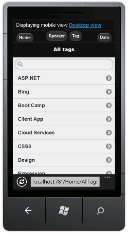](aspnet-mvc-4-mobile-features/_static/image1.png)

You can use Internet Explorer version 9 or 10, FireFox or Chrome to develop your mobile application by setting the [user agent string](http://www.howtogeek.com/113439/how-to-change-your-browsers-user-agent-without-installing-any-extensions/). The following image shows the completed tutorial using Internet Explorer emulating an iPhone. You can use the Internet Explorer F-12 developer tools and the [Fiddler tool](http://www.fiddler2.com/fiddler2/) to help debug your application.

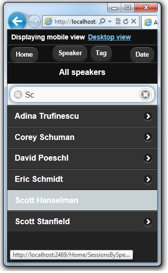

### Skills You'll Learn

Here's what you'll learn:

- How the ASP.NET MVC 4 templates use the HTML5 `viewport` attribute and adaptive rendering to improve display on mobile devices.
- How to create mobile-specific views.
- How to create a view switcher that lets users toggle between a mobile view and a desktop view of the application.

### Getting Started

Download the conference-listing application for the starter project using the following link: [Download](https://go.microsoft.com/fwlink/?LinkId=228307). Then in Windows Explorer, right-click the *MvcMobile.zip* file and choose **Properties**. In the **MvcMobile.zip Properties** dialog box, choose the **Unblock** button. (Unblocking prevents a security warning that occurs when you try to use a *.zip* file that you've downloaded from the web.)

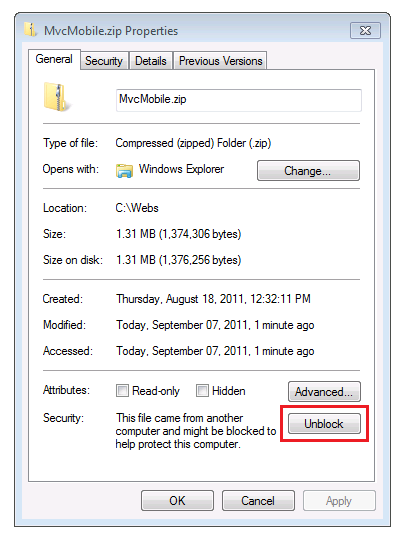

Right-click the *MvcMobile.zip* file and select **Extract All** to unzip the file. In Visual Studio, open the *MvcMobile.sln* file.

Press CTRL+F5 to run the application, which will display it in your desktop browser. Start your mobile browser emulator, copy the URL for the conference application into the emulator, and then click the **Browse by tag** link. If you are using the Windows Phone Emulator, click in the URL bar and press the Pause key to get keyboard access. The image below shows the *AllTags* view (from choosing **Browse by tag**).

[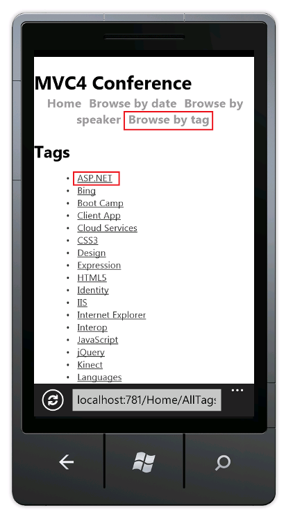](aspnet-mvc-4-mobile-features/_static/image5.png)

The display is very readable on a mobile device. Choose the ASP.NET link.

[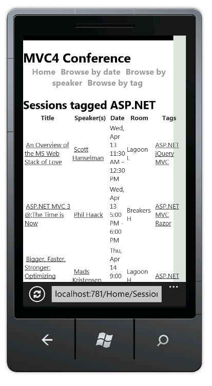](aspnet-mvc-4-mobile-features/_static/image7.png)

The ASP.NET tag view is very cluttered. For example, the **Date** column is very difficult to read. Later in the tutorial you'll create a version of the *AllTags* view that's specifically for mobile browsers and that will make the display readable.

Note: Currently a bug exists in the mobile caching engine. For production applications, you must install the [Fixed DisplayModes](http://nuget.org/packages/Microsoft.AspNet.Mvc.FixedDisplayModes) nugget package. See [ASP.NET MVC 4 Mobile Caching Bug Fixed](https://blogs.msdn.com/b/rickandy/archive/2012/09/17/asp-net-mvc-4-mobile-caching-bug-fixed.aspx) for details on the fix.

## CSS Media Queries

[CSS media queries](http://www.w3.org/TR/css3-mediaqueries/) are an extension to CSS for media types. They allow you to create rules that override the default CSS rules for specific browsers (user agents). A common rule for CSS that targets mobile browsers is defining the maximum screen size. The *Content\Site.css* file that's created when you create a new ASP.NET MVC 4 Internet project contains the following media query:

[!code-css[Main](aspnet-mvc-4-mobile-features/samples/sample1.css)]

If the browser window is 850 pixels wide or less, it will use the CSS rules inside this media block. You can use CSS media queries like this to provide a better display of HTML content on small browsers (like mobile browsers) than the default CSS rules that are designed for the wider displays of desktop browsers.

## The Viewport Meta Tag

Most mobile browsers define a virtual browser window width (the *viewport*) that's much larger than the actual width of the mobile device. This allows mobile browsers to fit the entire web page inside the virtual display. Users can then zoom in on interesting content. However, if you set the viewport width to the actual device width, no zooming is required, because the content fits in the mobile browser.

The viewport `<meta>` tag in the ASP.NET MVC 4 layout file sets the viewport to the device width. The following line shows the viewport `<meta>` tag in the ASP.NET MVC 4 layout file.

[!code-html[Main](aspnet-mvc-4-mobile-features/samples/sample2.html)]

## Examining the Effect of CSS Media Queries and the Viewport Meta Tag

Open the *Views\Shared\\_Layout.cshtml* file in the editor and comment out the viewport `<meta>` tag. The following markup shows the commented-out line.

[!code-cshtml[Main](aspnet-mvc-4-mobile-features/samples/sample3.cshtml)]

Open the *MvcMobile\Content\Site.css* file in the editor and change the maximum width in the media query to zero pixels. This will prevent the CSS rules from being used in mobile browsers. The following line shows the modified media query:

[!code-css[Main](aspnet-mvc-4-mobile-features/samples/sample4.css)]

Save your changes and browse to the Conference application in a mobile browser emulator. The tiny text in the following image is the result of removing the viewport `<meta>` tag. With no viewport `<meta>` tag, the browser is zooming out to the default viewport width (850 pixels or wider for most mobile browsers.)

[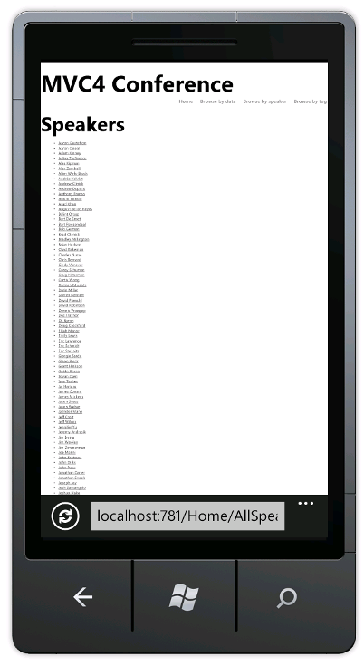](aspnet-mvc-4-mobile-features/_static/image9.png)

Undo your changes — uncomment the viewport `<meta>` tag in the layout file and restore the media query to 850 pixels in the *Site.css* file. Save your changes and refresh the mobile browser to verify that the mobile-friendly display has been restored.

The viewport `<meta>` tag and the CSS media query are not specific to ASP.NET MVC 4, and you can take advantage of these features in any web application. But they are now built into the files that are generated when you create a new ASP.NET MVC 4 project.

For more information about the viewport `<meta>` tag, see [A tale of two viewports — part two](http://www.quirksmode.org/mobile/viewports2.html).

In the next section you'll see how to provide mobile-browser specific views.

## Overriding Views, Layouts, and Partial Views

A significant new feature in ASP.NET MVC 4 is a simple mechanism that lets you override any view (including layouts and partial views) for mobile browsers in general, for an individual mobile browser, or for any specific browser. To provide a mobile-specific view, you can copy a view file and add *.Mobile* to the file name. For example, to create a mobile *Index* view, copy *Views\Home\Index.cshtml* to *Views\Home\Index.Mobile.cshtml*.

In this section, you'll create a mobile-specific layout file.

To start, copy *Views\Shared\\_Layout.cshtml* to *Views\Shared\\_Layout.Mobile.cshtml*. Open *\_Layout.Mobile.cshtml* and change the title from **MVC4 Conference** to **Conference (Mobile)**.

In each `Html.ActionLink` call, remove "Browse by" in each link *ActionLink*. The following code shows the completed body section of the mobile layout file.

[!code-cshtml[Main](aspnet-mvc-4-mobile-features/samples/sample5.cshtml)]

Copy the *Views\Home\AllTags.cshtml* file to *Views\Home\AllTags.Mobile.cshtml*. Open the new file and change the `<h2>` element from "Tags" to "Tags (M)":

[!code-html[Main](aspnet-mvc-4-mobile-features/samples/sample6.html)]

Browse to the tags page using a desktop browser and using mobile browser emulator. The mobile browser emulator shows the two changes you made.

[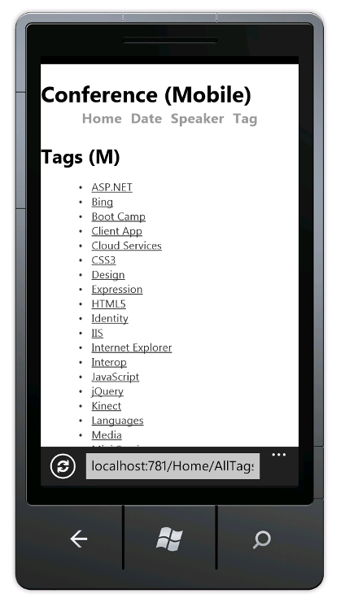](aspnet-mvc-4-mobile-features/_static/image11.png)

In contrast, the desktop display has not changed.

[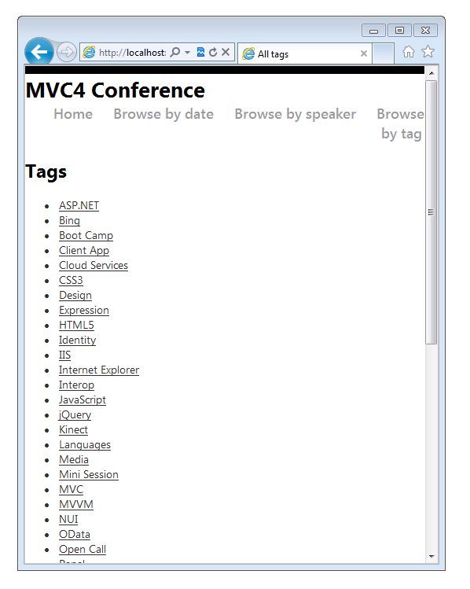](aspnet-mvc-4-mobile-features/_static/image13.png)

## Browser-Specific Views

In addition to mobile-specific and desktop-specific views, you can create views for an individual browser. For example, you can create views that are specifically for the iPhone browser. In this section, you'll create a layout for the iPhone browser and an iPhone version of the *AllTags* view.

Open the *Global.asax* file and add the following code to the `Application_Start` method.

[!code-csharp[Main](aspnet-mvc-4-mobile-features/samples/sample7.cs)]

This code defines a new display mode named "iPhone" that will be matched against each incoming request. If the incoming request matches the condition you defined (that is, if the user agent contains the string "iPhone"), ASP.NET MVC will look for views whose name contains the "iPhone" suffix.

In the code, right-click `DefaultDisplayMode`, choose **Resolve**, and then choose `using System.Web.WebPages;`. This adds a reference to the `System.Web.WebPages` namespace, which is where the `DisplayModes` and `DefaultDisplayMode` types are defined.

Alternatively, you can just manually add the following line to the `using` section of the file.

[!code-csharp[Main](aspnet-mvc-4-mobile-features/samples/sample8.cs)]

The complete contents of the *Global.asax* file is shown below.

[!code-csharp[Main](aspnet-mvc-4-mobile-features/samples/sample9.cs)]

Save the changes. Copy the *MvcMobile\Views\Shared\\_Layout.Mobile.cshtml* file to *MvcMobile\Views\Shared\\_Layout.iPhone.cshtml*. Open the new file and then change the `h1` heading from `Conference (Mobile)` to `Conference (iPhone)`.

Copy the *MvcMobile\Views\Home\AllTags.Mobile.cshtml* file to *MvcMobile\Views\Home\AllTags.iPhone.cshtml*. In the new file, change the `<h2>` element from "Tags (M)" to "Tags (iPhone)".

Run the application. Run a mobile browser emulator, make sure its user agent is set to "iPhone", and browse to the *AllTags* view. The following screenshot shows the *AllTags* view rendered in the [Safari](http://www.apple.com/safari/download/) browser. You can download Safari for Windows [here](https://support.apple.com/kb/DL1531).

In this section we've seen how to create mobile layouts and views and how to create layouts and views for specific devices such as the iPhone. In the next section you'll see how to leverage jQuery Mobile for more compelling mobile views.

## Using jQuery Mobile

The [jQuery Mobile](http://jquerymobile.com/demos/1.0b3/#/demos/1.0b3/docs/about/intro.html) library provides a user interface framework that works on all the major mobile browsers. jQuery Mobile applies *progressive enhancement* to mobile browsers that support CSS and JavaScript. Progressive enhancement allows all browsers to display the basic content of a web page, while allowing more powerful browsers and devices to have a richer display. The JavaScript and CSS files that are included with jQuery Mobile style many elements to fit mobile browsers without making any markup changes.

In this section you'll install the *jQuery.Mobile.MVC* NuGet package, which installs jQuery Mobile and a view-switcher widget.

To start, delete the *Shared\\_Layout.Mobile.cshtml* and *Shared\\_Layout.iPhone.cshtml* files that you created earlier.

Rename *Views\Home\AllTags.Mobile.cshtml* and *Views\Home\AllTags.iPhone.cshtml* files to *Views\Home\AllTags.iPhone.cshtml.hide* and *Views\Home\AllTags.Mobile.cshtml.hide*. Because the files no longer have a *.cshtml* extension, they won't be used by the ASP.NET MVC runtime to render the *AllTags* view.

Install the *jQuery.Mobile.MVC* NuGet package by doing this:

1. From the **Tools** menu, select **Library Package Manager**, and then select **Package Manager Console**.

    [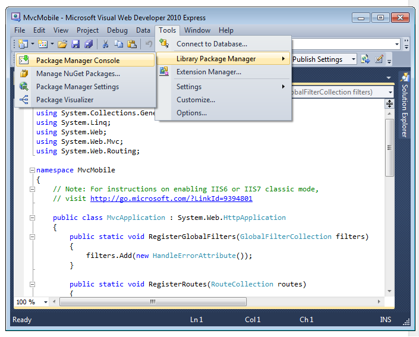](aspnet-mvc-4-mobile-features/_static/image19.png)
2. In the **Package Manager Console**, enter `Install-Package jQuery.Mobile.MVC -version 1.0.0`

The following image shows the files added and changed to the MvcMobile project by the NuGet jQuery.Mobile.MVC package. Files which are added have [add] appended after the file name. The image does not show the GIF and PNG files added to the *Content\images* folder.

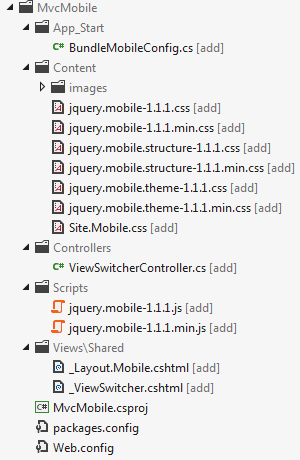

The jQuery.Mobile.MVC NuGet package installs the following:

- The *App\_Start\BundleMobileConfig.cs* file, which is needed to reference the jQuery JavaScript and CSS files added. You must follow the instructions below and reference the mobile bundle defined in this file.
- jQuery Mobile CSS files.
- A `ViewSwitcher` controller widget (*Controllers\ViewSwitcherController.cs*).
- jQuery Mobile JavaScript files.
- A jQuery Mobile-styled layout file (*Views\Shared\\_Layout.Mobile.cshtml*).
- A view-switcher partial view *(MvcMobile\Views\Shared\\_ViewSwitcher.cshtml*) that provides a link at the top of each page to switch from desktop view to mobile view and vice versa.
- Several*.png* and *.gif* image files in the *Content\images* folder.

Open the *Global.asax* file and add the following code as the last line of the `Application_Start` method.

[!code-csharp[Main](aspnet-mvc-4-mobile-features/samples/sample10.cs)]

The following code shows the complete *Global.asax* file.

[!code-csharp[Main](aspnet-mvc-4-mobile-features/samples/sample11.cs?highlight=26)]

> [!NOTE]
> If you are using Internet Explorer 9 and you don't see the `BundleMobileConfig` line above in yellow highlight, click the [Compatibility View button](https://windows.microsoft.com/en-US/windows7/How-to-use-Compatibility-View-in-Internet-Explorer-9)") in IE to make the icon change from an outline ") to a solid color "). Alternatively you can view this tutorial in FireFox or Chrome.

Open the *MvcMobile\Views\Shared\\_Layout.Mobile.cshtml* file and add the following markup directly after the `Html.Partial` call:

[!code-cshtml[Main](aspnet-mvc-4-mobile-features/samples/sample12.cshtml)]

The complete *MvcMobile\Views\Shared\\_Layout.Mobile.cshtml* file is shown below:

[!code-cshtml[Main](aspnet-mvc-4-mobile-features/samples/sample13.cshtml)]

Build the application, and in your mobile browser emulator browse to the *AllTags* view. You see the following:

[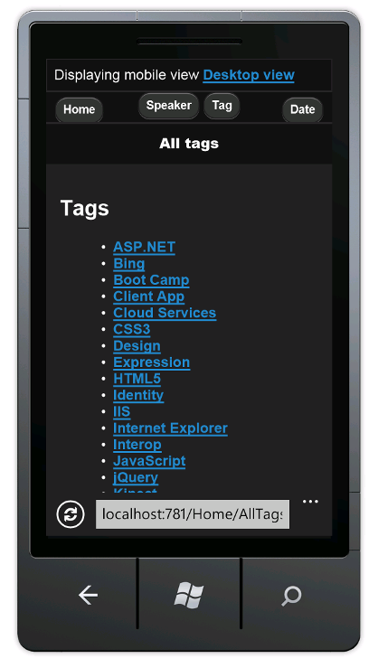](aspnet-mvc-4-mobile-features/_static/image22.png)

> [!NOTE]
> You can debug the mobile specific code by [setting the user agent string](http://www.howtogeek.com/113439/how-to-change-your-browsers-user-agent-without-installing-any-extensions/) for IE or Chrome to iPhone and then using the F-12 developer tools. If your mobile browser doesn't display the **Home**, **Speaker**, **Tag**, and **Date** links as buttons, the references to jQuery Mobile scripts and CSS files are probably not correct.

In addition to the style changes, you see **Displaying mobile view** and a link that lets you switch from mobile view to desktop view. Choose the **Desktop view** link, and the desktop view is displayed.

[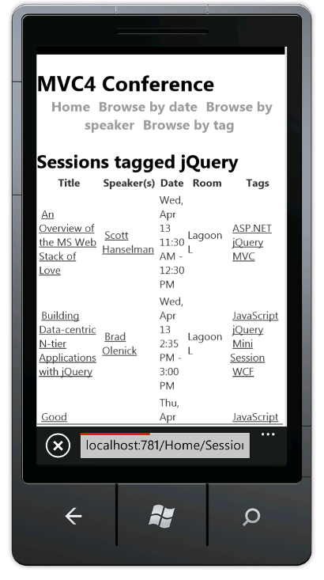](aspnet-mvc-4-mobile-features/_static/image24.png)

The desktop view doesn't provide a way to directly navigate back to the mobile view. You'll fix that now. Open the *Views\Shared\\_Layout.cshtml* file. Just under the page `body` element, add the following code, which renders the view-switcher widget:

[!code-cshtml[Main](aspnet-mvc-4-mobile-features/samples/sample14.cshtml)]

Refresh the *AllTags* view in the mobile browser. You can now navigate between desktop and mobile views.

[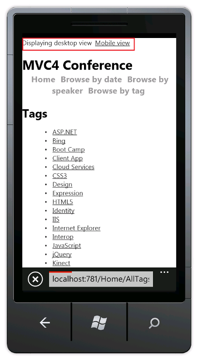](aspnet-mvc-4-mobile-features/_static/image26.png)

> [!NOTE]
> Debug note: You can add the following code to the end of the Views\Shared\\_ViewSwitcher.cshtml to help debug views when using a browser the user agent string set to a mobile device.
> 
> [!code-csharp[Main](aspnet-mvc-4-mobile-features/samples/sample15.cs)]
> 
>  and adding the following heading to the *Views\Shared\\_Layout.cshtml* file.  
> 
> [!code-html[Main](aspnet-mvc-4-mobile-features/samples/sample16.html)]

Browse to the *AllTags* page in a desktop browser. The view-switcher widget is not displayed in a desktop browser because it's added only to the mobile layout page. Later in the tutorial you'll see how you can add the view-switcher widget to the desktop view.

[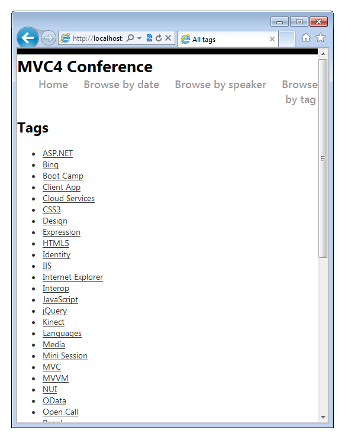](aspnet-mvc-4-mobile-features/_static/image28.png)

## Improving the Speakers List

In the mobile browser, select the **Speakers** link. Because there's no mobile view(*AllSpeakers.Mobile.cshtml*), the default speakers display (*AllSpeakers.cshtml*) is rendered using the mobile layout view (*\_Layout.Mobile.cshtml*).

[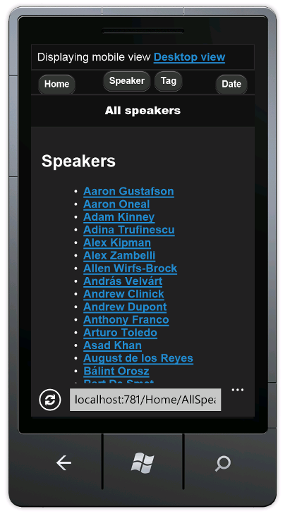](aspnet-mvc-4-mobile-features/_static/image30.png)

You can globally disable a default (non-mobile) view from rendering inside a mobile layout by setting `RequireConsistentDisplayMode` to `true` in the *Views\\_ViewStart.cshtml* file, like this:

[!code-cshtml[Main](aspnet-mvc-4-mobile-features/samples/sample17.cshtml)]

When `RequireConsistentDisplayMode` is set to `true`, the mobile layout (*\_Layout.Mobile.cshtml*) is used only for mobile views. (That is, the view file is of the form ***ViewName**.Mobile.cshtml*.) You might want to set `RequireConsistentDisplayMode` to `true` if your mobile layout doesn't work well with your non-mobile views. The screenshot below shows how the *Speakers* page renders when `RequireConsistentDisplayMode` is set to `true`.

[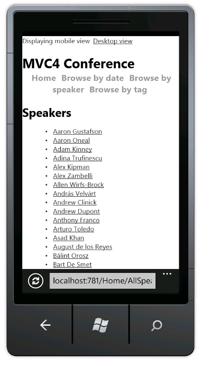](aspnet-mvc-4-mobile-features/_static/image32.png)

You can disable consistent display mode in a view by setting `RequireConsistentDisplayMode` to `false` in the view file. The following markup in the *Views\Home\AllSpeakers.cshtml* file sets `RequireConsistentDisplayMode` to `false`:

[!code-cshtml[Main](aspnet-mvc-4-mobile-features/samples/sample18.cshtml)]

## Creating a Mobile Speakers View

As you just saw, the *Speakers* view is readable, but the links are small and are difficult to tap on a mobile device. In this section, you'll create a mobile-specific *Speakers* view that looks like a modern mobile application — it displays large, easy-to-tap links and contains a search box to quickly find speakers.

Copy *AllSpeakers.cshtml* to *AllSpeakers.Mobile.cshtml*. Open the *AllSpeakers.Mobile.cshtml* file and remove the `<h2>` heading element.

In the `<ul>` tag, add the `data-role` attribute and set its value to `listview`. Like other [`data-*` attributes](http://html5doctor.com/html5-custom-data-attributes/), `data-role="listview"` makes the large list items easier to tap. This is what the completed markup looks like:

[!code-cshtml[Main](aspnet-mvc-4-mobile-features/samples/sample19.cshtml)]

Refresh the mobile browser. The updated view looks like this:

[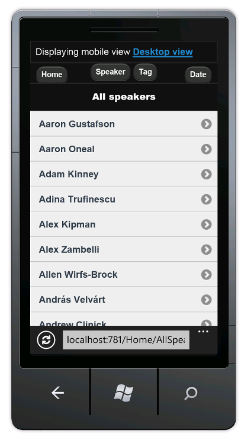](aspnet-mvc-4-mobile-features/_static/image34.png)

Although the mobile view has improved, it's difficult to navigate the long list of speakers. To fix this, in the `<ul>` tag, add the `data-filter` attribute and set it to `true`. The code below shows the `ul` markup.

[!code-html[Main](aspnet-mvc-4-mobile-features/samples/sample20.html)]

The following image shows the search filter box at the top of the page that results from the `data-filter` attribute.

[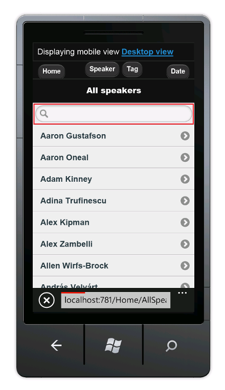](aspnet-mvc-4-mobile-features/_static/image36.png)

As you type each letter in the search box, jQuery Mobile filters the displayed list as shown in the image below.

[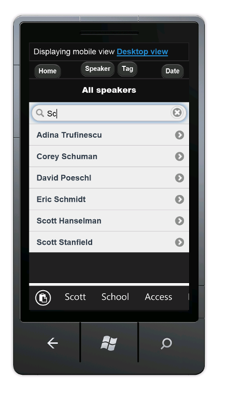](aspnet-mvc-4-mobile-features/_static/image38.png)

## Improving the Tags List

Like the default *Speakers* view, the *Tags* view is readable, but the links are small and difficult to tap on a mobile device. In this section, you'll fix the *Tags* view the same way you fixed the *Speakers* view.

Remove the &quot;hide&quot; suffix to the the *Views\Home\AllTags.Mobile.cshtml.hide* file so the name is *Views\Home\AllTags.Mobile.cshtml*. Open the renamed file and remove the `<h2>` element.

Add the `data-role` and `data-filter` attributes to the `<ul>` tag, as shown here:

[!code-html[Main](aspnet-mvc-4-mobile-features/samples/sample21.html)]

The image below shows the tags page filtering on the letter `J`.

[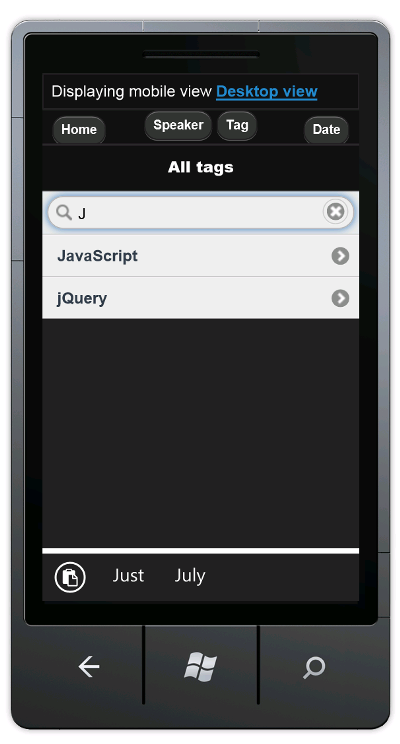](aspnet-mvc-4-mobile-features/_static/image40.png)

## Improving the Dates List

You can improve the *Dates* view like you improved the *Speakers* and *Tags* views, so that it's easier to use on a mobile device.

Copy the *Views\Home\AllDates.cshtml* file to *Views\Home\AllDates.Mobile.cshtml*. Open the new file and remove the `<h2>` element.

Add `data-role="listview"` to the `<ul>` tag, like this:

[!code-html[Main](aspnet-mvc-4-mobile-features/samples/sample22.html)]

The image below shows what the **Date** page looks like with the `data-role` attribute in place.

[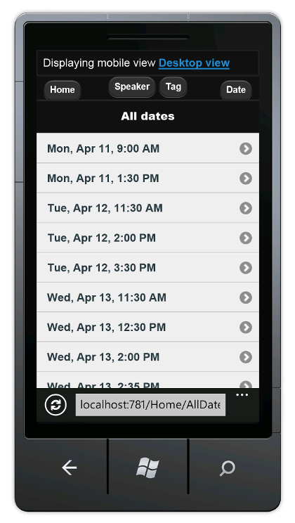](aspnet-mvc-4-mobile-features/_static/image42.png) Replace the contents of the *Views\Home\AllDates.Mobile.cshtml* file with the following code:

[!code-cshtml[Main](aspnet-mvc-4-mobile-features/samples/sample23.cshtml)]

This code groups all sessions by days. It creates a list divider for each new day, and it lists all the sessions for each day under a divider. Here's what it looks like when this code runs:

[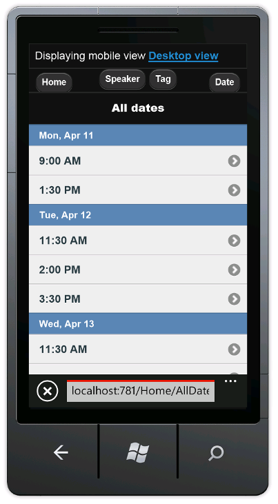](aspnet-mvc-4-mobile-features/_static/image44.png)

## Improving the SessionsTable View

In this section, you'll create a mobile-specific view of sessions. The changes we make will be more extensive than in other views we have created.

In the mobile browser, tap the **Speaker** button, then enter `Sc` in the search box.

Tap the **Scott Hanselman** link.

As you can see, the display is difficult to read on a mobile browser. The date column is hard to read and the tags column is out of the view. To fix this, copy *Views\Home\SessionsTable.cshtml* to *Views\Home\SessionsTable.Mobile.cshtml*, and then replace the contents of the file with the following code:

[!code-cshtml[Main](aspnet-mvc-4-mobile-features/samples/sample24.cshtml)]

The code removes the room and tags columns, and formats the title, speaker, and date vertically, so that all this information is readable on a mobile browser. The image below reflects the code changes.

## Improving the SessionByCode View

Finally, you'll create a mobile-specific view of the *SessionByCode* view. In the mobile browser, tap the **Speaker** button, then enter `Sc` in the search box.

Tap the **Scott Hanselman** link. Scott Hanselman's sessions are displayed.

[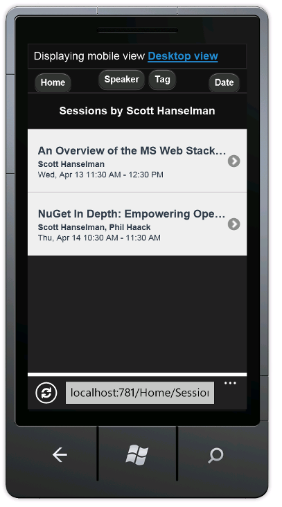](aspnet-mvc-4-mobile-features/_static/image54.png)

Choose the **An Overview of the MS Web Stack of Love** link.

[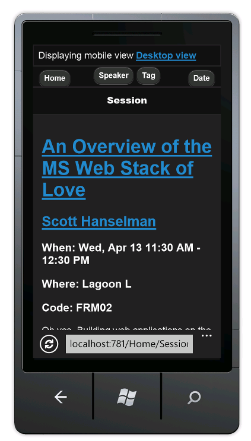](aspnet-mvc-4-mobile-features/_static/image56.png)

The default desktop view is fine, but you can improve it.

Copy the *Views\Home\SessionByCode.cshtml* to *Views\Home\SessionByCode.Mobile.cshtml* and replace the contents of the *Views\Home\SessionByCode.Mobile.cshtml* file with the following markup:

[!code-cshtml[Main](aspnet-mvc-4-mobile-features/samples/sample25.cshtml)]

The new markup uses the `data-role` attribute to improve the layout of the view.

Refresh the mobile browser. The following image reflects the code changes that you just made:

[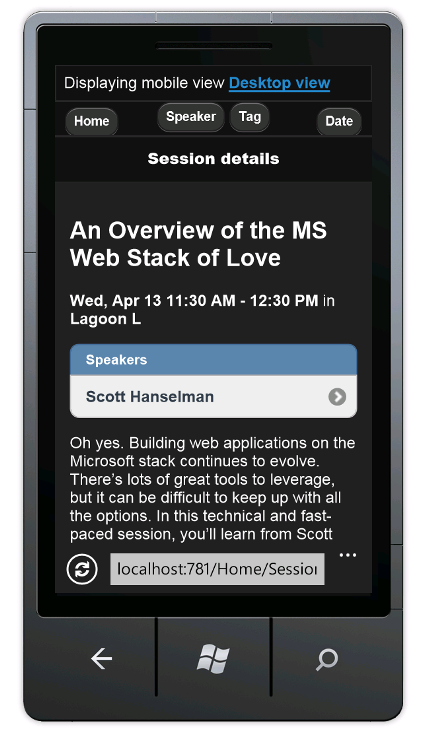](aspnet-mvc-4-mobile-features/_static/image58.png)

## Wrapup and Review

This tutorial has introduced the new mobile features of ASP.NET MVC 4 Developer Preview. The mobile features include:

- The ability to override layout, views, and partial views, both globally and for an individual view.
- Control over layout and partial override enforcement using the `RequireConsistentDisplayMode` property.
- A view-switcher widget for mobile views than can also be displayed in desktop views.
- Support for supporting specific browsers, such as the iPhone browser.

## See Also

- [jQuery Mobile](http://jquerymobile.com) site.
- [jQuery Mobile Overview](http://jquerymobile.com/demos/1.0b3/docs/about/intro.html)
- [W3C Recommendation Mobile Web Application Best Practices](http://www.w3.org/TR/mwabp/)
- [W3C Candidate Recommendation for media queries](http://www.w3.org/TR/css3-mediaqueries/)