Creating a MVC 3 Application with Razor and Unobtrusive JavaScript
====================
by [Microsoft](https://github.com/microsoft)

> The User List sample web application demonstrates how simple it is to create ASP.NET MVC 3 applications using the Razor view engine. The sample application shows how to use the new Razor view engine with ASP.NET MVC version 3 and Visual Studio 2010 to create a fictional User List website that includes functionality such as creating, displaying, editing, and deleting users.
> 
> This tutorial describes the steps that were taken in order to build the User List sample ASP.NET MVC 3 application. A Visual Studio project with C# and VB source code is available to accompany this topic: [Download](https://code.msdn.microsoft.com/aspnetmvcsamples/Release/ProjectReleases.aspx?ReleaseId=5114). If you have questions about this tutorial, please post them to the [MVC forum](https://forums.asp.net/1146.aspx).

## Overview

The application you'll be building is a simple user list website. Users can enter, view, and update user information.

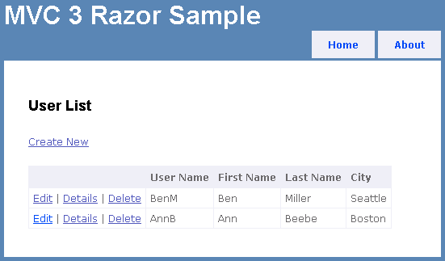

You can download the VB and C# completed project [here](https://code.msdn.microsoft.com/Creating-a-MVC-3-28883c0f).

## Creating the Web Application

To start the tutorial, open Visual Studio 2010 and create a new project using the *ASP.NET MVC 3 Web Application* template. Name the application &quot;Mvc3Razor&quot;.

In the **New ASP.NET MVC 3 Project** dialog, select **Internet Application**, select the Razor view engine, and then click **OK**.

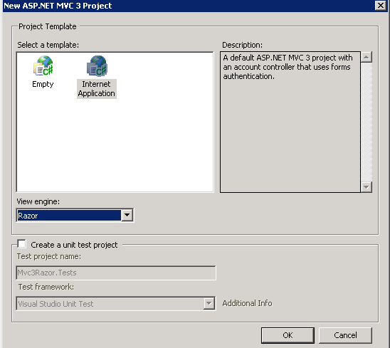

In this tutorial you will not be using the ASP.NET membership provider, so you can delete all the files associated with logon and membership. In **Solution Explorer**, remove the following files and directories:

- *Controllers\AccountController*
- *Models\AccountModels*
- *Views\Shared\\_LogOnPartial*
- *Views\Account* (and all the files in this directory)

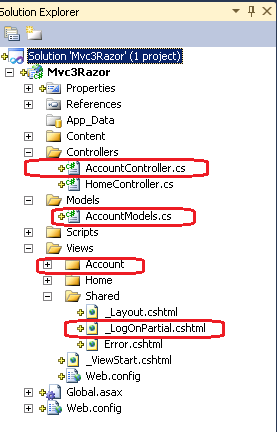

Edit the *\_Layout.cshtml* file and replace the markup inside the `
` element named `logindisplay` with the message *&quot;*Login Disabled&quot;. The following example shows the new markup:

[!code-cshtml[Main](creating-a-mvc-3-application-with-razor-and-unobtrusive-javascript/samples/sample1.cshtml)]

## Adding the Model

In **Solution Explorer**, right-click the *Models* folder, select **Add**, and then click **Class**.

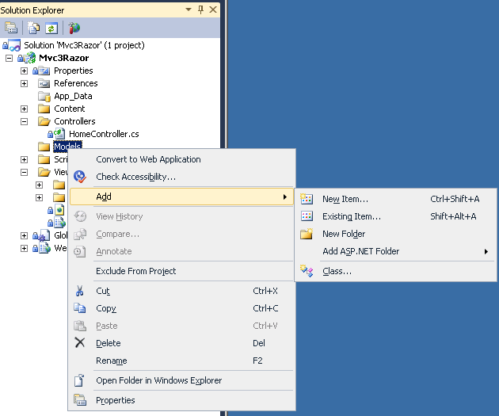

Name the class `UserModel`. Replace the contents of the *UserModel* file with the following code:

[!code-csharp[Main](creating-a-mvc-3-application-with-razor-and-unobtrusive-javascript/samples/sample2.cs)]

The `UserModel` class represents users. Each member of the class is annotated with the [Required](https://msdn.microsoft.com/en-us/library/system.componentmodel.dataannotations.requiredattribute.aspx) attribute from the [DataAnnotations](https://msdn.microsoft.com/en-us/library/system.componentmodel.dataannotations.aspx) namespace. The attributes in the [DataAnnotations](https://msdn.microsoft.com/en-us/library/system.componentmodel.dataannotations.aspx) namespace provide automatic client- and server-side validation for web applications.

Open the `HomeController` class and add a `using` directive so that you can access the `UserModel` and `Users` classes:

[!code-csharp[Main](creating-a-mvc-3-application-with-razor-and-unobtrusive-javascript/samples/sample3.cs)]

Just after the `HomeController` declaration, add the following comment and the reference to a `Users` class:

[!code-csharp[Main](creating-a-mvc-3-application-with-razor-and-unobtrusive-javascript/samples/sample4.cs)]

The `Users` class is a simplified, in-memory data store that you'll use in this tutorial. In a real application you would use a database to store user information. The first few lines of the `HomeController` file are shown in the following example:

[!code-csharp[Main](creating-a-mvc-3-application-with-razor-and-unobtrusive-javascript/samples/sample5.cs)]

Build the application so that the user model will be available to the scaffolding wizard in the next step.

## Creating the Default View

The next step is to add an action method and view to display the users.

Delete the existing *Views\Home\Index* file. You will create a new *Index* file to display the users.

In the `HomeController` class, replace the contents of the `Index` method with the following code:

[!code-csharp[Main](creating-a-mvc-3-application-with-razor-and-unobtrusive-javascript/samples/sample6.cs)]

Right-click inside the `Index` method and then click **Add View**.

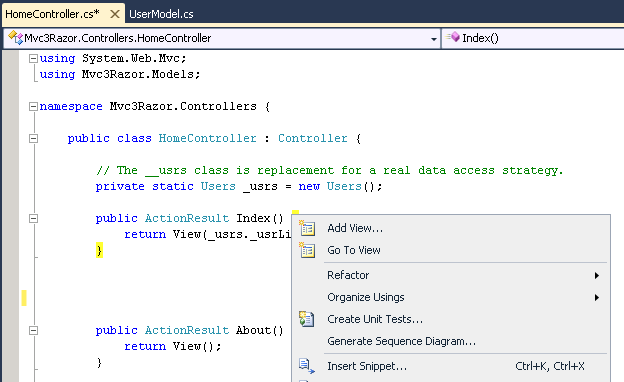

Select the **Create a strongly-typed view** option. For **View data class**, select **Mvc3Razor.Models.UserModel**. (If you don't see **Mvc3Razor.Models.UserModel** in the **View data class** box, you need to build the project.) Make sure that the view engine is set to **Razor**. Set **View content** to **List** and then click **Add**.

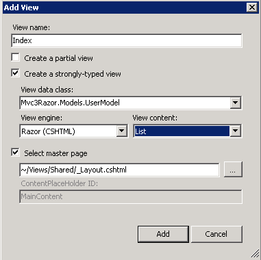

The new view automatically scaffolds the user data that's passed to the `Index` view. Examine the newly generated *Views\Home\Index* file. The **Create New**, **Edit**, **Details**, and **Delete** links don't work, but the rest of the page is functional. Run the page. You see a list of users.

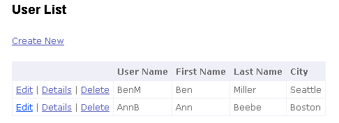

Open the *Index.cshtml* file and replace the `ActionLink` markup for **Edit**, **Details**, and **Delete** with the following code:

[!code-cshtml[Main](creating-a-mvc-3-application-with-razor-and-unobtrusive-javascript/samples/sample7.cshtml)]

The user name is used as the ID to find the selected record in the **Edit**, **Details**, and **Delete** links.

## Creating the Details View

The next step is to add a `Details` action method and view in order to display user details.

Add the following `Details` method to the home controller:

[!code-csharp[Main](creating-a-mvc-3-application-with-razor-and-unobtrusive-javascript/samples/sample8.cs)]

Right-click inside the `Details` method and then select **Add View**. Verify that the **View data class** box contains **Mvc3Razor.Models.UserModel***.* Set **View content** to **Details** and then click **Add**.

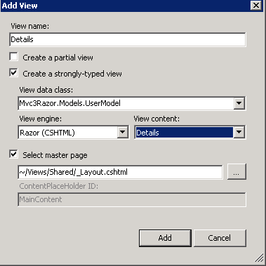

Run the application and select a details link. The automatic scaffolding shows each property in the model.

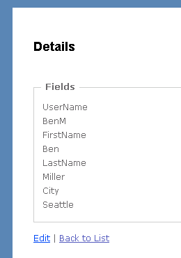

## Creating the Edit View

Add the following `Edit` method to the home controller.

[!code-csharp[Main](creating-a-mvc-3-application-with-razor-and-unobtrusive-javascript/samples/sample9.cs)]

Add a view as in the previous steps, but set **View content** to **Edit**.

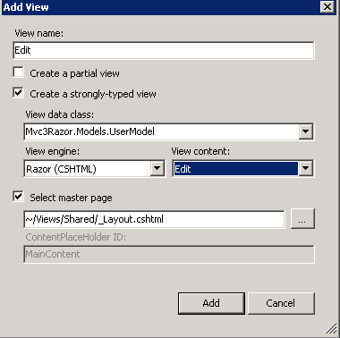

Run the application and edit the first and last name of one of the users. If you violate any `DataAnnotation` constraints that have been applied to the `UserModel` class, when you submit the form, you will see validation errors that are produced by server code. For example, if you change the first name &quot;Ann&quot; to &quot;A&quot;, when you submit the form, the following error is displayed on the form:

`The field First Name must be a string with a minimum length of 3 and a maximum length of 8.`

In this tutorial, you're treating the user name as the primary key. Therefore, the user name property cannot be changed. In the *Edit.cshtml* file, just after the `Html.BeginForm` statement, set the user name to be a hidden field. This causes the property to be passed in the model. The following code fragment shows the placement of the `Hidden` statement:

[!code-cshtml[Main](creating-a-mvc-3-application-with-razor-and-unobtrusive-javascript/samples/sample10.cshtml)]

Replace the `TextBoxFor` and `ValidationMessageFor` markup for the user name with a `DisplayFor` call. The `DisplayFor` method displays the property as a read-only element. The following example shows the completed markup. The original `TextBoxFor` and `ValidationMessageFor` calls are commented out with the Razor begin-comment and end-comment characters (`@* *@`)

[!code-cshtml[Main](creating-a-mvc-3-application-with-razor-and-unobtrusive-javascript/samples/sample11.cshtml)]

## Enabling Client-Side Validation

To enable client-side validation in ASP.NET MVC 3, you must set two flags and you must include three JavaScript files.

Open the application's *Web.config* file. Verify `that ClientValidationEnabled` and `UnobtrusiveJavaScriptEnabled` are set to true in the application settings. The following fragment from the root *Web.config* file shows the correct settings:

[!code-xml[Main](creating-a-mvc-3-application-with-razor-and-unobtrusive-javascript/samples/sample12.xml)]

Setting `UnobtrusiveJavaScriptEnabled` to true enables unobtrusive Ajax and unobtrusive client validation. When you use unobtrusive validation, the validation rules are turned into HTML5 attributes. HTML5 attribute names can consist of only lowercase letters, numbers, and dashes.

Setting `ClientValidationEnabled` to true enables client-side validation. By setting these keys in the application *Web.config* file, you enable client validation and unobtrusive JavaScript for the entire application. You can also enable or disable these settings in individual views or in controller methods using the following code:

[!code-csharp[Main](creating-a-mvc-3-application-with-razor-and-unobtrusive-javascript/samples/sample13.cs)]

You also need to include several JavaScript files in the rendered view. An easy way to include the JavaScript in all views is to add them to the *Views\Shared\\_Layout.cshtml* file. Replace the `<head>` element of the *\_Layout.cshtml* file with the following code:

[!code-cshtml[Main](creating-a-mvc-3-application-with-razor-and-unobtrusive-javascript/samples/sample14.cshtml)]

The first two jQuery scripts are hosted by the Microsoft Ajax Content Delivery Network (CDN). By taking advantage of the Microsoft Ajax CDN, you can significantly improve the first-hit performance of your applications.

Run the application and click an edit link. View the page's source in the browser. The browser source shows many attributes of the form `data-val` (for data validation). When client validation and unobtrusive JavaScript is enabled, input fields with a client-validation rule contain the `data-val="true"` attribute to trigger unobtrusive client validation. For example, the `City` field in the model was decorated with the [Required](https://msdn.microsoft.com/en-us/library/system.componentmodel.dataannotations.requiredattribute.aspx) attribute, which results in the HTML shown in the following example:

[!code-cshtml[Main](creating-a-mvc-3-application-with-razor-and-unobtrusive-javascript/samples/sample15.cshtml)]

For each client-validation rule, an attribute is added that has the form `data-val-rulename="message"`. Using the `City` field example shown earlier, the required client-validation rule generates the `data-val-required` attribute and the message &quot;The City field is required&quot;. Run the application, edit one of the users, and clear the `City` field. When you tab out of the field, you see a client-side validation error message.

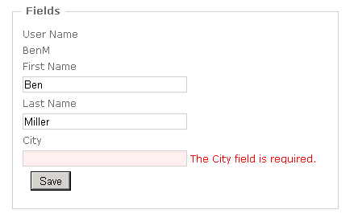

Similarly, for each parameter in the client-validation rule, an attribute is added that has the form `data-val-rulename-paramname=paramvalue`. For example, the `FirstName` property is annotated with the [StringLength](https://msdn.microsoft.com/en-us/library/system.componentmodel.dataannotations.stringlengthattribute.aspx) attribute and specifies a minimum length of 3 and a maximum length of 8. The data validation rule named `length` has the parameter name `max` and the parameter value 8. The following shows the HTML that is generated for the `FirstName` field when you edit one of the users:

[!code-cshtml[Main](creating-a-mvc-3-application-with-razor-and-unobtrusive-javascript/samples/sample16.cshtml)]

For more information about unobtrusive client validation, see the entry [Unobtrusive Client Validation in ASP.NET MVC 3](http://bradwilson.typepad.com/blog/2010/10/mvc3-unobtrusive-validation.html) in Brad Wilson's blog.

> [!NOTE]
> In ASP.NET MVC 3 Beta, you sometimes need to submit the form in order to start client-side validation. This might be changed for the final release.

## Creating the Create View

The next step is to add a `Create` action method and view in order to enable the user to create a new user. Add the following `Create` method to the home controller:

[!code-csharp[Main](creating-a-mvc-3-application-with-razor-and-unobtrusive-javascript/samples/sample17.cs)]

Add a view as in the previous steps, but set **View content** to **Create**.

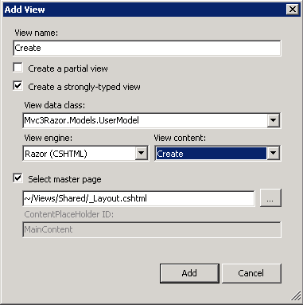

Run the application, select the **Create** link, and add a new user. The `Create` method automatically takes advantage of client-side and server-side validation. Try to enter a user name that contains white space, such as &quot;Ben X&quot;. When you tab out of the user name field, a client-side validation error (`White space is not allowed`) is displayed.

## Add the Delete method

To complete the tutorial, add the following `Delete` method to the home controller:

[!code-csharp[Main](creating-a-mvc-3-application-with-razor-and-unobtrusive-javascript/samples/sample18.cs)]

Add a `Delete` view as in the previous steps, setting **View content** to **Delete**.

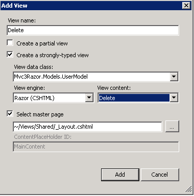

You now have a simple but fully functional ASP.NET MVC 3 application with validation.