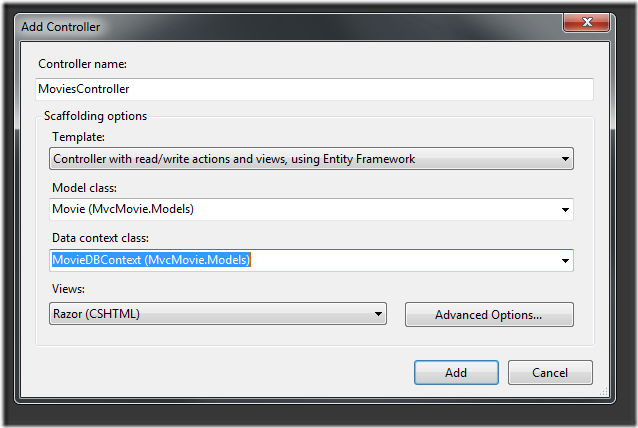
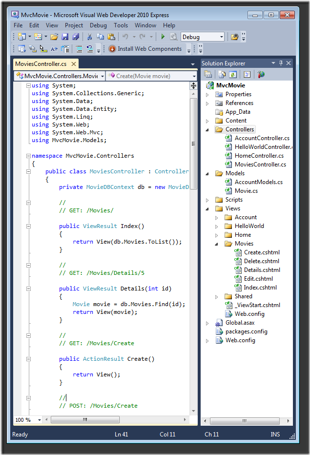
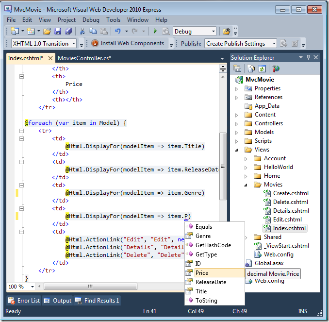
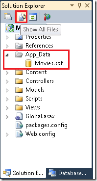
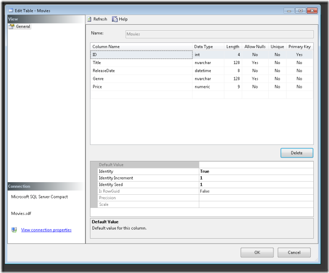

Accessing your Model's Data from a Controller (C#)
====================
by [Rick Anderson](https://github.com/Rick-Anderson)

> > [!NOTE]
> > An updated version of this tutorial is available [here](../../../getting-started/introduction/getting-started.md) that uses ASP.NET MVC 5 and Visual Studio 2013. It's more secure, much simpler to follow and demonstrates more features.
> 
> 
> This tutorial will teach you the basics of building an ASP.NET MVC Web application using Microsoft Visual Web Developer 2010 Express Service Pack 1, which is a free version of Microsoft Visual Studio. Before you start, make sure you've installed the prerequisites listed below. You can install all of them by clicking the following link: [Web Platform Installer](https://www.microsoft.com/web/gallery/install.aspx?appid=VWD2010SP1Pack). Alternatively, you can individually install the prerequisites using the following links:
> 
> - [Visual Studio Web Developer Express SP1 prerequisites](https://www.microsoft.com/web/gallery/install.aspx?appid=VWD2010SP1Pack)
> - [ASP.NET MVC 3 Tools Update](https://www.microsoft.com/web/gallery/install.aspx?appsxml=&amp;appid=MVC3)
> - [SQL Server Compact 4.0](https://www.microsoft.com/web/gallery/install.aspx?appid=SQLCE;SQLCEVSTools_4_0)(runtime + tools support)
> 
> If you're using Visual Studio 2010 instead of Visual Web Developer 2010, install the prerequisites by clicking the following link: [Visual Studio 2010 prerequisites](https://www.microsoft.com/web/gallery/install.aspx?appsxml=&amp;appid=VS2010SP1Pack).
> 
> A Visual Web Developer project with C# source code is available to accompany this topic. [Download the C# version](https://code.msdn.microsoft.com/Introduction-to-MVC-3-10d1b098). If you prefer Visual Basic, switch to the [Visual Basic version](../vb/intro-to-aspnet-mvc-3.md) of this tutorial.

In this section, you'll create a new `MoviesController` class and write code that retrieves the movie data and displays it in the browser using a view template. Be sure to build your application before proceeding.

Right-click the *Controllers* folder and create a new `MoviesController` controller. Select the following options:

- Controller name: **MoviesController**. (This is the default. )
- Template: **Controller with read/write actions and views, using Entity Framework**.
- Model class: **Movie (MvcMovie.Models)**.
- Data context class: **MovieDBContext (MvcMovie.Models)**.
- Views: **Razor (CSHTML)**. (The default.)

Click **Add**. Visual Web Developer creates the following files and folders:

- *A MoviesController.cs* file in the project's *Controllers* folder.
- A *Movies* folder in the project's *Views* folder.
- *Create.cshtml, Delete.cshtml, Details.cshtml, Edit.cshtml*, and *Index.cshtml* in the new *Views\Movies* folder.

The ASP.NET MVC 3 scaffolding mechanism automatically created the CRUD (create, read, update, and delete) action methods and views for you. You now have a fully functional web application that lets you create, list, edit, and delete movie entries.

Run the application and browse to the `Movies` controller by appending */Movies* to the URL in the address bar of your browser. Because the application is relying on the default routing (defined in the *Global.asax* file), the browser request `http://localhost:xxxxx/Movies` is routed to the default `Index` action method of the `Movies` controller. In other words, the browser request `http://localhost:xxxxx/Movies` is effectively the same as the browser request `http://localhost:xxxxx/Movies/Index`. The result is an empty list of movies, because you haven't added any yet.

### Creating a Movie

Select the **Create New** link. Enter some details about a movie and then click the **Create** button.

Clicking the **Create** button causes the form to be posted to the server, where the movie information is saved in the database. You're then redirected to the */Movies* URL, where you can see the newly created movie in the listing.

Create a couple more movie entries. Try the **Edit**, **Details**, and **Delete** links, which are all functional.

## Examining the Generated Code

Open the *Controllers\MoviesController.cs* file and examine the generated `Index` method. A portion of the movie controller with the `Index` method is shown below.

[!code-csharp[Main](accessing-your-models-data-from-a-controller/samples/sample1.cs)]

The following line from the `MoviesController` class instantiates a movie database context, as described previously. You can use the movie database context to query, edit, and delete movies.

[!code-csharp[Main](accessing-your-models-data-from-a-controller/samples/sample2.cs)]

A request to the `Movies` controller returns all the entries in the `Movies` table of the movie database and then passes the results to the `Index` view.

## Strongly Typed Models and the @model Keyword

Earlier in this tutorial, you saw how a controller can pass data or objects to a view template using the `ViewBag` object. The `ViewBag` is a dynamic object that provides a convenient late-bound way to pass information to a view.

ASP.NET MVC also provides the ability to pass strongly typed data or objects to a view template. This strongly typed approach enables better compile-time checking of your code and richer IntelliSense in the Visual Web Developer editor. We're using this approach with the `MoviesController` class and *Index.cshtml* view template.

Notice how the code creates a [`List`](https://msdn.microsoft.com/en-us/library/6sh2ey19.aspx) object when it calls the `View` helper method in the `Index` action method. The code then passes this `Movies` list from the controller to the view:

[!code-csharp[Main](accessing-your-models-data-from-a-controller/samples/sample3.cs)]

By including a `@model` statement at the top of the view template file, you can specify the type of object that the view expects. When you created the movie controller, Visual Web Developer automatically included the following `@model` statement at the top of the *Index.cshtml* file:

[!code-cshtml[Main](accessing-your-models-data-from-a-controller/samples/sample4.cshtml)]

This `@model` directive allows you to access the list of movies that the controller passed to the view by using a `Model` object that's strongly typed. For example, in the *Index.cshtml* template, the code loops through the movies by doing a `foreach` statement over the strongly typed `Model` object:

[!code-cshtml[Main](accessing-your-models-data-from-a-controller/samples/sample5.cshtml)]

Because the `Model` object is strongly typed (as an `IEnumerable<Movie>` object), each `item` object in the loop is typed as `Movie`. Among other benefits, this means that you get compile-time checking of the code and full IntelliSense support in the code editor:

## Working with SQL Server Compact

Entity Framework Code First detected that the database connection string that was provided pointed to a `Movies` database that didn't exist yet, so Code First created the database automatically. You can verify that it's been created by looking in the *App\_Data* folder. If you don't see the *Movies.sdf* file, click the **Show All Files** button in the **Solution Explorer** toolbar, click the **Refresh** button, and then expand the *App\_Data* folder.

Double-click *Movies.sdf* to open **Server Explorer**. Then expand the **Tables** folder to see the tables that have been created in the database.

> [!NOTE]
> If you get an error when you double-click *Movies.sdf*, make sure you've installed [SQL Server Compact 4.0](https://www.microsoft.com/web/gallery/install.aspx?appid=SQLCE;SQLCEVSTools_4_0)(runtime + tools support). (For links to the software, see the list of prerequisites in part 1 of this tutorial series.) If you install the release now, you'll have to close and re-open Visual Web Developer.

There are two tables, one for the `Movie` entity set and then the `EdmMetadata` table. The `EdmMetadata` table is used by the Entity Framework to determine when the model and the database are out of sync.

Right-click the `Movies` table and select **Show Table Data** to see the data you created.

Right-click the `Movies` table and select **Edit Table Schema**.

Notice how the schema of the `Movies` table maps to the `Movie` class you created earlier. Entity Framework Code First automatically created this schema for you based on your `Movie` class.

When you're finished, close the connection. (If you don't close the connection, you might get an error the next time you run the project).

You now have the database and a simple listing page to display content from it. In the next tutorial, we'll examine the rest of the scaffolded code and add a `SearchIndex` method and a `SearchIndex` view that lets you search for movies in this database.

>[!div class="step-by-step"]
[Previous](adding-a-model.md)
[Next](examining-the-edit-methods-and-edit-view.md)